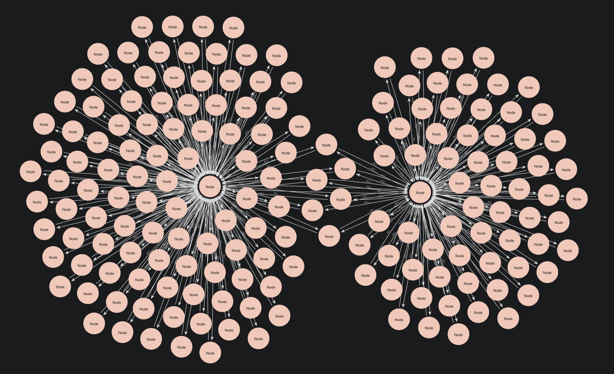

= Graph Projections and Structure
:type: lesson
:order: 4

[.slide.discrete]
== Introduction

The way you project your graph determines what algorithms can "see" and analyse.

In this session, you'll learn how to create projections, understand graph structures, and why this matters for your algorithm results.

[.slide]
== What You'll Learn

By the end of this lesson, you'll be able to:

* Create Cypher projections using `gds.graph.project()`
* Distinguish between graph structure and node labels in GDS
* Identify monopartite, bipartite, multipartite, and heterogeneous graph structures
* Choose appropriate projection strategies based on your target algorithm

[.slide]
== Running a Cypher Projection

The most basic Cypher projection command looks like this:

[source,cypher,role=noplay nocopy]
.Basic Cypher projection example
----
MATCH (source:Actor)-[r:ACTED_IN]->(target:Movie) // Match these nodes and relationships
WITH gds.graph.project(                           // Create a projection
  'actors-graph',                                 // Name the projection
  source,                                         // Use the source nodes identified in the previous MATCH statement
  target                                          // Use the target nodes identified in the previous MATCH statement
) AS g                                            // Name the graph `g`
RETURN g.graphName AS graph,
      g.nodeCount AS nodes,
      g.relationshipCount AS rels                 // Return the properties of the graph `g`
----

[.slide]
== Projecting Graph Models

You are not limited to using the relationships available in the main graph. For example, you can use intermediate nodes in your MATCH statement to create new relationships that exist only in the projection.

[source,cypher,role=noplay nocopy]
.Actor to actor collaboration
----
MATCH (source:Actor)-[r:ACTED_IN]->               // Select source nodes
        (:Movie)
      <-[:ACTED_IN]-(target:Actor)                // Select the source nodes as the target nodes
WITH gds.graph.project(                           // Create a projection
  'actors-graph',                                 // Name the projection
  source,                                         // Use the source nodes identified in the previous MATCH statement
  target                                          // Use the target nodes identified in the previous MATCH statement
) AS g                                            // Name the graph `g`
RETURN g.graphName AS graph,
      g.nodeCount AS nodes,
      g.relationshipCount AS rels                 // Return the properties of the graph `g`
----

[.slide]
== Actor to Actor Collaboration Graph

Running the previous projection will create a graph connecting actors directly to actors who worked on the same movies.

image::images/actors_to_actors.png[a projected graph of actors who worked with other actors]

[.transcript-only]

====
Run the following basic graph projection to see how this works for real.

[source,cypher]
.Basic Cypher projection example
----
MATCH (source:Actor)-[r:ACTED_IN]->(target:Movie)
WITH gds.graph.project(
  'actors-graph',
  source,
  target
) AS g
RETURN g.graphName AS graph,
      g.nodeCount AS nodes,
      g.relationshipCount AS rels
----
====

[.slide]
== What You Projected

Let's focus on the first projection you ran:

[source,cypher,role=noplay nocopy]
.Basic Cypher projection example
----
MATCH (source:Actor)-[r:ACTED_IN]->(target:Movie)
WITH gds.graph.project(
  'actors-graph',
  source,
  target
) AS g
RETURN g.graphName AS graph,
      g.nodeCount AS nodes,
      g.relationshipCount AS rels
----

[.slide]
== What You Expected

You may have expected to project a graph that looks like this:

image::images/actor_movie_model.png[An Actor node connects to a Movie node via ACTED_IN.]

This is a **bipartite graph**—a graph whose nodes fall into two distinct, non-overlapping sets.

[.slide]
== What GDS Actually Sees

By default, GDS strips away labels but **preserves structure**:

image::images/monopartite_model.png[A generic 'Node' connects to another generic 'Node' via a generic '__ALL__' relationship.]

[.transcript-only]

====
The graph is still structurally bipartite—Actors still only connect to Movies, never to other Actors. But GDS no longer knows *which* nodes are Actors and which are Movies.
====

[.slide]
== Structure vs Labels

Two separate concepts:

* **Structure**: How nodes connect (bipartite, monopartite, etc.)
* **Labels**: What GDS knows about node types

Your projection kept the bipartite *structure* but lost the *labels*.

[.slide]
== Graph Structures: Monopartite

A **monopartite graph** has nodes that cannot be separated into distinct non-overlapping sets.

Example: A social network where `(:Person)-[:FRIENDS_WITH]->(:Person)`

image::images/social_network.png[A monopartite social network graph., width=50%]

[.transcript-only]

====
Any person can be friends with any other person. You cannot divide the nodes into separate groups where connections only occur *between* groups.
====

[.slide]
== Graph Structures: Bipartite

A **bipartite graph** has nodes that fall into exactly two non-overlapping sets, where connections only occur *between* sets.

Example: `(:Actor)-[:ACTED_IN]->(:Movie)`

image::images/bipartite_graph_example.png[Actors in one row connect only to Movies in another row.]

[.transcript-only]

====
Actors connect to Movies. Actors never connect directly to other Actors. Movies never connect directly to other Movies.
====

[.slide]
== Graph Structures: Multipartite

A **multipartite graph** has three or more non-overlapping node sets, where connections only occur *between* sets, never within the same set.

Example: `(:User)-[:RATES]->(:Movie)-[:IN_GENRE]->(:Genre)`

image::images/multipartite_example.png[A graph of tripartite structure, three sets, non-overlapping.]

[.transcript-only]

====
In a true multipartite structure, each set is non-overlapping.
====

[.slide]
== Graph Structures: Heterogeneous

A **heterogeneous graph** has multiple node types and/or relationship types, but nodes within the same type can connect to each other.

image::images/heterogeneous_graph.png[The movie graph with Actor, Movie, User, and Genre nodes., width=50%]

[.transcript-only]

====
Our full Movies dataset has Actors, Movies, Users, and Genres. Movies can connect to all node types, meaning the connections can overlap.
====

[.slide]
== Why Structure Matters: PageRank Example

PageRank ranks nodes by "importance" based on incoming connections from other important nodes.

Let's see what happens when we run it on our unlabelled bipartite projection:

[source,cypher,role=noplay nocopy]
----
CALL gds.pageRank.stream('actors-graph', {})
YIELD nodeId, score
RETURN gds.util.asNode(nodeId).title, score
ORDER BY score DESC
----

[.slide]
== PageRank on Bipartite Structure

In our Actor → Movie **bipartite** structure, PageRank flows *into* Movies but has nowhere to go from there.

image::images/actors_into_movies.png[a single movie node with many actor nodes pointing into it.]

[.slide]
== Modelling, Not Algorithms

It's important to remember here: we are talking about graph structures, using algorithms for framing.

Do not worry too much about the intricacies of PageRank or any other algorithm for now—that comes later.

For now, try to see how the signal flows from node to node in the graph structures we're examining.

[.slide]
== Rank Sink

In our bipartite graph, Movie nodes become "rank sinks"—accumulating high scores simply because they receive connections, not because they're meaningfully important.

image::images/rank_sinks.png[a single movie node with many actor nodes pointing into it. Highlighted relationship flow and Movie nodes are larger than Actor nodes.]

[.transcript-only]

====
Almost all nodes receive the same score on either side of the structure. The bipartite structure traps the algorithm's ranking signal.
====

[.slide]
== Solution 1: Project a True Monopartite Graph

Now let's return to that second projection—the Actor-to-Actor collaboration graph:

[source,cypher,role=noplay nocopy]
----
MATCH (source:Actor)-[:ACTED_IN]->(:Movie)<-[:ACTED_IN]-(target:Actor)
WITH gds.graph.project('actors-only', source, target) AS g
RETURN g.graphName, g.nodeCount, g.relationshipCount
----

[.transcript-only]

====
This creates direct Actor-to-Actor connections through shared Movies. The Movies become invisible "bridges."
====

[.slide]
== True Monopartite Result

The projected graph is now **monopartite**. All actors connect to other actors.

There is no meaningful way of separating the nodes into non-overlapping sets.

[.slide]
== PageRank on Monopartite

Now PageRank can flow between nodes of the same type, producing meaningful importance rankings.

image::images/no_rank_sink.png[a slightly transparent Movie node, no longer part of the graph, with a bunch of relationships crossing over it.]

[.slide]
== Monopartite Structures

Bear in mind, the projection **still** does not retain node labels.

It is the graph **structure**, not its labels, that affects the algorithm's results.

image::images/monopartite_model.png[A generic 'Node' connects to another generic 'Node' via a generic '__ALL__' relationship.]

[.slide]
== Preserve Labels

For some algorithms, you will want to retain node labels.

Use configuration to preserve labels:

[source,cypher,role=noplay nocopy]
----
MATCH (source:Actor)-[r:ACTED_IN]->(target:Movie)
WITH gds.graph.project(
  'actors-movies-labelled',
  source,
  target,
  {
    sourceNodeLabels: labels(source),
    targetNodeLabels: labels(target),
    relationshipType: type(r)
  },
  {}
) AS g
RETURN g.graphName, g.nodeCount, g.relationshipCount
----

[.slide]
== When to Preserve Labels

**Preserve labels when:**

* You need to filter algorithms by node type
* Node type distinctions affect your analysis

**Use default (unlabelled) when:**

* You're projecting a true monopartite or bipartite subgraph
* The algorithm ignores node labels (most do)

[.slide]
== Bipartite-Friendly Algorithm: Node Similarity

Node Similarity compares nodes based on shared neighbours. It's *designed* for bipartite graphs.

[source,cypher,role=noplay nocopy]
----
MATCH (source:User)-[r:RATED]->(target:Movie)
WITH gds.graph.project(
  'user-rated-movie',
  source, target,
  { sourceNodeLabels: labels(source),
    targetNodeLabels: labels(target) },
  {}
) AS g
RETURN g.graphName, g.nodeCount, g.relationshipCount
----

[.slide]
== Node Similarity Result

Node Similarity finds Users who rated similar Movies—creating new User-to-User relationships.

image::images/user_movie_similar_bipartite.png[Users connected by SIMILAR relationships based on shared movie ratings.]

[.transcript-only]

====
The algorithm respects the bipartite structure: it compares nodes on one side based on their connections to the other side.
====

[.slide]
== Quick Reference: Choosing Your Projection

[cols="2,3,3"]
|===
|Algorithm Type |Graph Structure |Projection Strategy

|PageRank, Betweenness
|Works best on monopartite
|Project single node type (e.g., Actor-to-Actor)

|Node Similarity
|Designed for bipartite
|Preserve labels, include both types

|Community Detection
|Varies by algorithm
|Check documentation for each
|===

[.slide]
== Common Terminology

[cols="1,2"]
|===
|Term |Meaning

|**Monopartite**
|Nodes cannot be separated into distinct non-overlapping sets

|**Bipartite**
|Exactly two non-overlapping node sets; connections only between sets

|**Multipartite**
|Three or more non-overlapping node sets

|**Heterogeneous**
|Multiple node types and/or relationship types (may overlap)

|**Unlabelled**
|GDS doesn't know node/relationship types (default behaviour)
|===

read::Mark as read[]

[.summary]
== Lesson Summary

In this lesson, you learned:

* How to create Cypher projections with `gds.graph.project()`
* How to transform graph structures by changing your MATCH pattern
* **Structure** (how nodes connect) is separate from **labels** (what GDS knows about types)
* GDS strips labels by default but preserves structure
* Bipartite structures can trap algorithms like PageRank
* Project true monopartite graphs for algorithms that expect them
* Preserve labels when using bipartite-aware algorithms like Node Similarity

In the next lesson, you'll practice projecting different graph types.
