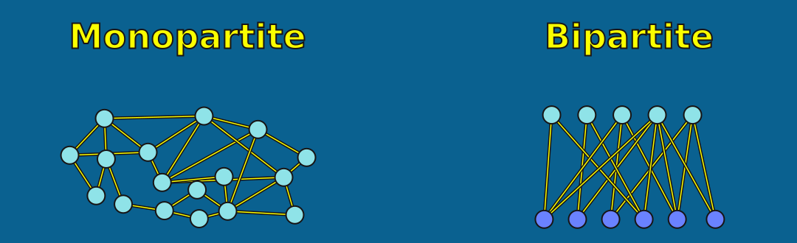
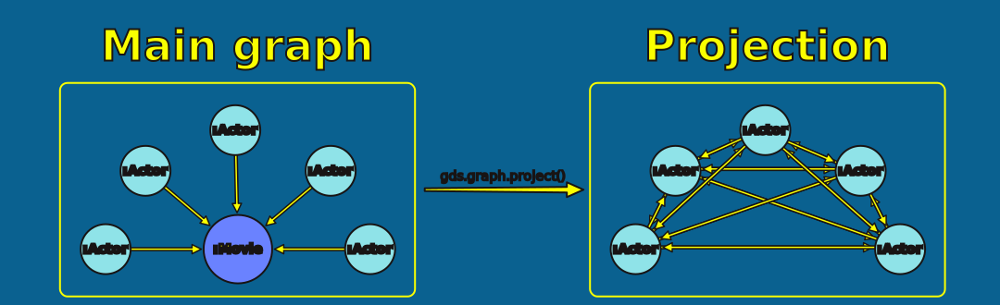
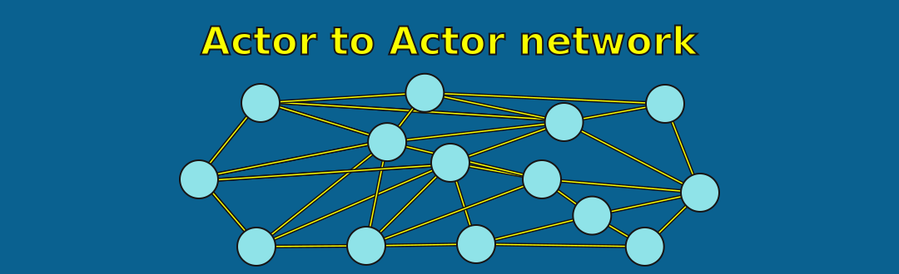
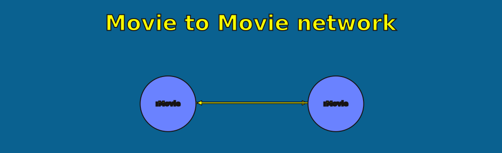
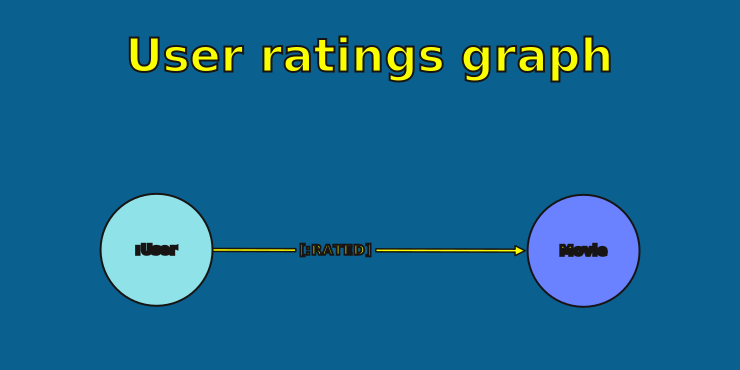
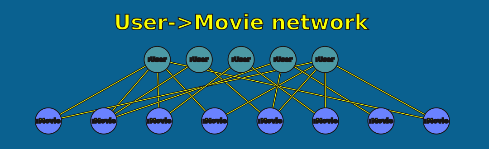
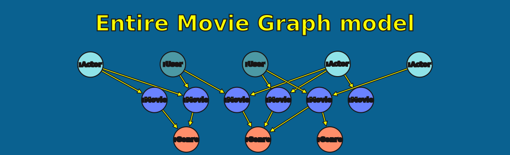
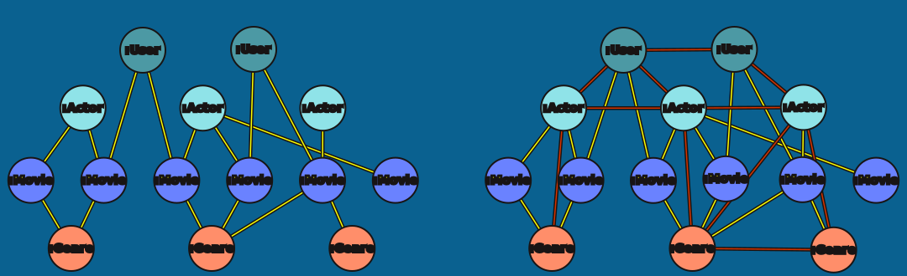
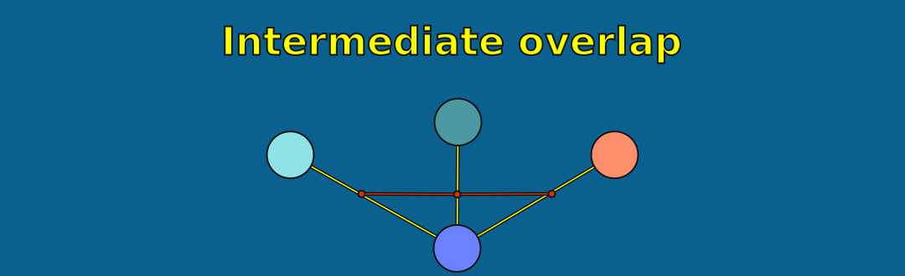

= Projection Practice
:type: lesson
:order: 5

[.slide.discrete]
== Introduction

Now it's time to put your knowledge into practice. You'll create both types of projections you learned about:

* **Monopartite transformations** — connecting nodes through shared neighbours
* **Labelled bipartite projections** — preserving two-partition structures

[.slide]
== What You'll Learn

By the end of this lesson, you'll be able to:

* Transform bipartite graphs into monopartite networks by traversing intermediate nodes
* Create labelled bipartite projections that preserve node types
* Match projection strategies to algorithm requirements
* Recognize why projecting "everything" rarely produces meaningful results

[.slide]
== Exercise 1: Monopartite Transformation

Your database has a bipartite structure: `(:Actor)-[:ACTED_IN]->(:Movie)`

Transform this into a monopartite Actor-to-Actor network by connecting actors through shared movies.

[.transcript-only]
====
You have five minutes to try this. If you need help, pop a message in the chat.

This pattern traverses Movie nodes without capturing them, creating direct Actor-to-Actor connections. The result is a true monopartite graph where any actor can potentially connect to any other actor.
====

[.slide.col-2]
== Exercise 1: Solution

The following query traverses through Movie nodes without including them in `source` or `target`.

[.col]
====
[source,cypher,role=noplay]
----
MATCH (source:Actor)-[:ACTED_IN]->(:Movie)<-[:ACTED_IN]-(target:Actor) // <1>
WITH gds.graph.project('actor-collab', source, target) AS g // <2>
RETURN g.graphName, g.nodeCount, g.relationshipCount // <3>
----
====

[.col]
====
<1> Match Actors connected through Movies, creating Actor-to-Actor pairs
<2> Project a graph named 'actor-collab' using the matched source and target nodes
<3> Return statistics about the created projection
====

[.slide]
== Why This Works for PageRank

In your Actor-to-Actor network:

* Actors connect directly to other Actors
* Importance can flow freely between nodes

[.slide]
== Exercise 2: Run PageRank

Run PageRank on the `actor-collab` graph in **write mode**, storing the result as a `pageRank` property.

Then query the database to find the top 10 actors by PageRank score.

Try this on your own for five minutes.

[.slide.col-2]
== Exercise 2: Solution

The first query runs PageRank on the actor-collab graph and stores the results in the database:

[.col]
====
[source,cypher,role=noplay]
----
CALL gds.pageRank.write('actor-collab', { // <1>
  writeProperty: 'pageRank' // <2>
})
YIELD nodePropertiesWritten // <3>
RETURN nodePropertiesWritten
----
====

[.col]
====
<1> Run PageRank in write mode on the actor-collab projection
<2> Store the PageRank score in a property named 'pageRank'
<3> Return the count of properties written to the database
====

[.slide.col-2]
== Exercise 2: Solution (continued)

The second query retrieves the top 10 actors by PageRank score:

[.col]
====
[source,cypher,role=noplay]
----
MATCH (a:Actor) // <1>
WHERE a.pageRank IS NOT NULL // <2>
RETURN a.name AS actor, a.pageRank AS score // <3>
ORDER BY score DESC // <4>
LIMIT 10 // <5>
----
====

[.col]
====
<1> Match all Actor nodes
<2> Filter to actors with a PageRank score
<3> Return the actor name and their PageRank score
<4> Order by score from highest to lowest
<5> Return only the top 10 results
====

You should see meaningful rankings—actors ranked by their importance in the collaboration network.

[.transcript-only]
====
Compare this to the bipartite structure where PageRank produced nearly identical scores for all nodes.
====

[.slide]
== Exercise 3: Movie Network

Create a monopartite Movie-to-Movie network by connecting movies through shared actors.

[.slide.col-2]
== Exercise 3: Solution

The following query traverses through Actor nodes to connect Movies.

[.col]
====
[source,cypher,role=noplay]
----
MATCH (source:Movie)<-[:ACTED_IN]-(:Actor)-[:ACTED_IN]->(target:Movie) // <1>
WITH gds.graph.project('movie-collab', source, target) AS g // <2>
RETURN g.graphName, g.nodeCount, g.relationshipCount // <3>
----
====

[.col]
====
<1> Match Movies connected through Actors, creating Movie-to-Movie pairs
<2> Project a graph named 'movie-collab' using the matched source and target nodes
<3> Return statistics about the created projection
====

[.slide.col-2]
== Exercise 4: Labelled Bipartite Projection

Create a bipartite projection of `(:User)-[:RATED]->(:Movie)`, preserving node labels.

[.col]
====
Try this by yourself for five minutes.

If you need help, pop a message in the chat.
====

[.col]
====

====

[.transcript-only]
====
The configuration parameters preserve the User and Movie labels. GDS now knows which nodes belong to which partition.
====

[.slide.col-2]
== Exercise 4: Solution

[.col]
====
[source,cypher,role=noplay]
----
MATCH (source:User)-[r:RATED]->(target:Movie) // <1>
WITH gds.graph.project(
  'user-movie-bipartite', // <2>
  source, // <3>
  target, // <4>
  { // <5>
    sourceNodeLabels: labels(source),
    targetNodeLabels: labels(target),
    relationshipType: type(r)
  },
  {}
) AS g
RETURN g.graphName, g.nodeCount, g.relationshipCount // <6>
----
====

[.col]
====
<1> Match Users connected to Movies via RATED relationships
<2> Name the projection 'user-movie-bipartite'
<3> Use User nodes as source
<4> Use Movie nodes as target
<5> Configure the projection to preserve node labels and relationship type
<6> Return statistics about the created projection
====

[.slide]
== What Have We Modelled?

What insights can we glean from a graph of `(:User)-[:RATED]->(:Movie)`?

Take a moment to discuss.

[.transcript-only]
====
Expected answers: user preferences, taste profiles, recommendation foundations, collaborative filtering data.
====

[.slide]
== Node Similarity

Node Similarity compares nodes based on shared neighbours across the bipartite structure.

In this case: finding users with overlapping taste in movies.

[.slide]
== Exercise 5: Run Node Similarity

Run Node Similarity on the `user-movie-bipartite` graph in **write mode**.

Use `SIMILAR` as the relationship type and `score` as the property name.

[.slide.col-2]
== Exercise 5: Solution

[.col]
====
[source,cypher,role=noplay]
----
CALL gds.nodeSimilarity.write('user-movie-bipartite', { // <1>
  writeRelationshipType: 'SIMILAR', // <2>
  writeProperty: 'score' // <3>
})
YIELD nodesCompared, relationshipsWritten // <4>
RETURN nodesCompared, relationshipsWritten
----
====

[.col]
====
<1> Run Node Similarity in write mode on the user-movie-bipartite projection
<2> Create SIMILAR relationships between similar nodes
<3> Store the similarity score as a 'score' property on the relationships
<4> Return statistics about the nodes compared and relationships created
====

[.transcript-only]
====
This creates SIMILAR relationships between Users who rated the same Movies, and between Movies rated by the same Users.
====

[.slide]
== Verify the Results

Check the similar users that Node Similarity found:

[source,cypher]
----
MATCH (u1:User)-[s:SIMILAR]->(u2:User)
RETURN u1.name AS user1, u2.name AS user2, s.score AS similarity
ORDER BY s.score DESC
LIMIT 10
----

These are users with similar movie rating patterns—the foundation of collaborative filtering.

[.slide]
== What Happens with Multipartite?

Node Similarity works well on bipartite structures. But what if you project the *entire* graph?

Let's find out.

[.slide]
== Project the Full Graph

Project everything: Actors, Movies, Users, and their relationships:

[source,cypher]
----
MATCH (source)-[r]->(target)
WHERE source:Actor OR source:Movie OR source:User OR target:Actor OR target:Movie OR target:User
LIMIT 100000
WITH gds.graph.project(
  'everything',
  source,
  target
) AS g
RETURN g.graphName, g.nodeCount, g.relationshipCount
----

[.transcript-only]
====
This projects the entire graph, including all node types. However, note that we are limiting the number of relationships to ensure that node similarity runs faster for this demonstration.
====

[.slide]
== Run Node Similarity on Everything

[source,cypher]
----
CALL gds.nodeSimilarity.stream('everything', {topK: 3})
YIELD node1, node2, similarity
WITH gds.util.asNode(node1) AS n1,
     gds.util.asNode(node2) AS n2,
     similarity
WHERE similarity < 0.3 AND n1 < n2 
  AND none(l IN labels(n1) WHERE l IN labels(n2))
  AND none(l IN labels(n2) WHERE l IN labels(n1))
RETURN labels(n1) AS label1,
       coalesce(n1.name, n1.title) AS node1,
       labels(n2) AS label2,
       coalesce(n2.name, n2.title) AS node2,
       similarity
ORDER BY similarity DESC
LIMIT 10
----

[.slide]
== Unexpected Results

Problems with the "everything" projection:

* Spurious links between Users, Actors and Genres
* The results are conceptually meaningless
* The algorithm takes significantly longer to run
* The query to interpret results is unnecessarily complex

[.transcript-only]
====
The algorithm has no concept of node types. It just sees nodes with shared neighbours—regardless of whether those comparisons are meaningful.
====

[.slide]
== Why This Happens

Node Similarity compares nodes based on shared neighbours. On a multipartite graph:

* An Actor and a User might both connect to the same Movie
* The algorithm sees them as "similar"—even though that comparison is nonsensical

[.transcript-only]
====
The algorithm has no concept of node types. It just sees nodes with shared neighbours—regardless of whether those comparisons are meaningful.
====

[.slide]
== Cleanup

Before moving on, drop the projections we created:

[source,cypher]
----
CALL gds.graph.list()
YIELD graphName
CALL gds.graph.drop(graphName)
YIELD graphName AS droppedGraphs
RETURN droppedGraphs
----

read::Mark as read[]

[.summary]
== Practice Summary

You practiced both projection approaches:

* **Monopartite transformations** for algorithms like PageRank that need single-type networks
* **Labelled bipartite projections** for algorithms like Node Similarity that work with two-partition structures

You experienced the consequences of projecting "everything" graphs.

The same data can answer different questions depending on how you project it. Choose your approach based on what your algorithm expects and what insights you're seeking.
