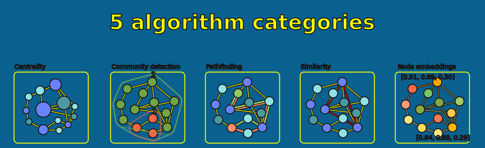
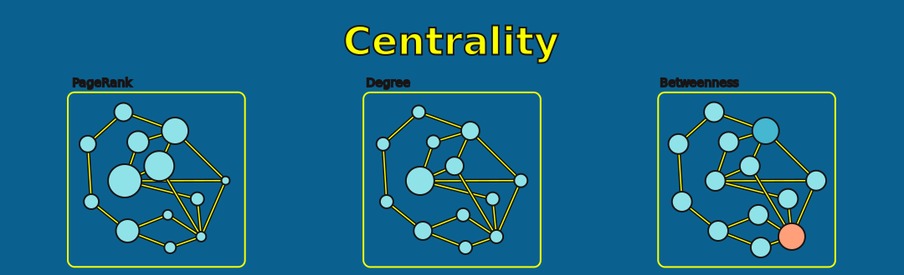
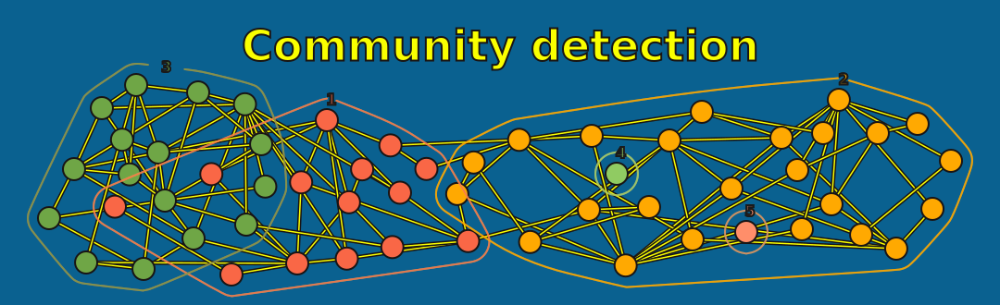
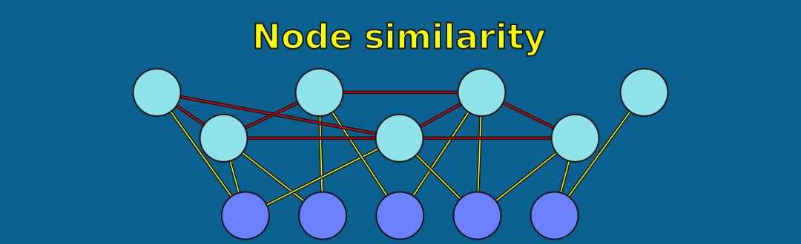
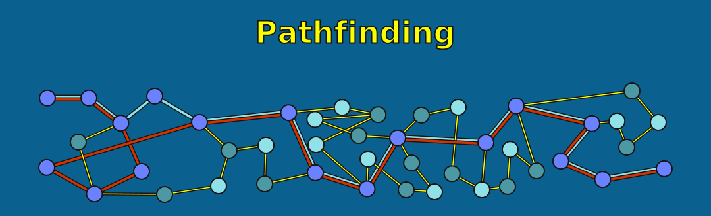
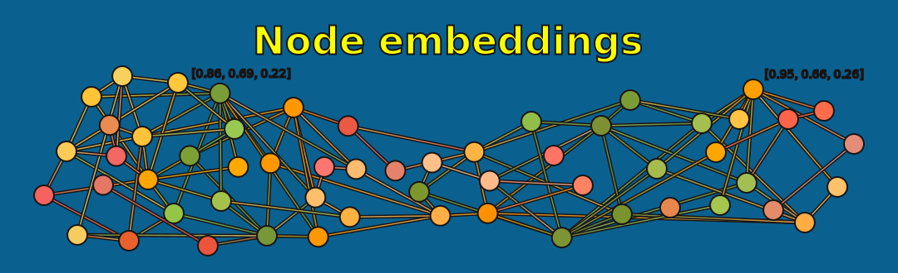

= Applying Algorithms
:type: lesson
:order: 6

[.slide.discrete]
== Introduction

You've learned how to project graphs and why structure matters for algorithms. Now let's put algorithms to work.

In this lesson, you'll run algorithms from each of the five categories and see how they answer different questions about the same data.

[.slide]
== Algorithm details

Don't worry too much about retaining the specific details of each algorithm.

In the next module, we'll apply community detection and centrality in detail to a fraud detection use case.

[.slide]
== What You'll Learn

By the end of this lesson, you'll be able to:

* Run algorithms from each of the five GDS categories on projected graphs
* Recognize how different centrality algorithms define "importance" differently
* Apply community detection, similarity, pathfinding, and embedding algorithms
* Choose the right algorithm category based on your analytical question

[.slide.col-2]
== Setup: Create the Actor Network

First, create an actor collaboration network:

[.col]
====
[source,cypher]
----
MATCH (source:Actor)-[:ACTED_IN]->(:Movie)<-[:ACTED_IN]-(target:Actor) // <1>
WITH gds.graph.project('actor-network', source, target) AS g // <2>
RETURN g.graphName, g.nodeCount, g.relationshipCount
----
====

[.col]
====
<1> Match actors connected through shared movies
<2> Project as a monopartite actor-to-actor network
====

You should see approximately 36,000 nodes and over 1 million relationships.

[.slide]
== Category 1: Centrality

Centrality algorithms rank nodes by importance. But "important" depends on how you define it.

Let's try three definitions on the same graph.

[.slide.col-2]
== Degree Centrality

**Question:** "Who has the most direct connections?"

Degree Centrality counts outgoing relationships.

[.col]
====
[source,cypher]
----
CALL gds.degree.stream('actor-network', {}) // <1>
YIELD nodeId, score
RETURN gds.util.asNode(nodeId).name AS actor, // <2>
       score AS collaborations
ORDER BY score DESC LIMIT 10
----
====

[.col]
====
<1> Stream Degree Centrality on the actor-network projection
<2> Resolve internal node IDs to actor names
====

Note the top actor and their score.

[.slide.col-2]
== PageRank

**Question:** "Who is connected to other important nodes?"

PageRank considers both connection count *and* the importance of those connections.

[.col]
====
[source,cypher]
----
CALL gds.pageRank.stream('actor-network', {}) // <1>
YIELD nodeId, score
RETURN gds.util.asNode(nodeId).name AS actor,
       score AS influence
ORDER BY score DESC LIMIT 10
----
====

[.col]
====
<1> PageRank weights connections by the importance of the connected node
====

Compare the rankings. Same actors at the top?

[.slide.col-2]
== Betweenness Centrality

**Question:** "Who bridges different groups?"

Betweenness measures how often a node appears on shortest paths between others.

[.col]
====
[source,cypher]
----
CALL gds.betweenness.stream('actor-network', {samplingSize: 5000}) // <1>
YIELD nodeId, score
RETURN gds.util.asNode(nodeId).name AS actor,
       score AS bridging
ORDER BY score DESC LIMIT 10
----
====

[.col]
====
<1> Betweenness identifies nodes that act as bridges between communities
====

[.transcript-only]
====
Betweenness is computationally expensive--O(n^3^) complexity--so this may take a moment. We are using a sampling size of 5000 to speed up the computation.

This means that we are using only 5000 nodes as source nodes for the calculation.

For now, just focus on the algorithm's basic functionality.

From the results, you can see that the top actors are not the same as the top actors from PageRank or Degree Centrality. In fact, you may not recognize some of the names here.

That is because they are not necessarily the 'most important' actors in the network. Instead, they are like the glue that ties together different communities.
====

[.slide]
== Three Definitions of "Important"

Same graph, three different answers:

* **Degree** -- most collaborations
* **PageRank** -- connected to influential actors
* **Betweenness** -- bridges different communities

The algorithm you choose defines what "importance" means.

[.slide]
== Category 2: Community Detection

Community detection finds clusters--nodes more connected to each other than to the rest of the network.

[.slide.col-2]
== Louvain

Louvain groups nodes by maximising "modularity"--connection density within groups vs. between groups.

[.col]
====
[source,cypher]
----
CALL gds.louvain.stream('actor-network', {}) // <1>
YIELD nodeId, communityId // <2>
WITH communityId, count(*) AS size // <3>
RETURN communityId, size
ORDER BY size DESC LIMIT 10
----
====

[.col]
====
<1> Stream Louvain community detection on the actor-network
<2> Each node is assigned a community ID
<3> Aggregate to count the size of each community
====

How many communities? What's the largest?

[.slide.col-2]
== Explore a Community

See who's in the largest community:

[.col]
====
[source,cypher]
----
CALL gds.louvain.stream('actor-network', {})
YIELD nodeId, communityId
WITH communityId,
     collect(gds.util.asNode(nodeId).name) AS actors, // <1>
     count(*) AS size
ORDER BY size DESC LIMIT 10 // <2>
RETURN communityId, size, actors[0..15] AS sampleActors // <3>
----
====

[.col]
====
<1> Collect actor names within each community
<2> Take only the largest community
<3> Return a sample of 15 actors from it
====

These actors are more densely connected to each other than to the rest of the network.

[.slide.col-2]
== Tuning: maxLevels

Louvain builds hierarchical communities. The `maxLevels` parameter controls depth.

[.col]
====
[source,cypher]
----
CALL gds.louvain.stats('actor-network', { maxLevels: 1 }) // <1>
YIELD communityCount, modularity
RETURN communityCount, modularity
----

[source,cypher]
----
CALL gds.louvain.stats('actor-network', { maxLevels: 5 }) // <2>
YIELD communityCount, modularity
RETURN communityCount, modularity
----
====

[.col]
====
<1> A single level produces more granular communities
<2> Five levels produces fewer, larger communities
====

More levels = fewer, larger communities with higher modularity.

[.slide]
== Category 3: Similarity

Node Similarity finds nodes with similar connection patterns.

[.slide.col-2]
== Bipartite projection

For this, we need a bipartite projection:

[.col]
====
[source,cypher]
----
MATCH (source:User)-[r:RATED]->(target:Movie)
WITH gds.graph.project(
  'user-movie',
  source, target,
  { sourceNodeLabels: labels(source), // <1>
    targetNodeLabels: labels(target) }, // <2>
  {}
) AS g
RETURN g.graphName, g.nodeCount, g.relationshipCount
----
====

[.col]
====
<1> Preserve User labels so the algorithm can distinguish node types
<2> Preserve Movie labels to maintain the bipartite structure
====

[.slide.col-2]
== Run Node Similarity

Find users with similar movie tastes:

[.col]
====
[source,cypher]
----
CALL gds.nodeSimilarity.stream('user-movie', { // <1>
  topK: 3 // <2>
})
YIELD node1, node2, similarity
RETURN gds.util.asNode(node1).name AS user1,
       gds.util.asNode(node2).name AS user2,
       similarity
ORDER BY similarity DESC LIMIT 10
----
====

[.col]
====
<1> Stream Node Similarity on the bipartite user-movie projection
<2> Return the top 3 most similar nodes per node
====

High similarity = rated many of the same movies.

[.slide]
== Category 4: Pathfinding

Pathfinding algorithms find the shortest path or paths between two nodes.

[.slide.col-2]
== Dijkstra's Shortest Path

Dijkstra finds the single shortest path between two nodes. Find the degrees of separation between actors:

[.col]
====
[source,cypher]
----
MATCH (source:Actor {name: 'Kevin Bacon'}) // <1>
MATCH (target:Actor {name: 'Meg Ryan'})
CALL gds.shortestPath.dijkstra.stream('actor-network', { // <2>
  sourceNode: source,
  targetNode: target
})
YIELD path
RETURN [node IN nodes(path) | node.name] AS connectionPath, // <3>
       length(path) AS degrees
----
====

[.col]
====
<1> Match the source and target actors by name
<2> Run Dijkstra's shortest path between them
<3> Extract actor names along the path and count degrees of separation
====

Try different actor pairs.

[.slide]
== Category 5: Node Embeddings

Node Embeddings convert nodes into vector representations that capture their structural properties. These vectors can be used for machine learning tasks.

[.slide.col-2]
== Run FastRP

FastRP creates vector representations capturing each node's network position.

[.col]
====
[source,cypher]
----
CALL gds.fastRP.stream('actor-network', {
  embeddingDimension: 64 // <1>
})
YIELD nodeId, embedding // <2>
RETURN gds.util.asNode(nodeId).name AS actor,
       embedding[0..5] AS embeddingSample // <3>
LIMIT 5
----
====

[.col]
====
<1> Generate 64-dimensional vectors for each node
<2> Each node receives an embedding vector
<3> Preview the first 5 dimensions of each embedding
====

Each actor now has a 64-dimensional vector.

[.slide.col-2]
== Using Embeddings

Find actors structurally similar to Kevin Bacon:

[.col]
====
[source,cypher]
----
CALL gds.fastRP.stream('actor-network', {
  embeddingDimension: 64
})
YIELD nodeId, embedding
WITH gds.util.asNode(nodeId) AS actor, embedding
WITH collect({actor: actor, embedding: embedding}) AS actors // <1>
WITH [a IN actors WHERE a.actor.name = 'Kevin Bacon'][0] AS kevin, // <2>
     actors
UNWIND actors AS other
WITH kevin, other
WHERE other.actor.name <> 'Kevin Bacon'
RETURN other.actor.name AS actor,
       gds.similarity.cosine(kevin.embedding, other.embedding) AS similarity // <3>
ORDER BY similarity DESC LIMIT 10
----
====

[.col]
====
<1> Collect all actors and their embeddings into a list
<2> Isolate Kevin Bacon's embedding as the reference point
<3> Compare every other actor using cosine similarity
====

These actors occupy similar positions in the collaboration network.

[.slide]
== Cleanup

Drop projections before moving on:

[source,cypher]
----
CALL gds.graph.drop('actor-network') YIELD graphName;
----

[source,cypher]
----
CALL gds.graph.drop('user-movie') YIELD graphName;
----

read::Mark as read[]

[.slide]
== Quick Reference

[cols="1,2,2"]
|===
| Question | Category | Try First

| Who is influential?
| Centrality
| PageRank, Degree, Betweenness

| What clusters exist?
| Community Detection
| Louvain, Leiden

| Who has similar patterns?
| Similarity
| Node Similarity

| How are nodes connected?
| Pathfinding
| Dijkstra

| How do I use this in ML?
| Embeddings
| FastRP
|===

[.summary]
== Summary

You've now applied algorithms from all five categories:

* **Centrality** -- three definitions of "important"
* **Community Detection** -- finding clusters with Louvain
* **Similarity** -- users with similar movie tastes
* **Pathfinding** -- degrees of separation
* **Embeddings** -- vector representations for ML

The same graph answers different questions depending on which algorithm you run.

In the next lesson, you'll learn the execution modes that control how results are returned and stored.
