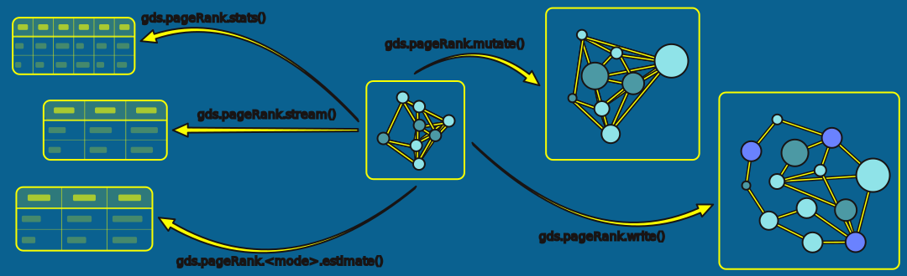
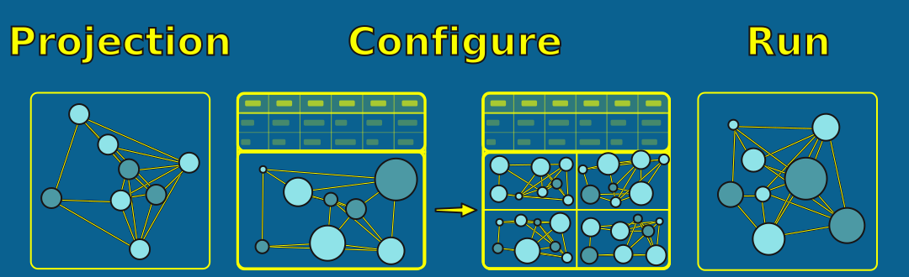

= Execution Modes and Configuration
:type: lesson
:order: 7

[.slide.discrete]
== Introduction

Every GDS algorithm supports five execution modes. Each mode determines where your results go and how you can use them.

Understanding these modes is essential for building effective GDS workflows.

[.slide]
== What You'll Learn

By the end of this lesson, you'll be able to:

* Choose the appropriate execution mode (stream, stats, mutate, write, estimate) for your task
* Build efficient workflows by combining modes strategically
* Configure algorithm parameters to control behaviour
* Use estimate mode to plan resource requirements before running expensive algorithms

[.slide]
== The Five Execution Modes

[cols="1,2"]
|===
| Mode | What it does

| **stream**
| Returns results to your query

| **stats**
| Returns summary statistics only

| **mutate**
| Stores results in the projection

| **write**
| Persists results to your database

| **estimate**
| Checks memory requirements
|===

[.slide.col-2]
== The Syntax Pattern

All algorithms follow the same pattern:

[.col]
====
[source,cypher,role=noplay]
----
CALL gds.<algorithm>.<mode>( // <1>
  'graph-name', // <2>
  { configuration } // <3>
)
YIELD <results> // <4>
RETURN <what you want>
----
====

[.col]
====
<1> Algorithm name and execution mode
<2> Name of your in-memory projection
<3> Optional configuration map
<4> Each mode yields different result fields
====

The mode determines what gets yielded and where results are stored.

[.slide.col-2]
== Stream Mode

Returns results directly in your query output. Nothing is stored.

[.col]
====
[source,cypher,role=noplay]
----
CALL gds.pageRank.stream('actor-network', {}) // <1>
YIELD nodeId, score // <2>
RETURN gds.util.asNode(nodeId).name AS actor, score
ORDER BY score DESC
LIMIT 10
----
====

[.col]
====
<1> Run PageRank in stream mode
<2> Results are yielded row-by-row to your query
====

Results exist only for the duration of your query.

[.slide]
== When to Use Stream

* Exploring results before deciding whether to store them
* Running one-off analyses
* Feeding results into other Cypher operations
* Exporting to CSV or pandas via the Python driver

Stream is your go-to for exploration.

[.slide.col-2]
== Stats Mode

Runs the algorithm but returns only summary statistics--no individual node results.

[.col]
====
[source,cypher,role=noplay]
----
CALL gds.louvain.stats('actor-network', {}) // <1>
YIELD communityCount, modularity, ranLevels // <2>
RETURN communityCount, modularity, ranLevels
----
====

[.col]
====
<1> Run Louvain in stats mode--no per-node results
<2> Yields aggregate metrics only
====

[.slide]
== When to Use Stats

* Understanding overall algorithm behaviour
* Testing configurations before committing
* Checking community counts or score distributions
* Quick iteration on parameter tuning

Stats is faster than streaming thousands of rows when you only need the summary.

[.slide.col-2]
== Mutate Mode

Stores results as properties **in your projection**--not in your database.

[.col]
====
[source,cypher,role=noplay]
----
CALL gds.pageRank.mutate('actor-network', {
  mutateProperty: 'pageRankScore' // <1>
})
YIELD nodePropertiesWritten // <2>
----
====

[.col]
====
<1> Property name for storing results in the projection
<2> Returns count of properties written to the projection
====

Results stay in memory until you drop the graph.

[.slide]
== When to Use Mutate

* Chaining algorithms (one algorithm's output feeds into another)
* Building ML feature pipelines
* Keeping your database clean of intermediate results
* Comparing multiple algorithm runs

Mutate is for workflows, not final outputs.

[.slide.col-2]
== Write Mode

Persists results as properties **in your Neo4j database**.

[.col]
====
[source,cypher,role=noplay]
----
CALL gds.pageRank.write('actor-network', {
  writeProperty: 'pageRank' // <1>
})
YIELD nodePropertiesWritten // <2>
----
====

[.col]
====
<1> Property name for persisting results to the database
<2> Returns count of properties written to your database
====

Results survive after dropping the projection.

[.slide]
== When to Use Write

* Making results available to applications
* Sharing insights via dashboards
* Preserving results for future queries
* Avoiding re-running expensive algorithms

Write is for production outputs.

[.slide.col-2]
== Estimate Mode

Tells you memory requirements **without running the algorithm**.

[.col]
====
[source,cypher,role=noplay]
----
CALL gds.pageRank.write.estimate('actor-network', { // <1>
  writeProperty: 'pageRank'
})
YIELD nodeCount, relationshipCount, requiredMemory // <2>
----
====

[.col]
====
<1> Append `.estimate` to any execution mode
<2> Returns graph size and memory requirements
====

Every execution mode has an estimate variant: `gds.<algorithm>.<mode>.estimate()`

[.slide]
== When to Use Estimate

* Planning before running expensive algorithms
* Checking if your heap can handle the operation
* Deciding whether to sample or run on the full graph

Estimate before you commit to long-running operations.

[.slide]
== A Typical Workflow

1. **Estimate** -- check memory requirements
2. **Stats** -- understand the distribution, test configurations
3. **Stream** -- explore specific results
4. **Mutate** -- chain algorithms together
5. **Write** -- persist final results

You won't always use all five, but knowing when to use each makes your workflow efficient.

[.slide.col-2]
== Algorithm Configuration

Most algorithms accept a configuration map:

[.col]
====
[source,cypher,role=noplay]
----
CALL gds.pageRank.stream('actor-network', {
  maxIterations: 40, // <1>
  dampingFactor: 0.95 // <2>
})
----
====

[.col]
====
<1> Number of iterations the algorithm will run
<2> Probability of following a link vs. random jump
====

Configuration controls how the algorithm behaves.

[.slide]
== Universal Configuration Options

Available across most algorithms:

* `concurrency` -- parallel threads (default: 4)
* `nodeLabels` -- filter to specific node types
* `relationshipTypes` -- filter to specific relationship types

[.slide]
== Algorithm-Specific Options

Each algorithm has unique parameters:

**PageRank:**
* `maxIterations` -- how many passes (default: 20)
* `dampingFactor` -- probability of following links (default: 0.85)

**Louvain/Leiden:**
* `maxLevels` -- hierarchy depth (default: 10)

You'll learn specific parameters as you use each algorithm.

[.slide]
== Configuration Strategy

1. **Start with defaults** -- run without configuration
2. **Use stats to test** -- check distributions and counts
3. **Adjust parameters** -- based on what you observe
4. **Validate results** -- do they answer your question?

[.transcript-only]
====
Don't over-configure early. Defaults are sensible starting points.
====

read::Mark as read[]

[.summary]
== Summary

Five execution modes control where results go:

* **Stream** -- view results (exploration)
* **Stats** -- summary only (testing)
* **Mutate** -- store in projection (chaining)
* **Write** -- persist to database (production)
* **Estimate** -- check memory (planning)

Configuration parameters control algorithm behaviour. Start with defaults, use stats to test, then tune as needed.

In the next lesson, you'll learn how projection configuration--undirected relationships and weights--affects algorithm behaviour.
