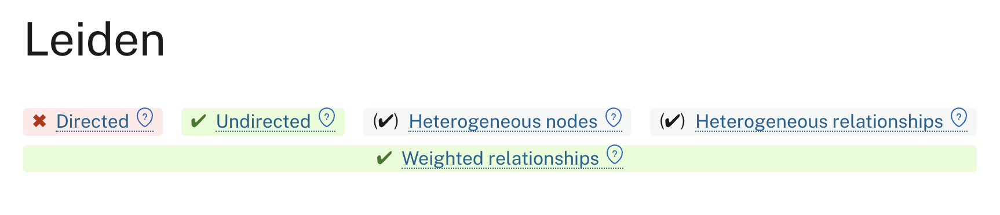

= Projection Configuration for Algorithms
:type: lesson
:optional: true
:order: 8
:slides: true

[.slide.discrete]
== Introduction

Some algorithms need specific projection configurations to work correctly—or at all.

In this lesson, you'll learn how relationship direction and weights affect algorithm behaviour, and how to configure projections accordingly.

[.slide]
== What You'll Learn

By the end of this lesson, you'll be able to:

* Create undirected projections for algorithms that require them
* Include relationship weights to represent connection strength
* Project node properties and handle missing values with `coalesce()`
* Determine what configuration an algorithm needs by checking its documentation

[.slide]
== Two Key Projection Settings

Beyond choosing which nodes and relationships to include, two configuration options significantly affect algorithms:

1. **Relationship direction** — directed vs undirected
2. **Relationship weights** — treating some connections as stronger than others

[.slide]
== Directed vs Undirected

By default, GDS projections are **directed**—relationships flow one way.

Some algorithms require **undirected** relationships, where connections work both ways.

[.slide]
== When Direction Matters

**Directed makes sense when:**

* Direction has real meaning (follows, purchased, influenced)
* You want to distinguish incoming from outgoing connections

**Undirected makes sense when:**

* Relationships are naturally bidirectional (collaborated with, friends with)
* The algorithm requires it (Leiden)

[.slide]
== Algorithm Requirements

Check the documentation header for each algorithm:

* ✓ Green = works well
* ✓ Grey = runs but ignores that aspect
* ✗ Red = won't run

Leiden has a red ✗ for directed—it **requires** undirected relationships.

[.slide]
== Creating Undirected Projections

Add `undirectedRelationshipTypes` to your projection configuration:

[source,cypher,role=noplay]
----
MATCH (source:Actor)-[:ACTED_IN]->(:Movie)<-[:ACTED_IN]-(target:Actor)
WITH gds.graph.project(
  'actor-network-undirected',
  source,
  target,
  {},
  { undirectedRelationshipTypes: ['*'] }  // <-- second config map
) AS g
RETURN g.graphName, g.nodeCount, g.relationshipCount
----

The `['*']` means all relationship types become undirected.

[.slide]
== Comparing Directed vs Undirected

For symmetrical graphs (like actor collaborations), results may be identical:

* If A→B exists, B→A also exists
* Making it undirected doesn't change the structure

For asymmetrical graphs (like followers), results will differ significantly.

[.slide]
== Degree Centrality and Direction

Degree centrality counts **outgoing** relationships by default.

[source,cypher,role=noplay]
----
CALL gds.degree.stream('actor-network', {
  orientation: 'NATURAL'  // outgoing (default)
})
----

You can change this:

* `'NATURAL'` — outgoing relationships
* `'REVERSE'` — incoming relationships
* `'UNDIRECTED'` — both directions

[.slide]
== Direction on Bipartite Graphs

Remember the Actor→Movie bipartite projection?

[source,cypher,role=noplay]
----
CALL gds.degree.stream('actor-movie-network', {
  orientation: 'REVERSE'
})
----

With `REVERSE`, you're now counting **incoming** relationships—which means you're ranking **Movies** by how many actors appeared in them, not actors by how many movies they made.

Direction determines *what* you're measuring.

[.slide]
== Relationship Weights

Not all connections are equal. Weights let algorithms treat some relationships as stronger than others.

Examples:

* Rating scores (1-5 stars)
* Transaction amounts
* Interaction frequency
* Distance or travel time

[.slide]
== Projecting Weights

Include relationship properties in your projection:

[source,cypher,role=noplay]
----
MATCH (source:User)-[r:RATED]->(target:Movie)
WITH gds.graph.project(
  'user-movie-weighted',
  source,
  target,
  { relationshipProperties: r { .rating } },  // <-- first config map
  { undirectedRelationshipTypes: ['*'] }
) AS g
RETURN g.graphName, g.nodeCount, g.relationshipCount
----

The `r { .rating }` syntax captures the `rating` property from relationships.

[.slide]
== Using Weights in Algorithms

Tell the algorithm which property to use:

[source,cypher,role=noplay]
----
CALL gds.leiden.stream('user-movie-weighted', {
  relationshipWeightProperty: 'rating'
})
YIELD nodeId, communityId
----

Without this parameter, the algorithm ignores the weights even if they're in the projection.

[.slide]
== Weighted vs Unweighted Communities

**Unweighted:** Groups users who rated the same movies (regardless of how they rated them)

**Weighted:** Groups users who rated movies *similarly* (5-star ratings contribute more than 1-star)

Weights transform "what's connected" into "how strongly it's connected."

[.slide]
== Weights for Different Algorithms

Different algorithms interpret weights differently:

* **Community Detection** — stronger connections keep nodes together
* **Pathfinding** — weights become distances/costs to minimise
* **Similarity** — higher weights increase similarity contribution

Check documentation for how each algorithm uses weights.

[.slide]
== Node Properties

Sometimes algorithms need node attributes—not just connections.

Examples:

* Initial values for community detection
* Features for similarity calculations
* Attributes for machine learning pipelines

[.slide]
== Projecting Node Properties

Include node properties using `sourceNodeProperties` and `targetNodeProperties`:

[source,cypher,role=noplay]
----
MATCH (source:Movie)<-[r:RATED]-(:User)-[:RATED]->(target:Movie)
WITH gds.graph.project(
  'user-movie-with-properties',
  source,
  target,
  {
    sourceNodeProperties: source { .startYear, .imdbRating },
    targetNodeProperties: target { .startYear, .imdbRating }
  }
) AS g
RETURN g.graphName, g.nodeCount, g.relationshipCount
----

[.slide]
== Handling Missing Properties

Use `coalesce()` to provide default values when properties might be missing:

[source,cypher,role=noplay]
----
MATCH (source:Movie)<-[:RATED]-(:User)-[:RATED]->(target:Movie)
WITH gds.graph.project(
  'movie-network-defaults',
  source,
  target,
  {
    sourceNodeProperties: source { imdbRating: coalesce(source.imdbRating, 5.0), startYear: coalesce(source.startYear, 1) },
    targetNodeProperties: target { imdbRating: coalesce(target.imdbRating, 5.0), startYear: coalesce(target.startYear, 1) }
  }
) AS g
RETURN g.graphName, g.nodeCount, g.relationshipCount
----

[.slide]

== No defaults leads to null

Without `coalesce()`, nodes missing the property will have `null` values—which can cause algorithms to fail.

[source,cypher]
----
CALL gds.fastRP.stream('user-movie-with-properties', {
  featureProperties: ['startYear', 'imdbRating'],
  embeddingDimension: 64
})
YIELD nodeId, embedding
----

[.transcript-only]

====
Without defaults, this query will fail with a null property error.
====

[.slide]
== Using Node Properties in Algorithms

With the use of defaults, however, we can still run the algorithm:

[source,cypher]
----
CALL gds.fastRP.stream('movie-network-defaults', {
  featureProperties: ['startYear', 'imdbRating'],
  embeddingDimension: 64
})
YIELD nodeId, embedding
----

[.transcript-only]

====
The `featureProperties` parameter tells FastRP to incorporate those node attributes into the embeddings.

We'll cover FastRP along with many other algorithms later in the workshop.
====

[.slide]
== Configuration Checklist

Before running an algorithm, ask:

1. **Does this algorithm support my graph structure?** (Check the header attributes)
2. **Does it need undirected relationships?** (Leiden does)
3. **Should I use weights?** (Do connection strengths matter?)
4. **Do I need node properties?** (Does the algorithm use node attributes?)
5. **What direction makes sense?** (What am I actually measuring?)

[.slide]
== Quick Reference: Configuration

[cols="2,3,2", options="header"]
|===
| Setting | Syntax | Location

| Undirected relationships
| `undirectedRelationshipTypes: ['*']`
| Second config map

| Relationship weights
| `relationshipProperties: r { .propertyName }`
| First config map

| Node properties
| `sourceNodeProperties: source { .prop }` +
`targetNodeProperties: target { .prop }`
| First config map

| Use relationship weights
| `relationshipWeightProperty: 'propertyName'`
| Algorithm config

| Use node properties
| `featureProperties: ['prop1', 'prop2']`
| Algorithm config
|===

[.summary]
== Summary

Projection configuration affects what algorithms can run and how they behave:

**Direction:**

* Some algorithms require undirected relationships (Leiden)
* Direction determines what you're measuring (outgoing vs incoming)
* Use `undirectedRelationshipTypes: ['*']` to make relationships bidirectional

**Weights:**

* Capture connection strength with `relationshipProperties`
* Tell algorithms to use weights with `relationshipWeightProperty`
* Transforms analysis from "connected" to "how strongly connected"

**Node Properties:**

* Include node attributes with `sourceNodeProperties` and `targetNodeProperties`
* Use `coalesce()` to handle missing values
* Some algorithms use properties as features (e.g., FastRP with `featureProperties`)

You're now ready to apply these concepts in the hands-on use case exercises.
