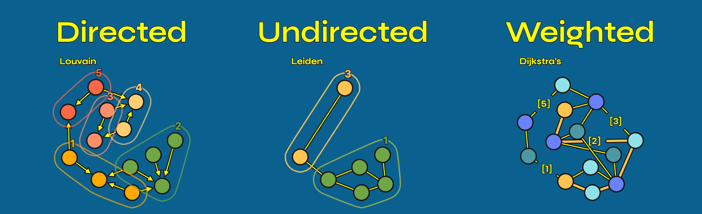
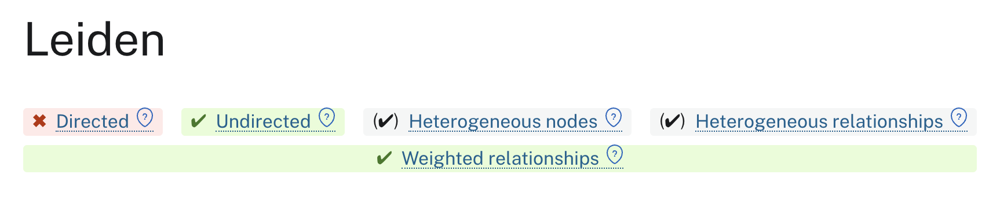
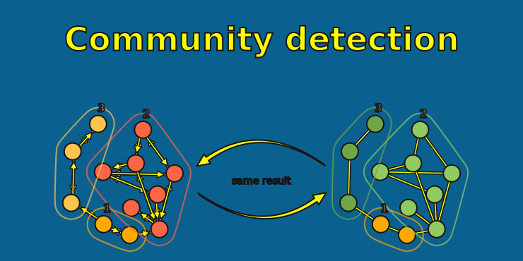
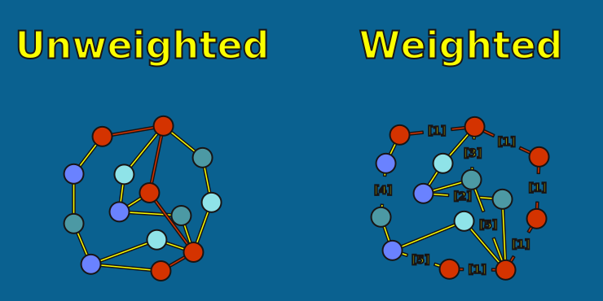
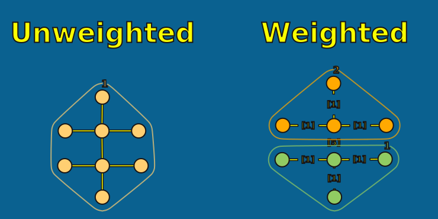
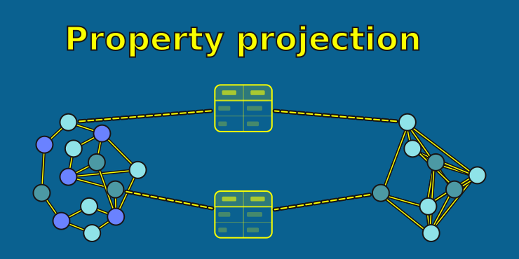

= Projection Configuration for Algorithms
:type: lesson
:order: 8

[.slide.discrete]
== Introduction

Some algorithms need specific projection configurations to work correctly--or at all.

In this lesson, you'll learn how relationship direction and weights affect algorithm behaviour, and how to configure projections accordingly.

[.slide]
== What You'll Learn

By the end of this lesson, you'll be able to:

* Create undirected projections for algorithms that require them
* Include relationship weights to represent connection strength
* Project node properties and handle missing values with `coalesce()`
* Determine what configuration an algorithm needs by checking its documentation

[.slide]
== Two Key Projection Settings

Beyond choosing which nodes and relationships to include, two configuration options significantly affect algorithms:

1. **Relationship direction** -- directed vs undirected
2. **Relationship weights** -- treating some connections as stronger than others

[.slide]
== Directed vs Undirected Projections

By default, GDS projections are **directed** -- relationships flow one way, from source to target.

Some algorithms require **undirected** projections, where every relationship works in both directions.

This is a property of the projection itself, set at projection time -- not something you change when running an algorithm.

[.slide]
== When Direction Matters

**Directed makes sense when:**

* Direction has real meaning (follows, purchased, influenced)
* You want to distinguish incoming from outgoing connections

**Undirected makes sense when:**

* Relationships are naturally bidirectional (collaborated with, friends with)
* The algorithm requires it (Leiden)

[.slide]
== Algorithm Requirements

Check the documentation header for each algorithm:

* Green = works well
* Grey = runs but ignores that aspect
* Red = won't run

Leiden has a red mark for directed--it **requires** undirected relationships.

[.slide.col-2]
== Projecting an Undirected Graph

To make a projection undirected, add `undirectedRelationshipTypes` to the second config map:

[.col]
====
[source,cypher]
.Undirected projection of actors and movies
----
MATCH (source:Actor)-[:ACTED_IN]->(target:Movie)
WITH gds.graph.project(
  'actor-movie-undirected',
  source,
  target,
  {}, // <1>
  { undirectedRelationshipTypes: ['*'] } // <2>
) AS g
RETURN g.graphName, g.nodeCount, g.relationshipCount
----
====

[.col]
====
<1> First config map (for node/relationship properties -- empty here)
<2> Second config map -- make all relationship types undirected
====

The `['*']` means all relationship types in the projection become undirected.

[.transcript-only]
====
In this projection, every Actor is connected to every Movie it appeared in, and every Movie is connected back to every Actor.

In reality, GDS creates this as a bidirectional graph rather than a truly undirected one, but in practice the effect is the same.
====

[.slide.col-2]
== Projecting a Directed Graph

For comparison, let's project the same data as a directed graph:

[.col]
====
[source,cypher]
.Directed projection of actors and movies
----
MATCH (source:Actor)-[:ACTED_IN]->(target:Movie)
WITH gds.graph.project(
  'actor-movie-directed',
  source,
  target
) AS g
RETURN g.graphName, g.nodeCount, g.relationshipCount
----
====

[.col]
====
This projection only has relationships flowing from Actor to Movie, matching the `ACTED_IN` direction in the database.
====

[slide.col-2]
== Run degree centrality in both directed and undirected projections

Now let's run degree centrality on both directed and undirected projections and compare the results.

[.col]
====
[source,cypher]
.Degree centrality in directed projection
----
CALL gds.degree.stream('actor-movie-directed')
YIELD nodeId, score
RETURN gds.util.asNode(nodeId).name AS name, score
ORDER BY score DESC LIMIT 5
----
====

[.col]
====
[source,cypher]
.Degree centrality in undirected projection
----
CALL gds.degree.stream('actor-movie-undirected')
YIELD nodeId, score
RETURN gds.util.asNode(nodeId).name AS name, score
ORDER BY score DESC LIMIT 5
----
====

You'll notice that both versions appear to return the same results. This is because, in our graph, actors connect to more movies than movies connect to actors.

[.slide.col-2]
== Comparing Directed vs Undirected

However, let's now look at what happens if we only count the degree count for movies in each projection.

[.col]
====
[source,cypher]
.Degree centrality in directed projection
----
CALL gds.degree.stream('actor-movie-directed')
YIELD nodeId, score
WITH gds.util.asNode(nodeId) as nodeType, score
WHERE "Movie" IN labels(nodeType)
RETURN nodeType.title AS title, score
ORDER BY score DESC LIMIT 5
----
====

[.col]
====
[source,cypher]
.Degree centrality in undirected projection
----
CALL gds.degree.stream('actor-movie-undirected')
YIELD nodeId, score
WITH gds.util.asNode(nodeId) as nodeType, score
WHERE "Movie" IN labels(nodeType)
RETURN nodeType.title AS title, score
ORDER BY score DESC LIMIT 5
----
====

You'll notice that the second version returns different results. In the first version we're counting all the outgoing rels from `Actor` to `Movie`, while in the second version we're counting in both directions.

In the first version, only `Actor` nodes receive a score greater than 0, while in the second version all nodes with outgoing relationships receive a score greater than 0.

[.transcript-only]
====
In the first version, Movies do not have any outgoing relationships, so their relationships are not counted. In the second version, all movies have outgoing relationships, so their relationships are counted.
====

[.slide.col-2]
== Comparing Directed vs Undirected

[.col]
====
For symmetrical graphs (like actor collaborations), results may be identical:

* If A->B exists, B->A also exists
* Making it undirected doesn't change the structure
====

[.col]
====

====

For asymmetrical graphs (like followers), results will differ significantly.

[.slide]
== Direction in the Projection vs Direction in the Algorithm

It's important to distinguish between two different places where direction can come into play:

1. **Projection-level direction** -- set when you create the projection using `undirectedRelationshipTypes`. This determines the structure of the in-memory graph.
2. **Algorithm-level orientation** -- some algorithms (like degree centrality) let you choose which direction to traverse using an `orientation` parameter. This only works within the bounds of what the projection contains.

[.slide.col-2]
== Degree Centrality: Measuring Direction

Degree centrality counts connections. On a directed projection, you can choose which connections to count using the `orientation` parameter.

[.col]
====
[source,cypher]
.Counting outgoing connections (NATURAL)
----
CALL gds.degree.stream('actor-movie-directed', {
  orientation: 'NATURAL' // <1>
})
YIELD nodeId, score
RETURN gds.util.asNode(nodeId).name AS name,
       score
ORDER BY score DESC LIMIT 5
----
====

[.col]
====
<1> `NATURAL` counts outgoing relationships (the default). For actors, this counts how many movies each actor appeared in.
====

[.slide.col-2]
== Degree Centrality: Reversing Direction

On the same directed projection, you can reverse the traversal direction:

[.col]
====
[source,cypher]
.Counting incoming connections (REVERSE)
----
CALL gds.degree.stream('actor-movie-directed', {
  orientation: 'REVERSE' // <1>
})
YIELD nodeId, score
RETURN gds.util.asNode(nodeId).title AS title,
       score
ORDER BY score DESC LIMIT 5
----
====

[.col]
====
<1> `REVERSE` counts incoming relationships. For movies, this counts how many actors appeared in each movie.
====

The same projection, different orientation -- and you're measuring something completely different.

[.slide.col-2]
== Reversing direction on an undirected projection

Now let's run degree centrality on an undirected projection, both with and without reversing the direction.

[.col]
====
[source,cypher]
----
CALL gds.degree.stream('actor-movie-undirected', {
  orientation: 'NATURAL'
})
YIELD nodeId, score
RETURN gds.util.asNode(nodeId).name AS name, score
ORDER BY score DESC LIMIT 5
----
====

[.col]
====
[source,cypher]
----
CALL gds.degree.stream('actor-movie-undirected', {
  orientation: 'REVERSE'
})
YIELD nodeId, score
RETURN gds.util.asNode(nodeId).name AS name, score
ORDER BY score DESC LIMIT 5
----
====

You'll notice that the results are the same in both cases. This is because the undirected projection is already bidirectional, so reversing the direction doesn't change the results.

[.slide.col-2]
== Relationship Weights

Not all connections are equal. Weights let algorithms treat some relationships as stronger than others.

[.col]
====
Examples:

* Rating scores (1-5 stars)
* Transaction amounts
* Interaction frequency
* Distance or travel time
====

[.col]
====

====

[.slide.col-2]
== Projecting Weights

Include relationship properties in your projection:

[.col]
====
[source,cypher]
----
MATCH (source:User)-[r:RATED]->(target:Movie)
WITH gds.graph.project(
  'user-movie-weighted',
  source,
  target,
  { relationshipProperties: r { .rating } }, // <1>
  { undirectedRelationshipTypes: ['*'] } // <2>
) AS g
RETURN g.graphName, g.nodeCount, g.relationshipCount
----
====

[.col]
====
<1> Capture the `rating` property from relationships
<2> Make relationships undirected (required for Leiden)
====

The `r { .rating }` syntax captures the `rating` property from relationships.

[.slide.col-2]
== Using Weights in Algorithms

Tell the algorithm which property to use:

[.col]
====
[source,cypher]
----
CALL gds.leiden.stream('user-movie-weighted', {
  relationshipWeightProperty: 'rating' // <1>
})
YIELD nodeId, communityId
----
====

[.col]
====
<1> Point the algorithm at the projected weight property
====

Without this parameter, the algorithm ignores the weights even if they're in the projection.

[.slide.col-2]
== Weighted vs Unweighted Communities

[.col]
====
**Unweighted:** Groups users who rated the same movies (regardless of how they rated them)

**Weighted:** Groups users who rated movies *similarly* (5-star ratings contribute more than 1-star)

Weights transform "what's connected" into "how strongly it's connected."
====

[.col]
====

====

[.slide]
== Weights for Different Algorithms

Different algorithms interpret weights differently:

* **Community Detection** -- stronger connections keep nodes together
* **Pathfinding** -- weights become distances/costs to minimise
* **Similarity** -- higher weights increase similarity contribution

Check documentation for how each algorithm uses weights.

[.slide.col-2]
== Node Properties

Sometimes algorithms need node attributes--not just connections.

[.col]
====
Examples:

* Initial values for community detection
* Features for similarity calculations
* Attributes for machine learning pipelines
====

[.col]
====

====

[.slide.col-2]
== Projecting Node Properties

Include node properties using `sourceNodeProperties` and `targetNodeProperties`:

[.col]
====
[source,cypher]
----
MATCH (source:Movie)<-[r:RATED]-(:User)-[:RATED]->(target:Movie)
WITH gds.graph.project(
  'user-movie-with-properties',
  source,
  target,
  {
    sourceNodeProperties: source { .startYear, .imdbRating }, // <1>
    targetNodeProperties: target { .startYear, .imdbRating } // <2>
  }
) AS g
RETURN g.graphName, g.nodeCount, g.relationshipCount
----
====

[.col]
====
<1> Include properties from source nodes
<2> Include the same properties from target nodes
====

[.slide.col-2]
== Handling Missing Properties

Use `coalesce()` to provide default values when properties might be missing:

[.col]
====
[source,cypher]
----
MATCH (source:Movie)<-[:RATED]-(:User)-[:RATED]->(target:Movie)
WITH gds.graph.project(
  'movie-network-defaults',
  source,
  target,
  {
    sourceNodeProperties: source {
      imdbRating: coalesce(source.imdbRating, 5.0), // <1>
      startYear: coalesce(source.startYear, 1) // <2>
    },
    targetNodeProperties: target {
      imdbRating: coalesce(target.imdbRating, 5.0),
      startYear: coalesce(target.startYear, 1)
    }
  }
) AS g
RETURN g.graphName, g.nodeCount, g.relationshipCount
----
====

[.col]
====
<1> Default to 5.0 if `imdbRating` is null
<2> Default to 1 if `startYear` is null
====

[.slide.col-2]
== No defaults leads to null

Without `coalesce()`, nodes missing the property will have `null` values--which can cause algorithms to fail.

[.col]
====
[source,cypher]
----
CALL gds.fastRP.stream('user-movie-with-properties', {
  featureProperties: ['startYear', 'imdbRating'], // <1>
  embeddingDimension: 64
})
YIELD nodeId, embedding
----
====

[.col]
====
<1> Algorithms using node properties will fail if any values are null
====

[.transcript-only]
====
Without defaults, this query will fail with a null property error.
====

[.slide.col-2]
== Using Node Properties in Algorithms

With the use of defaults, however, we can still run the algorithm:

[.col]
====
[source,cypher]
----
CALL gds.fastRP.stream('movie-network-defaults', {
  featureProperties: ['startYear', 'imdbRating'], // <1>
  embeddingDimension: 64
})
YIELD nodeId, embedding
----
====

[.col]
====
<1> `featureProperties` tells FastRP to incorporate node attributes into embeddings
====

[.transcript-only]
====
The `featureProperties` parameter tells FastRP to incorporate those node attributes into the embeddings.

FastRP and other embedding algorithms are covered in the link:/courses/workshop-gds-python-aga/[GDS Python Client & Aura Graph Analytics^] workshop.
====

[.slide]
== Configuration Checklist

Before running an algorithm, ask:

1. **Does this algorithm support my graph structure?** (Check the header attributes)
2. **Does it need undirected relationships?** (Leiden does)
3. **Should I use weights?** (Do connection strengths matter?)
4. **Do I need node properties?** (Does the algorithm use node attributes?)
5. **What direction makes sense?** (What am I actually measuring?)

[.slide]
== Quick Reference: Configuration

[cols="2,3,2", options="header"]
|===
| Setting | Syntax | Location

| Undirected relationships
| `undirectedRelationshipTypes: ['*']`
| Second config map

| Relationship weights
| `relationshipProperties: r { .propertyName }`
| First config map

| Node properties
| `sourceNodeProperties: source { .prop }` +
`targetNodeProperties: target { .prop }`
| First config map

| Use relationship weights
| `relationshipWeightProperty: 'propertyName'`
| Algorithm config

| Use node properties
| `featureProperties: ['prop1', 'prop2']`
| Algorithm config
|===

read::Mark as read[]

[.summary]
== Summary

Projection configuration affects what algorithms can run and how they behave:

image::images/diagram_summarizing_effects_of_direction_weights_a.png[Diagram summarizing effects of direction, weights, and node properties on algorithms.]

**Direction:**

* Some algorithms require undirected relationships (Leiden)
* Direction determines what you're measuring (outgoing vs incoming)
* Use `undirectedRelationshipTypes: ['*']` to make relationships bidirectional

**Weights:**

* Capture connection strength with `relationshipProperties`
* Tell algorithms to use weights with `relationshipWeightProperty`
* Transforms analysis from "connected" to "how strongly connected"

**Node Properties:**

* Include node attributes with `sourceNodeProperties` and `targetNodeProperties`
* Use `coalesce()` to handle missing values
* Some algorithms use properties as features (e.g., FastRP with `featureProperties`)

You're now ready to apply these concepts in the hands-on use case exercises.
