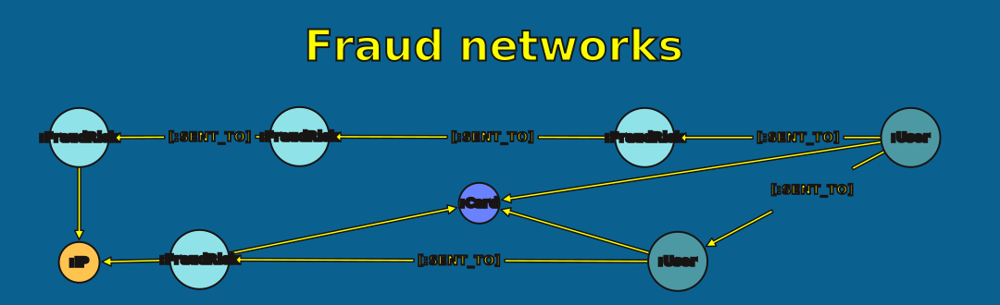
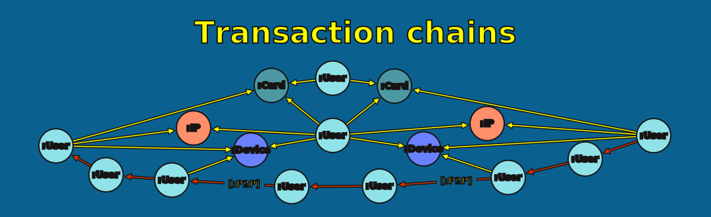
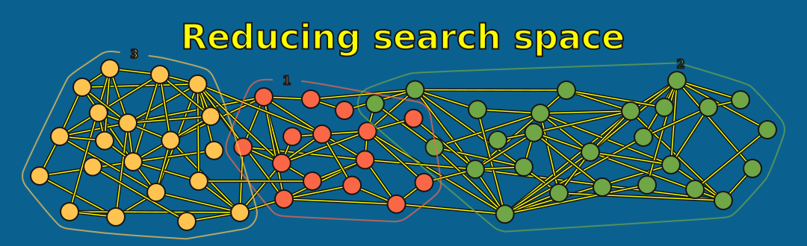
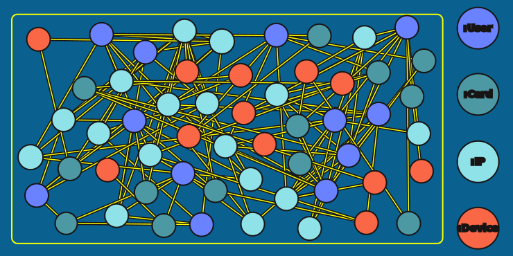
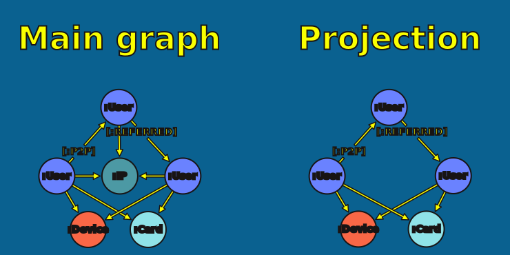

= Fraud Detection
:type: lesson
:order: 1

[.slide.discrete]
== Introduction

Traditional fraud detection looks at individual transactions. But organized fraud operates as coordinated networks—multiple actors working together.

Graph algorithms excel at revealing these hidden groups.

[.slide]
== What You'll Learn

By the end of this lesson, you'll be able to:

* Identify fraud patterns that are invisible in tables but obvious in graphs
* Explore a real fraud dataset and discover suspicious connections
* Design a graph projection strategy for fraud investigation
* Choose appropriate algorithms for narrowing search space and ranking suspects

[.slide]
== Why Graphs?

Fraudsters actively try to hide. They use:

* Multiple accounts
* Shared devices and credit cards
* Complex transaction chains

[.transcript-only]
====
These connections are invisible in tables—but obvious in graphs. A relational database would require multiple JOINs to discover what a single graph traversal reveals instantly.
====

[.slide.col-2]
== The Dataset

Let's see these principles in action with a real fraud network.

[.col]
====
You'll work with an anonymized peer-to-peer (P2P) financial transactions dataset containing:

* `User` nodes (some flagged as known fraudsters)
* `Card`, `Device`, and `IP` nodes
* `P2P`, `HAS_CC`, `HAS_IP`, `USED` relationships
====

[.col]
====
[source,mermaid, role=noplay nocoppy]
.Schema diagram showing User, Card, Device, and IP nodes with relationships.
----
graph LR
    User1(("User"))
    User2(("User"))
    Card(("Card"))
    Device(("Device"))
    IP(("IP"))
    User1 -- "P2P" --> User2
    User1 -- "HAS_CC" --> Card
    User1 -- "HAS_IP" --> IP
    User1 -- "USED" --> Device
----
====

[.slide]
== Explore the Schema

Run this to see the data model:

[source,cypher]
----
CALL db.schema.visualization()
----

[.transcript-only]
====
Take a moment to understand the structure. Users connect to Cards, Devices, and IPs. Users also connect to other Users via P2P transactions.
====

[.slide.col-2]
== Node and Relationship Counts

Let's see the scale of our data:

[.col]
====
[source,cypher]
----
MATCH (n)
WITH count(n) AS nodeCount // <1>
MATCH ()-[r]->() // <2>
RETURN nodeCount AS nodes, count(r) AS relationships
----
====

[.col]
====
<1> Count all nodes first, then pass the total forward
<2> Separate `MATCH` to count relationships independently
====

[.transcript-only]
====
This should return approximately 790,000 nodes and 1.8 million relationships.

This is a large search space—far too big for manual investigation. We need algorithms to help us focus.
====

[.slide.col-2]
== Fraud Flags

Known fraudulent users have been flagged with the property `fraudMoneyTransfer = 1`.

[.col]
====
[source,cypher]
----
MATCH (u:UserP2P)
WHERE u.fraudMoneyTransfer = 1 // <1>
RETURN u
LIMIT 10
----
====

[.col]
====
<1> The `fraudMoneyTransfer` property is a pre-labeled ground truth--only a subset of users carry this flag
====

[.slide]
== Explore Flagged Users

Run the query above and expand the nodes you find.

**What to notice:**

* How many unflagged users connect to each flagged user?
* What types of nodes (Cards, Devices, IPs) appear in the neighborhood?
* Do you see any shared infrastructure between flagged users?

[.transcript-only]
====
The fraud property is only applied to *some* users—many connected users remain unflagged. These connections are exactly what we want to investigate.
====

[.slide.col-2]
== Transfer Chains

Now let's see how flagged users connect to each other through transaction chains:

[.col]
====
[source,cypher]
----
MATCH path = (u1:UserP2P)-[:P2P*5]-(u2:UserP2P) // <1>
WHERE u1.fraudMoneyTransfer = 1
  AND u2.fraudMoneyTransfer = 1
  AND u1 <> u2 // <2>
RETURN path
LIMIT 100
----
====

[.col]
====
<1> `[:P2P*5]` follows exactly 5 hops of P2P transactions--long enough to reveal intermediaries between fraudsters
<2> Ensures the two endpoints are distinct users, avoiding self-loops in the result
====

[.slide]
== What the Chains Reveal

**What to notice:**

* Users in the *middle* of chains often aren't flagged
* Flagged users at either end suggest the middle users may be involved
* Money flows through these intermediaries—intentionally or not

[.transcript-only]
====
Discovering this pattern in a relational database would require five self-JOINs on the transaction table. In a graph, it's a simple path query.

This is the power of graph-based fraud detection: patterns that are computationally expensive in tables become trivial traversals.
====

[.slide.col-2]
== Shared Infrastructure

Two known fraudsters sharing the same credit card is suspicious:

[.col]
====
[source,cypher, role=noplay nocoppy]
----
MATCH path = (u1:UserP2P)-[:HAS_CC|USED]->(shared) // <1>
             <-[:HAS_CC|USED]-(u2:UserP2P)
WHERE u1.fraudMoneyTransfer = 1
  AND u2.fraudMoneyTransfer = 1
  AND u1 <> u2
RETURN path
LIMIT 50
----
====

[.col]
====
<1> The `(shared)` node is an unnamed Card or Device--the pattern matches two fraudsters converging on the same piece of infrastructure via `HAS_CC` or `USED`
====

[.transcript-only]
====
Legitimate users rarely share credit cards or devices. When two flagged users share infrastructure, it suggests coordination—possibly the same person operating multiple accounts.
====

[.slide]
== Fraud patterns

Finding connections *between* known fraudsters isn't remarkable.

**Can we use these patterns to find fraudsters we don't know about yet?**

That's what this module will teach you.

[.slide]
== The Challenge

With ~790,000 nodes and ~1.8 million relationships, manual investigation is impossible.

[.slide]
== The Strategy

We need algorithms to:

1. **Narrow the search space** — Find suspicious communities
2. **Rank suspects** — Prioritize who to investigate first

[.slide.col-2]
== Designing the Projection

Before running algorithms, we need to decide what to project.

[.col]
====
This network is **heterogeneous**—-it contains 
multiple overlapping node and relationship types:

* Users, Cards, Devices, IPs
* P2P transactions, HAS_CC, HAS_IP, USED relationships
====

[.col]
====

====

[.slide]
== Projection Options

We could project this network in different ways:

[cols="1,2,2"]
|===
|Approach |What It Captures |What It Loses

|**Monopartite** (UserP2P → UserP2P)
|Direct transactions
|Shared infrastructure

|**Bipartite** (UserP2P → Card/Device)
|Shared infrastructure
|Direct transactions

|**Heterogeneous** (All nodes)
|Everything
|Nothing (but more complex)
|===

[.slide.col-2]
== Our Choice: Heterogeneous

For fraud detection, shared infrastructure is critical evidence.

[.col]
====
We'll project `Users`, `Cards`, and `Devices` together.

This allows our algorithms to find communities 
based on several connection types—not just P2P transactions.

We will exclude `IP` nodes to avoid noise.
====

[.col]
====

====

[.transcript-only]
====
In later lessons, you'll see how to refine projections for specific investigative questions. For initial exploration, capturing everything gives us the broadest view.
====

[.slide]
== The Algorithmic Strategy

We'll use two algorithm families in sequence:

[cols="1,2,2"]
|===
|Step |Algorithm Family |Purpose

|1
|Community Detection
|Find groups containing known fraudsters

|2
|Centrality
|Rank users within those groups
|===

Community detection reduces the search space. Centrality ranks the suspects.

[.slide]
== Applying the Framework

Let's formalize our approach:

**Question:** Who else is involved in fraud networks?

**Projection:** Users, Cards, and Devices with their relationships

**Algorithm:** Community detection, then centrality ranking

**Config:** Start with defaults; refine based on results

[.slide]
== What's Next

In the following lessons, you'll:

* **Lesson 2:** Learn how Louvain community detection works
* **Lesson 3:** Run Louvain to reduce your search space by 98%
* **Lesson 4:** Learn Degree Centrality and WCC for formal community assignment
* **Lesson 5:** Build fraud communities using entity resolution patterns

Each lesson builds on the previous, taking you from raw data to actionable suspect lists.

read::Mark as read[]

[.summary]
== Summary

Fraud detection shifts from individual transactions to network analysis:

* **Graph structure** reveals connections fraudsters try to hide
* **Community detection** identifies fraud rings
* **Centrality** ranks suspects within those rings

You've explored the dataset and seen how flagged users connect through transactions and shared infrastructure. Now you're ready to apply algorithms to find the fraudsters hiding in plain sight.
