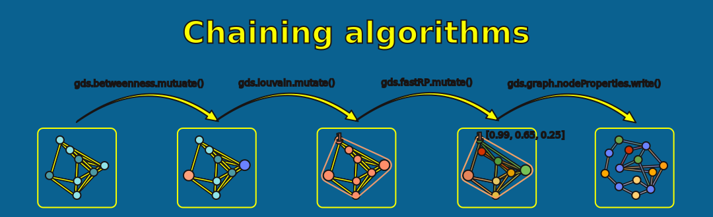

= Running Algorithms
:type: lesson
:order: 4

[.slide]
== Introduction

Algorithm call syntax in the Python client is similar to what you already know—with some minor differences.

This lesson covers syntax, execution modes, and working with results.

[.slide]
== What You'll Learn

By the end of this lesson, you'll be able to:

* Call algorithms using Python syntax
* Choose the right execution mode for your task
* Chain algorithms together using mutate mode
* Stream combined results from projections
* Estimate memory requirements before running

[.slide.col-2]
== Algorithm Syntax

The pattern is: `gds[.tier].<algorithm>.<mode>(G, **config)`

[.col]
====
[source,python,role=noplay nocopy]
.Algorithm call examples
----
# Louvain community detection with stream mode
result = gds.louvain.stream(G) # <1>

# Louvain with mutate mode
result = gds.louvain.mutate(G, mutateProperty="community") # <2>

# Beta algorithm
result = gds.beta.node2vec.stream(G, embeddingDimension=64) # <3>
----
====

[.col]
====
<1> Pattern: `gds.<algorithm>.<mode>(G)` — the Graph object `G` is always the first argument
<2> Mode-specific config params are passed as keyword arguments (e.g. `mutateProperty`)
<3> Pre-release algorithms use a tier prefix: `gds.beta.*` or `gds.alpha.*`
====

[.slide]
== Execution Modes Compared

[cols="1,2,2"]
|===
|**Mode** |**Returns** |**Side Effect**

|`.stream()`
|DataFrame with per-node/relationship results
|None

|`.mutate()`
|Series with summary statistics
|Adds property to projection

|`.write()`
|Series with summary statistics
|Writes property to Neo4j

|`.stats()`
|Series with summary statistics
|None
|===

[.slide]
== Stream Mode

Returns results as a DataFrame—perfect for analysis and exploration.

[source,python,role=noplay nocopy]
.Streaming Louvain results
----
df = gds.louvain.stream(G)

# df contains nodeId and communityId columns
print(df.head())
----

[.slide]
== Stream Mode: Working with Results

[source,python,role=noplay nocopy]
.Analyzing community sizes
----
# Work with results using pandas
community_sizes = df.groupby("communityId").size().reset_index(name="size")
print(community_sizes.nlargest(10, "size"))
----

[.slide.col-2]
== Mutate Mode

Adds results to the projection (not the database). Useful for chaining algorithms.

[.col]
====
[source,python,role=noplay nocopy]
.Mutating Louvain results
----
result = gds.louvain.mutate(
    G,
    mutateProperty="community" # <1>
)

print(f"Nodes processed: {result['nodePropertiesWritten']}")
print(f"Communities found: {result['communityCount']}") # <2>
print(f"Modularity: {result['modularity']:.4f}")
----
====

[.col]
====
<1> `mutateProperty` names the new property added to the in-memory projection — choose a descriptive name
<2> The returned `result` dict contains algorithm-specific metadata like community count and modularity score
====

[.slide]
== Mutate Mode: Verifying Properties

[source,python,role=noplay nocopy]
.Checking projection properties
----
# Property is now available in the projection
print(G.node_properties("User"))  # includes 'community'
print(G.node_properties("Movie")) # includes 'community'
----

[.slide.col-2]
== Write Mode

Writes results directly to Neo4j—useful for persisting results.

[.col]
====
[source,python,role=noplay nocopy]
.Writing Louvain results to database
----
result = gds.louvain.write(
    G,
    writeProperty="community" # <1>
)

print(f"Wrote to {result['nodePropertiesWritten']} nodes") # <2>
print(f"Communities found: {result['communityCount']}")
----
====

[.col]
====
<1> `writeProperty` names the property written back to Neo4j nodes — unlike mutate, this persists in the database
<2> Check `nodePropertiesWritten` to verify all expected nodes received the property
====

[.slide.col-2]
== Write Mode: Verifying in Database

[.col]
====
[source,python,role=noplay nocopy]
.Querying written results
----
df = gds.run_cypher(""" # <1>
    MATCH (u:User)
    WHERE u.community IS NOT NULL
    RETURN u.community AS community, count(*) AS userCount
    ORDER BY userCount DESC
    LIMIT 5
""")
display(df) # <2>
----
====

[.col]
====
<1> After `.write()`, the property is in the database — you can query it with standard Cypher
<2> `display()` renders a formatted table in Jupyter notebooks; use `print()` in scripts
====

[.slide]
== Stats Mode

Returns only statistics—useful for tuning configuration before persisting.

[source,python,role=noplay nocopy]
.Getting statistics only
----
result = gds.louvain.stats(G)

print(f"Community count: {result['communityCount']}")
print(f"Modularity: {result['modularity']:.4f}")
print(f"Compute time: {result['computeMillis']}ms")
----

[.slide]
== Chaining Algorithms

You can chain algorithms together—each algorithm's output becoming input for the next.

[.slide.col-2]
== Chaining Algorithms
Use mutate mode to chain algorithms together without writing to the database.

[.col]
====
[source,python,role=noplay nocopy]
.Chaining Louvain and Degree
----
# First: find communities
gds.louvain.mutate(G, mutateProperty="community") # <1>

# Second: calculate degree centrality
gds.degree.mutate(G, mutateProperty="degree") # <2>
----
====

[.col]
====
<1> Each `.mutate()` call adds a new property to the in-memory projection
<2> Both properties (`community` and `degree`) now coexist on the projection and can be streamed together
====

[.slide.col-2]
== Streaming Combined Results

[.col]
====
[source,python,role=noplay nocopy]
.Streaming multiple properties
----
# Stream all results together
df = gds.graph.nodeProperties.stream( # <1>
    G,
    node_properties=["community", "degree"], # <2>
    listNodeLabels=True # <3>
)

print(df.head(10))
----
====

[.col]
====
<1> `gds.graph.nodeProperties.stream()` retrieves mutated properties from the projection as a DataFrame
<2> Pass a list of property names to stream multiple algorithm results in a single DataFrame
<3> `listNodeLabels=True` adds a column showing each node's labels — useful for filtering by type
====

[.slide.col-2]
== Memory Estimation

Estimate algorithm memory requirements before running—useful for large graphs.

[.col]
====
[source,python,role=noplay nocopy]
.Estimating memory requirements
----
estimate = gds.louvain.mutate.estimate( # <1>
    G,
    mutateProperty="community_new"
)

print(f"Required memory: {estimate['requiredMemory']}") # <2>
print(f"Node count: {estimate['nodeCount']}")
print(f"Relationship count: {estimate['relationshipCount']}")
----
====

[.col]
====
<1> `.estimate()` is available on every algorithm and mode — call it before running on large graphs
<2> Returns a human-readable memory estimate (e.g. "512 MB") so you can verify the server has enough heap
====

read::Mark as read[]

[.summary]
== Summary

* Algorithm syntax: `gds.<algorithm>.<mode>(G, **config)`
* Stream mode returns DataFrames; mutate/write/stats modes return Series
* Chain algorithms using mutate mode
* Use `.stats()` to tune configuration before persisting
* Use `.estimate()` to check memory requirements

**Next:** Introduction to the Cora citation network dataset.
