= PageRank
:type: lesson
:order: 6

[.slide]
== Introduction

You've likely heard of PageRank—it's the original Google algorithm that revolutionized web search.

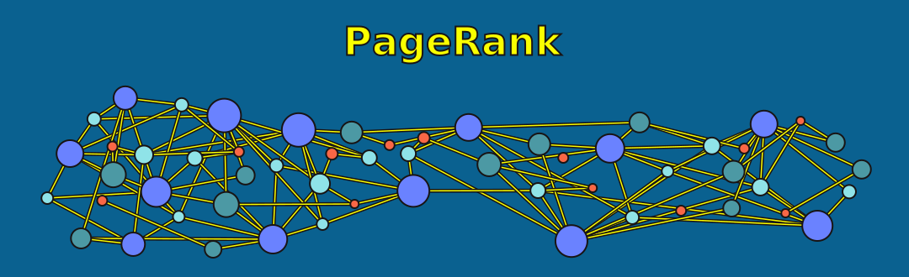

[.slide]
== PageRank
In this lesson, we'll apply PageRank to our citation network to find the most influential papers.

At its core, PageRank reveals which nodes matter most by measuring recursive influence.

[.slide]
== What You'll Learn

By the end of this lesson, you'll be able to:

* Explain what PageRank measures and why it matters
* Describe the random surfer model and damping factor
* Run PageRank using the Python GDS client
* Interpret PageRank results and check for convergence
* Find cross-disciplinary influential papers

[.slide.col-2]
== What PageRank Measures

[.col]
====
PageRank doesn't simply count how many connections a node has. Instead, it measures something more nuanced:

* How many nodes point to you
* How important those nodes are
* The overall "quality" of your connections
====

[.col]
====
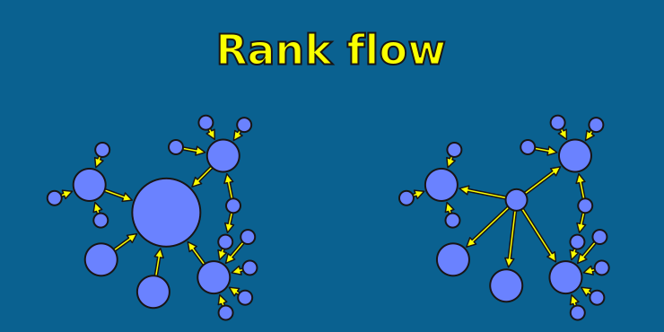
====

[.slide]
== Quality Over Quantity

PageRank optimizes for quality over quantity. Being cited by an influential paper matters far more than being cited by an obscure one.

A single citation from a foundational paper in your field can outweigh dozens of citations from lesser-known work.

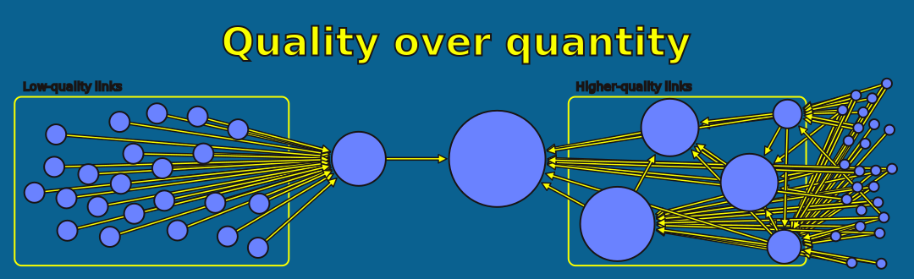

[.slide]
== The Random Surfer Model

To understand how PageRank works, imagine a researcher randomly browsing through papers in a library.

Let's walk through what this researcher does, step by step.

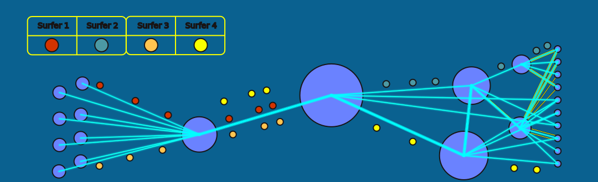

[.slide]
== Random Surfer: Step 1

First, our researcher starts at a random paper in the network.

They've picked up a paper off the shelf without any particular goal in mind.

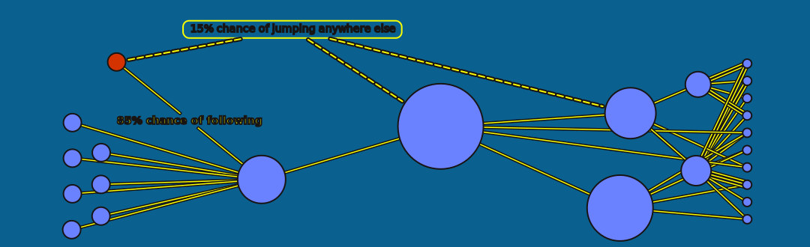

[.slide]
== Random Surfer: Step 2

Next, most of the time -- about 85% of the time with dampingFactor: 0.85 -- they follow a citation to another paper.

They see an interesting reference, so they go find that paper and start reading it instead.

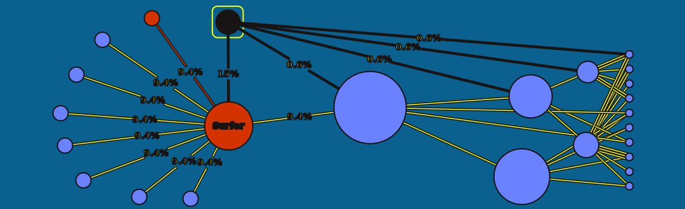

[.slide]
== Random Surfer: Step 3

But occasionally -- about 15% of the time with dampingFactor: 0.85 -- they get bored or distracted and jump to a completely random paper instead.

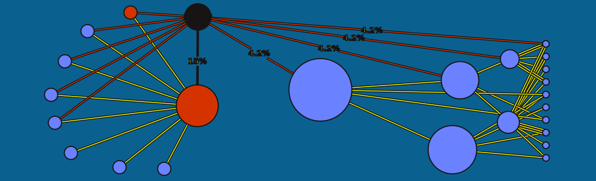

[.slide]
== Random Surfer: Step 4

Now imagine this researcher repeats this process millions of times.

Over time, they'll visit some papers far more often than others.

[.slide]
== What PageRank Represents

PageRank equals the probability of landing on each paper during this random browsing process.

Papers that the researcher lands on frequently are considered influential—they're the papers that naturally attract attention through the network structure.

[.slide]
== The Damping Factor

Remember how our random surfer sometimes jumps to a random paper instead of following citations?

The probability of this random jump is controlled by a parameter called the **damping factor**.

[cols="1,1,1", options="header"]
|===
|Damping Factor |Follow Link |Random Jump

|0.85 (default)
|85%
|15%

|0.70
|70%
|30%

|0.50
|50%
|50%
|===

[.slide]
== Damping Factor Values

When we set `dampingFactor = 0.85`, we're saying that 85% of the time the surfer follows links, and 15% of the time they jump randomly.

The damping factor must be between 0 (inclusive) and 1 (exclusive).

[.slide]
== Damping Factor Effects

Higher damping values place more weight on the actual link structure of the graph.

Lower damping values produce a more uniform distribution, where all nodes end up with similar scores.

The default value of 0.85 works well for most graphs, so you rarely need to change it.

[.slide]
== Why Do We Need Random Jumps?

The random jump mechanism isn't just a quirky detail—it actually solves three important problems that can break the algorithm.

Let's look at each one.

[.slide]
== Problem 1: Spider Traps

Spider traps are groups of nodes with no outgoing links to the rest of the graph.

Without random jumps, all the ranking signals would get "trapped" and accumulate here, giving these nodes artificially high scores.

[.slide]
== Problem 2: Rank Sinks

Rank sinks are cycles in the graph that accumulate rank infinitely.

The ranking signals keep circling around and around, never escaping to the rest of the network.

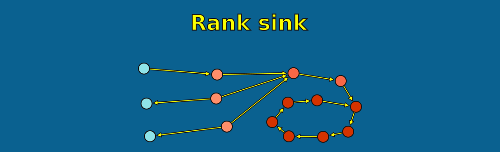

[.slide]
== Why Not Just Count Citations?

You might wonder: why not just count how many citations each paper has?

Let's look at an example to see why that approach falls short.

[.slide]
== Citation Count vs PageRank

[cols="1,1,1"]
|===
|**Paper** |**Citations** |**PageRank**

|Paper A
|100 (from obscure papers)
|2.5

|Paper B
|20 (from foundational papers)
|8.7

|Paper C
|50 (mixed)
|4.2
|===

[.slide]
== Importance, not popularity

Notice that Paper B has far fewer citations than Paper A, but a much higher PageRank score.

Why? Because Paper B is cited by the right papers—foundational work that itself has high influence.

[.slide]
== Now Let's Run PageRank

With the theory covered, let's apply PageRank to our citation network.

First, we need to retrieve the graph projection we created in Lesson 5.

[.slide]
== Setup: Retrieve the Projection

We use `gds.graph.get()` to retrieve an existing projection by name.

[source,python,role=noplay nocopy]
.Retrieving the existing projection
----
G = gds.graph.get("cora-graph")

print(f"Retrieved graph: {G.name()}")
print(f"  Nodes: {G.node_count():,}")
print(f"  Relationships: {G.relationship_count():,}")
----

[.slide.col-2]
== Running PageRank: Write Mode

Now we can run PageRank. We'll use write mode so the results get persisted back to the database.

This lets us query the results later using Cypher.

[.col]
====
[source,python,role=noplay nocopy]
.Running PageRank with write mode
----
PR_result = gds.pageRank.write(
    G,
    writeProperty='pageRank',  # <1>
    maxIterations=20,  # <2>
    dampingFactor=0.85  # <3>
)
----
====

[.col]
====
<1> Property name where scores are stored on each node
<2> Upper bound on iterations; algorithm may converge sooner
<3> Probability of following links vs random jumping (default 0.85)
====

[.slide.col-2]
== Inspecting the Results

The result object contains useful information about what the algorithm did.

[.col]
====
[source,python,role=noplay nocopy]
.Inspecting the results
----
print(f"Computed PageRank for {PR_result['nodePropertiesWritten']:,} papers")  # <1>
print(f"  Iterations ran: {PR_result['ranIterations']}")  # <2>
print(f"  Compute time: {PR_result['computeMillis']}ms")
----
====

[.col]
====
<1> Number of nodes that received a PageRank score
<2> Actual iterations used -- compare to `maxIterations` to check convergence
====

[.slide]
== Key Parameters

Here are the main parameters you can configure when running PageRank:

[cols="1,1,2"]
|===
|**Parameter** |**Default** |**Description**

|dampingFactor
|0.85
|Probability of following links (must be < 1)

|maxIterations
|20
|Maximum iterations before stopping

|tolerance
|1e-7
|Minimum score change for convergence

|writeProperty
|(required)
|Property name for storing results
|===

[.slide]
== Understanding Convergence

PageRank is an iterative algorithm. It runs multiple passes over the graph, refining the scores each time.

The algorithm stops when one of two things happens:

* The scores change less than `tolerance` between iterations (it has converged)
* It reaches `maxIterations` (it ran out of time)

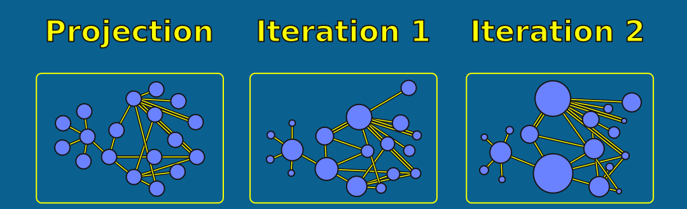

[.slide]
== Checking for Convergence

If the algorithm used all available iterations, it may not have fully converged.

We can check this by comparing `ranIterations` to our `maxIterations` setting.

[source,python,role=noplay nocopy]
.Checking for convergence
----
if PR_result['ranIterations'] == 20:  # maxIterations default
    print("Warning: may not have converged!")
    print("Consider increasing maxIterations")
----

[.slide.col-2]
== Re-running with More Iterations

If you find that PageRank has not converged, the fix is simple: increase `maxIterations` and run again.

[.col]
====
[source,python,role=noplay nocopy]
.Running with 100 max iterations
----
PR_result = gds.pageRank.write(
    G,
    writeProperty='pageRank',
    maxIterations=100,  # <1>
    dampingFactor=0.85
)

print(f"Iterations ran: {PR_result['ranIterations']}")  # <2>
----
====

[.col]
====
<1> Increased from 20 to 100 to give the algorithm room to converge
<2> If this is less than 100, the algorithm converged naturally
====

[.slide.col-2]
== A Better Approach: Stats Mode First

Rather than writing results and then checking convergence, you can use stats mode to test your parameters first.

Stats mode runs the algorithm and returns statistics, but doesn't store anything.

[.col]
====
[source,python,role=noplay nocopy]
.Using stats mode to verify convergence
----
result = gds.pageRank.stats(  # <1>
    G,
    maxIterations=100,
    dampingFactor=0.85
)
print(result)
----
====

[.col]
====
<1> `.stats` instead of `.write` -- runs the algorithm without persisting results, useful for parameter tuning
====

[.slide.col-2]
== Finding the Most Influential Papers

Now that we have PageRank scores written to the database, we can query for the most influential papers.

Let's find the top 10.

[.col]
====
[source,python,role=noplay nocopy]
.Querying top 10 papers by PageRank
----
top_papers = gds.run_cypher("""  # <1>
    MATCH (p:Paper)
    WHERE p.pageRank IS NOT NULL
    RETURN p.paper_Id AS paperId,
           p.subject AS subject,
           p.pageRank AS pageRank
    ORDER BY pageRank DESC  // <2>
    LIMIT 10
""")
----
====

[.col]
====
<1> `gds.run_cypher()` executes Cypher through the GDS client, returning a pandas DataFrame
<2> Sorting descending surfaces the highest-ranked papers first
====

[.slide]
== Top Papers Results

Let's see which papers came out on top.

[source,python,role=noplay nocopy]
.Displaying the results
----
print("Top 10 Most Influential Papers:")
display(top_papers)
----

[.slide.col-2]
== Analyzing Influence by Subject

We can also aggregate PageRank scores by subject area to see which research fields have the most influence overall.

[.col]
====
[source,python,role=noplay nocopy]
.PageRank distribution by subject
----
subject_influence = gds.run_cypher("""
    MATCH (p:Paper)
    WHERE p.pageRank IS NOT NULL
    RETURN p.subject AS subject,
           count(*) AS paperCount,
           avg(p.pageRank) AS avgPageRank,  // <1>
           max(p.pageRank) AS maxPageRank
    ORDER BY avgPageRank DESC
""")
----
====

[.col]
====
<1> Aggregating PageRank by subject reveals which fields carry the most influence on average, not just which individual papers score highest
====

[.slide]
== Subject Influence Results

This tells us which subject areas tend to produce more influential work.

[source,python,role=noplay nocopy]
.Displaying subject influence
----
print("Influence by Subject Area:")
display(subject_influence)
----

[.slide]
== Cross-Disciplinary Papers

Some of the most interesting papers are those that bridge different research areas.

These cross-disciplinary papers connect ideas across fields and often have outsized impact.

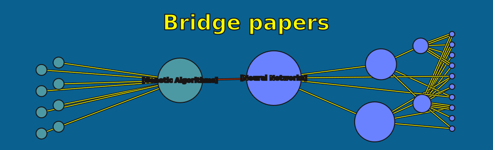

[.slide.col-2]
== Finding Cross-Discipline Citations

Let's find influential papers that cite work in subjects different from their own.

[.col]
====
[source,python,role=noplay nocopy]
.Finding cross-discipline citations
----
cross_discipline = gds.run_cypher("""
    MATCH (p:Paper)
    WHERE p.pageRank > 5  // <1>
    MATCH (p)-[:CITES]->(cited:Paper)
    WHERE p.subject <> cited.subject  // <2>
    RETURN
        p.paper_Id AS paperId,
        p.subject AS sourceSubject,
        p.pageRank AS pageRank,
        cited.subject AS citedSubject
    ORDER BY p.pageRank DESC
    LIMIT 10
""")
display(cross_discipline)
----
====

[.col]
====
<1> Filters to only highly influential papers (PageRank > 5)
<2> Finds citations that cross subject boundaries -- the hallmark of interdisciplinary work
====

[.slide.col-2]
== Papers Citing Multiple Subjects

We can take this further and find papers that cite across multiple different subject areas.

These are potential interdisciplinary bridges—papers that connect several research communities.

[.col]
====
[source,python,role=noplay nocopy]
.Finding interdisciplinary bridge papers
----
bridge_papers = gds.run_cypher("""
    MATCH (p:Paper)
    WHERE p.pageRank > 3
    MATCH (p)-[:CITES]->(cited:Paper)
    WITH p,
         count(DISTINCT cited.subject) AS subjectsCited,  // <1>
         count(cited) AS totalCitations
    WHERE subjectsCited > 1  // <2>
    RETURN p.paper_Id AS paperId,
           p.subject AS subject,
           p.pageRank AS pageRank,
           subjectsCited,
           totalCitations
    ORDER BY subjectsCited DESC, pageRank DESC
    LIMIT 10
""")
display(bridge_papers)
----
====

[.col]
====
<1> Counts the number of distinct subjects cited -- a measure of interdisciplinary breadth
<2> Filters to papers citing more than one subject area
====

[.slide]
== Interpreting Results

One important thing to remember is that PageRank scores are **relative**, not absolute.

* Scores typically range from 0.15 to 20+ depending on the graph
* You should only compare scores of nodes from the same run in the same graph
* Higher scores indicate more influential or "central" nodes

[.slide]
== Citation Network

In our citation network specifically:

* Papers with PageRank > 5 are highly influential in this network
* Papers that cite multiple subject areas are interdisciplinary bridges
* High PageRank combined with citations to multiple subjects suggests foundational interdisciplinary work

[.slide]
== Combining with Other Metrics

PageRank tells us an important part of the story, but not the whole story.

For richer insights, combine PageRank with other metrics:

* **Citation count** gives you raw popularity
* **Betweenness Centrality** shows bridges between communities (we'll cover this next)
* **Community membership** reveals which cluster a paper belongs to

[.slide]
== Common pitfalls

Before we wrap up, let's cover three common mistakes people make when using PageRank.

[.slide.col-2]
== Pitfall 1: Comparing across runs

PageRank scores are relative to the specific graph they were computed on and the specific PageRank run on that graph.

[.col]
====
A score of 5.0 in one graph means something completely different than a score of 5.0 in another graph.

A score of 5.0 on the same graph but different runs might be okay -- but run it in full again anyway.

The random nature of the random surfer model will introduce inconsistencies across runs.

Never compare PageRank scores across different graphs.
====

[.col]
====
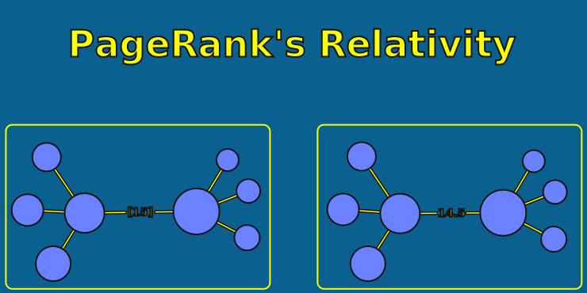
====

[.slide]
== Pitfall 2: Ignoring convergence

If `ranIterations` equals `maxIterations`, the algorithm may not have converged properly.

Always check for this condition, and use stats mode first to verify your parameters before writing results.

[.slide]
== Pitfall 3: Damping factor extremes

The damping factor should stay close to the default of 0.85.

Setting it too high -- close to 1 -- causes the spider trap problems.

Setting it too low makes all scores converge toward uniform values, losing the signal you're looking for.

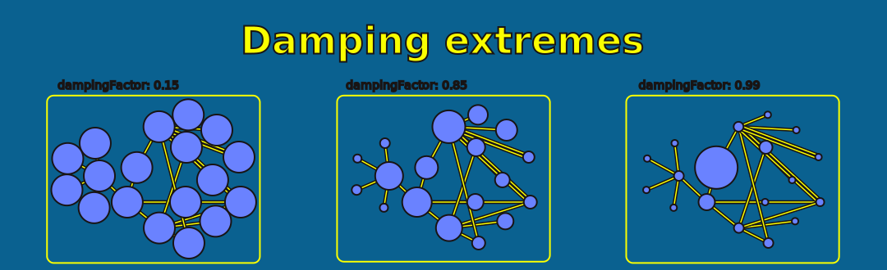

read::Mark as read[]

[.summary]
== Summary

In this lesson, you learned how PageRank measures recursive influence:

* Being cited by influential papers matters more than raw citation count
* The random surfer model simulates browsing behavior to calculate influence
* The damping factor prevents spider traps, rank sinks, and dead-ends
* Always check convergence by comparing `ranIterations` to `maxIterations`

You applied PageRank to the citation network, found the most influential papers, and discovered cross-disciplinary bridges.

**Next:** We'll use Betweenness Centrality to find "bridge papers" that connect different research communities.
