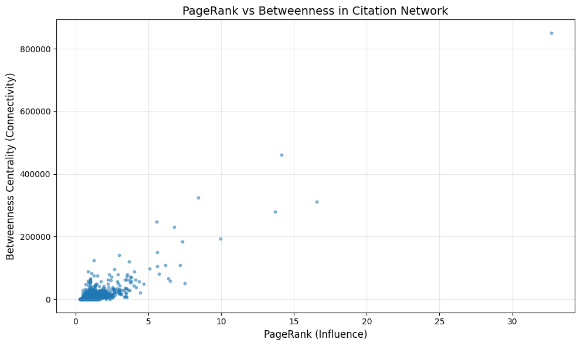

= Betweenness Centrality
:type: lesson
:optional: true
:order: 7

[.slide]
== Introduction

In the previous lesson, we used PageRank to find influential papers in our citation network.

Now we'll explore a different question: Which papers serve as bridges between different research areas?

Betweenness Centrality identifies these connectors—nodes that link different parts of the network together.

[.slide]
== What you'll learn

By the end of this lesson, you'll be able to:

* Explain what Betweenness Centrality measures and how it differs from PageRank
* Run Betweenness Centrality using the Python GDS client
* Compare influence (PageRank) with connectivity (Betweenness) using visualisation
* Identify papers that bridge multiple research areas

[.slide]
== What Betweenness measures

Betweenness Centrality measures how often a node lies on the shortest paths between other nodes in the network.

image::images/betweenness_concept.png[Betweenness Centrality concept]

[.slide]
== High Betweenness means high connectivity

If a node has high Betweenness, it means many shortest paths pass through it.

This makes the node a bottleneck or bridge in the network. If you removed it, many nodes would become harder to reach from each other.

[.slide]
== Betweenness in a social network

Think about a social network for a moment.

A person with high PageRank is like a celebrity—everyone knows who they are.

A person with high Betweenness is like a connector—they introduce people from different social circles to each other.

image::images/celebrity_vs_connector.png[Celebrity versus connector in a network]

[.slide]
== Both types matter

Both roles are valuable, but for different reasons.

The celebrity has influence. The connector enables information flow across the network.

In our citation network, we want to find the papers that play the connector role.

[.slide]
== How Betweenness is calculated

For each node in the graph, the algorithm:

1. Finds all shortest paths between every pair of nodes
2. Counts how many of those paths pass through the node
3. Divides that count by the total number of paths

image::images/betweenness_calculation.png[Betweenness calculation steps]

[.slide]
== Computational cost

Betweenness is more computationally expensive than PageRank because it needs to compute shortest paths between many pairs of nodes.

For the Cora dataset with 2,708 nodes, this completes quickly. For larger graphs, you may need to use sampling (we'll cover this later).

[.slide]
== Setup: Retrieve the projection

First, we retrieve the graph projection we created earlier.

[source,python,role=noplay nocopy]
.Retrieving the existing projection
----
G = gds.graph.get("cora-graph")

print(f"Graph '{G.name()}' loaded:")
print(f"  {G.node_count():,} nodes")
print(f"  {G.relationship_count():,} relationships")
----

[.slide]
== Running Betweenness Centrality

Now we can run Betweenness Centrality and write the results to the database.

[source,python,role=noplay nocopy]
.Running Betweenness with write mode
----
bc_result = gds.betweenness.write(
    G,
    writeProperty='betweenness'
)

print(f"Computed Betweenness for {bc_result['nodePropertiesWritten']:,} papers")
----

[.slide]
== Inspecting the distribution

GDS automatically provides distribution statistics in the result object.

[cols="1,1,1,1,1,1,1"]
|===
|**centralityDistribution** |**computeMillis** |**configuration** |**nodePropertiesWritten** |**postProcessingMillis** |**preProcessingMillis** |**writeMillis**

a|
{'max': 850,664, +
'mean': 6,053, +
'min': 0, +
'p50': 942, +
'p75': 4,729, +
'p90': 12,956, +
'p95': 23,651, +
'p99': 72,896, +
'p999': 324,664}
|180
a|
{'concurrency': 4, +
'writeConcurrency': 4, +
'writeProperty': 'betweenness', +
'nodeLabels': ['*'], +
'relationshipTypes': ['*'], +
'logProgress': True, +
'sudo': False, +
'writeToResultStore': False}
|2,708
|23
|0
|9
|===

[.slide]
== Key parameters

Here are the main parameters you can configure when running Betweenness Centrality:

[cols="1,1,2"]
|===
|**Parameter** |**Default** |**Description**

|writeProperty
|(required)
|Property name for storing results

|samplingSize
|all nodes
|Number of source nodes for approximation

|samplingSeed
|random
|Seed for reproducible sampling
|===

[.slide]
== Exact versus approximate

By default, Betweenness computes exact results using all nodes as sources.

For large graphs, you can use sampling to get approximate results much faster. We'll look at this option later in the lesson.

[.slide]
== Finding bridge papers

With Betweenness scores written to the database, we can query for the top bridge papers.

[source,python,role=noplay nocopy]
.Querying top bridge papers
----
q_top_betweenness = """
    MATCH (p:Paper)
    WHERE p.betweenness IS NOT NULL
    RETURN
        p.paper_Id AS paperId,
        p.subject AS subject,
        p.betweenness AS betweenness,
        p.pageRank AS pageRank
    ORDER BY p.betweenness DESC
    LIMIT 10
"""

df_bridges = gds.run_cypher(q_top_betweenness)
display(df_bridges)
----

[.slide]
== Interpreting the results

Notice how the top papers by Betweenness are often different from the top papers by PageRank.

High Betweenness papers act as connectors between research communities. These are often methodological papers whose techniques apply across multiple domains.

image::images/bridge_papers_results.png[Top bridge papers by Betweenness]

[.slide]
== Interpreting Betweenness scores

Betweenness scores are relative to your specific graph:

* A score of zero means no shortest paths pass through this node (often leaf nodes)
* Low scores indicate regular nodes with few paths passing through them
* High scores indicate bridges or bottlenecks

You should only compare scores within the same graph. A score of 500 means very different things in different networks.

[.slide]
== Comparing PageRank and Betweenness

Let's visualise the relationship between influence (PageRank) and connectivity (Betweenness).

This helps us understand the different types of important papers in the network.

[.slide]
== Fetching both metrics

First, we query all papers that have both metrics computed.

[source,python,role=noplay nocopy]
.Querying papers with both metrics
----
q_both_metrics = """
    MATCH (p:Paper)
    WHERE p.pageRank IS NOT NULL
      AND p.betweenness IS NOT NULL
    RETURN p.pageRank AS pageRank,
           p.betweenness AS betweenness,
           p.subject AS subject
"""

df_metrics = gds.run_cypher(q_both_metrics)
----

[.slide]
== Creating a scatter plot

Now we can create a scatter plot to see how the two metrics relate.

[source,python,role=noplay nocopy]
.Creating a scatter plot of PageRank vs Betweenness
----
import matplotlib.pyplot as plt

plt.figure(figsize=(10, 6))
plt.scatter(df_metrics['pageRank'],
            df_metrics['betweenness'],
            alpha=0.5, s=10)
plt.xlabel('PageRank (Influence)')
plt.ylabel('Betweenness Centrality (Connectivity)')
plt.title('PageRank vs Betweenness in Citation Network')
plt.grid(True, alpha=0.3)
plt.show()
----

[.slide]
== The scatter plot reveals four quadrants

[.slide]
== Bottom-left: Regular papers

Most papers cluster in the bottom-left quadrant. These have low influence and low connectivity.

This is expected—the majority of papers in any network are not exceptional by either measure.

[.slide]
== Top-right: Superstar papers

Papers in the top-right quadrant are both influential AND highly connected.

These are rare papers that are widely cited and also serve as bridges between research areas.

[.slide]
== Top-left: Bridge papers

Papers in the top-left quadrant have high connectivity but moderate influence -- none here.

These are true bridge papers—they connect different research areas even though they may not be the most famous works.

[.slide]
== Bottom-right: Influential specialists

Papers in the bottom-right quadrant are influential but not strongly connecting different areas.

These are important papers within their specific field, but they don't bridge to other research communities.

[.slide]
== Combining algorithms reveals richer insights

Different algorithms reveal different types of importance in your network.

Using PageRank alone, you would miss the bridge papers. Using Betweenness alone, you would miss the influential specialists.

Combining them gives you a more complete picture.

[.slide]
== Cross-subject bridge analysis

Let's find out which research subjects produce the most bridge papers.

[source,python,role=noplay nocopy]
.Analysing bridge papers by subject
----
q_subject_bridges = """
    MATCH (p:Paper)
    WHERE p.betweenness > 1000
    RETURN
        p.subject AS subject,
        count(p) AS num_bridge_papers,
        avg(p.betweenness) AS avg_betweenness,
        avg(p.pageRank) AS avg_pageRank
    ORDER BY num_bridge_papers DESC
"""

df_subject_bridges = gds.run_cypher(q_subject_bridges)
display(df_subject_bridges)
----

[.slide]
== Interpreting subject analysis

Subjects with many high-Betweenness papers tend to be methodological fields that influence multiple domains.

These are the research areas where techniques and ideas flow outward to other communities.

.Bridge Papers by Research Subject
[cols="1,1,1,1"]
|===
|**subject** |**num_bridge_papers** |**avg_betweenness** |**avg_pageRank**

|Neural_Networks
|401
|11,854
|1.24

|Theory
|206
|12,227
|1.37

|Probabilistic_Methods
|205
|13,763
|1.31

|Genetic_Algorithms
|188
|14,365
|1.45

|Case_Based
|159
|9,407
|1.24

|Reinforcement_Learning
|108
|13,188
|1.44

|Rule_Learning
|73
|6,838
|1.22
|===

[.slide]
== Finding specific cross-subject bridges

We can also find papers that specifically cite across multiple different research areas.

These are the truly interdisciplinary works.

[.slide]
== Querying cross-subject bridges

This query finds papers with high Betweenness that cite at least three different subjects.

[source,python,role=noplay nocopy]
.Finding papers that bridge multiple research areas
----
q_cross_subject = """
    MATCH (p:Paper)-[:CITES]->(cited:Paper)
    WHERE p.betweenness > 500
      AND p.subject <> cited.subject
    WITH p,
         collect(DISTINCT cited.subject) AS cited_subjects,
         count(DISTINCT cited.subject) AS num_subjects_cited
    WHERE num_subjects_cited >= 3
    RETURN
        p.paper_Id AS paperId,
        p.subject AS subject,
        p.betweenness AS betweenness,
        p.pageRank AS pageRank,
        num_subjects_cited,
        cited_subjects
    ORDER BY num_subjects_cited DESC, p.betweenness DESC
    LIMIT 10
"""

df_cross_subject = gds.run_cypher(q_cross_subject)
pp(df_cross_subject)
----

[.slide]
== Truly interdisciplinary papers

These papers have both structural importance (high Betweenness) and actually cite work from three or more different fields.

They serve as knowledge transfer hubs, synthesising ideas from across the research landscape.

.Papers Bridging Multiple Research Areas
[cols="1,1,1,1,1,2"]
|===
|**paperId** |**subject** |**betweenness** |**pageRank** |**num_subjects_cited** |**cited_subjects**

|28254
|Neural_Networks
|8,692
|1.75
|4
|Case_Based, Reinforcement_Learning, Theory, Probabilistic_Methods

|299197
|Neural_Networks
|82,818
|1.08
|3
|Genetic_Algorithms, Reinforcement_Learning, Probabilistic_Methods

|35797
|Neural_Networks
|78,154
|2.90
|3
|Probabilistic_Methods, Theory, Rule_Learning

|46431
|Neural_Networks
|30,303
|0.95
|3
|Case_Based, Theory, Genetic_Algorithms

|1104449
|Neural_Networks
|18,376
|0.81
|3
|Theory, Case_Based, Probabilistic_Methods

|97892
|Case_Based
|17,265
|0.83
|3
|Reinforcement_Learning, Theory, Rule_Learning

|14549
|Theory
|10,824
|1.30
|3
|Neural_Networks, Reinforcement_Learning, Probabilistic_Methods

|1103676
|Neural_Networks
|5,063
|0.68
|3
|Case_Based, Probabilistic_Methods, Theory

|323128
|Theory
|4,610
|0.86
|3
|Probabilistic_Methods, Case_Based, Neural_Networks

|68463
|Rule_Learning
|1,673
|0.67
|3
|Case_Based, Theory, Genetic_Algorithms
|===

[.slide]
== Sampling for large graphs

For large graphs with millions of nodes, exact Betweenness computation can be slow.

You can use sampling to get approximate results much faster.

[.slide]
== Using the samplingSize parameter

The `samplingSize` parameter limits how many source nodes are used in the calculation.

[source,python,role=noplay nocopy]
.Running Betweenness with sampling
----
bc_sampled_result = gds.betweenness.write(
    G,
    writeProperty='betweenness_sampled',
    samplingSize=500,
    samplingSeed=42
)

print(f"Computed sampled Betweenness for {bc_sampled_result['nodePropertiesWritten']:,} papers")
----

[.slide]
== Comparing exact and sampled results

You can compare exact and sampled results to see how close the approximation is.

[source,python,role=noplay nocopy]
.Comparing exact vs sampled Betweenness
----
q_compare = """
    MATCH (p:Paper)
    WHERE p.betweenness IS NOT NULL
      AND p.betweenness_sampled IS NOT NULL
    RETURN p.paper_Id AS paperId,
           p.betweenness AS exact,
           p.betweenness_sampled AS sampled
    ORDER BY p.betweenness DESC
    LIMIT 10
"""

df_compare = gds.run_cypher(q_compare)
display(df_compare)
----

[.slide]
== Compare sampled vs unsampled results

.Top 10 papers: Exact vs Sampled Betweenness
[cols="1,1,1"]
|===
|**paperId** |**exact** |**sampled**

|35
|850,663
|135,989

|3229
|460,318
|84,396

|4330
|324,663
|67,198

|1365
|310,253
|69,272

|6213
|278,922
|57,619

|887
|247,254
|54,440

|1272
|230,426
|35,196

|910
|193,210
|34,932

|3231
|182,882
|32,799

|6214
|149,405
|29,118
|===

[.slide]
== When to use sampling

Consider using sampling when:

* Your graph has millions of nodes
* Exact computation takes too long for your use case
* Approximate results are acceptable for your analysis

For the Cora dataset with 2,708 nodes, exact computation is fast enough that sampling isn't necessary.

On larger graphs, sampling can significantly reduce computation time while still identifying the most important bridge nodes.

[.slide]
== Performance considerations

Betweenness is more expensive than PageRank for a few reasons:

* It computes shortest paths between many node pairs
* Memory usage increases with the level of parallelism
* Undirected graphs are more expensive than directed graphs

[.slide]
== Handling memory issues

If you run into memory problems on large graphs, you can:

* Reduce the `concurrency` parameter to use fewer parallel threads
* Use `samplingSize` to compute approximate results
* Consider whether you need exact Betweenness or if another centrality measure would suffice

[.slide]
== Common pitfall: Disconnected graphs

Betweenness only counts paths that actually exist in the graph.

If your graph has isolated components, nodes may have zero Betweenness even if they are central within their own component.

image::images/disconnected_graph_pitfall.png[Disconnected graph with isolated components]

[.slide]
== Common pitfall: Comparing across graphs

A Betweenness score of 5000 means nothing without context.

You should only compare scores within the same graph. The same score in a different network would have a completely different meaning.

[.slide]
== Common pitfall: Expecting similarity to PageRank

High PageRank does not imply high Betweenness, and vice versa.

They measure fundamentally different things: Influence versus connectivity. The fact that they identify different papers is a feature, not a bug.

[.summary]
== Summary

Betweenness Centrality identifies bridges and bottlenecks in your network:

* It measures how often a node lies on shortest paths between other nodes
* High-Betweenness nodes are connectors that link different parts of the network
* It complements PageRank by revealing a different type of importance: Connectivity rather than influence
* For large graphs, use the `samplingSize` parameter to get approximate results faster
* Always compare scores within the same graph, never across different networks

You've now used both PageRank and Betweenness to analyse the citation network, finding both influential papers and bridge papers.

**Next:** Use Louvain community detection to discover research clusters in the network.
