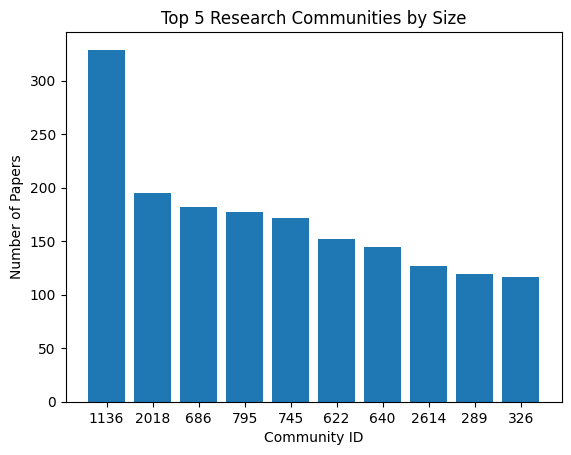

= Louvain Community Detection
:type: lesson
:optional: true
:order: 8
:slides: true

[.slide]
== Introduction

You've already used Louvain in the fraud module to detect fraud rings by optimizing modularity.

Now we'll apply the same algorithm to the citation network to discover research communities—groups of papers that cite each other more than they cite papers outside the group.

The question we'll explore: do citation-based communities align with official subject labels?

[.slide]
== What you'll learn

By the end of this lesson, you'll be able to:

* Run Louvain community detection to find research communities
* Analyze how detected communities relate to official subject labels
* Combine community membership with centrality metrics for richer analysis
* Interpret community statistics to identify influential and bridging communities

[.slide]
== Setup: Retrieve the projection

First, we retrieve the graph projection we've been working with.

[source,python,role=noplay nocopy]
.Retrieving the existing projection
----
G = gds.graph.get("cora-graph")

print(f"Graph '{G.name()}' ready with {G.node_count():,} nodes")
----

[.slide]
== Running Louvain community detection

Now we run Louvain and write the community assignments to the database.

[source,python,role=noplay nocopy]
.Running Louvain with write mode
----
louvain_result = gds.louvain.write(
    G,
    writeProperty='louvainCommunity',
    maxLevels=10,
    maxIterations=10
)

print(f"Detected {louvain_result['communityCount']} communities")
print(f"Modularity score: {louvain_result['modularity']:.4f}")
----

[.slide]
== Understanding the results

The key metrics from our Louvain run:

[cols="1,2"]
|===
|**Metric** |**Value**

|modularity
|0.82 (strong community structure)

|communityCount
|104 communities detected

|ranLevels
|4 hierarchical levels

|mean community size
|26 papers
|===

A modularity of 0.82 indicates well-defined communities with dense internal connections.

[.slide]
== Communities versus subject labels

The Cora dataset has official subject labels like Neural Networks, Theory, and Reinforcement Learning.

Louvain finds communities based purely on citation patterns, without knowing about these labels.

An interesting question is whether the detected communities align with the official labels.

[.slide]
== What do these communities mean?

We found 104 communities, but what do they represent?

The Cora dataset has official subject labels assigned by humans. Comparing Louvain's communities to these labels tells us whether citation behavior follows topical boundaries.

If communities align with subjects, papers mostly cite within their field. If they don't, citation patterns reveal structure that formal labels miss.

[.slide]
== Comparing communities with subjects

Let's see which subjects appear in each community.

[source,python,role=noplay nocopy]
.Analyzing community composition
----
q_community_subjects = """
    MATCH (p:Paper)
    WHERE p.louvainCommunity IS NOT NULL
    WITH p.louvainCommunity AS community, 
         p.subject AS subject,
         count(*) AS count
    RETURN community, subject, count
    ORDER BY community, count DESC
    LIMIT 20
"""

df_comm_subj = gds.run_cypher(q_community_subjects)
pp(df_comm_subj.head(20))
----

[.slide]
== Interpreting the composition

Most communities are dominated by a single subject:

.Sample Community Composition
[cols="1,2,1"]
|===
|**community** |**subject** |**count**

|289
|Case_Based
|111

|289
|Rule_Learning
|4

|326
|Probabilistic_Methods
|88

|326
|Neural_Networks
|17

|622
|Neural_Networks
|126

|622
|Probabilistic_Methods
|14
|===

Each community has a clear dominant subject, with minor contributions from related fields.

[.slide]
== What the composition reveals

The large communities (289, 326, 622) each have a dominant subject:

* **Community 289**: 93% Case_Based (111 of 119 papers)
* **Community 326**: 75% Probabilistic_Methods (88 of 117 papers)
* **Community 622**: 90% Neural_Networks (126 of 140 papers)

Smaller communities (379, 592, 617) are pure—containing only a single subject.

This suggests citation patterns mostly follow subject boundaries, with papers primarily citing within their field.

[.slide]
== Community statistics with centrality metrics

We can enrich our analysis by including the centrality metrics we computed earlier.

[source,python,role=noplay nocopy]
.Community statistics with PageRank and Betweenness
----
q_community_stats = """
    MATCH (p:Paper)
    WHERE p.louvainCommunity IS NOT NULL
    WITH p.louvainCommunity AS community,
         collect(DISTINCT p.subject) AS subjects,
         count(*) AS size,
         avg(p.pageRank) AS avg_pageRank,
         avg(p.betweenness) AS avg_betweenness
    RETURN community, 
           size,
           size(subjects) AS num_subjects,
           subjects,
           avg_pageRank,
           avg_betweenness
    ORDER BY size DESC
    LIMIT 10
"""

df_community_stats = gds.run_cypher(q_community_stats)
pp(df_community_stats)
----

[.slide]
== Reading the community statistics

Communities with high average PageRank contain influential papers.

Communities with high average Betweenness serve as bridges between other communities.

Communities spanning many subjects are interdisciplinary research areas.

.Top 10 Communities by Size
[cols="1,1,1,3,1,1"]
|===
|**community** |**size** |**num_subjects** |**subjects** |**avg_pageRank** |**avg_betweenness**

|1136
|329
|6
|Genetic_Algorithms, Reinforcement_Learning, Neural_Networks, ...
|1.02
|6,292

|2018
|195
|6
|Reinforcement_Learning, Probabilistic_Methods, ...
|1.07
|9,363

|686
|182
|6
|Case_Based, Theory, Rule_Learning, Neural_Networks, ...
|1.01
|8,293

|795
|177
|7
|Rule_Learning, Theory, Case_Based, Reinforcement_Learning, ...
|0.98
|5,858

|745
|172
|5
|Genetic_Algorithms, Neural_Networks, Reinforcement_Learning, ...
|1.02
|9,522

|622
|152
|5
|Neural_Networks, Probabilistic_Methods, Theory, ...
|0.99
|8,128

|640
|145
|5
|Theory, Reinforcement_Learning, Genetic_Algorithms, ...
|1.01
|5,426

|2614
|127
|6
|Rule_Learning, Theory, Neural_Networks, Case_Based, ...
|1.01
|5,554

|289
|119
|5
|Case_Based, Neural_Networks, Genetic_Algorithms, ...
|0.99
|5,689

|326
|117
|6
|Probabilistic_Methods, Neural_Networks, Reinforcement_Learning, ...
|0.96
|5,439
|===  

[.slide]
== Identifying key communities

Looking at the statistics, we can identify:

* **Most influential community:** 2018 has the highest avg_pageRank (1.07)
* **Key bridging community:** 745 has the highest avg_betweenness (9,522)
* **Most interdisciplinary:** 795 spans 7 subjects

These communities would be good starting points for understanding cross-disciplinary research.

[.slide]
== Visualizing community sizes

A bar chart helps us see the distribution of community sizes.

[source,python,role=noplay nocopy]
.Creating a bar chart of community sizes
----
import matplotlib.pyplot as plt

q_community_sizes = """
    MATCH (p:Paper)
    WHERE p.louvainCommunity IS NOT NULL
    RETURN p.louvainCommunity AS community, 
           count(*) AS size
    ORDER BY size DESC
    LIMIT 10
"""

df_sizes = gds.run_cypher(q_community_sizes)

plt.bar(df_sizes['community'].astype(str), df_sizes['size'])
plt.xlabel('Community ID')
plt.ylabel('Number of Papers')
plt.title('Top 10 Research Communities by Size')
plt.show()
----

[.slide]
== Community sizes chart

[.slide]
== Combining all three perspectives

You now have three complementary views of each paper:

* **PageRank** tells you how influential a paper is
* **Betweenness** tells you how much it connects different areas
* **Community** tells you which cluster it belongs to

Combining these perspectives reveals patterns that no single metric could show alone.

[.slide]
== Multi-metric analysis examples

With all three metrics, you can answer questions like:

* Which paper is most influential in each community?
* Which papers bridge between communities?
* How do community-level averages compare across the network?

[.slide]
== Multi-metric analysis example

Find the most influential paper in each of the top 5 communities:

[source,python,role=noplay nocopy]
.Finding top papers per community
----
q = """
    MATCH (p:Paper)
    WHERE p.louvainCommunity IN [1136, 2018, 686, 795, 745]
    WITH p.louvainCommunity AS community, p
    ORDER BY p.pageRank DESC
    WITH community, collect(p)[0] AS topPaper
    RETURN community, topPaper.paper_Id, topPaper.pageRank
"""
gds.run_cypher(q)
----

This combines community membership with PageRank to answer a real question.

[.summary]
== Summary

In this lesson, you:

* Ran Louvain to detect 104 research communities from citation patterns
* Compared communities to official subject labels and found strong alignment
* Combined community membership with PageRank and Betweenness for richer analysis
* Identified influential and bridging communities using multi-metric analysis

**Next:** Scale features for ML, use FastRP to create node embeddings and explore node similarity for recommendations.
