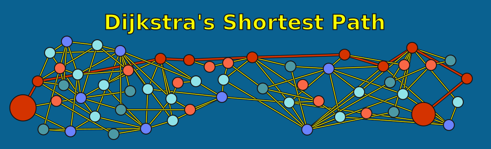
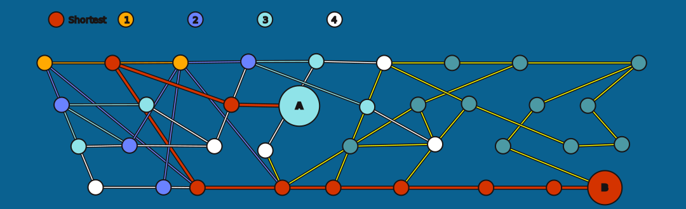

= Dijkstra's Shortest Path
:type: lesson
:order: 3

[.slide.discrete]
== Introduction

Before running Dijkstra's on our logistics network, let's understand what it does, how it works internally, and how to configure it for different use cases.

We'll practice on the familiar Movie graph first, then apply what we learn to logistics.

[.slide]
== What You'll Learn

By the end of this lesson, you'll be able to:

* Explain how Dijkstra's algorithm finds optimal weighted paths
* Configure Dijkstra's for single and multiple target nodes
* Invert relationship weights to find "strongest" rather than "cheapest" paths
* Recognize when Dijkstra's is (and isn't) the right algorithm choice

[.slide.col-2]
== What Dijkstra's Does

Dijkstra's finds the **shortest weighted path** between a source node and one or more target nodes.

It systematically explores the network, always choosing the lowest-cost path forward until reaching the destination.

[.slide]
== A Note on Projection Syntax

In this module, we show two projection styles:

[source,cypher, role=nocopy, noplay]
.Browser/Cypher syntax
----
CALL gds.graph.project(...)
----

[source,python, role=nocopy, noplay]
.Python + AGA syntax
----
gds.graph.project("graphName", """
    ...
    RETURN gds.graph.project.remote(source, target, {...})
""")
----

Same concept, slightly different syntax. The notebooks use `gds.graph.project.remote()` because we're working with Aura Graph Analytics.

[.slide]
== The Core Concept: Weighted Paths

Dijkstra's optimizes for **total cost**—the sum of all relationship weights along a path.

* **Low total cost:** Efficient route through the network
* **High total cost:** Inefficient route with unnecessary delays

For movies, "cost" could mean rating difference, year gap, or collaboration strength. For logistics, it could mean time or literal transit cost.

[.slide]
== How It Works

Dijkstra's uses a **greedy approach** with a priority queue:

1. Start at the source node with cost 0
2. Add all neighbors to a priority queue, ordered by total cost
3. Pop the lowest-cost node from the queue
4. If it's the target, we're done
5. Otherwise, add its unvisited neighbors to the queue
6. Repeat until target is reached or queue is empty

[.slide]
== Why Not Just Use Cypher SHORTEST?

Native Cypher has a `SHORTEST` function.

[source,cypher]
.Cypher shortest
----
MATCH path = SHORTEST 1 (:Actor)-[:ACTED_IN]-+(:Actor)
RETURN path
----

There are a few key differences...

[.slide.col-2]
== Cypher SHORTEST vs Dijkstra's

[.col]
====
**Cypher SHORTEST**:

* Specify complex graph navigation through quantified path patterns
* Faster for simple queries
* Does not account for relationship weights
====

[.col]
====
**Dijkstra's**

* Finds paths with the lowest total cost
* Fast on large graphs
* Considers relationship weights

====

[.slide]
== Graph Structure Requirements

Dijkstra's works on:

* **Directed or undirected** graphs
* **Heterogeneous nodes** — Multiple node labels supported
* **Heterogeneous relationships** — Multiple relationship types supported
* **Weighted relationships** — Required for meaningful results

**Critical:** Weights must be **non-negative**. If your model includes negative values (discounts, refunds, credits), Dijkstra's will silently produce incorrect paths. Use Bellman-Ford for negative weights.

[.slide]
== Key Configuration Parameters

[cols="1,1,2"]
|===
|Parameter |Type |Description

|sourceNode
|Integer
|The source node (required)

|targetNodes
|Integer or List
|One or more target nodes (required)

|relationshipWeightProperty
|String
|Property to use as weights (optional)
|===

[.transcript-only]
====
If `relationshipWeightProperty` is not specified, the algorithm runs unweighted—treating all relationships as having equal cost. This effectively finds the path with fewest hops.
====

[.slide.col-2]
== Project the Movie Graph

Let's find the shortest path between actors through their collaborations. In plain Cypher, we'd do this:

[.col]
====
[source,python]
.Project actor collaborations
----
MATCH (source:Actor)-[:ACTED_IN]->(m:Movie)<-[:ACTED_IN]-(target:Actor) // <1>
WHERE source <> target
WITH source, target, count(m) AS collaborations
RETURN gds.graph.project(
  'actor-collaborations',
  source,
  target,
  {relationshipProperties: {collaborations: collaborations}}, // <2>
  {undirectedRelationshipTypes: ['*']} // <3>
)
----
====

[.col]
====
<1> Find pairs of actors who appeared in the same movie
<2> Store the collaboration count as a relationship property for weighted pathfinding
<3> Treat all relationships as undirected since collaboration is mutual
====

[.transcript-only]
====
This creates an undirected graph where actors are connected if they've appeared in the same movie. The `collaborations` property counts how many movies they've shared.
====

[.slide.col-2]
== Practice: Project the Movie Graph (AGA)

In AGA, we use `gds.graph.project.remote()` with a Cypher projection:

[.col]
====
[source,python]
----
G_collab, result = gds.graph.project(
    "actor-collaborations",
    """
    CALL {
      MATCH (a1)-[r:ACTED_IN]->(m:Movie)<-[:ACTED_IN]-(a2:Actor)
      WHERE a1 <> a2
      RETURN a1 AS source,
            a2 AS target,
            type(r) AS relType,
            a1{} AS sourceNodeProperties, # <1>
            a2{} AS targetNodeProperties,
            count(r) AS collaborations
    }
    RETURN gds.graph.project.remote(source, target, { # <2>
      sourceNodeLabels: labels(source),
      targetNodeLabels: labels(target),
      sourceNodeProperties: sourceNodeProperties,
      targetNodeProperties: targetNodeProperties,
      relationshipType: 'COLLABORATED',
      relationshipProperties: {collaborations: collaborations} # <3>
    })
    """
)
----
====

[.col]
====
<1> `a1{}` passes all node properties to the projection for later use
<2> `gds.graph.project.remote()` sends the projection to the remote GDS Session
<3> Collaboration count stored as a relationship property for weighted algorithms
====

[.slide.col-2]
== Find the Shortest Path

Now, to find the shortest path between two actors in the Browser, we'd do this:

[.col]
====
[source,cypher]
.Run Dijkstra's
----
MATCH (source:Actor {name: 'Shah Rukh Khan'}),
      (target:Actor {name: 'Lee Jung-jae'})
CALL gds.shortestPath.dijkstra.stream('actor-collaborations', { // <1>
    sourceNode: source,
    targetNodes: target
})
YIELD totalCost, nodeIds // <2>
RETURN totalCost AS hops,
       [nodeId IN nodeIds | gds.util.asNode(nodeId).name] AS path // <3>
----
====

[.col]
====
<1> Stream mode returns results row-by-row without writing to the database
<2> `totalCost` is the sum of all weights along the path
<3> Resolve internal GDS node IDs back to readable actor names
====

Without a weight property, this finds the path with fewest hops--the classic "degrees of separation."

[.slide]
== Source and target

First we get our source and target using the `gds.find_node_id()` function:

[source,python]
----
# Find source and target node IDs by label and property
source_id = gds.find_node_id(["Actor"], {"name": "Shah Rukh Khan"})
target_id = gds.find_node_id(["Actor"], {"name": "Lee Jung-jae"})

print(f"Source: Shah Rukh Khan (ID: {source_id})")
print(f"Target: Lee Jung-jae (ID: {target_id})")
----

[.slide.col-2]
== Find the Shortest Path (AGA)

Then, we can call `gds.shortestPath.dijkstra.stream()` on the graph object:

[.col]
====
[source,python]
----
# Run Dijkstra's algorithm
result = gds.shortestPath.dijkstra.stream(
    G_collab, # <1>
    sourceNode=source_id,
    targetNode=target_id # <2>
)
----
====

[.col]
====
<1> Pass the projected graph object, not the graph name string
<2> In AGA Python, use `targetNode` (singular) for a single target
====

[.slide]
== Single Target vs Multiple Targets

Dijkstra's can find paths to **multiple targets** in a single call.

First, we specify the multiple targets:

[source,cypher]
.Multiple targets
----
# Find source and target node IDs
source_id = gds.find_node_id(["Actor"], {"name": "Shah Rukh Khan"})
target_ids = [
    gds.find_node_id(["Actor"], {"name": "Lee Jung-jae"}),
    gds.find_node_id(["Actor"], {"name": "Joe Pantoliano"}),
    gds.find_node_id(["Actor"], {"name": "Keanu Reeves"})
]
----

[.slide.col-2]
== Single Target vs Multiple Targets (AGA)

In AGA, pass a list of target node IDs:

[.col]
====
[source,python]
----
# Run Dijkstra's with multiple targets
multi_result = gds.shortestPath.dijkstra.stream(
    G_collab,
    sourceNode=source_id,
    targetNodes=target_ids # <1>
)
----
====

[.col]
====
<1> `targetNodes` (plural) accepts a list, returning the shortest path to each target in a single call
====

[.slide.col-2]
== Dijkstra's finds the minimum cost

We projected collaboration counts to the graph too. Let's add those as a weight and see what happens.

In AGA, add the `relationshipWeightProperty` parameter:

[.col]
====
[source,python]
----
# Run Dijkstra's with collaboration weights
weighted_result = gds.shortestPath.dijkstra.stream(
    G_collab,
    sourceNode=source_id,
    targetNodes=target_ids,
    relationshipWeightProperty='collaborations' # <1>
)
----
====

[.col]
====
<1> Dijkstra's minimizes total weight -- higher collaboration counts are treated as higher cost
====

[.slide.col-2]
== Collaboration visualisation no weights

Check out this query -- it runs Djikstra's but returns the paths between actors as a graph:

[.col]
====
[source,cypher]
.Dijkstra's as graph -- no weights
----
MATCH (source:Actor {name: 'Shah Rukh Khan'}), (target1:Actor {name: 'Lee Jung-jae'}),
      (target2:Actor {name: 'Joe Pantoliano'}), (target3:Actor {name: 'Keanu Reeves'})
CALL gds.shortestPath.dijkstra.stream('actor-collaborations', {
    sourceNode: source, targetNodes: [target1, target2, target3]})
YIELD targetNode, nodeIds
WITH [nodeId IN nodeIds | gds.util.asNode(nodeId)] AS actors // <1>
UNWIND range(0, size(actors) - 2) AS i
WITH actors[i] AS a1, actors[i + 1] AS a2
MATCH path = (a1)-[:ACTED_IN]->(m:Movie)<-[:ACTED_IN]-(a2) // <2>
RETURN path
----
====

[.col]
====
<1> Convert internal node IDs to actual node objects for path reconstruction
<2> Re-match the original ACTED_IN relationships to visualize the full graph path
====

[.slide.col-2]
== Collaboration visualisation weighted with collaborations

And now try this one, with the collaboration weights.

Remember, Djikstra's interprets the 'weight' as 'cost'. The higher the cost, the greater the penalty.

[.col]
====
[source,cypher]
.Shortest path with collaboration weights
----
MATCH (source:Actor {name: 'Shah Rukh Khan'}), (target1:Actor {name: 'Lee Jung-jae'}),
      (target2:Actor {name: 'Joe Pantoliano'}), (target3:Actor {name: 'Keanu Reeves'})
CALL gds.shortestPath.dijkstra.stream('actor-collaborations', {
    sourceNode: source, targetNodes: [target1, target2, target3], relationshipWeightProperty: 'collaborations'}) // <1>
YIELD targetNode, nodeIds
WITH [nodeId IN nodeIds | gds.util.asNode(nodeId)] AS actors
UNWIND range(0, size(actors) - 2) AS i
WITH actors[i] AS a1, actors[i + 1] AS a2
MATCH path = (a1)-[:ACTED_IN]->(m:Movie)<-[:ACTED_IN]-(a2)
RETURN path
----
====

[.col]
====
<1> Adding `relationshipWeightProperty` changes the path -- Dijkstra's now avoids high-collaboration edges because it minimizes cost
====

[.slide]
== Collaboration Strength

What if we want to find the path through the **strongest** collaborations?

We need to invert our thinking: Dijkstra's minimizes cost, but we want to maximize strength.

[.slide.col-2]
== Project with inverted weighted paths (AGA)

In AGA, include the inverted weight calculation in the projection:

[.col]
====
[source,python]
----
# Project with inverted weights using remote projection
G_weighted, result = gds.graph.project(
    "actor-weighted",
    """
    CALL {
        MATCH (a1:Actor)-[:ACTED_IN]->(m:Movie)<-[:ACTED_IN]-(a2:Actor)
        WHERE a1 <> a2
        WITH a1, a2, count(m) AS collaborations
        RETURN
          a1 AS source,
          a2 AS target,
          'COLLABORATED' AS relType,
          a1{} AS sourceNodeProperties,
          a2{} AS targetNodeProperties,
          1.0 / collaborations AS invertedCollab # <1>
    }
    RETURN gds.graph.project.remote(source, target, {
      sourceNodeLabels: labels(source),
      targetNodeLabels: labels(target),
      sourceNodeProperties: sourceNodeProperties,
      targetNodeProperties: targetNodeProperties,
      relationshipType: relType,
      relationshipProperties: {invertedCollab: invertedCollab} # <2>
    })
    """
)

print(f"Projected graph: {G_weighted.name()}")
print(f"  Nodes: {G_weighted.node_count():,}")
print(f"  Relationships: {G_weighted.relationship_count():,}")
----
====

[.col]
====
<1> Invert the collaboration count so Dijkstra's minimizes `1/count` -- finding paths through the strongest collaborators
<2> Store the inverted weight as a relationship property for use by the algorithm
====

[.slide]
== Weighted Paths (AGA)

In AGA, run Dijkstra's on the inverted-weight projection:

[source,python]
----
# Find strongest collaboration paths
inverted_result = gds.shortestPath.dijkstra.stream(
    G_weighted,
    sourceNode=source_id,
    targetNodes=target_ids,
    relationshipWeightProperty='invertedCollab'
)
----

[.slide]
== Visualize weighted Paths (AGA)

In AGA, visualize the strongest collaboration paths:

[source,python]
----
# Visualize strongest collaboration paths
VG = visualize_dijkstra_paths(inverted_result, "Dijkstra's Paths (Inverted Weights - Strongest Collaborations)")
VG.render()
----

[.slide.col-2]
== Write Mode (AGA)

In AGA, use `gds.shortestPath.dijkstra.write()`:

[.col]
====
[source,python]
----
# Get Keanu Reeves node ID
keanu_id = gds.find_node_id(["Actor"], {"name": "Keanu Reeves"})

# Write the shortest path as a relationship
write_result = gds.shortestPath.dijkstra.write(
    G_collab,
    sourceNode=source_id,
    targetNode=keanu_id,
    writeRelationshipType='SHORTEST_PATH', # <1>
    writeNodeIds=True, # <2>
    writeCosts=True
)

print(f"Relationships written: {write_result['relationshipsWritten']}")
----
====

[.col]
====
<1> Write mode creates a new relationship in the database between source and target
<2> `writeNodeIds` and `writeCosts` store the full path details on the relationship
====

[.slide]
== See the relationship

Check out the relationship we just created:

[source,cypher]
.Shah Rukh Khan to Keanu Reeves
----
MATCH (a:Actor {name: "Shah Rukh Khan"})-[r:SHORTEST_PATH]->(a2:Actor {name: "Keanu Reeves"})
RETURN a.name AS actor1, r.totalCost AS totalCost, r.nodeIds AS nodeIds, r.costs AS costs, a2.name AS actor2
----

[.transcript-only]
====
The relationship produced is always **directed**, even if the input graph is undirected. This is because a path has a natural direction from source to target.
====

[.slide.col-2]
== Mutate Mode

In AGA, use `gds.shortestPath.dijkstra.mutate()`:

[.col]
====
[source,python]
----
# Get Tom Hanks node ID
tom_id = gds.run_cypher(""" # <1>
    MATCH (a:Actor {name: 'Tom Hanks'})
    RETURN id(a) AS id
""")['id'].iloc[0]

# Mutate - add path to in-memory graph only
mutate_result = gds.shortestPath.dijkstra.mutate(
    G_collab,
    sourceNode=tom_id,
    targetNode=keanu_id,
    mutateRelationshipType='SHORTEST_PATH' # <2>
)

print(f"Relationships added to projection: {mutate_result['relationshipsWritten']}")
----
====

[.col]
====
<1> `gds.run_cypher()` lets you run arbitrary Cypher against the source database
<2> Mutate adds results to the in-memory projection only -- nothing is written back to AuraDB
====

[.slide]
== Relationship Type Filtering

Add the `relationshipTypes` parameter to filter to only traverse named rels:

[source,python]
----
# Filter by relationship types
filtered_result = gds.shortestPath.dijkstra.stream(
    G_collab,
    sourceNode=source_id,
    targetNode=target_id,
    relationshipTypes=['ACTED_IN'],  # Only traverse these types
    relationshipWeightProperty='cost'
)
----

[.slide]
== Node Label Filtering

Similarly, you can filter which nodes are allowed on the path:

In AGA, add `nodeLabels` parameter:

[source,python]
----
# Filter by node labels
filtered_result = gds.shortestPath.dijkstra.stream(
    G_collab,
    sourceNode=source_id,
    targetNode=target_id,
    nodeLabels=['Actor', 'Director'],  # Only traverse these labels
    relationshipWeightProperty='cost'
)
----

[.slide]
== Clean Up: Drop

Drop projections:

[source,python]
----
# Drop all projections
for graph_name in gds.graph.list()["graphName"].tolist():
    gds.graph.drop(graph_name)
    print(f"Dropped: {graph_name}")
----

[.slide]
== Clean Up: Delete session

Or just delete the session:

[source,python]
----
gds.delete()
----

[.slide]
== Performance Considerations

Dijkstra's is efficient:

* **Time complexity:** O((V + E) log V)
* **Space complexity:** O(V) for the priority queue
* **Single-threaded:** Changing concurrency has no effect

The projection step is typically the bottleneck, not the algorithm itself.

[.slide]
== When Dijkstra's Won't Help

Dijkstra's is **not** the right choice when:

* You need paths with **negative weights** -- Use Bellman-Ford
* You need **all** shortest paths, not just one -- Use All Pairs Shortest Path
* You need **k shortest paths** -- Use Yen's algorithm
* Weights are all equal -- Native Cypher SHORTEST is simpler

[.slide]
== Common Use Cases

Dijkstra's is widely used for:

* **Logistics** — Finding fastest shipping routes
* **Navigation** — GPS and mapping applications
* **Network routing** — Internet packet delivery
* **Game AI** — Character pathfinding
* **Social networks** — Degrees of separation (like our actor example!)

Any network where you need the optimal weighted path is a candidate.

[.slide]
== Transfer: From Movies to Logistics

You've mastered Dijkstra's on familiar data. Now let's apply it:

|===
|Movies Concept |Logistics Equivalent

|Actors
|Locations (airports, warehouses)

|Collaboration count
|Transit time (effectiveMinutes)

|"Degrees of separation"
|Optimal route through network

|Finding path to Keanu
|Finding fastest route to destination
|===

**Next lesson:** Apply Dijkstra's to find optimal shipping routes—and start answering: "Are our historical routes actually efficient?"

read::Mark as read[]

[.summary]
== Summary

Dijkstra's finds the optimal weighted path by systematically exploring from source to destination using a priority queue.

Key points:

* **Minimizes total cost** (sum of weights), not hop count
* **Requires non-negative weights** — Negative weights cause errors
* **Single-threaded** — Concurrency setting has no effect
* **Multiple targets** — Can find paths to several destinations in one call
* **Three execution modes** — Stream, mutate, and write

In the next lesson, you'll apply Dijkstra's to the logistics network to find optimal shipping routes.
