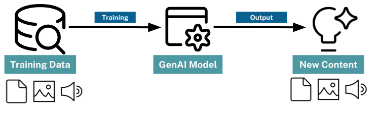

= Generative AI
:type: lesson
:order: 1
:slides: true

[.slide.discrete]
== Recap

In this lesson, you will recap some key concepts:

* What is Generative AI
* Knowledge Graphs
* Cypher

// added by martin

[.slide]
== What is Generative AI

Generative AI (or GenAI) refers to artificial intelligence systems designed to create new content that resembles human-made data. The data could be text, images, audio, or code. 

[.transcript-only]
====
These models, like GPT (for text) or DALL-E (for images), are trained on large datasets and use patterns learned from this data to generate new output. 
====

[.transcript-only]
====
Generative AI is widely used in applications such as chatbots, content creation, image synthesis, and code generation.

Generative AI models are not "intelligent" in the way humans are:

. They do not understand or comprehend the content they generate
. They rely on statistical patterns and correlations learned from their training data. 

While Generative AI models can produce coherent and contextually relevant outputs, they lack understanding.
====

[.slide]
== Large Language Models (LLMs)

Large Language Models (LLMs) are a type of generative AI model designed to understand and generate human-like text.

These models are trained on vast amounts of text data and can perform various tasks, including answering questions, summarizing data, and analyzing text.

[.slide.discrete]
== LLM Responses

The response generated by an LLM is a probabilistic continuation of the instructions it receives. 

The LLM provides the most likely response based on the patterns it has learned from its training data.

If presented with the instruction: 
    
    "Continue this sequence - A B C"
    
An LLM could respond: 
    
    "D E F"

[.slide.col-2]
== Knowledge Graphs

[.col]
====
_Knowledge Graph = design patterns to organize & access interrelated data_

Property Graph Model:

* *Nodes* represent entities in the graph
* *Relationships* represent associations or interactions between nodes
* *Properties* represent attributes of nodes or relationships
====

[.col]
image::images/manager-company-data-model.svg[a graph data model showing an Asset Manager who OWNS a Company.]

[.slide]
== Cypher

Cypher is a _A Powerful & Expressive Query Language_

image::images/cypher.svg[a cypher statement and equivalent graph model, width=80%]

read::Continue[]

[.summary]
== Summary

In this lesson, you ...

In the next lesson, you will ...
