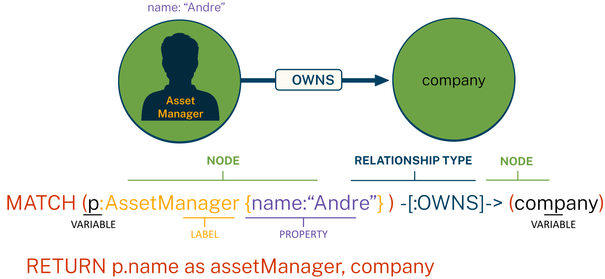

= Generative AI
:type: lesson
:order: 1

In this lesson, you will recap some key concepts:

* What is Generative AI
* Knowledge Graphs
* Cypher

== What is Generative AI

todo

== Knowledge Graphs

_Knowledge Graph = design patterns to organize & access interrelated data_

Property Graph Model:

* *Nodes* represent entities in the graph
* *Relationships* represent associations or interactions between nodes
* *Properties* represent attributes of nodes or relationships

image::images/manager-company-data-model.svg[a graph data model showing an Asset Manager who OWNS a Company.]

== Cypher

Cypher is a _A Powerful & Expressive Query Language_

read::Continue[]

[.summary]
== Summary

In this lesson, you ...

In the next lesson, you will ...
