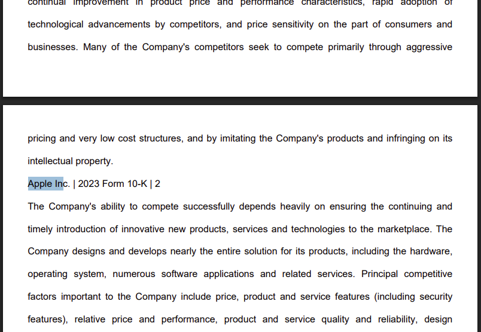

= Building a Graph
:type: lesson
:order: 2
:slides: true

[.slide.discrete]
== Introduction
In this lesson, you will explore the knowledge graph we've prepared for this workshop and learn how it was built.

You'll start with a completed knowledge graph containing structured entities and relationships extracted from PDF documents. Then we'll show you the transformation process: how raw text became the structured data model you'll be working with.

[.slide]
== The Problem with Traditional RAG

Traditional RAG systems work - but they're blind to context:

- **Retrieves based on similarity, not understanding**
- **No map of your domain or business logic**
- **Treats all chunks as isolated, unstructured blobs**
- **Can't bridge relationships across documents**

**The Challenge with PDF Documents:**
- Rich information about companies, financials, and risks locked in unstructured text
- Hard to search, query, or analyze systematically
- Connections between entities are hidden in narrative text
- Traditional RAG can't reason across relationships

**The GraphRAG Solution:**
- Use AI to extract structured entities and relationships
- Create a knowledge graph that preserves connections
- Give the system a "mental map" of your domain
- Enable context-aware retrieval, not just similarity search

It's like giving someone index cards with code snippets vs. an architectural diagram - GraphRAG understands the structure.

[.slide]
== From PDF Documents to Knowledge Graph

image::images/unstructured-structured.svg["a graph data model showing the separation of structured and unstructured data.", width=95%]

[.transcript-only]
====
The knowledge graph you'll be exploring was built from unstructured PDF documents transformed into a structured, queryable format.

Let's walk through how this transformation happened - from the original data sources to the final knowledge graph you'll work with in this workshop.
====

[.slide.col-2]
== The Source: EDGAR SEC Filings

[.col]
====
The knowledge graph you'll explore was built from EDGAR SEC filing PDF documents.

These documents contain valuable company information, but it was originally locked in free-form text that's difficult to query systematically.

**The Original Challenge:** How do you extract structured insights from thousands of pages of legal text about companies, executives, financial metrics, and business risks?
====

[.col]


[.slide.col-2]
== Step 1: Documents and Chunks

[.col]
====
**Documents** in your knowledge graph are the original PDF files that were processed.

**Chunks** are smaller, semantically meaningful segments of text extracted from each document.

[.transcript-only]
=====
**Why This Chunking Strategy?**

- Improves retrieval and search accuracy
- Enables LLMs to process long documents effectively  
- Each chunk becomes a searchable unit linked to its source
- Supports both granular search and traceability

This chunking strategy was crucial for creating a knowledge graph that works at multiple levels of granularity - from specific facts to document-level context. Unlike traditional RAG chunks, these chunks are connected to business entities and relationships.
=====
====

[.col]
====

**Verify Documents and Chunks:**

[source, cypher]
----
// See what documents were processed and how many chunks each has
MATCH (d:Document)<-[:FROM_DOCUMENT]-(c:Chunk)
RETURN d.path, count(c) as totalChunks
ORDER BY totalChunks DESC
----

[.transcript-only]
=====
Now we have a way to access the unstructured data through chunks, but what about the structure that exists within the unstructured data?

PDF documents aren't truly "unstructured" - they contain rich business entities and relationships hidden in the text. Companies mention products, face risks, report financial metrics, and connect to executives. This structure just isn't explicit or queryable.
=====

The solution: define exactly what structure to extract.

====

[.slide.col-2]
== Step 2: Schema-Driven Extraction

The knowledge graph was built using a defined schema combined with carefully crafted prompts to guide the AI extraction process.

**Schema Definition:**

[.col]
====
**Entities:**

- Company
- Executive
- Product
- FinancialMetric
- RiskFactor
- StockType
- Transaction
- TimePeriod    
====

[.col]
====
**Relationships:**

Company **HAS_METRIC** FinancialMetric +
Company **FACES_RISK** RiskFactor +
Company **ISSUED_STOCK** StockType +
Company **MENTIONS** Product 
====

[.slide.discrete]
== Step 2: Guided Extraction Prompts

**Guided Extraction Prompts:**

The extraction process used carefully crafted prompts to ensure quality:

- **Company Validation:** Only extract approved companies from our list
- **Context Resolution:** Resolve "the Company" to actual company names
- **Schema Enforcement:** Strict adherence to defined entity types
- **Quality Control:** Validate all extracted relationships

This schema + prompt combination acted as the blueprint - telling the AI exactly what to look for and how to connect entities in the knowledge graph you'll explore. It's the difference between isolated chunks and a connected web of business knowledge.

[.slide]
== Step 3: The GraphRAG Pipeline

The complete pipeline orchestrated the transformation from PDF to knowledge graph using AI-powered extraction.

**The GraphRAG Pipeline:**

image::images/8.png[Diagram showing the Neo4j GraphRAG pipeline process from PDF documents to knowledge graph]

[.slide.col-2.discrete]
== Step 3: SimpleKGPipeline Example

[.col]
====
```python
pipeline = SimpleKGPipeline(
    driver=driver, # Neo4j connection driver
    llm=llm, embedder=embedder,  # OpenAI llm and embeddings
    entities=entities, relations=relations,  # Define schema
    enforce_schema="STRICT",
    prompt_template=prompt_template,
)
# Process the SEC filing documents
pdf_documents = [
    "apple-10K-2023.pdf", "microsoft-10K-2023.pdf",
    # ... more company filings
]
# Run the pipeline to transform PDFs into knowledge graph
for pdf_file in pdf_documents:
    pipeline.run(file_path=pdf_file)
```
====

[.col]
====
**What happened during `pipeline.run()`:**

1. **PDF Text Extraction:** Extracted raw text from PDF documents +
2. **Document Chunking:** Broke text into semantically meaningful chunks +
3. **Entity Extraction:** Used LLM to identify companies, metrics, risks, etc. +
4. **Relationship Extraction:** Found connections between entities +
5. **Graph Storage:** Saved structured entities and relationships to Neo4j +
6. **Vector Embeddings:** Generated embeddings for chunks and stored them

[.transcript-only]
=====
This transformed hundreds of pages of unstructured PDF text into the queryable knowledge graph with thousands of connected entities.
=====
====

[.slide.discrete]
== Step 3: Verify Entity Extraction

**Verify Entity Extraction:**

[source, cypher]
----
// Count what entities were extracted by type
MATCH (e)
WHERE NOT e:Document AND NOT e:Chunk
RETURN labels(e) as entityType, count(e) as count
ORDER BY count DESC
----

[.slide]
== Step 4: Adding Structured Data

But PDF extraction was only part of the story. The knowledge graph also includes structured data loaded from CSV files to complement the extracted PDF entities.

**Structured Data Sources:**

- **Asset Manager Holdings:** Ownership information connecting asset managers to companies
- **Company Filing Information:** Metadata linking companies to their PDF documents

**Why Both Data Types?**

- **Unstructured (PDFs):** Rich content about companies, risks, metrics
- **Structured (CSVs):** Precise ownership data and document relationships

This created a complete picture: detailed company information from PDFs **plus** structured ownership and filing relationships. The bridge between structured and unstructured data enables the powerful GraphRAG queries you'll explore.

[.transcript-only]
====
**Sample Structured Data:**

**Asset Manager Holdings (Sample Data):**
[%autowidth]
|===
| managerName | companyName | ticker | Value | shares

| ALLIANCEBERNSTEIN L.P. | AMAZON COM INC | AMZN | $6,360,000,000 | 50,065,439
| ALLIANCEBERNSTEIN L.P. | APPLE INC | AAPL | $4,820,000,000 | 28,143,032  
| AMERIPRISE FINANCIAL INC | ALPHABET INC | GOOG | $4,780,000,000 | 36,603,757
| BlackRock Inc. | AMAZON COM INC | AMZN | $78,000,000,000 | 613,380,364
| FMR LLC | MICROSOFT CORP | MSFT | $68,200,000,000 | 215,874,152
|===

**Company Filing Information (Sample Data):**
[%autowidth]  
|===
| name | ticker | cusip | cik | form10KUrls

| AMAZON | AMZN | 23135106 | 1018724 | 0001018724-23-000004.pdf
| NVIDIA Corporation | NVDA | 067066G104 | 1045810 | 0001045810-23-000017.pdf
| APPLE INC | AAPL | 3783310 | 1490054 | 0001096906-23-001489.pdf
| PAYPAL | PYPL | 1633917 | 1633917 | 0001633917-23-000033.pdf
| MICROSOFT CORP | MSFT | 594918954 | 789019 | 0000950170-23-035122.pdf
|===
====

[.slide.discrete]
== Step 4: How the Data Was Loaded
**How The Data Was Loaded:**

1. **Neo4j Data Importer** processed the CSV files
2. **AssetManager nodes** were created from holdings data  
3. **OWNS relationships** connected asset managers to companies with holding values
4. **FILED relationships** linked companies to their PDF documents

**Verify the Complete Graph:**

[source, cypher]
----
// See the complete data model - all node types
MATCH (n)
RETURN labels(n) as nodeType, count(n) as count
ORDER BY count DESC
----

[.slide.col-2]
== Step 5: Exploring What Was Created

Now that we've seen how the knowledge graph was built, let's explore what was created. Your complete knowledge graph contains:

[.col]
====
**The Complete Data Model:**

- **500+ Company entities** extracted from SEC filings
- **Asset Manager entities** with ownership information
- **2,000+ Financial metrics and risk factors** as structured nodes  
- **Clear entity relationships** connecting business concepts
- **Document links** bridging structured and unstructured data
====

[.col]
====
**Visualize the Complete Schema:**

[source, cypher]
----
CALL db.schema.visualization()
----

[.transcript-only]
=====
This shows the complete knowledge graph schema including both extracted entities (Company, Product, FinancialMetric, etc.) and loaded structured data (AssetManager, ownership relationships) that you'll work with.
=====
====

[.slide.discrete]
== Step 5: Explore a Complete Company Profile

**Explore a Complete Company Profile:**

[source, cypher]
----
// See how all three data types connect for one company
MATCH (c:Company {name: 'APPLE INC'})
OPTIONAL MATCH (c)-[r1]->(extracted)
WHERE NOT extracted:Chunk AND NOT extracted:Document
OPTIONAL MATCH (am:AssetManager)-[r2:OWNS]->(c)
OPTIONAL MATCH (c)<-[:FROM_CHUNK]->(chunk:Chunk)
RETURN c.name,
       count(DISTINCT extracted) as extractedEntities,
       count(DISTINCT am) as assetManagers, 
       count(DISTINCT chunk) as textChunks
----

[.transcript-only]
====
**Additional Exploration Queries:**

[source, cypher]
----
// Count what the pipeline created
MATCH (d:Document)
OPTIONAL MATCH (d)<-[:FROM_DOCUMENT]->(c:Chunk)
OPTIONAL MATCH (c)<-[:FROM_CHUNK]-(e)
RETURN d.path, 
       count(DISTINCT c) as chunks, 
       count(DISTINCT e) as entities
ORDER BY entities DESC
----

[source, cypher]
----
// See all asset managers that were loaded
MATCH (am:AssetManager)
RETURN am.managerName, count{(am)-[:OWNS]->()} as companiesOwned
ORDER BY companiesOwned DESC
LIMIT 10
----

[source, cypher]
----
// Check data quality across companies
MATCH (c:Company)
OPTIONAL MATCH (c)-[r]->(entity)
RETURN c.name, count(r) as totalRelationships, 
       collect(DISTINCT type(r)) as relationshipTypes
ORDER BY totalRelationships DESC
LIMIT 5
----

[source, cypher]
----
// Find all financial metrics for a specific company
MATCH (c:Company {name: 'MICROSOFT CORP'})-[:HAS_METRIC]->(m:FinancialMetric)
RETURN c.name, m.name
LIMIT 10
----

[source, cypher]
----
// Discover risk factors across all companies
MATCH (c:Company)-[:FACES_RISK]->(r:RiskFactor)
RETURN c.name, r.name
LIMIT 50
----
====

[.slide]
== Key Takeaways

✅ **Unstructured → Structured:** PDF text was transformed into business entities and relationships

✅ **Schema-Driven:** Clear entity definitions guided accurate extraction

✅ **AI-Powered:** LLMs identified and extracted meaningful business concepts

✅ **Relationship-Aware:** Connections between entities were preserved and made explicit

✅ **Data Model Ready:** Clean, structured data prepared for the knowledge graph you'll explore

This structured data model is the foundation for everything that follows - without it, you'd still have unstructured text instead of the queryable business entities you'll work with!

read::Continue[]

[.summary]
== Summary

In this lesson, you learned how we extracted structured data from unstructured PDF documents:

**The Process:**

- Started with EDGAR SEC filing PDFs containing company information
- Defined a clear schema with entities (Company, Executive, Product, etc.) and relationships
- Applied AI-powered extraction with carefully crafted prompts to identify business entities
- Used guided extraction to ensure data quality and consistency
- Created structured entities and relationships from free-form text

**What Was Created:**

- 500+ company entities from SEC filings
- 2,000+ financial metrics and risk factors as structured nodes
- Clear entity relationships connecting business concepts
- Clean, structured data model ready for graph storage

**Key Technologies:**

- Schema definition for consistent entity extraction
- OpenAI GPT-4 for entity and relationship identification
- Guided prompts for data quality control
- Structured extraction pipeline

This structured data model is now ready to be stored in a knowledge graph and enhanced with vector embeddings for search.

In the next lesson, you will learn about vectors and embeddings that enable semantic search across this structured data.
