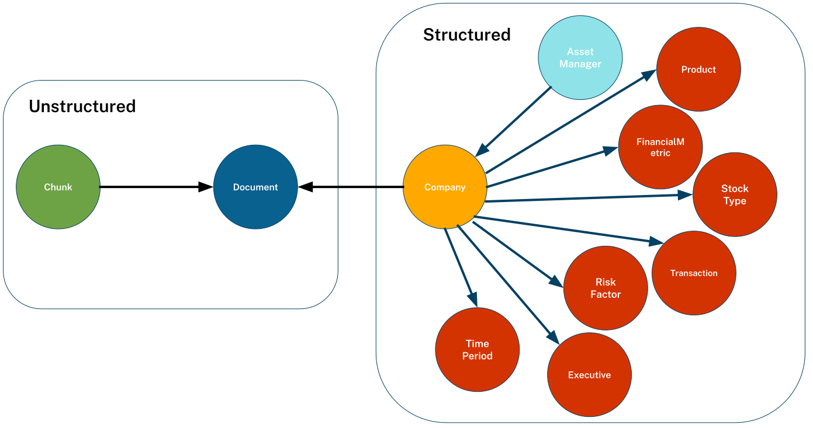
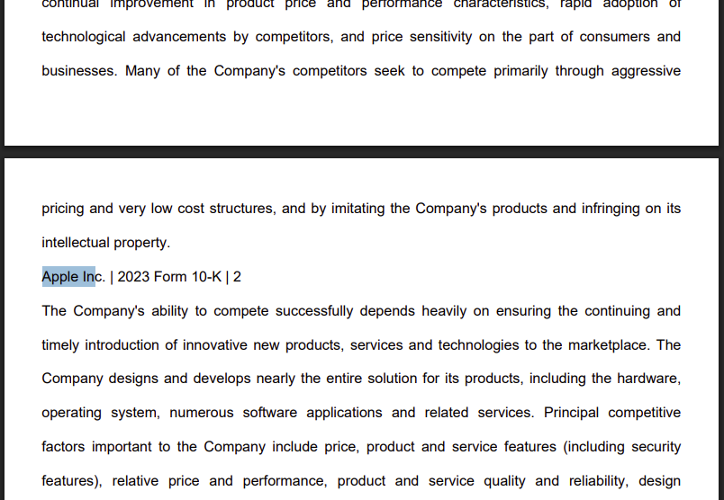

= Data Model
:type: lesson
:order: 2
:slides: true

// added by martin

[.slide]
== Unstructured and Structured Data

You will be exploring a knowledge graph of structure and unstructured data.

[.slide.col-40-60]
== EDGAR SEC Filings

[.col]
====
The knowledge graph was created from EDGAR SEC filing PDF documents.
====

[.col]

[.slide]
== Explore the Data Model

Use Cypher query to find product data relating to `APPLE INC`:

[source, cypher]
----
MATCH (c:Company)-[m:MENTIONS]->(product:Product)
WHERE c.name = 'APPLE INC'
RETURN c, m, product
----

[.slide]
== Building a Knowledge Graph

I used the `neo4j-graphrag` Python library to create the graph by:

. *Chunking the data* - The documents were broken down the data into manageable _chunks_.
. *_Vectorizing_ the chunks* - Embeddings were created to search the data.
. *Extracting entities and relationships* - The data was passed to an LLM to discover nodes and relationships.
. *Generating the graph* - The output was used to create the graph in Neo4j.

read::Continue[]

[.summary]
== Summary

In this lesson, you ...

In the next lesson, you will ...
