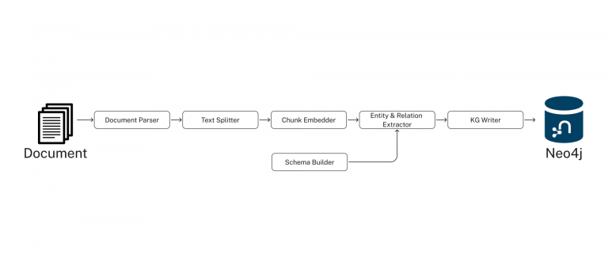

= Extracting Structured Data from PDFs
:type: lesson
:order: 2
:slides: true

In this lesson, you will learn how we extract structured entities and relationships from unstructured PDF documents.

This is the foundational transformation: converting raw text into a structured data model that understands business entities and their connections.

[.slide]
== The Problem with Traditional RAG

Traditional RAG systems work - but they're blind to context:

- **Retrieves based on similarity, not understanding**
- **No map of your domain or business logic**
- **Treats all chunks as isolated, unstructured blobs**
- **Can't bridge relationships across documents**

It's like giving someone index cards with code snippets - they can parrot back functions, but they don't understand the architecture.

[.slide]
== From PDF Documents to Knowledge Graph

image::images/unstructured-structured.svg["a graph data model showing the separation of structured and unstructured data.", width=95%]

[.transcript-only]
We started with unstructured PDF documents and transformed them into a structured, queryable knowledge graph.

The journey from unstructured data to GraphRAG retrievers begins here. This transformation unlocks the hidden value in documents by making their content searchable, connected, and intelligent.

== The Source: EDGAR SEC Filings

[.col]
====
We used EDGAR SEC filing PDF documents as our unstructured data source.

These contain valuable company information, but it's locked in free-form text that's difficult to query systematically.

**The Challenge:** How do you extract structured insights from thousands of pages of legal text about companies, executives, financial metrics, and business risks?
====

[.col]
image::images/apple-edgar-pdf.png["a screenshot of an Apple SEC filing PDF document."]

[.slide]
== The Transformation Challenge

**The Problem:**
- PDF documents contain rich information about companies, financials, and risks
- Information is in unstructured text format
- Hard to search, query, or analyze systematically
- Connections between entities are hidden in narrative text
- Traditional RAG can't reason across relationships

**The Solution:**
- Use AI to extract structured entities and relationships
- Create a knowledge graph that preserves connections
- Give the system a "mental map" of your domain
- Enable context-aware retrieval, not just similarity search
- Build the foundation for GraphRAG retrievers

This is not just about parsing PDFs - it's about creating an intelligent data foundation that understands relationships and context like a human would.

[.slide]
== Step 1: Documents and Chunks

**Documents** are the original PDF files we process.

**Chunks** are smaller, semantically meaningful segments of text extracted from each document.

**Why Chunking?**
- Improves retrieval and search accuracy
- Enables LLMs to process long documents effectively  
- Each chunk becomes a searchable unit linked to its source
- Supports both granular search and traceability

This chunking strategy is crucial for creating a knowledge graph that works at multiple levels of granularity - from specific facts to document-level context. Unlike traditional RAG chunks, these chunks will be connected to business entities and relationships.

[.slide]
== Step 2: Schema Definition

We defined what entities and relationships to extract:

**Entities:**

- Company
- Executive
- Product
- FinancialMetric
- RiskFactor
- StockType
- Transaction
- TimePeriod

**Relationships:**

Company **HAS_METRIC** FinancialMetric +
Company **FACES_RISK** RiskFactor +
Company **ISSUED_STOCK** StockType +
Company **MENTIONS** Product

This schema acts as our blueprint - telling the AI exactly what to look for and how to connect entities in our knowledge graph. It's the difference between isolated chunks and a connected web of business knowledge.

[.slide]
== Step 3: Guided Extraction with Prompts

The extraction process uses carefully crafted prompts:

- **Company Validation:** Only extract approved companies from our list
- **Context Resolution:** Resolve "the Company" to actual company names
- **Schema Enforcement:** Strict adherence to defined entity types
- **Quality Control:** Validate all extracted relationships

This ensures clean, consistent data in our knowledge graph.

The prompts are our way of teaching the AI to be a domain expert, understanding not just what to extract, but how to maintain data quality and consistency.

[.slide]
== Step 4: The GraphRAG Pipeline

The complete pipeline orchestrates the transformation from PDF to knowledge graph:



```python
pipeline = SimpleKGPipeline(
    driver=driver,
    llm=llm,  # OpenAI GPT-4
    embedder=embedder,  # OpenAI embeddings
    entities=entities,  # Our schema
    relations=relations,
    prompt_template=prompt_template,
    enforce_schema="STRICT"
)
```

This is where the magic happens - the pipeline orchestrates the entire transformation from unstructured PDF to structured knowledge graph. It handles chunking, extraction, embedding, and graph construction - giving your RAG system the "mental model" it needs to understand your domain.

[.slide]
== What We Created

[.slide]
== What We Created

**The Result:** A structured data model containing:

- **500+ Company entities** extracted from SEC filings
- **2,000+ Financial metrics and risk factors** as structured nodes  
- **Clear entity relationships** connecting business concepts
- **Clean, structured data** ready for graph storage

**The Transformation:**
- Unstructured PDF text → Structured business entities
- Hidden relationships → Explicit entity connections
- Free-form data → Consistent schema
- Document silos → Connected data model

From scattered PDF text to a structured understanding of business entities and their relationships - the foundation for any knowledge graph.

[.slide]
== Explore the Data Model

Let's see the structured entities we extracted! Use this Cypher query to find products mentioned by Apple:

[source, cypher]
----
MATCH (c:Company)-[m:MENTIONS]->(product:Product)
WHERE c.name = 'APPLE INC'
RETURN c, m, product
----

This shows how unstructured text became queryable, structured relationships.

[.slide]
== Key Takeaways

✅ **Unstructured → Structured:** PDF text became business entities and relationships

✅ **Schema-Driven:** Clear entity definitions guided accurate extraction

✅ **AI-Powered:** LLMs identified and extracted meaningful business concepts

✅ **Relationship-Aware:** Connections between entities were preserved and made explicit

✅ **Data Model Ready:** Clean, structured data ready for knowledge graph storage

This structured data model is the foundation for everything that follows - without it, we'd still have unstructured text instead of queryable business entities!

read::Continue[]

[.summary]
== Summary

In this lesson, you learned how we extracted structured data from unstructured PDF documents:

**The Process:**

- Started with EDGAR SEC filing PDFs containing company information
- Defined a clear schema with entities (Company, Executive, Product, etc.) and relationships
- Applied AI-powered extraction with carefully crafted prompts to identify business entities
- Used guided extraction to ensure data quality and consistency
- Created structured entities and relationships from free-form text

**What Was Created:**

- 500+ company entities from SEC filings
- 2,000+ financial metrics and risk factors as structured nodes
- Clear entity relationships connecting business concepts
- Clean, structured data model ready for graph storage

**Key Technologies:**

- Schema definition for consistent entity extraction
- OpenAI GPT-4 for entity and relationship identification
- Guided prompts for data quality control
- Structured extraction pipeline

This structured data model is now ready to be stored in a knowledge graph and enhanced with vector embeddings for search.

In the next lesson, you will learn about vectors and embeddings that enable semantic search across this structured data.
