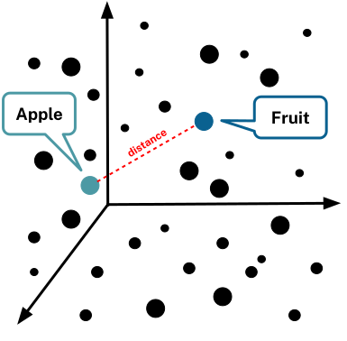

= Vectors
:type: lesson
:order: 3
:slides: true

// added by martin

[.slide.col-2]
== What is a Vector?

[.col]
====
Vectors are simply a list of numbers.

The vector `[1, 2, 3]` is a list of three numbers and could represent a point in three-dimensional space.

You can use vectors to represent many different types of data, including text, images, and audio.
====

[.col]

[.slide.col-40-60]
== Vectors in the Real World

[.col]
====
* 3D space
* Navigation
* Calculations with external forces
* And many other uses!
====

[.col]

[.slide.col-2]
== What are embeddings?

_An embedding is a vector that represents the data in a useful way for a specific task._

[.col]
====
* A type of data compression
* Transform messy data into compact format
* Numeric vectors with 100s or 1000s of elements
====

[.slide]
== "apple"

You can use an embedding model to turn words and phrases into vectors:

include::apple-embedding.adoc[lines=1] 
...

[.slide]
== Similarity Search

Semantic search aims to understand search phrases' intent and contextual meaning.

Are you searching about the fruit, the tech company, or something else?

image::images/Apple-tech-or-fruit.png[A diagram showing the different meanings for the word "apple"]

[.slide.discrete.col-2]
== Similarity Search

[.col]
====
You can use the _distance_ or _angle_ between vectors to find similar data.

Words with similar meanings or contexts will have vectors that are close together, while unrelated words will be farther apart.
====

[.col]

[.slide]

[.slide.col-2]
== Knowledge Graphs and Vectors

[.col]
====
Vectors and embeddings can be used to facilitate similarity search in knowledge graphs.
====

[.col]

[.slide]
== Create embeddings

You can use Cypher to create an embedding for a chunk of text:

[source, cypher]
----
WITH genai.vector.encode(
    "Create an embedding for this text",
    "OpenAI",
    { token: "sk-..." }) AS embedding
RETURN embedding
----

[.transcript-only]
====
[IMPORTANT]
.OpenAI API Key
=====
You need to replace `sk-...` with your OpenAI API key.
=====
====

[.slide]
== Search a vector index

You can search a vector index to find similar chunks of text.

[source, cypher]
----
WITH genai.vector.encode(
    "What is the latest with Apple Inc?",
    "OpenAI",
    { token: "sk-..." }) AS embedding
CALL db.index.vector.queryNodes('chunkEmbeddings', 6, embedding)
YIELD node, score
RETURN node.text, score
----

[.slide.discrete]
== Traverse the graph

From the results of the vector search, you can traverse the graph to find related entities:

[source, cypher]
----
WITH genai.vector.encode(
    "Whats the latest with Apple Inc?",
    "OpenAI",
    { token: "sk-..." }) AS embedding
CALL db.index.vector.queryNodes('chunkEmbeddings', 6, embedding)
YIELD node, score
MATCH (node)<-[:FROM_CHUNK]-(e:__Entity__)
RETURN node.text, score, collect(e.name) AS entities
----

read::Continue[]

[.summary]
== Summary

In this lesson, you learned about vectors and embeddings for semantic search:

**Key Concepts:**

- Vectors are numerical representations that enable semantic similarity search
- Embeddings transform text into high-dimensional vectors that capture meaning and context
- Neo4j can store vectors alongside graph data for hybrid retrieval
- Vector indexes enable fast similarity search across large document collections

**Practical Applications:**

- Create embeddings for text chunks using OpenAI's embedding API
- Store embeddings in Neo4j with vector indexes for efficient search
- Combine vector similarity with graph traversal for contextual retrieval
- Use semantic search to find relevant content even when exact keywords don't match

**What You Can Do:**

- Search for similar content based on meaning, not just keywords
- Find relevant document chunks that relate to your query semantically
- Traverse from retrieved chunks to related entities in the knowledge graph
- Enable more intelligent, context-aware search capabilities

In the next module, you will learn how to build different types of retrievers that combine vector search with graph traversal for powerful GraphRAG applications.
