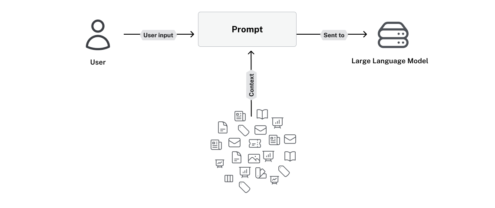
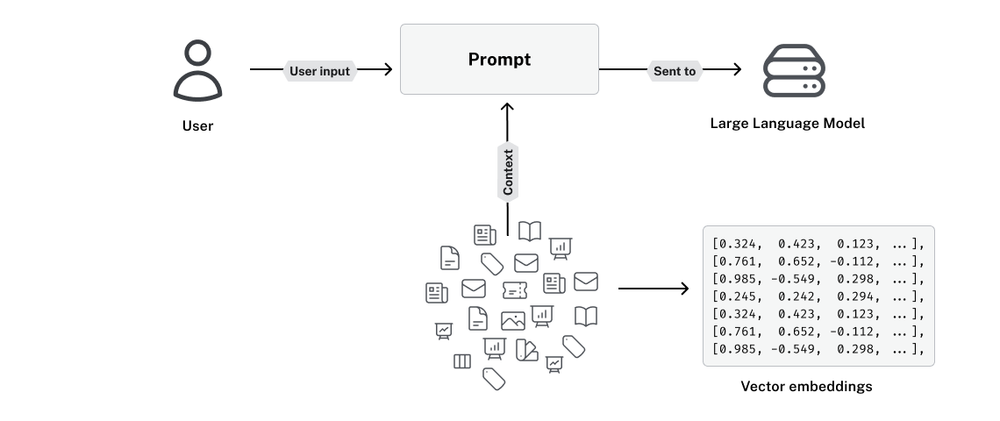
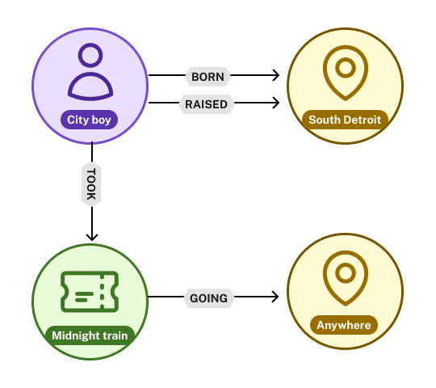
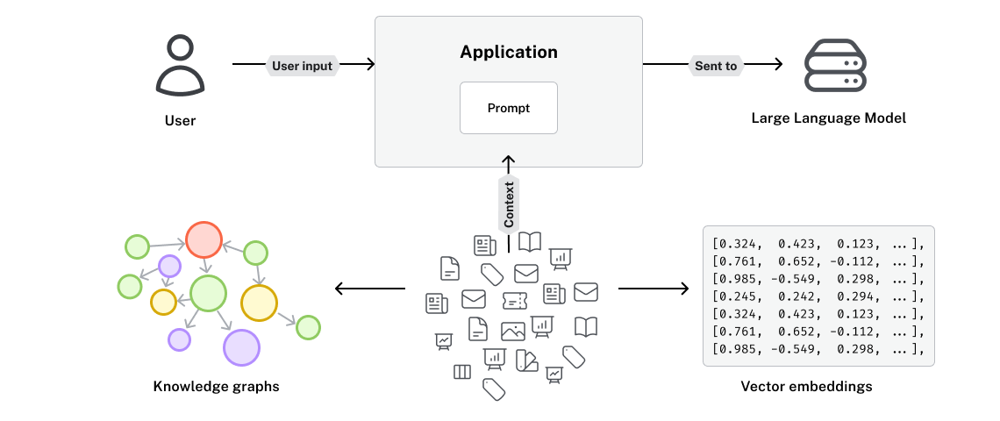
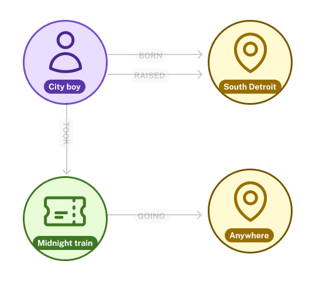
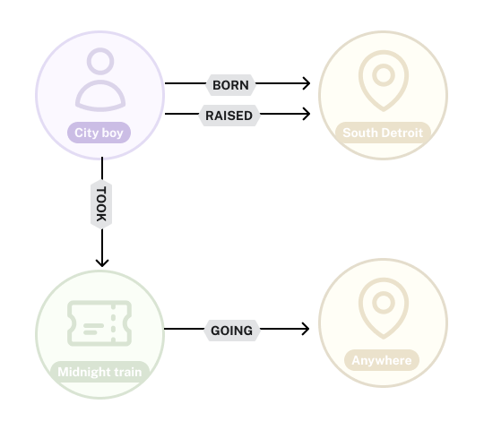
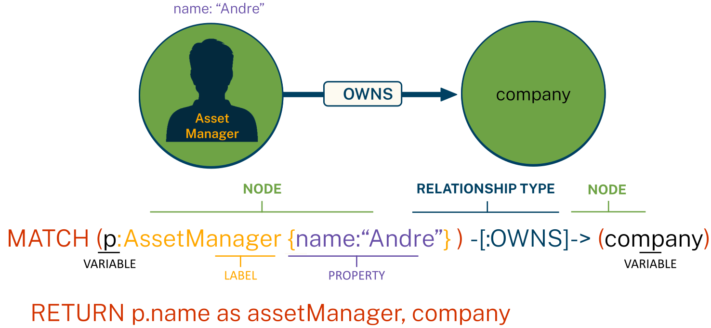

= What is GraphRAG?
:order: 1

[.slide.discrete]
== Retrieval-Augmented Generation (RAG)

**Retrieval-Augmented Generation (RAG)** is a technique that improves the responses of LLMs by providing them with relevant, up-to-date information retrieved from external sources.

[.slide.discrete]
== Retrieval-Augmented Generation (RAG) with Vectors

This typically involves converting text into **vector embeddings** that encodes the semantic meaning of the text, in a format that the user understands, and then using similarity search to find relevant information.

[.slide.col-2]
== Vector-based RAG

[.col]
====
**Vectors work well for:**

* Contextual or Meaning Based Questions
* Synonyms or Paraphrasing
* Fuzzy or Vague queries
* Broad or Open-Ended questions
* Complex queries with multiple concepts

[quote,role="text-xl"]
What does Paul Graham think about Generative AI?
====

[.col]
====
**Vectors are ineffective for:**

* Highly Specific or Fact-Based Questions
* Numerical or Exact-Match Queries
* Boolean or Logical Queries
* Ambiguous or Unclear Queries without Context
* Specialised Knowledge

[quote]
How many Generative AI Startups has Paul Graham invested in?

====

[.slide.discrete.col-2]
== Unstructured data as vectors

[.col]
====
[%header,cols="1,1"]
|===
|Text |Vector embedding

|She's just a small town girl
|[0.12, -0.34, 0.56, 0.78, ..., -0.91]

|Living in a lonely world
|[0.22, 0.45, -0.67, 0.11, ..., 0.33]

|She took the midnight train
|[-0.55, 0.89, 0.12, -0.44, ..., 0.67]

|Going anywhere
|[0.78, -0.23, 0.45, 0.91, ..., -0.12]
|===
====

[.col]
====
====

[.slide.col-2]
== Unstructured data as a graph

[.col]
====
[%header,cols="1,1"]
|===
|Text |Vector embedding

|She's just a small town girl
|[0.12, -0.34, 0.56, 0.78, ..., -0.91]

|Living in a lonely world
|[0.22, 0.45, -0.67, 0.11, ..., 0.33]

|She took the midnight train
|[-0.55, 0.89, 0.12, -0.44, ..., 0.67]

|Going anywhere
|[0.78, -0.23, 0.45, 0.91, ..., -0.12]
|===
====

[.col]
====

====

// [.slide.col-2]
// == Vectors vs knowledge graphs

// [.col]
// ====
// **Vectors**

// * Store numbers in a format that can be reasoned about by a machine
// * Can often inflate text
// * Vector similarity returns similar results but not always relevant
// ====

// [.col]
// ====
// **Knowledge graphs**

// * Store data in a graph structure
// * Graph similarity returns similar results
// * Easy for a human to understand
// * Compressed view of the data
// ====

[.slide.discrete]
== Knowledge Graphs

GraphRAG involves creating a **knowledge graph** of nodes and relationships contained in unstructured data.

[.slide.col-2]
== Nodes

[.col]
====
* Nodes represent **things**
* Nodes are grouped by **labels**
* Nodes are described by **properties** as key-value pairs

[quote.text-xl]
A **Person** with the `description` of **City Boy** +
A **Location** with the `name` *South Detroit*.

====

[.col]
====

====

[.slide.col-2]
== Relationships

[.col]
====
* Any two nodes can be connected by a **relationship**
* Each relationship has a **type** and a **direction**
* Relationships have **properties** as key-value pairs

[quote.text-xl]
The City Boy **took** the Midnight Train **going** Anywhere.
====

[.col]
====

====

[.slide]
== Cypher

Cypher is a _A Powerful & Expressive Query Language_ for querying graphs.

[.slide]
== Steps of GraphRAG

The term Graph RAG encapsulates the process of **extracting nodes and relationships** from unstructured text, which sit along the vector embeddings in the knowledge graph.

The knowledge graph structure can be **enriched with additional features** derived from graph algorithms in the Neo4j Graph Data Science library, providing deeper insights into the data's patterns and connections.

Then **querying the resulting knowledge graph**, sometimes in combination with vector search, to retrieve the necessary information for the task.

We will explore these points in more detail as we progress through the course.
