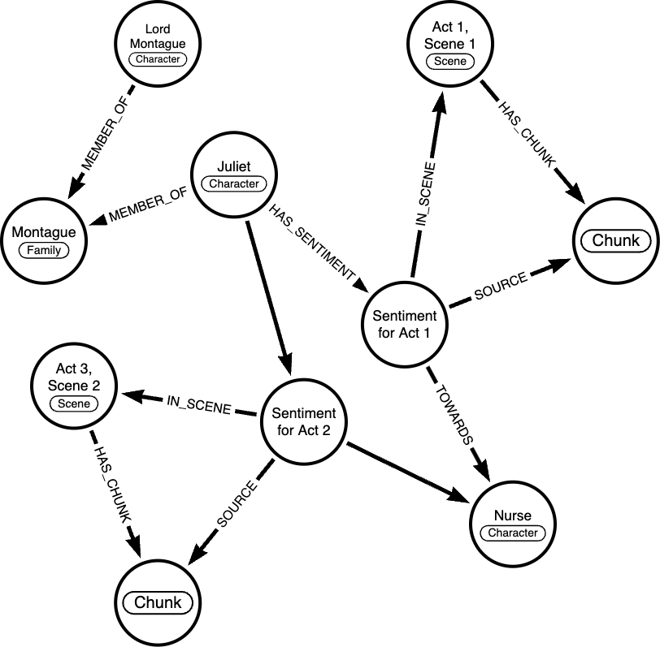
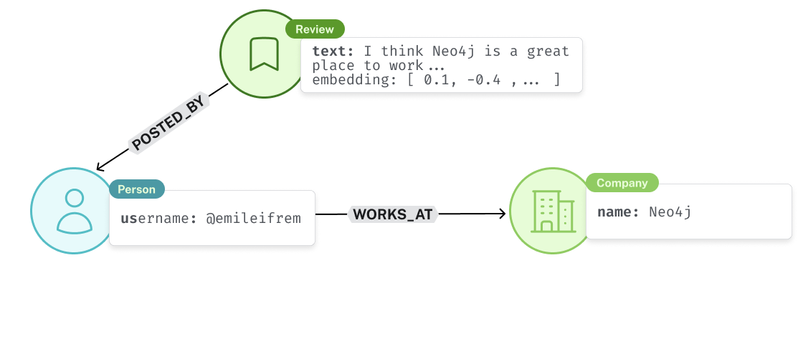

= Constructing knowledge graphs for GraphRAG
:order: 2 

[.slide.discrete]
== Constructing knowledge graphs for GraphRAG 

In this lesson, we will explore the different types of knowledge graphs that can be used for GraphRAG. 

* **Lexical graphs**
* **Lexical with entities**
* **Domain graphs**
* **Memory graphs**

link:https://graphrag.com/[GraphRAG Patterns from graphrag.com^]

[.slide.col-2]
== Lexical graphs

[.col]
====
It is useful to chunk large documents into smaller pieces for creating embeddings. An embedding is a text’s semantic representation capturing the meaning of what the text is about. If the given text is long and contains too many diverse subjects, the informative value of its embedding deteriorates.
====

[.col]
====
image::https://graphrag.com/_astro/knowledge-graph-lexical-graph.De_a3uWZ_Z2h45bE.svg[Lexical graph,width=90%]
====

[.slide.col-2]
== Lexical graphs with hierarchical structure

[.col]
====
If the given documents have pre-defined structures, it is useful to persist them into the chunk structure. This pattern is an evolution of the Lexical Graph.

For example, a book is a collection of chapters, which are in turn a collection of sections, which are in turn a collection of paragraphs.

====

[.col]
====
image::https://graphrag.com/_astro/knowledge-graph-lexical-graph-hierarchical-structure.9SFxqb4Q_ZNvQ6r.svg[Lexical graph with community summaries,width=90%]
====

[.slide.col-2]
== Lexical graphs with entities

[.col]
====
The biggest problem with the vector search approach as in the e.g. Basic Retrievers or Parent-Child Retrievers is finding all relevant context that is necessary to answer a question. The context can be spread across many chunks not being found by the search. Relating the real-world entities from the chunks to each other and retrieving these relationships together with a vector search provides additional context about these entities that the chunks deal with.
====

[.col]
====
image::https://graphrag.com/_astro/knowledge-graph-lexical-graph-extracted-entities.BsKeTZFb_ZxxPUk.svg[Lexical graph with entities,width=90%]
====

// [.slide.col-2]
// == Lexical graphs with community summaries

// [.col]
// ====
// Certain questions that can be asked on a whole dataset, do not just relate to things that are present in some chunks but rather search for an overall message that is overarching in the dataset. All aforementioned patterns are not suited to answer these kinds of “global” questions.
// ====

// [.col]
// ====

// image::https://graphrag.com/_astro/knowledge-graph-lexical-graph-extracted-entities-community-summaries.CBUo7m6H_Z2jRSb3.svg[Lexical graph with community summaries,width=90%]
// ====

[.slide.col-2]
== Domain graphs

[.col]
====
A Domain Graph contains Business Domain Knowledge. It contains real-world entities and the relationships between them. Frequently used example Domain Graphs are the Movie Graph or the Northwind Graph.

Since Domain Graphs will look different based on the underlying domain, it isn’t possible to provide a blueprint of how one would look. Just keep in mind that they contain structured data adhering to a schema.

Providing the information contained in a Domain Graph within a question-answer application where natural language queries lead to (deterministic) structured retrieval of data can be executed in several ways.
====

[.col]
====

image::https://graphrag.com/_astro/domain-graph.DOzUcy6K_YkdvU.svg[Lexical graph with community summaries,width=100%]
====

[.slide.col-2]
== Memory graphs

[.col]
====
**Semantic memory** contains facts about the world. For an agent, this can be information about the user, such as name, age, or relationships to other people. 

This type of memory requires information to be properly maintained and can change frequently, which leads to complexity in creating, updating, and deleting memories appropriately.

Here’s an example of how this may look in practice. Information about the current user may be retrieved dynamically according to the input question. For example, if the question requires knowledge about what the user does for fun, a query may be used to grab information about events they’ve attended.

====

[.col]
====

image::https://graphrag.com/_astro/memory-semantic-example.CUYOgV1l_15Cfug.svg[Memory graph,width=100%]
====

[.slide.col-2]
== A combined example

[.col]
====
In **Romeo and Juliet**, the **Nurse** is Juliet's closest confidante.  This relationship persists throughout Acts 1 and 2.  She supports Juliet's secret romance with Romeo.

However, in Act 3, after **Lord Montague** demands that Juliet marry Paris, the **Nurse** switches allegiances and supports Juliet's family's wishes.

[quote]
“I think it best you married with the county. O, he’s a lovely gentleman!”

While a single chunk of text may unearth one of these states, each event needs to be stored in the graph to provide the full **context** of the character's relationships.
====

[.col]
====

====

[.slide.col-2.discrete]
== A combined example

[.col]
====

* The _hierarchical lexical graph_ splits the play into **Acts**, **Scenes** and **Lines**.
* The _domain graph_  describes how *Characters* are affiliated to a *Family*.
* _Temporal memory_ captures the changing **sentiment** between the characters over time.

====

[.col.slide-only]
====

====

[.slide]
== Context is key 

====

====

Would you trust a Glassdoor review that comes from the company's CEO?
What else have they posted? 
What is their motivation for the post?

[.transcript-only]
====
The relationships reveal additional information that is not immediately obvious from the raw text.
This information can be included in with the raw text that you embed, but may be lost in the embedding process.
====

// * Knowledge graphs back genai applications 
// ** Nodes 
// ** Relationships
// * Types of graph: 
// ** Lexical
// ** Lexical with entities
// ** Domain graph 
// * Short-term memory as a graph 
// * Long-term memory as a graph 
