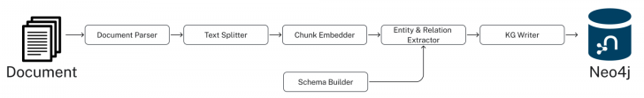

= Building a Graph
:type: lesson
:order: 2
:slides: true

[.slide.discrete]
== Introduction

In this lesson, we will explore how to transform unstructured documents into knowledge graphs using Neo4j's GraphRAG Library.

The link:https://github.com/neo4j/neo4j-graphrag-python[Neo4j GraphRAG Library^] provides  developers with methods to build and query knowledge graphs.

The library allows you to build pipelines to:

* Chunk text documents and PDFs and create vector embeddings
* Extract entities and relationships from the chunks and store them in a knowledge graph
* Query vector embeddings and return the surrounding nodes and relationships

&nbsp;

[source,sh]
pip install "neo4j_graphrag[openai]"

[.slide.col-2]
== The Source: EDGAR SEC Filings

[.col]
====
EDGAR (Electronic Data Gathering, Analysis, and Retrieval) SEC filings are official documents that public companies must submit to the U.S. Securities and Exchange Commission (SEC).
// These include annual reports (10-K), quarterly reports (10-Q), and other critical disclosures.

These documents are the authoritative source for company information, containing details about:

- Financial performance and metrics
- Business operations and strategy
- Risk factors and challenges
- Executive leadership and compensation
- Corporate governance

**The Challenge:** +
How do you extract structured insights from these comprehensive but text-heavy regulatory documents that contain crucial business intelligence?

[TIP,role="transcript-only"]
.Spoiler Alert
You can link:https://github.com/neo4j-graphacademy/workshop-genai/blob/main/workshop-genai/financial-documents/pdf-build/01_PDF_Loader_for_Neo4j_GraphRAG.ipynb[View the entire process on Github^].

====

[.col]
image::images/apple-edgar-pdf.png["a screenshot of an Apple SEC filing PDF document."]

[.slide.col-2]
== Step 1: Documents and Chunks

[.col]
====
**Documents** in your knowledge graph are the original PDF files that were processed.

**Chunks** are smaller, semantically meaningful segments of text extracted from each document.

This is known in GraphRAG as a **Lexical graph**.

[.transcript-only]
=====
**Why This Chunking Strategy?**

- Improves retrieval and search accuracy
- Enables LLMs to process long documents effectively
- Each chunk becomes a searchable unit linked to its source
- Supports both granular search and traceability

This chunking strategy was crucial for creating a knowledge graph that works at multiple levels of granularity - from specific facts to document-level context. Unlike traditional RAG chunks, these chunks are connected to business entities and relationships.
=====
====

[.col]
====
image::https://graphrag.com/_astro/knowledge-graph-lexical-graph.De_a3uWZ_Z2h45bE.svg[Lexical graph,width=90%]
====

[.slide.col-2]
== Lexical graphs with hierarchical structure

[.col]
====
Documents are also inherently **hierarchical**.

A book will contain chapters, which are in turn a collection of sections, which are in turn a collection of paragraphs.

If the given documents have pre-defined structures, it is useful to persist them into the chunk structure.

// For example, a book is a collection of chapters, which are in turn a collection of sections, which are in turn a collection of paragraphs.

====

[.col]
====
image::https://graphrag.com/_astro/knowledge-graph-lexical-graph-hierarchical-structure.9SFxqb4Q_ZNvQ6r.svg[Lexical graph with community summaries,width=90%]
====

// **Verify Documents and Chunks:**

// [source, cypher]
// ----
// // See what documents were processed and how many chunks each has
// MATCH (d:Document)<-[:FROM_DOCUMENT]-(c:Chunk)
// RETURN d.path, count(c) as totalChunks
// ORDER BY totalChunks DESC
// ----

// [.transcript-only]
// =====
// Now we have a way to access the unstructured data through chunks, but what about the structure that exists within the unstructured data?

// PDF documents aren't truly "unstructured" - they contain rich business entities and relationships hidden in the text. Companies mention products, face risks, report financial metrics, and connect to executives. This structure just isn't explicit or queryable.
// =====

// The solution: define exactly what structure to extract.

// ====

[.slide.discrete]
== Step 2: Guided Extraction Prompts

The extraction process uses **carefully crafted prompts** to ensure quality and accuracy.
The following principles are crucial for achieving high-quality results:

- **Company Validation:** Only extract approved companies from predefined lists
- **Context Resolution:** Resolve generic references like "the Company" to actual names
- **Schema Enforcement:** Strict adherence to defined entity types and properties
- **Quality Control:** Validate all extracted relationships against schema

This schema + prompt combination acts as the blueprint - telling the LLM exactly what to look for and how to connect entities in the knowledge graph you'll explore.

[.slide]
== An example prompt

Here's how to create effective extraction prompts:

[source, python]
----
from neo4j_graphrag.experimental.pipeline.kg_builder import ERExtractionTemplate

company_instruction = (
    "You are an expert in extracting company information from SEC filings. "
    "When extracting, the company name must match exactly as shown below. "
    "ONLY USE THE COMPANY NAME EXACTLY AS SHOWN IN THE LIST. "
    "If the text refers to 'the Company', 'the Registrant', or uses a pronoun, "
    "you MUST look up and use the exact company name from the allowed list. "
    "UNDER NO CIRCUMSTANCES should you output 'the Company' or generic phrases. "
)
# Combine with default template
custom_template = company_instruction + ERExtractionTemplate.DEFAULT_TEMPLATE
prompt_template = ERExtractionTemplate(template=custom_template)
----

[.slide.col-2]
== Step 2: Schema-Driven Extraction

[.col]
====
**Entity Types:**

- Company
- Executive
- Product
- FinancialMetric
- RiskFactor
- StockType
- Transaction
- TimePeriod

// **Example Enhanced Entities:**

// - Company (id, name)
// - Location (name)
// - Country (name)
// - FundingRound (id, series, amount)
====

[.col]
====
[source, python]
----
entities = [
  {
    "label": "Company",
    "properties": [
      {"name": "name", "type": "STRING"}
    ]
  },
  {
    "label": "Executive",
    "properties": [
      {"name": "name", "type": "STRING"}
    ]
  },
  # ... more entities
]
----

// {"label": "Product", "properties": [{"name": "name", "type": "STRING"}]},
//     {"label": "FinancialMetric", "properties": [{"name": "name", "type": "STRING"}]},
//     {"label": "RiskFactor", "properties": [{"name": "name", "type": "STRING"}]},
//     {"label": "StockType", "properties": [{"name": "name", "type": "STRING"}]},
//     {"label": "Transaction", "properties": [{"name": "name", "type": "STRING"}]},
//     {"label": "TimePeriod", "properties": [{"name": "name", "type": "STRING"}]},
====

[.slide.col-2.discrete]
== Step 2: Defining the Relationships

[.col]
====
**Relationships:**

- Company **HAS_METRIC** FinancialMetric
- Company **FACES_RISK** RiskFactor
- Company **ISSUED_STOCK** StockType
- Company **MENTIONS** Product
====

[.col]
====
[source, python]
----
relations = [
  {
    "label": "HAS_METRIC",
    "source": "Company",
    "target": "FinancialMetric"
  },
  {
    "label": "FACES_RISK",
    "source": "Company",
    "target": "RiskFactor"
  },
  # ... more relationships
]
----
====

[.slide]
== Step 3: The GraphRAG Pipeline

The complete pipeline defines the transformation from PDF to knowledge graph using LLM-powered extraction.

**The GraphRAG Pipeline:**

[.transcript-only]
====
To build a pipeline, you will need to perform the following steps.
====

[.slide.col-2.discrete]
== Step 3: SimpleKGPipeline Example

[.col]
====
.Connect to the Neo4j database
[source, python, subs="attributes+"]
----
from neo4j import GraphDatabase

NEO4J_URI = "{instance-scheme}://{instance-host}:{instance-boltPort}"
NEO4J_USERNAME = "{instance-username}"
NEO4J_PASSWORD = "{instance-password}"

driver = GraphDatabase.driver(
  NEO4J_URI,
  auth=(NEO4J_USERNAME, NEO4J_PASSWORD)
)
----
====

[.col]
====
* Use the Neo4j Python Driver to connect to a Neo4j database
====

[.slide.col-2.discrete]
== Step 3: SimpleKGPipeline Example

[.col]
====
// * Create an embedder and LLM

[source, python]
----
from neo4j_graphrag.embeddings import OpenAIEmbeddings
from neo4j_graphrag.llm import OpenAILLM

# Create embedder and LLM
embedder = OpenAIEmbeddings(
  model="text-embedding-3-large"
)

llm = OpenAILLM(
    model_name="gpt-4o",
    model_params={
        "max_tokens": 2000,
        "response_format": {"type": "json_object"},
        "temperature": 0,
    },
)
----
====

[.col]
====
* Choose an embedding service to create embeddings from the text
* Choose an LLM to use for the entity and relationship extraction
====

[.slide.discrete]
== Step 3: SimpleKGPipeline Example

Create an extraction pipeline with `SimpleKGPipeline`.

[source, python]
.Create the pipeline
----
from neo4j_graphrag.experimental.pipeline.kg_builder import SimpleKGPipeline

# Instantiate the SimpleKGPipeline with full configuration
kg_builder = SimpleKGPipeline(
  driver=driver,
  llm=llm, embedder=embedder,       # LLM and embedding service
  prompt_template=prompt_template,  # Custom prompt from previous step
  entities=entities,                # Entity schema
  relations=relations,              # Relationship schema
  from_pdf=False,                   # Set to True for PDF processing
)
----

[.slide.discrete]
== Step 3: SimpleKGPipeline Example

[source, python]
----
text = """
Neo4j is developed by Neo4j, Inc., based in San Mateo, California, United States.
In November 2016, Neo4j secured $36M in Series D Funding led by Greenbridge Partners.
In November 2018, Neo4j secured $80M in Series E Funding led by One Peak Partners.
"""

result = await kg_builder.run_async(text=text)
----

The function returns a summary of nodes to extract and the number of nodes created.

[source]
----
{
  'resolver': {'number_of_nodes_to_resolve': 42, 'number_of_created_nodes': 18}
}
----

// **Pipeline Configuration Options:**

// - `on_error="IGNORE"` - Skip errors and continue processing
// - `from_pdf=True` - Enable PDF text extraction
// - `enforce_schema="STRICT"` - Enforce strict schema validation
// - `chunk_size=1000` - Set text chunk size for processing
// - `chunk_overlap=200` - Set overlap between chunks

[.slide.discrete]
== Step 3: SimpleKGPipeline Example

[.col]
====
**What happened during `pipeline.run()`:**

1. **PDF Text Extraction:** Extracted raw text from PDF documents +
2. **Document Chunking:** Broke text into semantically meaningful chunks +
3. **Entity Extraction:** Used LLM to identify companies, metrics, risks, etc. +
4. **Relationship Extraction:** Found connections between entities +
5. **Graph Storage:** Saved structured entities and relationships to Neo4j +
6. **Vector Embeddings:** Generated embeddings for chunks and stored them

[.transcript-only]
=====
This transformed hundreds of pages of unstructured PDF text into the queryable knowledge graph with thousands of connected entities.
=====
====

// [.slide.discrete]
// == Step 3: Automatic Schema Construction

// **Bonus: SchemaFromTextExtractor**

// Instead of manually defining entities and relationships, you can use AI to automatically extract schema from sample text:

// [source, python]
// ----
// from neo4j_graphrag.experimental.components.schema import SchemaFromTextExtractor
// from neo4j_graphrag.llm import OpenAILLM

// # Instantiate the automatic schema extractor
// schema_extractor = SchemaFromTextExtractor(
//     llm=OpenAILLM(
//         model_name="gpt-4o",
//         model_params={
//             "max_tokens": 2000,
//             "response_format": {"type": "json_object"},
//         },
//     )
// )

// # Extract schema from sample text
// sample_text = """
// Neo4j is developed by Neo4j, Inc., based in San Mateo, California.
// In November 2016, Neo4j secured $36M in Series D Funding led by Greenbridge Partners.
// """

// extracted_schema = await schema_extractor.run(text=sample_text)

// # View extracted node types
// print(extracted_schema.node_types)
// # Output: Company, FundingRound, Event entities with properties

// # View extracted relationship types
// print(extracted_schema.relationship_types)
// # Output: RECEIVED, LED_BY, PARTICIPATED_IN relationships

// # View extracted patterns
// print(extracted_schema.patterns)
// # Output: (Company, RECEIVED, FundingRound), (FundingRound, LED_BY, Company)
// ----

// This automatically generates a schema that can be refined and used in your pipeline.

[.slide.discrete.transcript-only]
== Step 3: Verify Entity Extraction

**Verify Entity Extraction:**

[source, cypher]
----
// Count what entities were extracted by type
MATCH (e)
WHERE NOT e:Document AND NOT e:Chunk
RETURN labels(e) as entityType, count(e) as count
ORDER BY count DESC
----

[.slide]
== Step 4: Enriching the Graph with Structured Data

PDF extraction is only part of the story.
The knowledge graph built by entity extraction can be enhanced with structured data loaded from CSV files.

**Structured Data Sources:**

- **Asset Manager Holdings:** Ownership information connecting asset managers to companies
- **Company Filing Information:** Metadata linking companies to their PDF documents

**Why Both Data Types?**

- **Unstructured (PDFs):** Rich content about companies, risks, metrics
- **Structured (CSVs):** Precise ownership data and document relationships

This creates a complete picture: detailed company information from PDFs **plus structured ownership and filing relationships**.
// The bridge between structured and unstructured data enables the powerful GraphRAG queries you'll explore.

[.slide]
== Step 4: Sample Structured Data

[.col]
====
**Asset Manager Holdings (Sample Data):**

[%width=100%]
|===
| managerName | companyName | ticker | Value | shares

| ALLIANCEBERNSTEIN L.P. | AMAZON COM INC | AMZN | $6,360,000,000 | 50,065,439
| ALLIANCEBERNSTEIN L.P. | APPLE INC | AAPL | $4,820,000,000 | 28,143,032
| AMERIPRISE FINANCIAL INC | ALPHABET INC | GOOG | $4,780,000,000 | 36,603,757
| BlackRock Inc. | AMAZON COM INC | AMZN | $78,000,000,000 | 613,380,364
| FMR LLC | MICROSOFT CORP | MSFT | $68,200,000,000 | 215,874,152
|===
====

[.slide]
== Step 4: Sample Structured Data

[.col]
====
**Company Filing Information (Sample Data):**

[%width=100%]
|===
| name | ticker | cusip | cik | form10KUrls

| AMAZON | AMZN | 23135106 | 1018724 | 0001018724-23-000004.pdf
| NVIDIA Corporation | NVDA | 067066G104 | 1045810 | 0001045810-23-000017.pdf
| APPLE INC | AAPL | 3783310 | 1490054 | 0001096906-23-001489.pdf
| PAYPAL | PYPL | 1633917 | 1633917 | 0001633917-23-000033.pdf
| MICROSOFT CORP | MSFT | 594918954 | 789019 | 0000950170-23-035122.pdf
|===
====

[.slide.discrete]
== Loading Structured Data

1. **Neo4j Data Importer** to map CSV files to the existing knowledge graph
2. **AssetManager nodes** were created from holdings data
3. **OWNS relationships** connected asset managers to companies with holding values
4. **FILED relationships** linked companies to their PDF documents

[.transcript-only]
====
**Verify the Complete Graph:**

[source, cypher]
----
// See the complete data model - all node types
MATCH (n)
RETURN labels(n) as nodeType, count(n) as count
ORDER BY count DESC
----
====

[.slide.col-2]
== Exploring What Was Created

Now that we've seen how to build a knowledge graph, let's explore one.
You have access to a knowledge graph that contains:

[.col]
====
**The Complete Data Model:**

- **500+ Company entities** extracted from SEC filings
- **Asset Manager entities** with ownership information
- **2,000+ Financial metrics and risk factors** as structured nodes
- **Clear entity relationships** connecting business concepts
- **Document links** bridging structured and unstructured data
====

[.col]
====
**Visualize the Complete Schema:**

[source, cypher]
----
CALL db.schema.visualization()
----

[.transcript-only]
=====
This shows the complete knowledge graph schema including both extracted entities (Company, Product, FinancialMetric, etc.) and loaded structured data (AssetManager, ownership relationships) that you'll work with.
=====
====

[.slide.discrete]
== Explore a Complete Company Profile

**Explore a Complete Company Profile:**

[source, cypher]
.See how all three data types connect for one company
----
MATCH (c:Company {name: 'APPLE INC'})
RETURN c.name,
  COUNT { (c)-[r1]->(extracted) WHERE NOT extracted:Chunk AND NOT extracted:Document } AS extractedEntities,
  COUNT { (:AssetManager)-[:OWNS]->(c) } AS assetManagers,
  COUNT { (c)<-[:FROM_CHUNK]->(chunk:Chunk) } AS textChunks

----

[.transcript-only]
====
**Additional Exploration Queries:**

[source, cypher]
.Count what the pipeline created
----
MATCH (d:Document)
RETURN d.path,
  COUNT { (d)<-[:FROM_DOCUMENT]->(:Chunk) } AS chunks,
  COUNT { (c)<-[:FROM_CHUNK]-() } AS entities
ORDER BY entities DESC
----

[source, cypher]
----
// See all asset managers that were loaded
MATCH (am:AssetManager)
RETURN am.managerName, count{(am)-[:OWNS]->()} as companiesOwned
ORDER BY companiesOwned DESC
LIMIT 10
----

[source, cypher]
----
// Check data quality across companies
MATCH (c:Company)
OPTIONAL MATCH (c)-[r]->(entity)
RETURN c.name, count(r) as totalRelationships,
       collect(DISTINCT type(r)) as relationshipTypes
ORDER BY totalRelationships DESC
LIMIT 5
----

[source, cypher]
----
// Find all financial metrics for a specific company
MATCH (c:Company {name: 'MICROSOFT CORP'})-[:HAS_METRIC]->(m:FinancialMetric)
RETURN c.name, m.name
LIMIT 10
----

[source, cypher]
----
// Discover risk factors across all companies
MATCH (c:Company)-[:FACES_RISK]->(r:RiskFactor)
RETURN c.name, r.name
LIMIT 50
----
====

[.slide]
== Key Takeaways

✅ **Unstructured → Structured:** PDF text will be transformed into business entities and relationships +
✅ **Schema-Driven:** Clear entity definitions will guide accurate extraction +
✅ **AI-Powered:** LLMs will identify and extract meaningful business concepts +
✅ **Relationship-Aware:** Connections between entities will be preserved and made explicit +
✅ **Data Model Ready:** Clean, structured data will be prepared for the knowledge graph you'll explore +

A structured data model is the foundation for everything that follows.   Without it, you would still have inflated, unprecise, unstructured text rather than a repository of facts that the text attempts to convey!

read::Continue[]

[.summary]
== Summary

In this lesson, you learned how to extract structured data from unstructured PDF documents.
We explored an end-to-end process of entity extraction to create a knowledge graph from PDF documents.

**The Process:**

- Started with EDGAR SEC filing PDFs containing company information
- Defined a clear schema with entities (Company, Executive, Product, etc.) and relationships
- Applied AI-powered extraction with carefully crafted prompts to identify business entities
- Used guided extraction to ensure data quality and consistency
- Created structured entities and relationships from free-form text

**What Was Created:**

- 500+ company entities from SEC filings
- 2,000+ financial metrics and risk factors as structured nodes
- Clear entity relationships connecting business concepts
- Clean, structured data model ready for graph storage

**Key Technologies:**

- `SimpleKGPipeline` for end-to-end knowledge graph construction
- `ERExtractionTemplate` for custom prompt engineering
- `SchemaFromTextExtractor` for automatic schema generation
- OpenAI GPT-4 with JSON response formatting for structured extraction
- Custom validation and error handling strategies
- Advanced entity resolution and relationship mapping

This structured data model is now ready to be stored in a knowledge graph and enhanced with vector embeddings for search.

In the next lesson, you will learn about vectors and embeddings that enable semantic search across this structured data.
