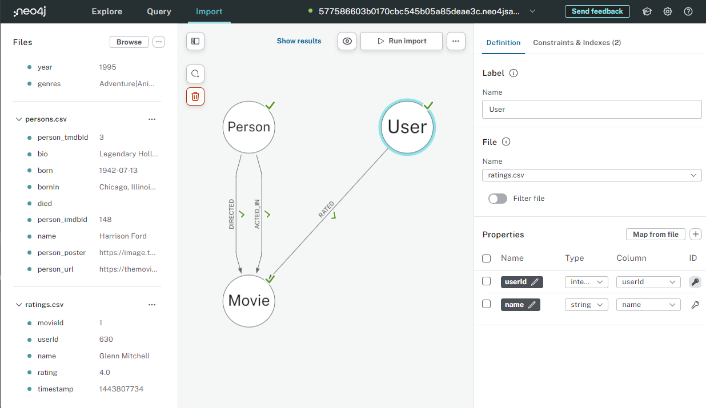

= Introduction to Data Importer
:type: lesson
:order: 2

[.slide.discrete]
== Lesson Overview

In the previous lesson, you learned about different import options available in Neo4j. The Data Importer is the most accessible tool for beginners because it provides a visual interface that requires no coding.


In this lesson, you will learn how to use the Data Importer tool to import CSV files into your graph database.


[.slide]
== Understanding Data Importer

The *Data Importer* is a visual tool built into Neo4j Aura that lets you import CSV files into your graph database without writing code.


It provides a graphical interface that:


* Accepts CSV files as input
* Lets you design your graph model visually
* Maps CSV columns to properties
* Generates and runs the import automatically


[.slide.discrete]
=== Accessing the Tool

To access Data Importer in Aura:


//```mermaid
//flowchart TD
//    A((Aura Console)) --> B((Select Your Instance))
//    B --> C((Click Open))
//    C --> D((Choose Data Importer))
//```


1. Go to your Aura console
2. Click on your instance
3. Click *Open*
4. Select *Import* or *Data Importer*


//TODO: Add image from importing-fundamentals showing Aura console with Data Importer option


[.slide]
== Exploring the Interface

The Data Importer interface has several key areas:




[.slide.discrete]
=== 1. Files Panel (Left)

* Upload CSV files
* View uploaded files
* See file previews
* Manage data sources


[.slide.discrete]
=== 2. Canvas Area (Center)

* Visual graph model
* Drag nodes to position
* Create relationships
* See the big picture


[.slide.discrete]
=== 3. Details Panel (Right)

* Configure node properties
* Map CSV columns
* Set constraints
* Define indexes


[.slide.discrete]
=== 4. Action Buttons (Top)

* Save model
* Load model
* Clear model
* Run import


[.slide]
== Following the Import Workflow

Here's the typical workflow in Data Importer:


//```mermaid
//flowchart TD
//    A((Upload CSV File)) --> B((Create Node in Canvas))
//    B --> C((Set Node Label))
//    C --> D((Map Properties from CSV))
//    D --> E((Set ID Property))
//    E --> F{More Nodes?}
//    F -->|Yes| A
//    F -->|No| G((Create Relationships))
//    G --> H((Map Relationship Properties))
//    H --> I{More Relationships?}
//    I -->|Yes| G
//    I -->|No| J((Add Constraints & Indexes))
//    J --> K((Run Import))
//```


Let's walk through each step.


[.slide.discrete]
=== Step 1: Upload CSV Files

Click *Add Data Source* or drag-and-drop CSV files.


//```mermaid
//flowchart LR
//    A((CSV File)) -->|Drag & Drop| B((Data Importer))
//    C((CSV File)) -->|Browse & Upload| B
//```


The tool will:


* Parse the CSV
* Show column headers
* Display sample data
* Infer data types


[.slide.discrete]
=== Step 2: Create Nodes

Add nodes to the canvas for each entity type.


//```mermaid
//graph LR
//    A((Add Node Button)) --> B((Node Appears on Canvas))
//    B --> C((Give it a Label))
//```


For Northwind, you will create:


* Customer node
* Order node
* Product node
* Category node
* Supplier node
* Employee node


[.slide.discrete]
=== Step 3: Map Properties

Select a node and map CSV columns to properties.


//```mermaid
//flowchart TD
//    A((Select Node)) --> B((Choose CSV File))
//    B --> C((Map Columns to Properties))
//
//    C --> D(("customerId -> customerId"))
//    C --> E(("companyName -> companyName"))
//    C --> F(("city -> city"))
//```


You can:


* Select which columns to import
* Rename properties
* Set data types
* Mark required fields


[.slide.discrete]
=== Step 4: Set ID Property

Every node needs a unique identifier.


//```mermaid
//graph LR
//    A((Node)) -->|Must Have| B((ID Property))
//    B -->|Used For| C((Uniqueness Constraint))
//    B -->|Used For| D((Relationship Matching))
//```


For Northwind:


* Customer → `customerId`
* Order → `orderId`
* Product → `productId`
* Category → `categoryId`
* Supplier → `supplierId`
* Employee → `employeeId`


[.slide.discrete]
=== Step 5: Create Relationships

Draw relationships between nodes.


//```mermaid
//graph LR
//    A((Click Node Edge)) -->|Drag| B((Target Node))
//    C((Relationship Created)) --> D((Name the Type))
//    D --> E((Map Properties))
//```


For each relationship:


* Set the type (PLACED, ORDERS, etc.)
* Choose source CSV file
* Map ID columns for matching
* Map relationship properties if any


[.slide.discrete]
=== Step 6: Add Constraints and Indexes

Before importing, set up constraints and indexes.


*Constraints* - Ensure data integrity


//```mermaid
//graph LR
//    A((Constraint)) --> B((Unique IDs))
//    A --> C((Required Properties))
//```


*Indexes* - Improve query performance


//```mermaid
//graph LR
//    D((Index)) --> E((Fast Lookups))
//    D --> F((Efficient Queries))
//```


[.slide.discrete]
=== Step 7: Run Import

Click *Run Import* to:


//```mermaid
//flowchart TD
//    A((Run Import)) --> B((Connect to Database))
//    B --> C((Generate Cypher))
//    C --> D((Execute Import))
//    D --> E((Show Results))
//```


1. Connect to your database
2. Generate Cypher statements
3. Execute the import
4. Display import summary


The tool shows:


* Nodes created
* Relationships created
* Time taken
* Any errors


[.slide]
== Applying Best Practices

Follow these best practices when importing data:


//```mermaid
//graph TB
//    A((Best Practices)) --> B((Start with Nodes))
//    A --> C((Set IDs First))
//    A --> D((Test with Small Files))
//    A --> E((Add Constraints Early))
//    A --> F((Verify Results))
//```


* *Import nodes before relationships* - Relationships need nodes to exist
* *Set ID properties correctly* - These are crucial for matching
* *Test with subset of data first* - Debug issues with small files
* *Add constraints before importing* - Prevents duplicate data
* *Verify after each step* - Query database to confirm data loaded


[.slide.discrete]
=== Saving Your Model

You can save the model definition as a JSON file.


//```mermaid
//flowchart LR
//    A((Design Model)) --> B((Click Save))
//    B --> C((Download JSON))
//    C --> D((Reuse Later))
//```


This is useful for:


* Documenting your model
* Sharing with team members
* Reusing for similar imports
* Version control


[.summary]
== Summary

Data Importer is a visual tool built into Neo4j Aura that allows you to import CSV files without writing code.


Key components of the Data Importer interface:


* **Files Panel** - Upload and manage CSV files
* **Canvas Area** - Design your graph model visually
* **Details Panel** - Configure properties and map CSV columns
* **Action Buttons** - Save, load, and run imports


The typical import workflow follows these steps:


1. Upload CSV files
2. Create nodes and assign labels
3. Map CSV columns to properties
4. Set ID properties for uniqueness
5. Create relationships between nodes
6. Add constraints and indexes
7. Run the import


Best practices include importing nodes before relationships, setting ID properties correctly, testing with small files first, and verifying results after each step.


In the next lesson, you will import all the Northwind nodes using the Data Importer tool.

read::Mark as completed[]
