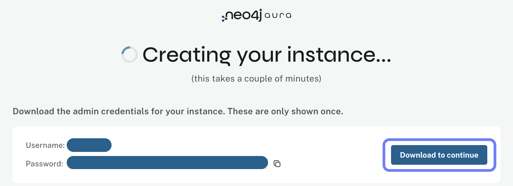

= Create Your Aura Instance
:type: lesson
:order: 2

[.slide.discrete]
== Create an Aura Free Instance

You learned what Neo4j Aura is and why it's ideal for this workshop.
Now, you need a running Aura instance to host your Northwind data.

In this lesson, you will create a Neo4j Aura Free database instance and save your connection credentials.

[.slide.discrete]
== Sign Up for Aura

Go to link:https://neo4j.com/cloud/aura/[neo4j.com/cloud/aura^] and click **Start Free**.

You can sign up using:

* Email address
* Google account
* GitHub account

[.slide.discrete]
== Create a New Instance

Once logged in to the Aura Console:

1. Click **New Instance** or **Create Instance**
2. Select **AuraDB Free**
3. The instance will be created automatically with default settings

image::images/4-free-instance-sign-up.png[Selecting tier,width=450,align=center]

[NOTE]
.Instance Region
====
Free instances are created in a default region close to your location.
For paid tiers, you can select the specific region.
====

[.slide.discrete]
== Save Your Credentials

**IMPORTANT:** When your instance is created, you will see a dialog with your connection details:

* **Username**: `neo4j` (default)
* **Password**: A randomly generated password
* **Connection URI**: `neo4j+s://<instance-id>.databases.neo4j.io`

**Download the credentials file** or copy the password immediately.
You cannot retrieve the auto-generated password later!

[WARNING]
.Save Your Credentials Now
====
If you lose your credentials, you will need to reset your password or create a new instance.
====

[.slide.discrete]
== Instance Details

Your connection details will look like this:

[source]
----
NEO4J_URI=neo4j+s://xxxxx.databases.neo4j.io
NEO4J_USERNAME=neo4j
NEO4J_PASSWORD=your-generated-password
NEO4J_DATABASE=neo4j
----

[.slide.discrete]
== Wait for Instance to Start

After saving credentials, your instance will show:

* **Status**: Creating → Running
* **Size**: Free (fixed size)
* **Region**: Auto-assigned

The instance typically takes 1-2 minutes to start.
When the status shows **Running**, your database is ready!

[.slide.discrete]
== Verify Your Instance

Once running, you will see your instance in the console with:

* Instance name (e.g., "Instance01")
* Status indicator (green dot for running)
* Connection URI
* Options to Open, Manage, or Delete

image::images/4-free-ready.png[instance ready,width=600,align=center]

[.summary]
== Summary

In this lesson, you created a Neo4j Aura Free database instance and saved your connection credentials.

Key steps you completed:

* Signed up for Neo4j Aura
* Created a free database instance
* Saved your connection credentials
* Verified your instance is running

In the next lesson, you will explore the key tools in Neo4j Aura that you will use throughout this workshop.
