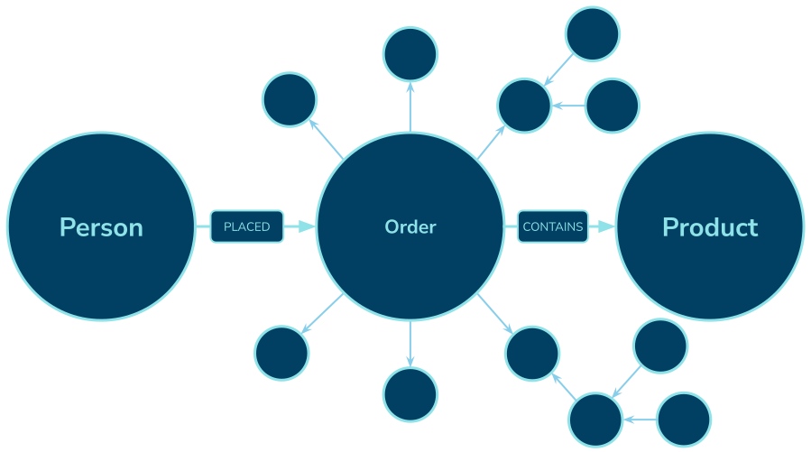
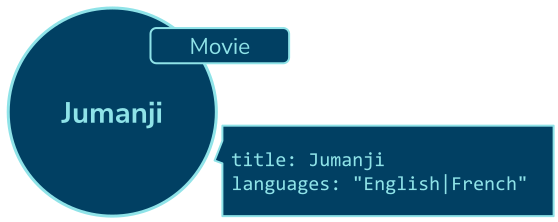

= How to Model Data
:order: 1
:type: lesson

[.slide]
== Graph Data Modelling

There is no data model within Neo4j until you create data within the database.

Neo4j is schema-optional - you create the data model as you create the data.

[.slide]
== The Golden Rule

The golden rule of graph data modeling is to model your data as a graph of nouns and verbs:

->(Noun)"]

[.slide.discrete]
== Noun VERB Noun

The nouns become nodes and the verbs become relationships:

->(Product)"]

[.slide.discrete]
== Expanding Relationships

You can expand a relationship to include more detail:

->(Order)"]

[.slide.discrete]
== Describe the Data

The `(Noun)-[:VERB]->(Noun)` pattern allows you to describe your data in a way that is easy to understand.

->(Order) (Order)-[*]-()", width=65%]

[.slide]
== Properties

Nodes & relationships with the same label or type can have different properties.

[.slide]
== Labels

Node labels serve as an anchor point for a query. 

[.transcript-only]
====
By specifying a label, you are specifying a subset of one or more nodes with which to start a query.
====

[.slide.discrete]
== Multiple Labels

You can segment your graph by using multiple labels on nodes:

[.transcript-only]
====
Labels allow you to target specific sub-sections of your graph.
====

[.slide]
== Node | Property

Depending on your use case, you may want to deduplicate properties into Nodes:

[.slide.discrete]
== Node | Property

This model offers greater flexibility and improved query performance but at the cost of semantic complexity.

[.transcript-only]

[.slide]
== Relationships

Relationships are fast to traverse and efficient.
Specialized relationship allow you to traverse the graph quickly.

[.slide.discrete]
== Relationships

Actors rated by a user:

[.next.discrete]
== Continue

read::Continue[]

[.summary]
== Summary

In this lesson, you explored graph data modeling concepts.
