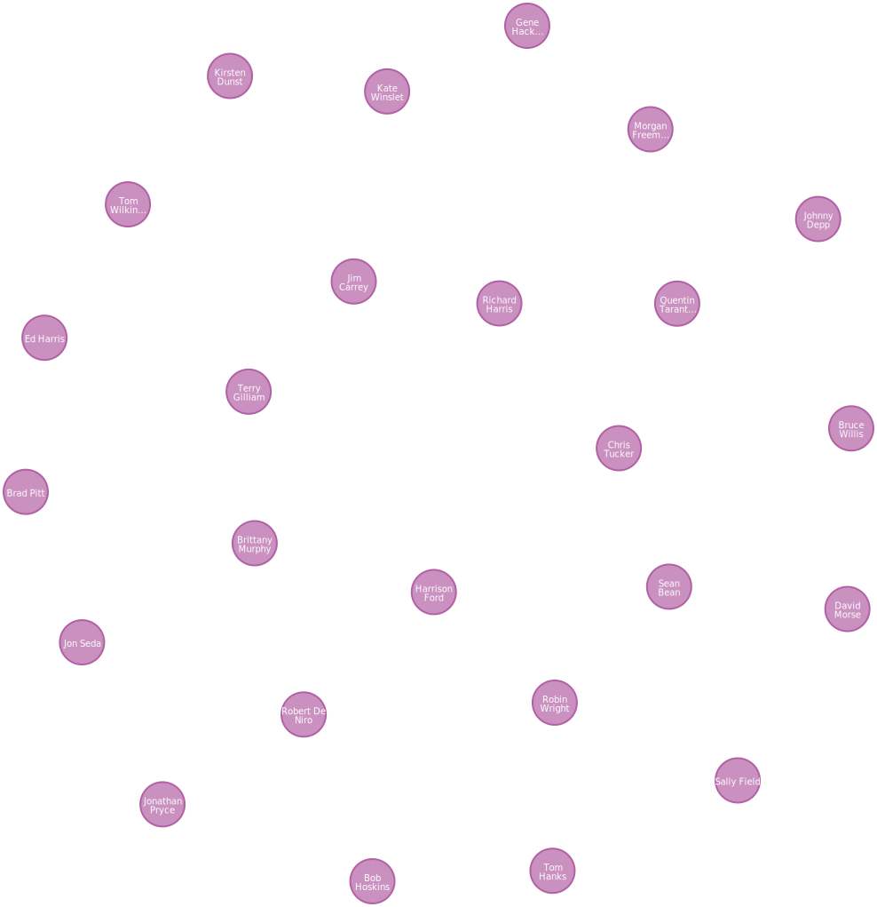

= Importing Northwind Nodes
:type: lesson
:order: 3

[.slide.discrete]
== Lesson Overview

You learned about the Data Importer tool and its interface. To build the Northwind graph, you need to start by importing the entity data as nodes.

In this lesson, you will import all the Northwind nodes: Customers, Products, Categories, Suppliers, Orders, and Employees.

[.slide]
== Download the CSV Files

Download the Northwind CSV files:

* link:https://data.neo4j.com/northwind/customers.csv[customers.csv^]
* link:https://data.neo4j.com/northwind/products.csv[products.csv^]
* link:https://data.neo4j.com/northwind/categories.csv[categories.csv^]
* link:https://data.neo4j.com/northwind/suppliers.csv[suppliers.csv^]
* link:https://data.neo4j.com/northwind/orders.csv[orders.csv^]
* link:https://data.neo4j.com/northwind/employees.csv[employees.csv^]

Save these files to your local machine.

[.slide.col-2.reverse]
== Open Data Importer

[.col]
====
image::images/01_data_importer_source.jpg[Data Importer,width=450,align=center]
====

[.col]
====
To start importing data, open the Data Importer in your Aura instance:

1. Go to your Aura console
2. Click on your instance
3. Click *Open*
4. Choose *Data Importer* from the tools
====

[.slide]
== Upload Customer CSV

Click *Add Data Source* and upload `customers.csv`.

The Data Importer will show a preview of the data with columns like:

* customerID
* companyName
* contactName
* city
* country

[.slide]
== Create Customer Node

Create the first node for customers:

1. Click *Add Node* in the canvas
2. In the details panel, set the label to `Customer`
3. Click *Map from file* and select `customers.csv`
4. The tool will suggest property mappings

image::images/add-node.png[Adding node,width=450,align=center]

image::images/map-from-file.png[Map from file,width=450,align=center]

image::images/mapped-properties.png[Mapped properties,width=450,align=center]

[.slide.discrete]
=== Set Customer Properties

Map these CSV columns to properties:

[options="header"]
|===
| CSV Column | Property Name | Type
| customerID | customerId | String
| companyName | companyName | String
| contactName | contactName | String
| contactTitle | contactTitle | String
| address | address | String
| city | city | String
| region | region | String
| postalCode | postalCode | String
| country | country | String
| phone | phone | String
| fax | fax | String
|===

[.slide.col-2.reverse]
== Set ID Property

[.col]
====
image::images/set-id.png[Set ID property,width=450,align=center]
====

[.col]
====
Click the key icon next to `customerId` to mark it as the ID property.

This creates a uniqueness constraint to ensure each customer has a unique ID.
====

[.slide]
== Create Product Node

Repeat the process for Products:

1. Click *Add Node*
2. Set label to `Product`
3. Upload and map `products.csv`
4. Map the properties:

[options="header"]
|===
| CSV Column | Property | Type
| productID | productId | Integer
| productName | productName | String
| quantityPerUnit | quantityPerUnit | String
| unitPrice | unitPrice | Float
| unitsInStock | unitsInStock | Integer
| unitsOnOrder | unitsOnOrder | Integer
| reorderLevel | reorderLevel | Integer
| discontinued | discontinued | Boolean
|===

5. Mark `productId` as ID property

[.slide]
== Create Category Node

Follow the same process for Categories:

1. Click *Add Node*
2. Set label to `Category`
3. Upload and map `categories.csv`
4. Map the properties:

[options="header"]
|===
| CSV Column | Property | Type
| categoryID | categoryId | Integer
| categoryName | categoryName | String
| description | description | String
|===

Mark `categoryId` as ID property.

[.slide]
== Create Supplier Node

Follow the same process for Suppliers:

1. Click *Add Node*
2. Set label to `Supplier`
3. Upload and map `suppliers.csv`
4. Map the properties:

[options="header"]
|===
| CSV Column | Property | Type
| supplierID | supplierId | Integer
| companyName | companyName | String
| contactName | contactName | String
| contactTitle | contactTitle | String
| address | address | String
| city | city | String
| region | region | String
| postalCode | postalCode | String
| country | country | String
| phone | phone | String
| fax | fax | String
| homePage | homePage | String
|===

Mark `supplierId` as ID property.

[.slide]
== Create Order Node

Follow the same process for Orders:

1. Click *Add Node*
2. Set label to `Order`
3. Upload and map `orders.csv`
4. Map the properties:

[options="header"]
|===
| CSV Column | Property | Type
| orderID | orderId | Integer
| orderDate | orderDate | Date
| requiredDate | requiredDate | Date
| shippedDate | shippedDate | Date
| freight | freight | Float
| shipName | shipName | String
| shipAddress | shipAddress | String
| shipCity | shipCity | String
| shipRegion | shipRegion | String
| shipPostalCode | shipPostalCode | String
| shipCountry | shipCountry | String
|===

Mark `orderId` as ID property.

[.slide]
== Create Employee Node

Follow the same process for Employees:

1. Click *Add Node*
2. Set label to `Employee`
3. Upload and map `employees.csv`
4. Map the properties:

[options="header"]
|===
| CSV Column | Property | Type
| employeeID | employeeId | Integer
| lastName | lastName | String
| firstName | firstName | String
| title | title | String
| titleOfCourtesy | titleOfCourtesy | String
| birthDate | birthDate | Date
| hireDate | hireDate | Date
| address | address | String
| city | city | String
| region | region | String
| postalCode | postalCode | String
| country | country | String
| homePhone | homePhone | String
| extension | extension | String
| notes | notes | String
|===

Mark `employeeId` as ID property.

[.slide.col-2.reverse]
== Review Your Canvas

[.col]
====

====

[.col]
====
All nodes should be displayed on the canvas, each connected to their CSV file, with properties mapped and ID properties set:

* Customer
* Product
* Category
* Supplier
* Order
* Employee
====

[.summary]
== Summary

In this lesson, you imported all the Northwind nodes using the Data Importer:

* **Customer** - Contains customer information with `customerId` as the ID property
* **Product** - Contains product details with `productId` as the ID property
* **Category** - Contains product categories with `categoryId` as the ID property
* **Supplier** - Contains supplier information with `supplierId` as the ID property
* **Order** - Contains order details with `orderId` as the ID property
* **Employee** - Contains employee information with `employeeId` as the ID property

In the next lesson, you will create relationships between these nodes.

read::Mark as completed[]
