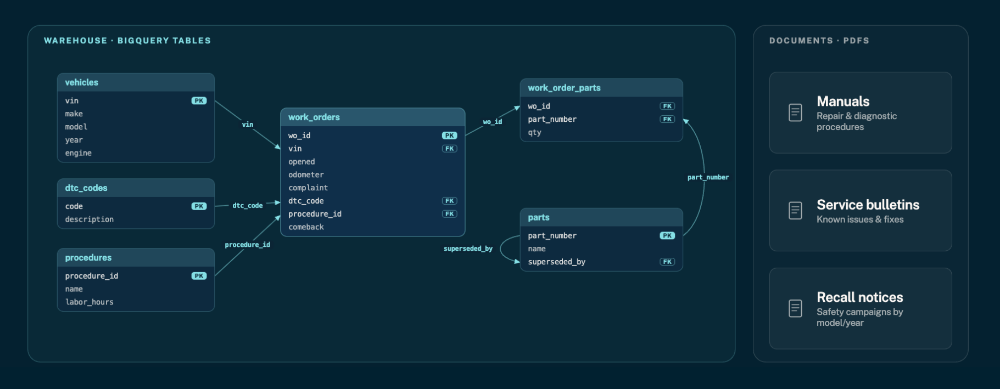
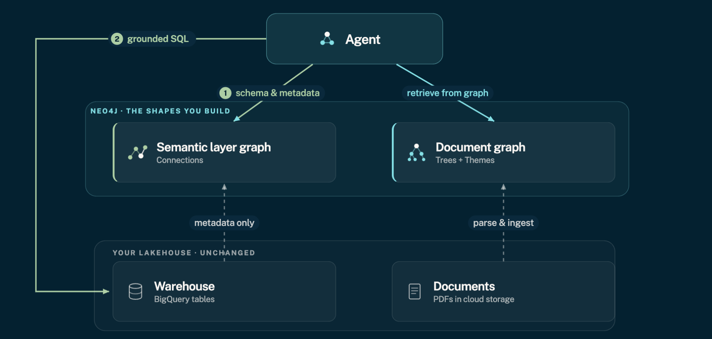

= Workshop Overview
:type: lesson
:order: 1
:duration: 6

[.slide.discrete]
== Introduction

Your agent can reach your data but still cannot use it reliably.
In this workshop, you will fix that by building three reusable graph shapes from lakehouse data - so your agent can answer the questions that actually run the shop.

[.slide]
== The scenario - AutoFix Group

AutoFix Group is a national auto-repair chain running on a cloud lakehouse:

* **Repair manuals, service bulletins, and recall notices** live as PDFs in cloud storage
* **Every repair, part, and vehicle** lives in BigQuery tables (`vehicles`, `work_orders`, `work_order_parts`, `parts`, `procedures`, `dtc_codes`)

Dani Reyes, a master technician, has a 2020 Falcon in the bay throwing misfire code `P0301`.
There was a bulletin about a revised ignition coil - but which model years?
On a single lookup like this, the modern stack does fine: the manual portal finds the bulletin, and the shop system knows the part that fixed it before. The agent can already reach both halves.

The gap shows up one level up - on the questions that actually run the shop.

[.slide]
== Three questions that break the stack

Morgan Tao, VP of Service Ops, wants a copilot any technician can trust - not just for one car, but for the whole estate. Sam Okafor, the AI engineer, builds the obvious solution and hits three questions where it _looks_ like it answered, but didn't. To be clear up front: this is not about any one vendor being worse - the document and table tools did their jobs. What is missing is the _shape_.

. **Connection - "how do these records relate?"** Point Text2SQL at a big, look-alike warehouse schema and it picks the wrong table, loops, runs up token cost, and on cheaper models often just gives up. It guesses how things join instead of following the structure - and every large warehouse, from supply chain to finance to life sciences, has this shape.
. **Absence - "what is missing or unused?"** Similarity search only reaches what _resembles_ your query - it searches, it never navigates. So anything you would reach by following the structure of the documents, including what simply is not there, is out of reach: it cannot prove a negative. Sam had recurring fault codes with _zero_ documentation, and the agent reported them as documented, just buried. It is the same wall a legal team hits asking which contracts are missing a required clause, or a quality team asking which procedures were never written.
. **Coverage - "what patterns run across all our documents?"** Top-k retrieval hands back the nearest handful and silently skips the rest. Sam put 112 bulletins and recalls in; it returned about seven patterns and even flagged its own coverage gaps. It samples when the question needs the whole set - the same whether you are clustering every incident report, supplier audit, or clinical-batch record in an estate.

Each failure is a _different_ missing shape.
The problem is not a bad model or a bad query - it is a lack of *context*.

[.slide]
== Context comes in shapes

The fix is to give the agent the shapes its answers need:

* **Connections (Paths)** - how the warehouse tables join, in Module 2 - neocarta reads the foreign keys, so the agent follows the joins instead of guessing: the **Connection** question
* **Table of Contents (Trees & Links)** - navigate the documents, in Module 3 - follow structure and tell "not there" from "not retrieved": the **Absence** question
* **Themes (Communities)** - surface patterns nobody named, in Module 4 - cover and cluster the whole library instead of sampling: the **Coverage** question

And you learn a second axis: _where_ each shape should live. The connections graph is a *semantic layer* - only the warehouse's metadata (table names and foreign keys), not its rows - so the rows stay in BigQuery while the documents become graphs in Neo4j. The agent crosses between them on the keys they already share - part numbers and trouble codes.

[.slide]
== The goal

By the end of this workshop, your agent answers the questions that run the shop. You start on Dani's car - _"what fixed this code on cars like this one?"_ - where one shape is not enough: the agent grounds the symptom in the documents (Neo4j) and reads the real repair history from the warehouse (BigQuery), combining the two into one evidence-backed answer.

Then you zoom out to the estate, where the shapes truly separate from the stack:

. **Absence** - what is failing in the field but has _no_ documentation: the negative a similarity search cannot prove
. **Coverage** - the patterns across _all_ the bulletins and recalls, clustered, not sampled
. **Connection** - how a fix traces from the documents through to the records of what actually happened

You build the tools that answer them as a *service-advisor skill*, shape by shape, and leave with the code to point at your own lakehouse.

[.slide]
== Prerequisites and duration

You should be able to read and run basic Cypher queries.
No Graph Data Science experience is required - you will learn what you need in Module 4.

Bring the coding agent you already use - Claude Code, Cursor, Codex, or similar.
In each hands-on module, you and your agent build the skill's tools together, and every query is also runnable by hand in the sandbox if you prefer.

The core path takes 90 minutes, with around 20 more minutes of optional practice - ideal for revisiting after a live session.

The patterns are portable - the warehouse here is BigQuery, and Module 7 shows how to swap the connector for Snowflake, Databricks, or anywhere your data lives.

read::Let's go![]

[.summary]
== Summary

In this workshop, you will:

* Build **navigation tools** over a document tree parsed from real PDFs
* Build **theme tools** with community detection - patterns nobody named
* Build the **connections** shape so the agent follows the warehouse joins instead of guessing them
* Watch your agent answer the **estate-level questions** a modern stack gets wrong - covering the whole library, proving what is undocumented, and connecting documents to the records of what actually happened

In the next lesson, you will open your workshop environment and load the AutoFix lakehouse.
