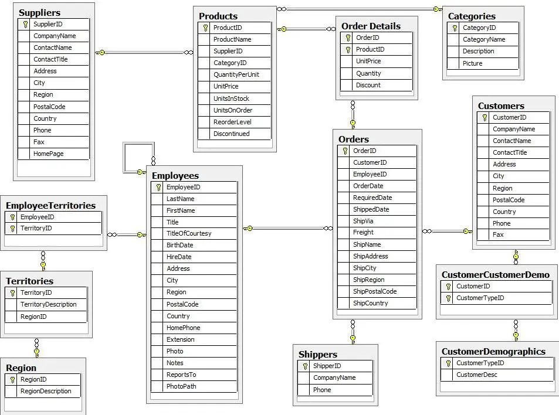
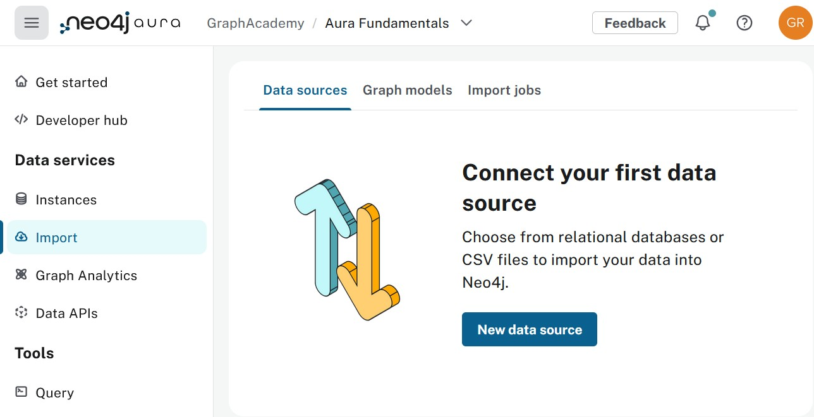

= Workshop Overview
:type: lesson
:order: 1
:duration: 5

[.slide.discrete]
== Introduction

In this workshop, you will build a **product recommendation system** by transforming relational data into a graph database. These systems need to find patterns in connected data—customers, orders, and products—and answer questions about relationships between them.

By the end of this workshop, you will build a **product recommendation system** that answers this question:

> "What products do people like me buy, that I haven't bought yet?"

[.slide.col-2]
== Your workshop goal

[.col]
====

You will import data from the **Northwind dataset**—a fictitious food products company with customers, orders, products, suppliers, and employees.

* 91 customers
* 830 orders
* 77 products across 8 categories
* 29 suppliers
* 9 employees
====

[.col]
====

====

[.slide.discrete]
== Understanding the recommendation challenge

To answer this question, you need to:

1. Find what products I've purchased
2. Find customers with similar purchases ("people like me")
3. Find what products they bought
4. Exclude products I already own
5. Rank by popularity among similar customers

This is **collaborative filtering**—the algorithm behind recommendation systems provided by the world's largest companies.

These questions are about **relationships and connections**, not just individual records.

[.slide.col-2]
== The relational database approach

In SQL, the recommendation query requires **38 lines of code** with 7 JOINs and 3 Common Table Expressions:

[.col]
====
[source,sql]
.Product recommendations in SQL (simplified)
----
-- Find my products
WITH my_products AS (
  SELECT DISTINCT od.productID
  FROM customers c
  JOIN orders o ON c.customerID = o.customerID
  JOIN order_details od ON o.orderID = od.orderID
  WHERE c.customerID = 'ALFKI'
),
-- Find similar customers
similar_customers AS (
  SELECT DISTINCT c2.customerID
  FROM customers c2
  JOIN orders o2 ON c2.customerID = o2.customerID
  JOIN order_details od2 ON o2.orderID = od2.orderID
  WHERE od2.productID IN (SELECT productID FROM my_products)
    AND c2.customerID <> 'ALFKI'
),
-- Find recommendations
recommendations AS (
  SELECT od3.productID, COUNT(DISTINCT sc.customerID) as recommendedBy
  FROM similar_customers sc
  JOIN orders o3 ON sc.customerID = o3.customerID
  JOIN order_details od3 ON o3.orderID = od3.orderID
  WHERE od3.productID NOT IN (SELECT productID FROM my_products)
  GROUP BY od3.productID
)
SELECT p.name, p.unitPrice, p.unitsInStock, r.recommendedBy
FROM recommendations r
JOIN products p ON r.productID = p.productID
WHERE p.unitsInStock > 0
ORDER BY r.recommendedBy DESC, p.unitPrice
LIMIT 10;
----
====

[.col]
====
**The problems:**

* 38 lines of complex SQL
* 7 JOIN operations across 4 tables
* Multiple subqueries and CTEs
* Performance degrades as data grows—each join adds index scans and materialized result sets, so cost scales with table sizes
* Hard to write, read, and maintain
====

[.slide.col-2]
== Why graph databases?

Graph databases store relationships as first-class citizens, making connected data queries natural and fast.

[.col]
====
**The recommendation query in Cypher (10 lines):**

[source,cypher]
.Product recommendations
----
MATCH (me:Customer {id: 'ALFKI'})-[:PLACED]->(:Order)-[:CONTAINS]->(myProduct:Product)
MATCH (myProduct)<-[:CONTAINS]-(:Order)<-[:PLACED]-(other:Customer)
WHERE other <> me
MATCH (other)-[:PLACED]->(:Order)-[:CONTAINS]->(rec:Product)
WHERE NOT (me)-[:PLACED]->(:Order)-[:CONTAINS]->(rec)
  AND rec.unitsInStock > 0
RETURN rec.name, rec.unitPrice,
       count(DISTINCT other) AS recommendedBy
ORDER BY recommendedBy DESC
LIMIT 10
----
====

[.col]
====
**The advantages:**

* **10 lines** vs 38 lines SQL
* **No JOINs**—relationships are pre-materialized pointers; the engine follows them in memory
* **Cost scales with connections traversed**—not with total table size; graph databases store adjacency directly
* **Index lookup** finds the anchor node (one fast index use), then the query follows pointers instead of doing repeated index scans and join materialization
* **Readable**—reads like the problem statement
* **Maintainable**—easy to modify and extend

You'll learn why this performance difference exists and how to leverage it.
====

[.slide]
== What you'll build

By the end of this workshop, you will have:

* **Complete graph model** - Products, Customers, Orders, and Categories as nodes and relationships
* **Collaborative filtering algorithm** - Find "people like me" based on purchase patterns
* **Recommendation query** - 10 lines of Cypher compared to 38 lines of SQL
* **Performance understanding** - How anchor nodes and traversal make queries fast
* **Hands-on experience** - Import data, write queries, and understand graph database concepts

Each module builds toward the recommendation query.

[.slide]
=== Module 1: Building Your Graph

* Graph fundamentals - nodes, relationships, properties, labels
* How graph queries work - anchor nodes and traversal
* Performance model - Index lookup for the starting node, then pointer chasing along relationships (no repeated index scans or join materialization)
* Identifying nodes vs properties
* Import tool overview and ecosystem
* Import nodes - Products, Customers, Orders

[.slide]
=== Module 2: Modeling Relationships

* Understanding relationships - type, direction, properties
* When to use direct relationships vs intermediate nodes
* Discussion: Customer→Product vs Customer→Order→Product
* Relationship property performance considerations
* Import relationships - Customer `PLACED` Order

[.slide]
=== Module 3: Many-to-Many Relationships

* Transform join tables into relationships
* Import Product `IN_CATEGORY` Category relationships
* Import Order `CONTAINS` Product relationships
* Multi-hop traversals for recommendations

[.slide]
=== Module 4: Completing the Model

* Import Category nodes and create `IN_CATEGORY` relationships
* Import Supplier nodes and create `SUPPLIES` relationships
* Import Employee nodes with `REPORTS_TO` and `SOLD` relationships
* Query hierarchical data with variable-length paths
* Complete Northwind graph model

[.slide]
=== Module 5: Building Recommendations and Review

* Step-by-step query building - collaborative filtering
* Find products I bought
* Find similar customers (people like me)
* Find their products (that I don't have)
* Rank by popularity
* SQL vs Cypher comparison
* Knowledge check quiz

[.slide.col-2]
== Your Neo4j Instance Credentials

[.col]
====
A Neo4j sandbox instance has been created for you to use throughout this workshop. Use these credentials when connecting from the Import tool or Query tool.

[WARNING]
.Use the sandbox credentials shown here
=====
These credentials are specific to your GraphAcademy sandbox. If you also have a personal Aura account, do not use those credentials for this workshop.
=====

[.credentials]
// Browser URL:: link:https://{instance-host}/browser/[https://{instance-host}/browser/^]
// Bolt URI:: [copy]#bolt://{instance-ip}:{instance-boltPort}#
Connection URL:: [copy]#bolt+s://{instance-host}:{instance-boltPort}#
Username:: [copy]#{instance-username}#
Password:: [copy]#{instance-password}#
Database:: [copy]#{instance-database}#
====

[.col]
====
[TIP]
.Two ways to run queries
=====
**Integrated Query pane** (bottom right) - Convenient for quick queries while reading lessons. Click the link:#[Toggle Query pane,role=classroom-sandbox-toggle] button to open it.

**Aura Query tool** (full screen) - Better for complex queries and exploring results. Click the console links throughout the course to open it in a new tab with your credentials pre-filled.

Use whichever works best for the query at hand. The integrated pane can feel cramped for longer queries, so don't hesitate to switch to the full Query tool.
=====
====

[.slide.col-2]
== Importing tabular data into Neo4j

[.col]
====
The **Import** tool is a visual tool for importing tabular data into Neo4j.

**What you can do:**

* Upload data files
* Design your graph data model visually
* Map table columns to nodes and relationships
* Set up constraints and indexes
* Run the import with one click

console::Open Import Tool[tool=import,connect-url={connect-url}]

[NOTE]
.Using the Import tool
You will use the Import tool extensively in the next module when you design and import your own data model.
====

[.col]
====

====

[.slide]
== Querying your graph database

The **Query** tool (also referred to as Neo4j Browser) lets you:

* Write and execute Cypher queries
* Generate queries using AI assistance
* Visualize query results as graphs or tables
* Explore your data interactively
* Save and share queries

You will use the Import tool to design your graph data model and the Query tool to query your graph database.

console::Open Query Tool[tool=query,connect-url={connect-url}]

read::Mark as completed[]

[.summary]
== Summary

In this lesson, you learned about the workshop goal:

* **Goal** - Build a recommendation system: "What products do people like me buy?"
* **The challenge** - SQL requires 38 lines with 7 JOINs and complex subqueries
* **The solution** - Cypher does it in 10 lines with direct relationship traversals
* **Performance** - Graph traversal follows pointers in memory; deep traversals are more predictable and often much faster than equivalent multi-join SQL, especially as relationship depth increases
* **What you'll build** - Complete graph with Products, Customers, Orders, collaborative filtering algorithm
* **Workshop structure** - 5 modules: Building Your Graph → Modeling Relationships → Many-to-Many → Completing the Model → Building Recommendations
* **Dataset** - Real Northwind data (91 customers, 830 orders, 77 products)

In the next module, you will learn graph fundamentals and import your first data.
