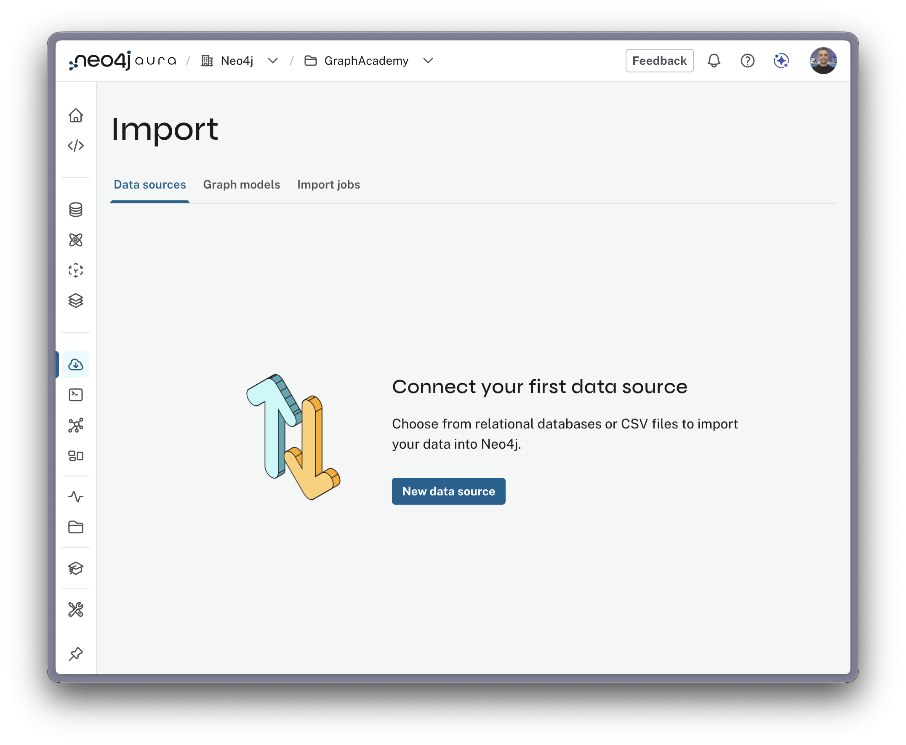
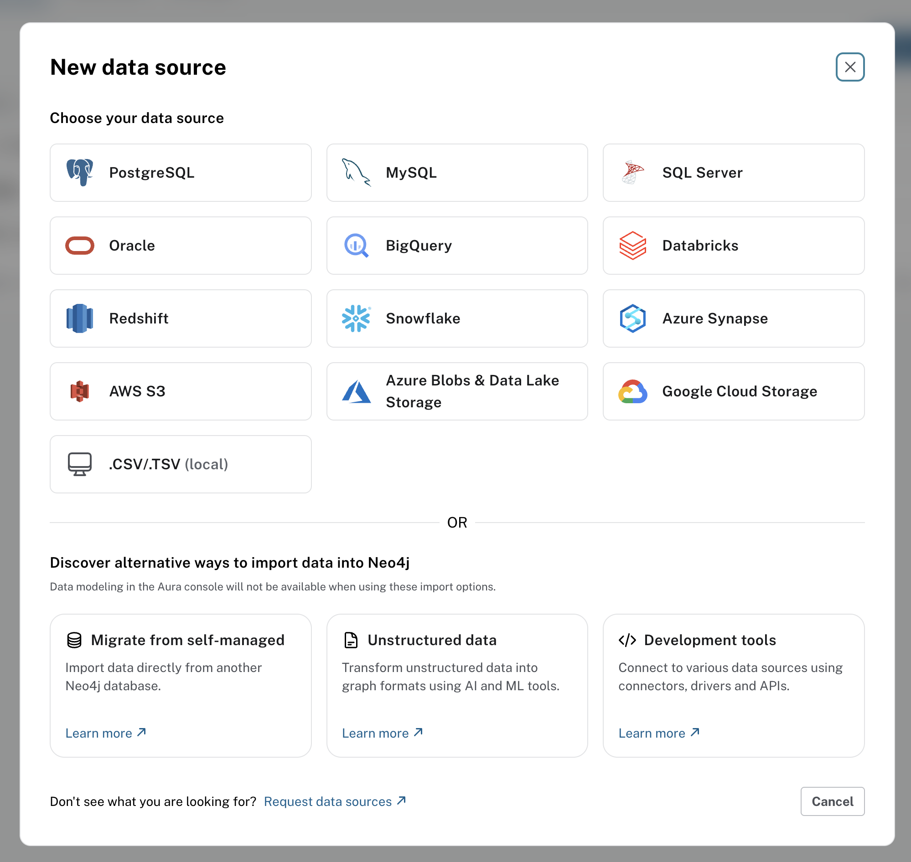
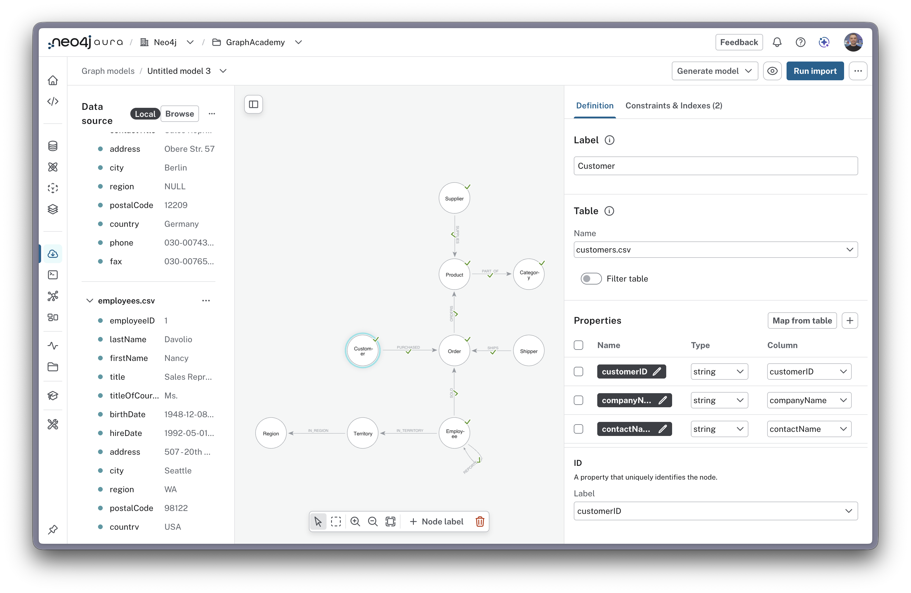
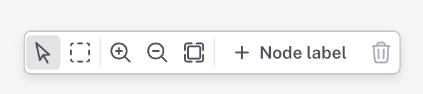

= Understanding the Import Tool
:type: lesson
:order: 4
:duration: 10

// New lesson: Overview of how the Import tool works
// Based on official Neo4j Aura Import documentation
// General guide to UI and mapping workflow for all data sources

[.slide.discrete]
== The Import Tool

You identified nodes in the Northwind dataset. The Import tool provides a visual interface for defining your data model and loading data without writing code.

In this lesson, you will learn how the Import tool is organized, the workflow for importing data, and how mapping works.

[.slide.col-2]
== Choosing the right import approach

[.transcript-only]
====
Neo4j offers several ways to import data. The right choice depends on your data source, volume, and requirements.
====

[.col]
====
[source,mermaid,role="noheader"]
----
flowchart TD
    Start["What are you importing?"] --> Source{Data Source?}

    Source -->|Tabular Files CSV, TSV| Volume1{Data Volume?}
    Source -->|Relational DB PostgreSQL, MySQL| DBChoice{Volume & Complexity?}
    Source -->|APIs/Real-time| Custom[Custom Application Neo4j Drivers]
    Source -->|Multiple Sources| ETL[ETL Tool Apache Hop]

    Volume1 -->|"< 1M rows"| Import["Import tool ⭐"]
    Volume1 -->|"1M - 10M rows"| LoadCSV[LOAD CSV in Cypher]
    Volume1 -->|"> 10M rows"| Admin[neo4j-admin import Offline bulk load]

    DBChoice -->|Few tables and simple volume/complexity| Import
    DBChoice -->|Complex queries or transformations| ETL

    Import --> Note1["✓ No-code visual interface ✓ Upload tabular files ✓ Define model visually ✓ Best for learning"]
    LoadCSV --> Note2["✓ Programmatic control ✓ Cypher transformations ✓ Batch processing"]
    Admin --> Note3["✓ Fastest for large datasets ✓ Requires database offline ✓ Pre-formatted files"]
    ETL --> Note4["✓ Multiple data sources ✓ Complex transformations ✓ Scheduled pipelines"]
    Custom --> Note5["✓ Real-time integration ✓ Complex business logic ✓ Full control"]

    style Import fill:#4CAF50,stroke:#2E7D32,color:#fff
    style Note1 fill:#E8F5E9,stroke:#4CAF50
----
====

[.col]
====
**Why we're using the Import tool in this workshop:**

* **Visual interface** - See your model as you build it
* **Tabular files** - The Northwind dataset is in tabular file format
* **Small dataset** - 91 customers, 830 orders, 77 products (< 1M rows)
* **Learning focused** - Great for understanding and building graph modeling
* **No code required** - Focus on concepts, not syntax
====

[.slide]
== Understanding the import tool

The **Import** tool in Neo4j Aura helps you load data from various sources into your graph database without writing any code.

**Supported data sources:**

* Relational databases (PostgreSQL, MySQL, SQL Server, Oracle)
* Data warehouses (BigQuery, Databricks, Snowflake)
* Cloud storage (AWS S3, Azure Blobs & Data Lake Storage, Google Cloud Storage)
* Local files (CSV)

**Key benefits:**

* **Visual** - Design your graph model with a drag-and-drop interface
* **No coding required** - Map tables and columns to graph elements without writing Cypher
* **Validated** - Preview your data before importing
* **Fast** - Optimized for bulk data loading

You'll find the Import tool in the left navigation of your Aura instance.

[.slide.col-2]
== The import tool

[.col]
====
The Import tool consists of **three main tabs** that reflect the three stages of importing.
====

[.col]
====

====

[.slide.col-3]
== Exploring the UI overview

[.col]
====
**1. Data Sources**

* Connect to databases, data warehouses, or cloud storage
* Upload local files
* View data source previews showing columns and sample data
* Manage multiple data sources for your import
====

[.col]
====
**2. Graph Models**

* Visual canvas where you design your graph model
* Create nodes and relationships
* Map tables/files to graph elements
* Configure properties and IDs
====

[.col]
====
**3. Import Jobs**

* View and manage import jobs
* Monitor import progress and results
* Review past imports and their status
====
// The workflow moves through these tabs: **Data Sources** → **Graph Models** → **Import Jobs**

// [.slide.col-3]
// == Following the import workflow

// Importing data follows three main stages:

// [.col]
// ====
// **Stage 1: Provide the Data**

// * Connect to your data source or upload files
// * Configure connection settings (for databases/warehouses)
// * Preview your tables/files to see columns and sample rows
// ====

// [.col]
// ====
// **Stage 2: Model and Map the Data**

// * Design your graph model on the canvas
// * Add nodes and set labels
// * Map tables/files to nodes
// * Select columns to become properties and set ID fields
// ====

// [.col]
// ====
// **Stage 3: Run the Import**

// * Preview the import (optional but recommended)
// * Execute the import to create nodes and relationships
// * Review the results summary
// ====

// &nbsp;

// Let's explore each stage in detail.

[.slide.col-2]
== Connecting to data sources

[.col]
====
To choose a data source, navigate to the **Data sources** tab and click **New data source**.

From there, you can choose the source of your data.
Depending on which data source you choose, you will need to configure the data source and provide the credentials to connect to the data source.

The data source you choose must be publicly accessible.

For **CSV and TSV files**, you will be prompted to upload the files.
====

[.col]
====

====

// **Viewing your data:**

// * Each data source can be expanded to show columns and sample rows
// * Use the dropdown arrow to preview contents
// * Use the `...` menu to delete or manage sources

[.slide.col-3]
== Using the graph models tab

Once you have a data source connected, switch to the **Graph Models** tab to design your model.

[.slide.col-3]
== The Canvas

The canvas has three panels:

[.col]
====
**1. Data Source Panel (left)**

* Shows your connected tables/files
* Expand to preview columns and sample data
* Drag to reorder or manage sources
====

[.col]
====
**2. Model Canvas (center)**

* Visual workspace for designing your graph
* Add nodes and relationships
* Position and organize your model
====

[.col]
====
**3. Details Panel (right)**

* Configure selected elements
* Two tabs: Definition and Constraints & Indexes
* Map tables/files to graph elements
====

[.slide.col-2]
== Creating and labeling nodes

[.col]
====
**How to create a node:**

1. Click the **+ Node Label** button (bottom center of the data model pane)
2. A node appears on the canvas
3. Type the label directly on the node, or use the **Label** field in the details panel

// **Naming conventions:**

// * Use **CamelCase** for labels: `Product`, `Category`, `OrderDetail`
// * Use **singular** form: `Product` not `Products`
// * Be descriptive and consistent

// [TIP]
// .Node requirements
// ====
To complete the mapping process, every node needs a label, a data source, at least one property, and an ID property.

The green checkmark against each node and relationship indicates that all requirements are met and the data is ready import.
// ====

====

[.col]
====

====

[.slide.col-2]
== Mapping tables to nodes

[.col]
====
To map a node to a data source:

1. Select your node on the canvas
2. In the details panel, find the **Table** dropdown under the Definition pane
3. Select the data source to map to this node
4. Choose **Map properties from table** to auto-populate properties
====

[.col]
====
video::videos/mapping-tables-to-nodes.mp4[Mapping tables to nodes,align=center,role="cdn"]
====

// **What happens:**

// * The Import tool reads the table columns
// * Each column can become a property
// * Data types are automatically detected (String, Integer, Float, Boolean, Date)
// * You can review and adjust the mappings

// **Mapping workflow:**

// This mapping process is the same regardless of whether your source is a database table or a file. The Import tool treats all sources uniformly once connected.

[.slide.col-2.reverse]
== Configuring properties

[.col]
====
video::videos/configuring-properties.mp4[Property configuration,align=center,role="cdn"]
====

[.col]
====
Once a data source is mapped, you'll see properties listed in the **Definition** pane of the details panel.

**For each property, you can:**

* **Rename** - Click the pencil icon to change the property name
* **Change type** - Select the data type from the dropdown
* **Select Column** - select the column from the data source to map to this property

[TIP,role=transcript-only]
.Available data types
=====
The Import tool auto-detects data types from a sample of your source data.  You can change the data type of a property from the dropdown.

* **String** - Text values
* **Integer** - Whole numbers
* **Float** - Decimal numbers
// * **Boolean** - true/false values
// * **Date** - Date/datetime values
=====
====

[.slide.col-2.reverse]
== Setting the ID property

[.col]
====
image::images/setting-the-id-property.png[Setting the ID property,align=center,role="no-padding"]
====

[.col]
====
The ID property uniquely identifies each node in the source data.

To set the ID property, select the column from the list.

Every node must have a unique identifier.  This ensures that each node is unique and can be identified within the source data.
====

[TIP,role=transcript-only]
.Automatic ID selection
====

The Import tool attempts to automatically select columns with "id" in the name, but you should verify this is correct for your data.
====

// **Common ID patterns:**

// * Primary keys from database tables
// * Unique identifiers like `productId`, `customerId`, `orderId`
// * Natural keys that uniquely identify entities

[.slide.col-2]
== Creating relationships

[.col]
====
To create a relationship between two existing nodes:

1. Create and map both nodes you want to connect
2. Select one of the nodes on the canvas (the from node)
3. Hover over the selected node - a grey circle with a green plus sign appears (the _halo_)
4. Drag the halo to the other node and release
5. A relationship line is drawn between the two nodes

Once the relationship is created, you can configure its properties in the details panel.
====

[.col]
====
video::videos/creating-relationships.mp4[Creating relationships,align=center,role="cdn"]
====

[TIP,role=transcript-only]
.Create a node and relationship together
====
You can also create a relationship to a new node in one step by dragging the halo to an empty space on the canvas.
====

[.slide.col-2]
== Configuring relationship properties

[.col]
====
Configure the relationship in the **Definition** pane of the details panel.

**Required relationship settings:**

* **Type** - Name the relationship type (e.g., `PURCHASED`, `IN_CATEGORY`)
* **Table** - Select the data source that contains the relationship data
* **Node ID mapping** - Specify which nodes are connected
  - **From** - Identifies the source node using a column that matches the source node's ID property
  - **To** - Identifies the target node using a column that matches the target node's ID property
* **Properties** - Use the **Map from table** to set relationship properties
====

[.col]
====
video::videos/configuring-relationship-properties.mp4[Configuring relationship properties,align=center,role="cdn"]
====

[TIP,role=transcript-only]
.Relationship direction
====
All relationships have a direction in Neo4j. If you need to reverse the direction, select the relationship and use the reverse direction button in the details panel.
====

[.slide.col-2]
== Previewing the import

[.col]
====
To check your model before importing, you can preview your data using the **Preview** icon.

1. Click the **Preview** icon
2. Choose **Preview all** or **Preview selected**
3. The preview shows a sample of your data as a graph
====

[.col]
====
video::videos/previewing-the-import.mp4[Previewing the import,align=center,role="cdn"]
====

[.slide.col-2]
== Running the import

[.col]
====
When you are ready to import your data, click the **Run Import** button.

Once completed, you'll see a results summary showing nodes created, properties set, time elapsed, and data processed.

For longer running imports, you can view the progress by navigating to **Import** and clicking the **Import Jobs** tab.
====

[.col]
====
video::videos/running-the-import.mp4[Running the import,align=center,role="cdn"]
====

[.slide]
== Viewing import results

[.col]
====
Once the import is complete, a summary of the import will be displayed.

You can expand each element in the results to see the generated Cypher. This provides insight into how the Import tool constructs statements.
====

[.slide.col-3]
== Following best practices

[.col]
====
**Before importing:**

* Review your source data for quality and completeness
* Identify unique identifiers in each data source
* Plan your node labels and property names
* Understand the graph structure you're building
====

[.col]
====
**During modeling:**

* Use descriptive, singular labels (`Product` not `products`)
* Follow naming conventions (CamelCase for labels, camelCase for properties)
* Set appropriate data types for properties
* Always verify the ID property is correct
====

[.col]
====
**After import:**

* Verify the data with Cypher queries
* Check node counts match expected values
* Review the results summary for any warnings
* Test sample queries to ensure data is correct
====

[.slide]
== Try for yourself

Now it is time to try for yourself.  Head to the next lesson to import your first nodes with step-by-step guidance.

read::Proceed to next lesson[]

[.summary]
== Summary

In this lesson, you learned how the Import tool works:

* **Three-tab structure** - Data Sources, Graph Models, and Import Jobs
* **Data source options** - Databases, data warehouses, cloud storage, and local files
* **Three-stage workflow** - Provide data → Model and map → Run import
* **Graph modeling** - Create nodes on the canvas and set labels
* **Mapping process** - Connect tables/files to nodes, regardless of source type
* **Property configuration** - Select columns, rename properties, and set data types
* **ID property** - Every node must have a unique ID property for node identification
* **Creating relationships** - Use the halo to connect existing nodes or create new nodes with relationships
* **Relationship configuration** - Set type, map data source, configure Node ID mappings (From/To), and select properties
* **Preview functionality** - Test your model with sample data before importing
* **Import execution** - Batch processing with progress tracking and results summary

In the next lesson, you will use the Import tool to import your first nodes with step-by-step guidance.
