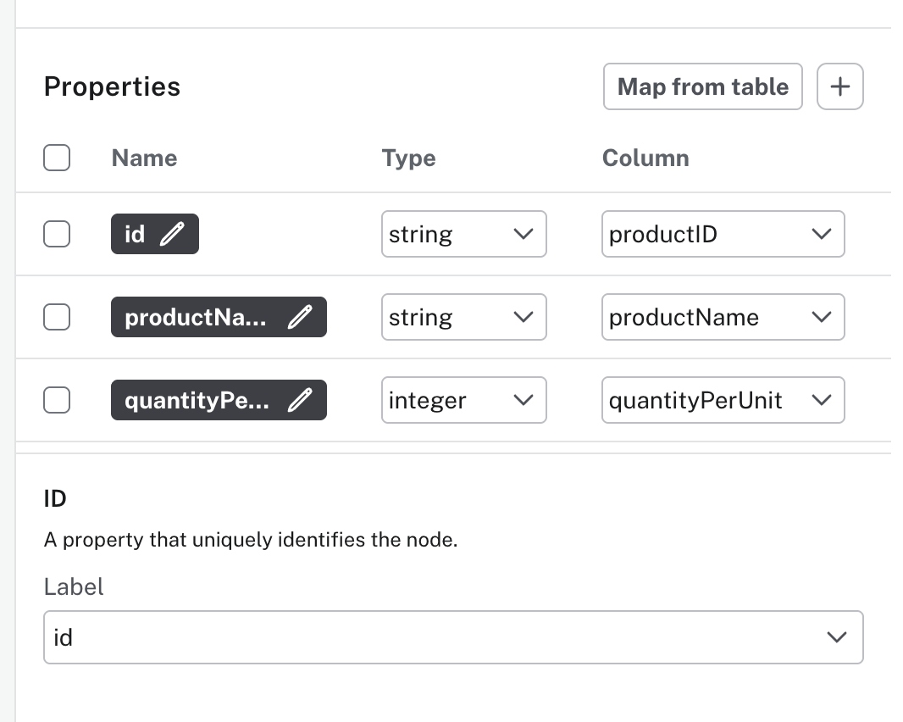
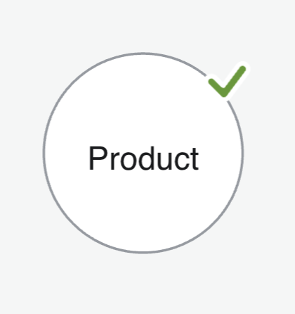

= Importing Your Data
:type: lesson
:order: 6
:duration: 20

[.slide.discrete]
== Importing Your Data

Now that you know how the Import tool works, let's load all the CSV files for this workshop upfront, then model and import nodes step by step.

[.slide]
== Download and load all files

Download the complete data package:

link:https://cdn.graphacademy.neo4j.com/courses/workshop-modeling/modules/5-final-review/lessons/1-recommendation-query/data/complete-model.zip[Download all files as a zip file^, role="btn"]

**The zip file contains 5 CSV files:**

[options="header"]
|===
| File | Rows | Description
| products.csv | 77 | Product catalog (names, prices, categories)
| customers.csv | 91 | Customer companies (names, contacts, locations)
| orders.csv | 830 | Purchase orders (dates, shipping details)
| categories.csv | 8 | Product categories (names, descriptions)
| order-details.csv | 2,155 | Order line items (links orders to products with quantities)
|===

[.slide]
== Understanding products.csv

The `products.csv` file contains your product catalog:

[options="header"]
|===
| Column | Type | Description
| productID | Integer | Unique identifier for each product
| productName | String | Name of the product (e.g., "Chai", "Chang")
| categoryID | Integer | Reference to product category
| unitPrice | Float | Price per unit
| unitsInStock | Integer | Current inventory level
| discontinued | Boolean | Whether product is discontinued
|===

**77 products** - These are what we'll recommend to customers.

[.slide]
== Understanding customers.csv

The `customers.csv` file contains customer information:

[options="header"]
|===
| Column | Type | Description
| customerID | String | Unique identifier (e.g., "ALFKI")
| companyName | String | Name of the customer company
| contactName | String | Primary contact person
| city | String | City name
| country | String | Country name
|===

**91 customers** - These are the "people like me" in our recommendation query.

[.slide]
== Understanding orders.csv

The `orders.csv` file contains order information:

[options="header"]
|===
| Column | Type | Description
| orderID | Integer | Unique identifier for each order
| customerID | String | Reference to customer who placed the order
| orderDate | DateTime | Date the order was placed
| shipCountry | String | Shipping country
|===

**830 orders** - These connect customers to what they bought.

[.slide]
== Understanding order-details.csv

The `order-details.csv` file links orders to products:

[options="header"]
|===
| Column | Type | Description
| orderID | Integer | Reference to the order
| productID | Integer | Reference to the product
| unitPrice | Float | Price at time of order
| quantity | Integer | Number of units ordered
| discount | Float | Discount applied
|===

**2,155 line items** - This is the many-to-many link between orders and products.

[.slide]
== Understanding categories.csv

The `categories.csv` file contains product categories:

[options="header"]
|===
| Column | Type | Description
| categoryID | Integer | Unique identifier
| categoryName | String | Name (e.g., "Beverages", "Seafood")
| description | String | Category description
|===

**8 categories** - Used for organizing products and filtering recommendations.

include::../../../../includes/open-import-tool.adoc[]

[.slide.col-2]
== Loading the data files

[.col]
====
In the Aura console:

1. Click *Import* from the main navigation
2. Click **New data source** 
3. Select **CSV/TSV** (local)
4. Navigate to your unzipped files and select **all 5 CSV files**
5. You'll see all files listed in the Data Sources panel
====

[.col]
====
video::videos/loading-the-data-files.mp4[Import tool empty canvas, role="cdn", align=center]
====

[.slide.col-2]
== Map the Product node

[.col]
====
Once you have loaded the data files, you will be taken to the **Data Modeling tab**.

. Select the **Define manually** option. This will open the data modeling canvas with a new node.
. **Set the label:** With the new node selected, under **Definition**, set the label to `Product`
. **Select the table:** Under **Table**, select `products.csv`

====

[.col]
====
video::videos/mapping-the-product-node.mp4[Mapping the product node, role="cdn", align=center]
====

[.slide.col-2]
== Mapping columns to properties

[.col]
====
Use the **Map from table** button to select the following columns to map to the node properties:

* productID
* productName
* quantityPerUnit
* unitPrice

[NOTE,role=transcript-only]
.Property Types
=====
The Import tool auto-detects types:

* **String** - Text values (productName, productId)
* **Integer** - Whole numbers (unitsInStock)
* **Float** - Decimal numbers (unitPrice)
* **Boolean** - true/false (discontinued)

If a type is wrong, you can change it in the property list.
=====
====

[.col]
====
video::videos/mapping-columns-to-properties.mp4[Mapping columns to properties, role="cdn", align=center]
====

[.slide.col-2]
== Rename the columns

[.col]
====
Use the pencil icon to rename the columns to remove the `product` prefix and convert the name to camelCase.

* `productID` becomes `id`
* `productName` becomes `name`

This will make the properties more concise and easier to understand.

[WARNING]
.Property names matter for queries
=====
Once you rename properties, all Cypher queries must use the new names. For example, after renaming `productName` to `name`, use `p.name` in your queries, not `p.productName`.
=====
====

[.col]
====
video::videos/renaming-the-columns.mp4[Renaming columns, role="cdn", align=center]
====

[.slide.col-2]
== Setting the ID property

[.col]
====

The Import tool will attempt to automatically select the ID property.
Verify the ID property is set to `id` and update if necessary.
====

[.col]
====

====

[.slide.col-2]
== Verify the mapping

[.col]
====
If you have followed the steps correctly, a green tick will appear next to the node.

You are now ready to preview and import the data.
====

[.col]
====

====

[.slide.col-2]
== Preview the import

[.col]
====
Click the **Run preview** button to review the import.

A modal window will open with a preview of the data in a forced graph layout.
====

[.col]
====
video::videos/previewing-the-import.mp4[Previewing the import, role="cdn", align=center]
====

[.slide.col-2]
== Running the import

[.col]
====
Click the **Run Import** button to import the data.

You will see a progress indicator while the import is running.

Once complete, a summary shows the import results, including the Cypher statements that were executed.
====

[.col]
====
video::videos/running-the-import.mp4[Running the import, role="cdn", align=center]
====

[.slide]
== Troubleshooting import issues

**Connection errors:** If you see "cannot establish a connection" or similar errors, check that:

* You're using the correct credentials (sandbox credentials are shown in the GraphAcademy lesson, not your personal Aura credentials)
* The connection URL uses the correct protocol (`neo4j+s://` or `bolt+s://`)

**Nodes with empty labels:** If something went wrong during import, you can find problematic nodes with:

[source,cypher]
----
MATCH (n) WHERE size(labels(n)) = 0 RETURN n
----

**Property name mismatches:** If queries don't return expected results, check that property names in your queries match the names you defined during import.

include::questions/verify.adoc[leveloffset=+1]

[.summary]
== Summary

In this lesson, you:

* Loaded all 5 CSV files into the Import tool
* Learned what each file contains and how they relate
* Imported 77 Product nodes from products.csv
* Renamed properties for consistency (`productID` → `id`, `productName` → `name`)

In the next lessons, you'll import Customer and Order nodes using the same workflow.
