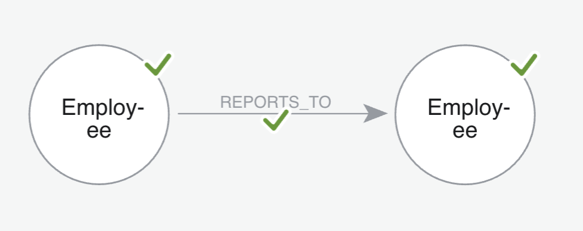
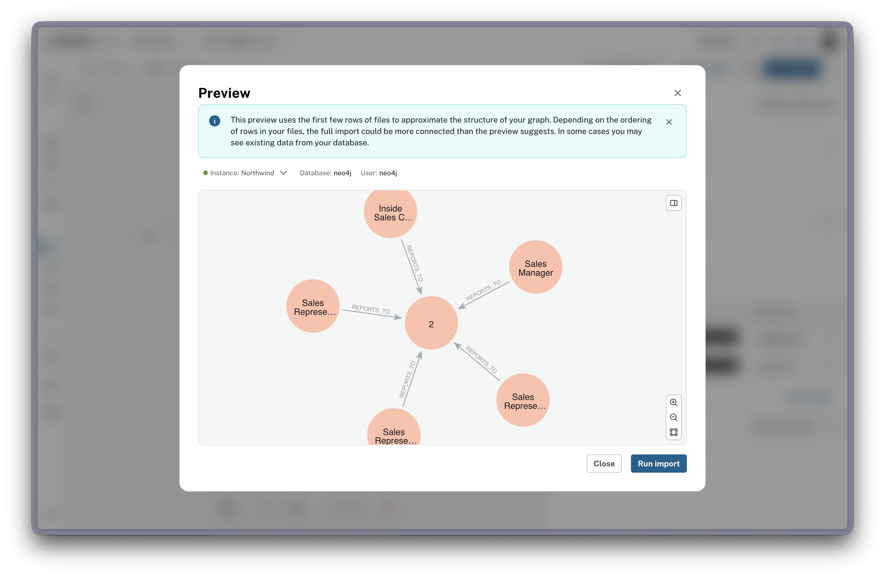

= Importing Employees with Hierarchical Relationships
:type: challenge
:order: 3
:duration: 20
:optional: true

:imported-content: Categories and Suppliers
:zip-url: https://cdn.graphacademy.neo4j.com/courses/workshop-modeling/modules/5-completing-the-model/lessons/2-import-suppliers/data/2-import-suppliers.zip
:zip-filename: 2-import-suppliers.zip

include::../../../../includes/download-current-state.adoc[]

== Importing Employees

You have Customers, Orders, and Products. Now add Employees with organizational hierarchy and sales tracking.

In this challenge, you will work independently to import employees and create REPORTS_TO (hierarchical) and SOLD (order assignment) relationships.

== File structure: employees.csv

[NOTE]
.Additional data source
====
This optional lesson uses `employees.csv`, which is not included in the main workshop files. Download it separately: link:https://data.neo4j.com/northwind/employees.csv[employees.csv^]
====

The employees.csv file contains employee information:

[options="header"]
|===
| Column | Type | Description
| employeeID | Integer | Unique identifier for each employee
| lastName | String | Employee's last name
| firstName | String | Employee's first name
| title | String | Job title
| titleOfCourtesy | String | Title of courtesy (Mr., Mrs., etc.)
| birthDate | Date | Birth date
| hireDate | Date | Hire date
| address | String | Street address
| city | String | City location
| region | String | Region/state (may be empty)
| postalCode | String | Postal/ZIP code
| country | String | Country location
| homePhone | String | Home phone number
| extension | String | Phone extension
| photo | String | Photo path
| notes | String | Employee notes/bio
| reportsTo | Integer | employeeID of manager (null for CEO)
| photoPath | String | Photo file path
|===

This file has **9 rows** - one for each employee.

== Understanding employee relationships

**Business rules:**

1. **REPORTS_TO** - Employees report to other employees (hierarchical structure)
   * The `reportsTo` column contains the `employeeID` of their manager
   * The CEO has no manager (reportsTo is null)
   * Creates a self-referential relationship

2. **SOLD** - Employees are assigned to process orders
   * The `employeeID` column in orders.csv references the employee who handled the order
   * Creates relationships from Employee to Order

**Graph patterns:**

[source,mermaid]
----
%%{init: {
  "theme": "base",
  "themeVariables": {
    "primaryColor": "#eef6f9",
    "primaryBorderColor": "#c7e0ec",
    "lineColor": "#94a3b8",
    "fontFamily": "Public Sans, Arial, Helvetica, sans-serif"
  }
}}%%
graph TB
    CEO((Employee CEO)):::primary
    Manager((Employee Manager)):::primary
    Rep1((Employee Sales Rep)):::primary
    Rep2((Employee Sales Rep)):::primary
    Order((Order)):::highlight

    Manager -->|REPORTS_TO| CEO
    Rep1 -->|REPORTS_TO| Manager
    Rep2 -->|REPORTS_TO| Manager
    Rep1 -->|SOLD| Order

    classDef primary fill:#eef6f9,stroke:#c7e0ec,stroke-width:1.25px,color:#0b5c7a
    classDef highlight fill:#f4f5ff,stroke:#c7d2fe,stroke-width:1.25px,color:#3730a3
    linkStyle default stroke:#94a3b8,stroke-width:1.25px
----

include::../../../../includes/open-import-tool.adoc[]

== Your challenge

Using what you've learned about the Import tool, you will:

1. Create Employee nodes
2. Create REPORTS_TO relationships
3. Create SOLD relationships
4. Run the import

== Create Employee nodes

This step requires creating **two Employee node mappings** in the data modeler:

1. **First Employee node** - Imports employee details:
   * Map employees.csv to an Employee node
   * Rename the `employeeID` column to `id` (this will become the node's unique identifier)
   * Include all properties **except** the `reportsTo` field
   * Suggested properties: firstName, lastName, title, hireDate, city, country

2. **Second Employee node** - Creates the relationship target:
   * Map employees.csv to another Employee node
   * Rename the `reportsTo` column to `id` (maps to the same property as the first node)
   * You don't need to define other properties - they're already defined in the first node
   * This node exists only to create the REPORTS_TO relationship

== Create REPORTS_TO relationships

1. Draw a relationship from the first Employee node to the second Employee node
2. Set the relationship type: `REPORTS_TO`
3. Configure the relationship mapping:
+
[options="header"]
|===
| | Node | ID | ID column
| **From** | Employee | id | employeeID
| **To** | Employee | id | reportsTo
|===
+

4. The importer should automatically map these based on the keys, but verify using the **Preview Selected** option
5. Note: Some employees have null `reportsTo` (the CEO) - the tool will skip these automatically

== Create SOLD relationships

1. Map orders.csv as the relationship source
2. Create relationship type: `SOLD`
3. **From:** Map `employeeID` in orders.csv to Employee node's ID
4. **To:** Map `orderId` in orders.csv to Order node's ID

== Run the import

== Expected results

After importing, you should have:

* **9 Employee nodes** created
* **8 REPORTS_TO relationships** created (CEO has no manager)
* **830 SOLD relationships** created (one for each order)

You can verify with these queries:

[source,cypher]
.Check organizational hierarchy
----
MATCH (e:Employee)-[:REPORTS_TO]->(manager:Employee)
RETURN e.firstName + ' ' + e.lastName AS employee,
       manager.firstName + ' ' + manager.lastName AS reportsTo,
       e.title AS title
ORDER BY e.employeeID
----

[source,cypher]
.Check sales assignments
----
MATCH (e:Employee)-[:SOLD]->(o:Order)
RETURN e.firstName + ' ' + e.lastName AS employee,
       count(o) AS ordersSold
ORDER BY ordersSold DESC
----

include::questions/verify.adoc[leveloffset=+1]

== Multi-level hierarchy queries

One of the powerful features of graphs is querying hierarchical data with variable-length paths.

**Example: Find all reports (direct and indirect) to a manager**

[source,cypher,role="norun"]
.Find all employees who report to a Sales Manager
----
MATCH (manager:Employee {title: 'Sales Manager'})
      <-[:REPORTS_TO*]-(employee:Employee)  // <1>
RETURN manager.firstName + ' ' + manager.lastName AS manager,
       employee.firstName + ' ' + employee.lastName AS employee,
       employee.title AS title
ORDER BY employee.title, employee.lastName
----

<1> **Variable-length path** - `[:REPORTS_TO*]` follows the relationship any number of times, finding direct reports, their reports, and so on

**Why this is powerful:**

In a relational database, you would need:

* Recursive CTEs (Common Table Expressions) in SQL
* Multiple self-joins to traverse each level
* Fixed depth queries (limited to predefined levels)

In Neo4j, variable-length paths handle unlimited hierarchy depth naturally.

== Analyzing organizational structure

**Example: Find the complete reporting chain for an employee**

[source,cypher,role="norun"]
.Reporting chain from Sales Representative to CEO
----
MATCH path = (employee:Employee {title: 'Sales Representative'})
             -[:REPORTS_TO*]->(ceo:Employee)
WHERE NOT (ceo)-[:REPORTS_TO]->()  // <1>
RETURN [n IN nodes(path) | n.firstName + ' ' + n.lastName] AS reportingChain,
       length(path) AS levels
----

<1> **Find CEO** - The employee with no REPORTS_TO relationship is at the top

This query returns the complete chain from employee to CEO, regardless of how many management levels exist.

[.summary]
== Summary

You imported Employee nodes with hierarchical relationships:

* 9 Employee nodes created
* Properties: employeeID, firstName, lastName, title, hireDate
* 8 REPORTS_TO relationships created (organizational hierarchy)
* 830 SOLD relationships created (order assignments)
* **Variable-length paths** - Query multi-level hierarchies with `[:REPORTS_TO*]` syntax
* **Graph advantage** - No recursive CTEs or complex self-joins needed for hierarchy traversal
* **Optional Building Block**: "Employees with hierarchy and sales tracking" ✓

You now have the complete Northwind graph with all entities and relationships!

read::Mark as completed[]
