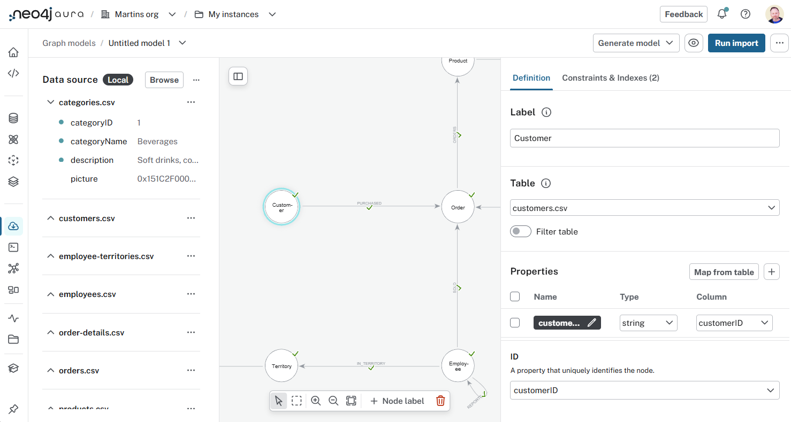

= Northwind Data Set
:type: lesson
:order: 3

[.slide.discrete]
== Introduction

In this lesson, you are going to load the Northwind dataset you will need for the course.

You will need to:

. Download the Northwind graph data model.
. Create a new graph data model
. Open the Northwind dataset in the Import tool
. Run the import

[.slide.col-40-60]
== Northwind Dataset

[.col]
====
The Northwind dataset contains data about a fictional company called Northwind Traders, which imports and exports specialty foods from around the world.

The graph data model contains nodes and relationships for Customers, Orders, Products, Categories, and Employees.
====

[.col]
====
[source, mermaid]
.Northwind Graph Model
----
include::diagrams/northwind-graph-model.mermaid[]
----
====

[.slide]
== Create a graph data model

[.slide-only]
====
**Continue with the lesson to create the graph data model**
====

[.transcript-only]
=== Import the Northwind dataset

You need to link:https://raw.githubusercontent.com/neo4j-graph-examples/northwind/refs/heads/main/import/northwind-complete.zip[download the complete Northwind dataset^] and create a new blank graph data model:

. link:https://raw.githubusercontent.com/neo4j-graph-examples/northwind/refs/heads/main/import/northwind-complete.zip[Download the complete Northwind dataset^]
. Open the *Import* tool in Aura and select *Graph Models*. 
+
console::Open Import Tool[tool=import]
+
image::images/aura-import-graph-annotated.png["Aura Console - Import - Graph Models"]
. Create a new graph data model.
. Use the `...` menu to `Open model (with data)` and select the `northwind-complete.zip` file you downloaded.
+
image::images/open-model-with-data-annotated.png["... menu - Open model with data"]
. You will see the tables (csv files) from the Northwind dataset and the graph data model.
+

[.transcript-only]
=== Run the import

Run the import to create the Northwind data model:

. Click *Run Import*
. Select your instance
+
image::images/select-aura-instance.png["Dialogue to select the Aura instance to import into"]
. Enter your instance credentials (if prompted)
. A summary of the import will be displayed
+ 
image::images/import-result.png["Import result summary showing the number of nodes and relationships created"]

[.slide.col-2]
== Query the graph

[.col]
====
You can view the Customers in the graph using the Query tool.

console::Open Query Tool[tool=query]

[source, cypher, role=noplay]
.Customer nodes
----
MATCH (c:Customer)
RETURN c
----
====

[.col]
image::images/query-customer-nodes.png["Result of the query showing the Customer nodes"]

[.next]
== Next

read::Continue[]

[.summary]
== Lesson Summary

In this lesson, you learned imported the Northwind graph data model into your Aura instance.

In the next module, you will learn how to manage and administer instances in Aura.
