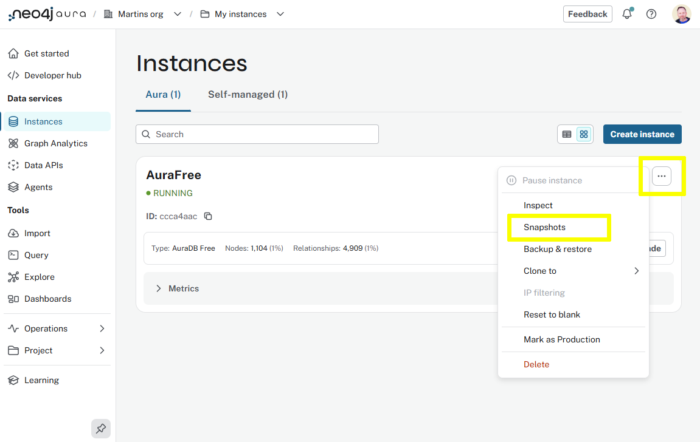
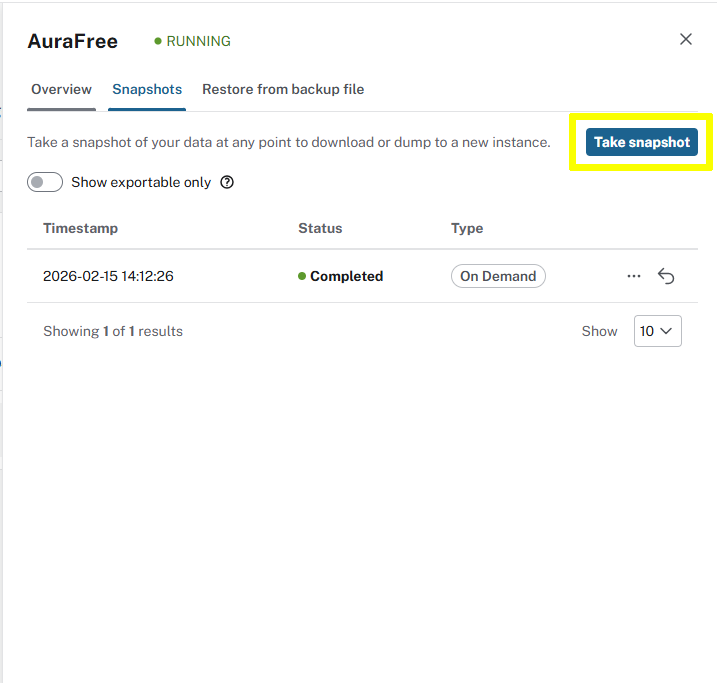
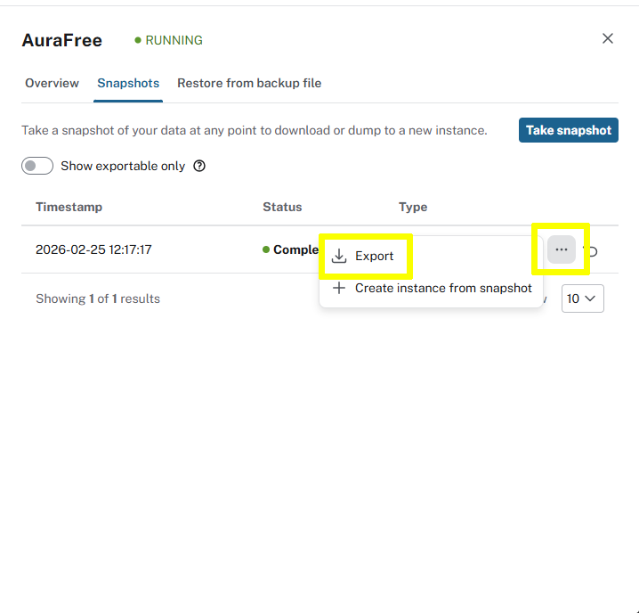

= Database Backup & Restore
:type: lesson
:order: 2
:image-path: {cdn-url}/aura-administration/modules/1-backup-restore/lessons/1-snapshot-management/images

[.slide.discrete]
== Introduction

In this lesson you will learn:

* Snapshot creation and management
* How to restore from snapshots
* Understanding different backup types and schedules

A **snapshot** is a point-in-time copy of your database that you can restore in case of accidental changes, data loss, or to test changes safely without impacting your main database.

[.slide]
== Snapshot Types

Aura provides two types of snapshots to help you protect your data and maintain operational flexibility, full and sequential backups.

A **full snapshot** captures your entire database at a specific point in time - it's complete and self-contained.

A **differential snapshot**, on the other hand, only records the changes since the last full snapshot, making it more efficient but dependent on the full snapshot that came before it.

[NOTE]
.Exporting snapshots
You can use both types of snapshots to restore your database to a specific point in time, but only full snapshots can be exported.

[.slide]
== Scheduled Snapshots

Scheduled snapshots run automatically. The frequency of scheduled snapshots depends on your tier.

* **AuraDB Professional** and **AuraDS Professional** create snapshots once per day.
* **AuraDB Business Critical** creates snapshots every hour.
* **AuraDB Virtual Dedicated Cloud** creates both daily full snapshots and hourly differential snapshots.
* **AuraDS Enterprise** creates daily snapshots.
// * **AuraDB Virtual Dedicated Cloud (4.x)** creates snapshots every 6 hours.

[.slide]
== On Demand Snapshots

You can create a snapshot anytime using the **Take snapshot** button in the Aura console. This is useful before major changes or migrations.

Take a snapshot of your Aura Instance:

. Open the `...` menu for your instance.
. Select *Snapshots*.
+
[.transcript-only]

+
The Snapshots page will show you all existing snapshots for the instance.
+
[.transcript-only]

. Click *Take snapshot*. 
. The status of the snapshot will change to *Pending*, *In Progress*, and finally *Complete*.

[.slide]
== Snapshot Actions

Each _full_ snapshot has the following actions via the more menu (**…**):

* **Export** - downloads a snapshot as a backup file for offline storage or use with other Neo4j installations
* **Create instance from snapshot** - creates a new instance with data from the snapshot. Your original instance remains unchanged.

The arrow icon image:{image-path}/restore-from-snapshot.png[Restore from snapshot icon] to the right of each snapshot item allows you to restore the snapshot to overwrite the current instance.

[.slide]
== Export a snapshot

Export a snapshot of your Aura instance:

. Go to the Snapshots page for your instance
. Click the `...` menu next to *Complete* snapshot and select **Export**.
+
[.transcript-only]

. The snapshot will be downloaded as a `.backup` file, which you can store offline or use to restore to another Neo4j instance.

read::Continue[]

[.summary]
== Lesson Summary

In this lesson, you learned about database backup and restore procedures in Neo4j Aura, including how to create, schedule, and manage backups effectively.

In the next lesson, you will learn about accessing and understanding logs.
