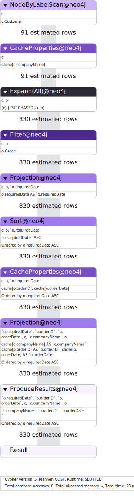
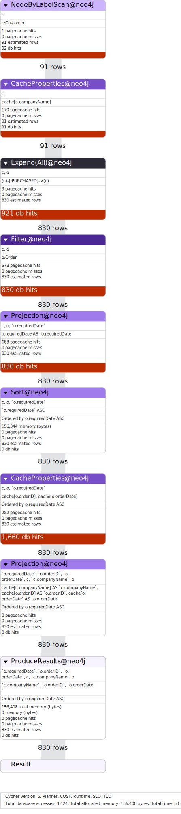

= Analyzing Query Performance
:type: lesson
:order: 2

In this lesson you will learn how to use `PROFILE` and `EXPLAIN` to:

* Analyze and understand query execution plans.
* Understand query metrics.
* Identify performance bottlenecks.

== EXPLAIN and PROFILE

When you want to analyze a query by examining its execution plan, you can use `EXPLAIN` and `PROFILE`.

=== EXPLAIN

Use `EXPLAIN` when you want to see the execution plan without actually running the statement:

* Prepend your Cypher statement with `EXPLAIN`
* Shows you what Neo4j *plans* to do to execute your query
* `EXPLAIN` returns an empty result and makes no changes to the database
* Useful for understanding the query strategy before execution

[source,cypher]
----
EXPLAIN MATCH (c:Customer)-[:PURCHASED]->(o:Order) 
RETURN c.companyName, o.orderID, o.orderDate
ORDER BY o.requiredDate
----

[NOTE]
.Execution plan
====
The execution plan is a tree of operators that shows how Neo4j will execute your query. Each operator represents a step in the query execution process, such as scanning nodes, filtering results, or joining data.

Look through the execution plan, try to identify the individual steps and the order.

You will learn more about execution plans later in this lesson
====

=== PROFILE

Use `PROFILE` when you want to run the statement and see detailed performance metrics:

* Runs your statement and tracks execution statistics  
* Shows which operators are being used and how
* Provides information about:
  ** Number of rows passing through each operator
  ** How much each operator interacts with the storage layer
  ** Actual time spent in each operation

[TIP]
====
Only use `PROFILE` when actively optimizing queries, as it consumes additional resources to collect performance statistics.
====

[source,cypher]
----
PROFILE MATCH (c:Customer)-[:PURCHASED]->(o:Order) 
RETURN c.companyName, o.orderID, o.orderDate
ORDER BY o.requiredDate
----

You can see that the `PROFILE` query plan includes pagecache statistics and absolute database hits.

== Execution plans

Neo4j decomposes query execution into a tree-like structure called an execution plan, where each operator implements a specific piece of work.

// image of an execution plan

=== Understanding Operators

**Operators** are the building blocks of execution plans:

* Each operator takes zero or more input rows and produces zero or more output rows
* **Leaf operators** (like scans and seeks) have no input and get data directly from storage  
* **Join operators** combine input from two branches into a single output stream
* The **root operator** produces the final query results
* Operators are arranged in a tree structure with data flowing to the root

// image of an execution plan with operators labeled

[TIP]
.Operator types
====
There are over 100 different operator types that support the execution of a Cypher query.

You can view a summary of all the types in the link:https://neo4j.com/docs/cypher-manual/4.4/execution-plans/operator-summary/[Execution Plan Operators documentation^].
====

=== Evaluation

Execution plan evaluation follows a specific flow pattern:

* **Execution** - Evaluation begins at the **leaf nodes** (operators like scans and seeks) and data flows through the operators to produces the final result.
* **Data Pipeline** - Each operator pipes its output rows to the parent operator, continuing through the tree until reaching the result.
* **Lazy vs Eager Evaluation**: - 
** **Lazy** - Query evaluation is mostly _lazy_. Operators pipe their output rows to their parent operators as soon as they are produced allowing parallel processing.
** **Eager**: Some operators (aggregation, sorting) must process *all* input before producing output.

[IMPORTANT]
.Performance Impact
====
**Eager operators** can cause high memory usage and performance issues because they must collect and process all data before passing results upward. Watch for these in your execution plans when diagnosing performance problems.
====

=== Reading Execution Plan Statistics

When you use `PROFILE`, each operator shows the performance metrics:

==== Core Metrics
* **`Rows`**: Actual number of rows the operator produced
* **`EstimatedRows`**: Neo4j's estimate of expected rows
* **`DbHits`**: Number of storage engine operations performed

==== Advanced Metrics (Enterprise Edition)
* **`Page Cache Hits/Misses`**: Cache efficiency metrics
* **`Page Cache Hit Ratio`**: Percentage of data found in cache vs. disk
* **`Time`**: Actual execution time in milliseconds

=== Key Takeaways

* **High `DbHits`** often indicate performance bottlenecks
* **Eager operators** can cause memory issues with large datasets
* **Good cache hit ratios** (close to 100%) indicate efficient data access

read::Continue[]

[.summary]
== Lesson Summary

In this lesson, you learned how to use `PROFILE` and `EXPLAIN`to analyze query execution.

In the next lesson, you will learn about good practices for writing efficient Cypher queries.
