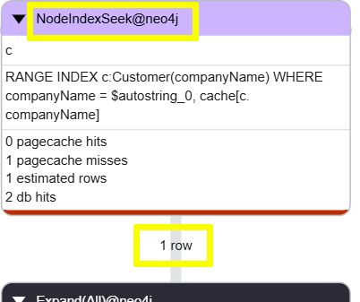

= Query Good Practice
:type: lesson
:order: 3

In this lesson you will learn some of the common best practices for writing efficient Cypher queries including: 

* Use of indexes
* Reading early
* Using WITH to break down complex queries

== Use of indexes

Indexes are a powerful tool for improving query performance. Indexes allow Neo4j to quickly locate nodes based on their properties, which can significantly reduce the time it takes to find anchor nodes and traverse relationships.

The following query finds the orders for a specific customer, "Ernst Handel".

[source, cypher, role=noplay]
----
PROFILE MATCH (c:Customer {companyName: "Ernst Handel"})-[:PURCHASED]->(o:Order) 
RETURN c.companyName, o.orderID, o.requiredDate
ORDER BY o.requiredDate
----

Run the query, review the plan, and try to identify the operations being performed.

The profile of this query shows that: 

. Neo4j is performing a `NodeByLabelScan` operation on `Customer`. 
. Before a `Filter` operation to find the specific customer.

image::images/no-index-query-plan-labelscan-filter.png["Query plan showing NodeByLabelScan operation passing 91 rows to Filter which outputs 1 row"]

Neo4j has to scan all `Customer` nodes to find the one with the matching `companyName`.

You can improve the performance of this query by creating an index on the `companyName` property of the `Customer` label:

[source, cypher, role=noplay]
----
CREATE INDEX customer_companyName 
IF NOT EXISTS 
FOR (c:Customer) ON (c.companyName)
----

Running the same query again after creating the index shows that Neo4j is now using a `NodeIndexSeek` operator to find the specific customer:

[source, cypher, role=noplay]
----
PROFILE MATCH (c:Customer {companyName: "Ernst Handel"})-[:PURCHASED]->(o:Order) 
RETURN c.companyName, o.orderID, o.requiredDate
ORDER BY o.requiredDate
----

Creating an index on the `companyName` property allows Neo4j to quickly locate the specific customer node, which significantly improves the performance of the query.

[TIP]
.Text indexes
====
You can use a link:https://neo4j.com/docs/cypher-manual/current/indexes/search-performance-indexes/create-indexes/#create-text-index[text index^] to improve the performance of queries that involve partial matching of string properties using `CONTAINS`, `STARTS WITH`, or `ENDS WITH`. 
====

// Potential examples we could use:

// * Read early
// * Break down complex queries
// * Using WITH
// * Query parameters
// * Indexing
// * USING INDEX
// * Labels
// * Avoiding Eager
// * Super nodes

read::Continue[]

[.summary]
== Lesson Summary

In this lesson, you learned about query good practices, including how to structure queries efficiently, use indexes effectively, and avoid common performance anti-patterns.

In the next lesson, you will learn about investigating and resolving common query performance issues.
