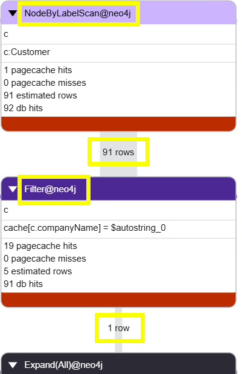

= Indexes
:type: lesson
:order: 4

== Introduction

Indexes are a powerful tool for improving query performance. 

Indexes allow Neo4j to quickly locate nodes based on their properties, which can significantly reduce the time it takes to find anchor nodes and traverse relationships.

== Use of indexes

The following query finds the orders for a specific customer, "Ernst Handel".

[source, cypher, role=noplay]
.Find orders for a specific customer
----
MATCH (c:Customer {companyName: "Ernst Handel"})-[:PURCHASED]->(o:Order) 
RETURN c.companyName, o.orderID, o.requiredDate
ORDER BY o.requiredDate
----

You can use `PROFILE` the query to see the execution plan.

[source, cypher, role=noplay]
.Profile the query
----
PROFILE MATCH (c:Customer {companyName: "Ernst Handel"})-[:PURCHASED]->(o:Order) 
RETURN c.companyName, o.orderID, o.requiredDate
ORDER BY o.requiredDate
----

Run the query, review the plan, and try to identify the operations being performed.

=== Profile without an index

The profile of this query shows that: 

. Neo4j is performing a `NodeByLabelScan` operation on `Customer`. 
. Before a `Filter` operation to find the specific customer.

Neo4j has to scan all `Customer` nodes to find the one with the matching `companyName`.

=== Create an index

You can improve the performance of this query by creating an index on the `companyName` property of the `Customer` label:

[source, cypher, role=noplay]
.Create an index
----
CREATE INDEX companyName_Customer
IF NOT EXISTS 
FOR (c:Customer) ON (c.companyName)
----

=== Profile with an index

Running the same query again after creating the index shows that Neo4j is now using a `NodeIndexSeek` operator to find the specific customer:

[source, cypher, role=noplay]
.Profile the query with an index
----
PROFILE MATCH (c:Customer {companyName: "Ernst Handel"})-[:PURCHASED]->(o:Order) 
RETURN c.companyName, o.orderID, o.requiredDate
ORDER BY o.requiredDate
----

image::images/with-index-query-plan-nodeindexseek.png["Query plan showing NodeIndexSeek operation passing 1 row to Expand operation"]

Creating an index on the `companyName` property allows Neo4j to quickly locate the specific customer node, which significantly improves the performance of the query.

[TIP]
.Text indexes
====
You can use a link:https://neo4j.com/docs/cypher-manual/current/indexes/search-performance-indexes/create-indexes/#create-text-index[text index^] to improve the performance of queries that involve partial matching of string properties using `CONTAINS`, `STARTS WITH`, or `ENDS WITH`. 
====

== Create an index for Product names

The following query finds the supplier for a specific product, "Tofu".

[source, cypher, role=noplay]
.Find a supplier for a product
----
MATCH (p:Product {productName: "Tofu"})<-[:SUPPLIES]-(s:Supplier)
RETURN p.productName, s.companyName
----

You challenge is to: 

* Profile the query and identify the operations being performed.
* Create an index on the `productName` property of the `Product` label.
* Review the new query plan to see how it has changed.

[%collapsible]
.Click to reveal the solution
====
. Use `PROFILE` to analyze the query and identify that it is performing a `NodeByLabelScan` on `Product` to find the node with the matching `productName`.
+ 
[source, cypher, role=noplay]
.Profile the query
----
PROFILE MATCH (p:Product {productName: "Tofu"})<-[:SUPPLIES]-(s:Supplier)
RETURN p.productName, s.companyName
----

. Create an index on the `productName` property of the `Product` label:
+
[source, cypher, role=noplay]
.Create an index on `productName`
----
CREATE INDEX productName_Product
IF NOT EXISTS
FOR (p:Product) ON p.productName
----

. Run the query again and review the new query plan to see that it is now using a `NodeIndexSeek` to find the specific product node:
+
[source, cypher, role=noplay]
.Profile the query with the new index
----
PROFILE MATCH (p:Product {productName: "Tofu"})<-[:SUPPLIES]-(s:Supplier)
RETURN p.productName, s.companyName
----

. The new query plan will use a `NodeIndexSeek` to find the specific product node significantly improving the performance of the query.
====

read::Continue[]

[.summary]
== Lesson Summary

In this lesson, you learned about the importance of indexes for query performance and how to create them in Neo4j.

In the next lesson, you will ...
