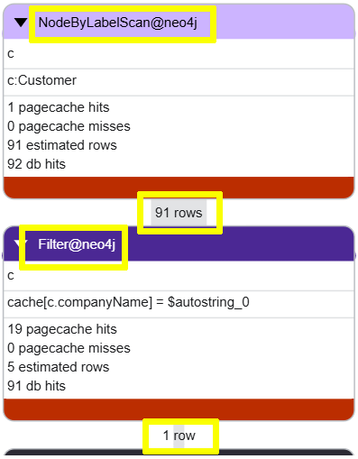

= Indexes
:type: lesson
:order: 4

[.slide.discrete]
== Introduction

Indexes are a powerful tool for improving query performance. 

Indexes allow Neo4j to quickly locate nodes based on their properties, which can significantly reduce the time it takes to find anchor nodes and traverse relationships.

[.slide.col-2]
== Use of indexes

The following query finds the orders for a specific customer, "Ernst Handel".

[source, cypher, role=noplay]
.Find orders for a specific customer
----
MATCH (c:Customer {companyName: "Ernst Handel"})-[:PURCHASED]->(o:Order) 
RETURN c.companyName, o.orderID, o.requiredDate
ORDER BY o.requiredDate
----

[.slide]
=== Profile the query

You can use `PROFILE` the query to see the execution plan.

[source, cypher, role=noplay]
.Profile the query
----
PROFILE MATCH (c:Customer {companyName: "Ernst Handel"})-[:PURCHASED]->(o:Order) 
RETURN c.companyName, o.orderID, o.requiredDate
ORDER BY o.requiredDate
----

Run the query, review the plan, and try to identify the operations being performed.

[.slide.discrete.col-2]
=== Scanning all the customers

[.col]
====
The profile of this query shows that: 

. Neo4j is performing a `NodeByLabelScan` operation on `Customer`. 
. Before a `Filter` operation to find the specific customer.

Neo4j has to scan all `Customer` nodes to find the one with the matching `companyName`.
====

[.col]

[.slide]
=== Create an index

You can improve the performance of this query by creating an index on the `companyName` property of the `Customer` label:

[source, cypher, role=noplay]
.Create an index
----
CREATE INDEX companyName_Customer
IF NOT EXISTS 
FOR (c:Customer) ON (c.companyName)
----

[.slide.col-2]
=== Profile with an index

[.col]
====
Running the same query again after creating the index shows that Neo4j is now using a `NodeIndexSeek` operator to find the specific customer:

[source, cypher, role=noplay]
.Profile the query with an index
----
PROFILE MATCH (c:Customer {companyName: "Ernst Handel"})-[:PURCHASED]->(o:Order) 
RETURN c.companyName, o.orderID, o.requiredDate
ORDER BY o.requiredDate
----

Creating an index on the `companyName` property allows Neo4j to quickly locate the specific customer node, which significantly improves the performance of the query.
====

[.col]
image::images/with-index-query-plan-nodeindexseek.png["Query plan showing NodeIndexSeek operation passing 1 row to Expand operation"]

[.transcript-only]
====
[TIP]
.Text indexes
=====
You can use a link:https://neo4j.com/docs/cypher-manual/current/indexes/search-performance-indexes/create-indexes/#create-text-index[text index^] to improve the performance of queries that involve partial matching of string properties using `CONTAINS`, `STARTS WITH`, or `ENDS WITH`. 
=====
====

[.slide.col-2]
== Create an index for Product names

[.col]
====
The following query finds the supplier for a specific product, "Tofu".

[source, cypher, role=noplay]
.Find a supplier for a product
----
MATCH (p:Product {productName: "Tofu"})<-[:SUPPLIES]-(s:Supplier)
RETURN p.productName, s.companyName
----
====

[.col]
====
You challenge is to: 

* Profile the query and identify the operations being performed.
* Create an index on the `productName` property of the `Product` label.
* Review the new query plan to see how it has changed.
====

[.transcript-only]
====
[%collapsible]
.Click to reveal the solution
=====
. Use `PROFILE` to analyze the query and identify that it is performing a `NodeByLabelScan` on `Product` to find the node with the matching `productName`.
+ 
[source, cypher, role=noplay]
.Profile the query
----
PROFILE MATCH (p:Product {productName: "Tofu"})<-[:SUPPLIES]-(s:Supplier)
RETURN p.productName, s.companyName
----

. Create an index on the `productName` property of the `Product` label:
+
[source, cypher, role=noplay]
.Create an index on `productName`
----
CREATE INDEX productName_Product
IF NOT EXISTS
FOR (p:Product) ON p.productName
----

. Run the query again and review the new query plan to see that it is now using a `NodeIndexSeek` to find the specific product node:
+
[source, cypher, role=noplay]
.Profile the query with the new index
----
PROFILE MATCH (p:Product {productName: "Tofu"})<-[:SUPPLIES]-(s:Supplier)
RETURN p.productName, s.companyName
----

. The new query plan will use a `NodeIndexSeek` to find the specific product node significantly improving the performance of the query.
=====
====

[.slide]
== Anchor nodes

Anchor nodes are the starting points for graph pattern matching in Cypher queries. They represent the initial nodes that Neo4j locates before traversing relationships to find connected data.

An anchor node is typically:

* A node (or nodes) with specific property values that can be efficiently located using labels or indexes
* The first node matched in a query pattern before following relationships 
* A node that provides a focused entry point into the graph structure

[.slide]
=== Why anchor nodes matter

Anchor nodes are crucial for query performance because they determine how Neo4j begins executing a query:

* **Efficient Starting Points** - Properly indexed anchor nodes allow Neo4j to quickly locate specific nodes using `NodeIndexSeek` operations instead of scanning all nodes with a label (`NodeByLabelScan`)
* **Reduced Search Space** - By identifying the correct anchor node first, Neo4j limits the scope of relationship traversals, avoiding unnecessary exploration of the graph
* **Query Optimization** - The Neo4j query planner can create more efficient execution plans when anchor nodes are clearly defined and indexed
* **Scalability** - As graphs grow larger, efficient anchor node identification becomes increasingly important to maintain fast query response times
* **Resource Conservation** - Well-chosen anchor nodes reduce CPU usage and memory consumption during query execution

[.slide.discrete]
=== Customer Anchor Node

In this query:

[source, cypher, role=noplay]
----
MATCH (c:Customer {companyName: "Ernst Handel"})-[:PURCHASED]->(o:Order) 
RETURN c.companyName, o.orderID, o.requiredDate
----

The `Customer` node with `companyName: "Ernst Handel"` serves as the anchor node. With an index on `companyName`, Neo4j can quickly locate this specific customer before traversing the `PURCHASED` relationships to find related orders.

[.slide.discrete]
=== Best practices for anchor nodes

Best practices for anchor nodes:

* Create indexes on properties used to identify anchor nodes
* Choose anchor nodes with selective property values (avoid properties with many duplicate values)
* Position anchor nodes early in your MATCH patterns
* Use PROFILE to verify that your queries are using efficient anchor node operations

read::Continue[]

[.summary]
== Lesson Summary

In this lesson, you learned about the importance of indexes for query performance and how to create them in Neo4j.

In the next lesson, you will learn how to use the count store to optimize queries that count or check for the existence of nodes and relationships.
