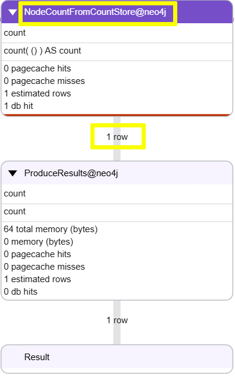
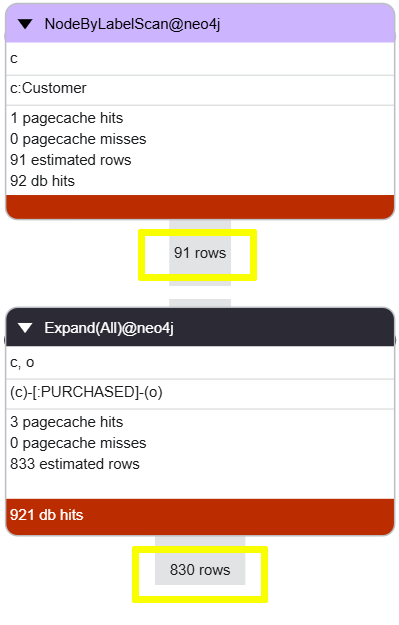
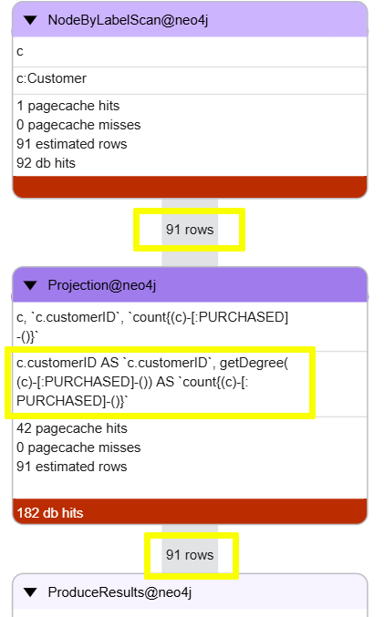

= Count Store
:type: lesson
:order: 5

[.slide.discrete]
== Introduction

In this lesson, you will learn about the transactional count store and how you can use it to optimize certain queries.

Neo4j maintains a transactional count store that keeps track of the number of nodes and relationships in the graph. This allows Neo4j to quickly return counts without having to scan the entire graph.

=== Count all nodes

Run the following query to profile a count of all the nodes in the graph:

[source, cypher, role="noplay"]
.Count all nodes
----
PROFILE MATCH (n)
RETURN count(n)
----

You can see from the profile that Neo4j is reading from the count store and only reading 1 row. 

The count store maintains a count of all nodes in the graph, so Neo4j can return the count without having to scan all the nodes.

Depending on how you write your query, Neo4j cas use the count store and wont have to scan the graph to calculate the count.

[.slide]
== Counting customers orders

Profile the following query that returns a count of how many order and customer has purchased:

[source, cypher, role="noplay"]
.Count of orders by customer
----
PROFILE MATCH (c:Customer)-[:PURCHASED]-(o:Order)
RETURN 
    c.customerID, 
    count(o)
----

All the `Customer` nodes are read, then all the `PURCHASED` relationships are expanded to calculate the count of orders per customer.

[.slide]
=== Optimizing with the count store

An alternative approach is to use the count store to get how many `PURCHASED` relationships each `Customer` has.

[source, cypher, role="noplay"]
.Count of orders per customer using count store
----
PROFILE MATCH (c:Customer)   // <1>
RETURN 
  c.customerID, 
  count{(c)-[:PURCHASED]-()} // <2>
----

<1> All the customers are found, but no relationships are expanded.
<2> The count store is used to get the count of `PURCHASED` relationships for each customer. 

The `getDegree` function is used to read the count store and return the count of relationships for each customer. This allows Neo4j to return the count without having to expand the relationships.

== Counting products per order

The following query counts how many products are in each order:

[source, cypher, role="noplay"]
.Count of products per order
----
MATCH (o:Order)-[:ORDERS]->(p:Product)
RETURN o.orderID, count(p)
----

You challenge is to optimize this query to use the count store:

. Profile the query and note how many rows are read and how many relationships are expanded.
. Rewrite the query to use the count store and profile it again.
. Compare the results.

[%collapsible]
.Click to reveal the solution
====
. Profiling the query shows that it reads all the `Order` nodes and expands all the `ORDERS` relationships to count the products:
+
[source, cypher, role="noplay"]
.Profile the query
----
PROFILE MATCH (o:Order)-[:ORDERS]->(p:Product)
RETURN o.orderID, count(p)
----

. The query can be rewritten to use the count store to get the count of `ORDERS` relationships for each order:
+
[source, cypher, role="noplay"]
.Optimized query using the count store
----
PROFILE MATCH (o:Order)
RETURN o.orderID, count{(o)-[:ORDERS]->()}
----

. Profiling the optimized query shows that it reads all the `Order` nodes but does not expand any relationships and reduces database reads significantly.
====

[TIP]
.Learn more
====
You can learn more about the count store in the Neo4j Knowledge Base article link:https://neo4j.com/developer/kb/fast-counts-using-the-count-store/[Fast counts using the count store^].
====

== Exists

You can use the count store to check if a node has any relationships using exists. For example, you can check if a `Customer` has made any purchases:

[source, cypher, role="noplay"]
.Customers with no purchases
----
MATCH (c:Customer)
WHERE not exists{(c)-[:PURCHASED]-()}
RETURN c.customerID
----

The alternative approach would be to use an `OPTIONAL MATCH`, check for null values, and use `DISTINCT` to remove duplicates:

[source, cypher, role="noplay"]
.Customers with no purchases
----
MATCH (c:Customer)
OPTIONAL MATCH (c)-[:PURCHASED]->(o)
WITH c,o
WHERE o IS NULL
RETURN c.customerID
----

Review and compare the profile for both these queries and identify the performance difference. 

read::Continue[]

[.summary]
== Lesson Summary

In this lesson, you learned about ..

In the next lesson, you will learn about ..
