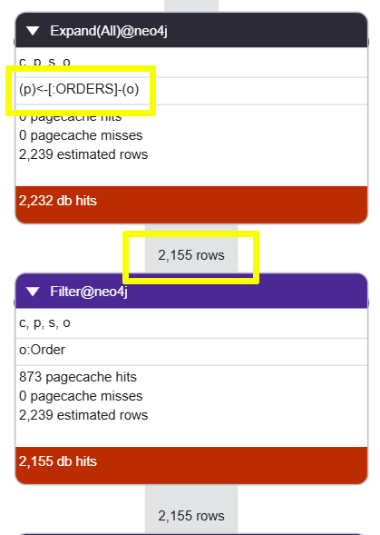

= Breaking down complex queries with WITH
:type: lesson
:order: 6

[.slide.discrete]
== Introduction

In this lesson, you will learn how to use the `WITH` clause in Cypher to:

* Break down complex queries into smaller, more manageable parts.
* Control the flow of data through your query for better performance and readability.

[.slide.col-2]
== Limiting results

[.col]
====
The following query returns data about the top 10 most popular products based on the number of orders:

[source, cypher, role="noplay"]
.Most popular products
----
PROFILE MATCH                                                   //<1>
  (o:Order)-[:ORDERS]->(p:Product)<-[:SUPPLIES]-(s:Supplier),   
  (p)-[:PART_OF]-(c:Category)
RETURN DISTINCT                                                 //<2>
  p.productName AS product, 
  c.categoryName as category, 
  s.companyName AS supplier, 
  count (o) as orderCount                                       //<3> 
ORDER BY orderCount DESC                                        //<4>
LIMIT 10        
----
====

[.col]
====
<1> The query matches orders, products, suppliers, and categories in a single step.
<2> The `DISTINCT` keyword is used to eliminate duplicate rows, which can add overhead to the query execution.
<3> The count of orders is calculated for all products.
<4> Finally all the results are ordered and limited to the top 10.

The profile of this query shows that all the orders are expanded before the count is ordered.
====

[.transcript-only]

[.slide]
=== Break the query down 

The query can be optimized by breaking it down into smaller parts: 

* Finding the top 10 products
* Pipelining just the top products and the order count using `WITH`
* Matching the suppliers and categories for those top products
* Returning the results

[.slide.discrete.col-2]
=== Optimized query using WITH

[.col]
====
The optimized query looks like this:

[source, cypher, role="noplay"]
.Optimized query using WITH
----
PROFILE MATCH (p:Product)                                     //<1>
WITH p, count { (p)<-[:ORDERS]-() } as orderCount             //<2>
ORDER BY orderCount DESC LIMIT 10

MATCH (c:Category)<-[:PART_OF]-(p)<-[:SUPPLIES]-(s:Supplier)  //<3>
RETURN                                                        //<4>
  p.productName AS product,  
  c.categoryName as category, 
  s.companyName AS supplier, 
  orderCount
----
====

[.col]
====
<1> The query starts by matching all products.
<2> `WITH` is used in conjunction with the count store `ORDER BY` and `LIMIT` to pipeline just the top 10 products.
<3> The suppliers and categories are matched for just those top products.
 
Review the profile of this query and compare it to the profile of the original query. 

Limiting the number of products early and using the count store significantly reduces the number of rows read and relationships expanded

The execution plan of the optimized query would stay mostly consistent as the number of orders grew.
====

[.slide]
== Reading properties late

This query returns the top 10 customers by quantity of products ordered:

[source, cypher, role="noplay"]
.Top customers by quantity ordered
----
PROFILE MATCH (c:Customer)-[:PURCHASED]->(o:Order)-[line:ORDERS]->(:Product)
RETURN 
  c.companyName,
  c.contactName,
  c.phone,
  sum(line.quantity) as quantity
ORDER BY quantity DESC LIMIT 10
----

All the properties of read before the results are ordered and limited - leading to unnecessary reads particularly if there are a lrage number of customers and orders in the database.

[.slide.discrete]
== Optimizing by reading properties late

The query can be optimized by reading the properties of the customers after the top customers have been identified:

[source, cypher, role="noplay"]
----
PROFILE MATCH (c:Customer)-[:PURCHASED]->(o:Order)-[line:ORDERS]->(:Product)
WITH c, sum(line.quantity) as quantity
ORDER BY quantity DESC LIMIT 10

RETURN 
  c.companyName,
  c.contactName,
  c.phone,
  quantity
----

The number of database reads is similar as the quantity is calculated for all orders, but the total allocated memory is significantly reduced as the properties of only the top customers are read.

read::Continue[]

[.summary]
== Lesson Summary

In this lesson, you learned how to split complex queries into smaller parts using the `WITH` clause. This allows you to control the flow of data through your query and optimize performance by limiting results early and reading properties late.

In the next lesson, you will learn about ..
