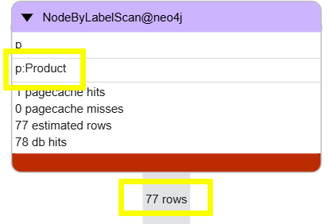
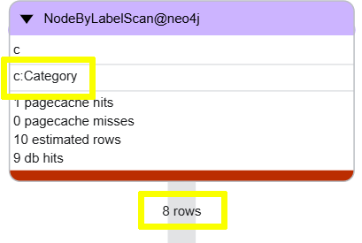

= Investigate
:type: challenge
:order: 7

[.slide.discrete]
== Introduction

In this challenge you will be presented with a query that exhibits common performance issues. 

You should:

. Use `PROFILE` to analyze the query.
. Identify the root causes of the performance issues.
. Implement effective solutions to resolve the performance problems.

[.slide.col-2]
== Finding product reorder levels by category

[.col]
====
The following query finds the reorder levels for products in the "Beverages" category.

[source, cypher, role=noplay]
.Find reorder levels by category
----
MATCH (p:Product)
WITH p, p.productName as productName, p.reorderLevel as reorderLevel
MATCH (p)-[:PART_OF]->(c:Category {categoryName: "Beverages"})
RETURN c.categoryName, productName, reorderLevel
----
====

[.col]
====
You should profile the query and identify improvement opportunities. Consider the following questions:

- What is the anchor node(s) in this query?
- How can the query be simplified to reduce the number of operations?
- What properties are being searched?
====

[.transcript-only]
====
[%collapsible]
.Click to reveal the solution
=====
. The query is overly complicated and is performing unnecessary operations, such as using `WITH` to read properties that are not needed until later in the query.

. The anchor for the query is all the `Product` nodes.
+

+ 
You can simplify the query and make the `Category` nodes the anchor:
+
[source, cypher, role=noplay]
.Simplify the query to make `Category` the anchor
----
MATCH (p:Product)-[:PART_OF]->(c:Category {categoryName: "Beverages"})
RETURN c.categoryName, p.productName as productName, p.reorderLevel as reorderLevel
----
+ 

. The query is searching for `categoryName` on the `Category` nodes, you can also create an index on that property:
+
[source, cypher, role=noplay]
.Create an index on `categoryName`
----
CREATE INDEX categoryName_Category
IF NOT EXISTS
FOR (c:Category) ON c.categoryName
----

The simplified query with the new index significantly improves the performance.
=====
====

// TODO - another example

read::Complete[]

[.summary]
== Lesson Summary

In this challenge, you investigated query performance issues, using various diagnostic approaches, and implementing solutions to resolve common performance problems.
