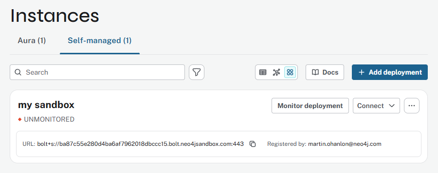

= Setup Neo4j
:type: lesson
:order: 2
:image-path: {cdn-url}/aura-fundamentals/modules/2-getting-started/lessons/2-create-instance/images

[.slide.discrete]
== Introduction

Creating your own Neo4j database instance is a great way continue learning.

In this challenge, you will: 

. Create your own Neo4j database instance on Aura.
. Explore the Neo4j Aura console.

[.slide.col-2]
== Create an Aura Instance

[.col]
====
Create an account on link:https://console.neo4j.io[Neo4j Aura^] and complete the onboarding process.

[TIP]
.Single Sign-On
=====
You can use the same account as you used for GraphAcademy.
=====
====

[.col]
image::images/sign-up.png["Aura Signup"]

[.slide.col-2]
== Create an instance

[.col]
====
To create a new database instance:

. Select `Instances` in the navigation menu.
. Click `Create Instance`.
+
image::{image-path}/02_create_instance.png["Aura Instances"]
====

[.col]
====
[start=3]
. Select **AuraDB Free** to create a new free instance or start a free trial of **AuraDB Professional**.
+
image::{image-path}/new-instance-modal.jpg["Selecting the correct tier"]
====

[.slide.col-2]
== Saving your credentials

[.col]
====
A modal window will appear with the username and password for the database.

image::{image-path}/02_create_free_credentials.jpg["Credentials modal"]
====

[.col]
====
[IMPORTANT]
.Credentials
=====
Make sure to **Download and continue** and **keep** the file safe. The file contains the credentials needed to connect to your new database. 

You will need it to continue with the workshop.
=====
====

[.slide.col-2]
== Instance creation

[.col]
====
You will then see the new instance listed on the instances page with a status of **Creating**.

image::{image-path}/02_create_free_in_progress.jpg[spinner,width=450,align=center]
====

[.col]
====
Once the database is ready, the status will change to **Running**.

image::{image-path}/02_create_free_running.jpg[running database,width=450,align=center]

[IMPORTANT]
.Instance creation time
=====
It will take a few minutes for the instance to be created and become available.
=====
====

[.transcript-only]
====

[%collapsible]
.Can't create an Aura instance?
=====
If you can't create an Aura instance, you can add the Sandbox you have been using during the course as a *Self-managed* instance in the Aura console.

. Goto *Instances*, *Self-managed*, and click *Add deployment*.
+ 
image::images/self-managed-annotated.png["Self managed page with the add deployment button highlighted"]
. Select *Unmonitored*, give the instance a name (for example, `My Sandbox`), and click Connect.
+
image::images/add-deployment-annotated.png["Unmonitored option selected with the instance name My sandbox and connect button highlighted"]
. Enter the following connection details for your sandbox:
+
Connection URL:: [copy]#{instance-host}:443#
Username:: [copy]#{instance-username}#
Password:: [copy]#{instance-password}#
. Click *Add* to add the instance to your Aura console.
+

You can now use your sandbox instance in the Aura console to complete the workshop.

*Make a note of your username and password* for the instance as you will need them to connect to the database in the next module.
=====

[TIP]
.Aura Fundamentals
=====
You can learn more about Neo4j Aura in the link:https://graphacademy.neo4j.com/courses/aura-fundamentals/[GraphAcademy Aura Fundamentals course^].
=====
====

[.next]
== Next

read::Move on[]

[.summary]
== Summary

In this challenge, you created your own Neo4j Aura instance.

