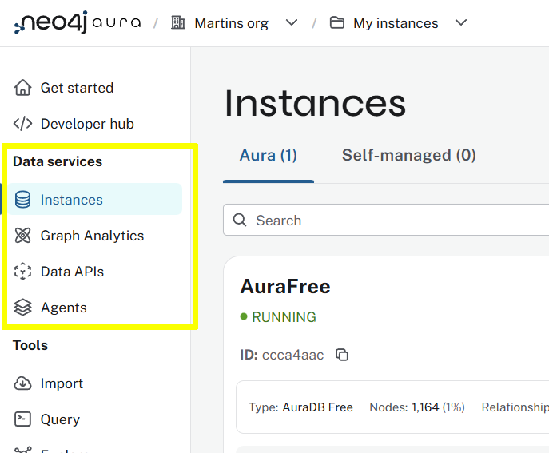

= Aura Overview
:type: lesson
:order: 3

== Console
The Aura console allows you to manage your Neo4j Aura database instances.

image::images/console.png["Aura Console"]

== Data Services

Data Services provides access to your Neo4j instances and data API services.

You can:

. Manage your Neo4j Aura instances.
. Setup Aura Graph Analytics instances.
. Configure GraphQL Data API services.
. Create AI agents and APIs to interact with your graph data.

== Tools

You can interact with your Neo4j Aura instances using a variety of tools:

. *Import* - Create graph data import jobs to load data from external sources.
. *Query* - Run Cypher queries against your database.
. *Explore* - Visualize and explore your graph data.
. *Dashboards* - Create dashboards to display metrics and insights.

== Operations and Projects

You can: 

* View metrics and logs for your instances.
* Manage Aura projects including security, usage, and billing.

image::images/operations.png["Operations and Projects"]

== Next

read::Continue[]

[.summary]
== Lesson Summary

In this lesson, you reviewed the Aura console and its features including Data Services, Tools, Operations, and Projects.
