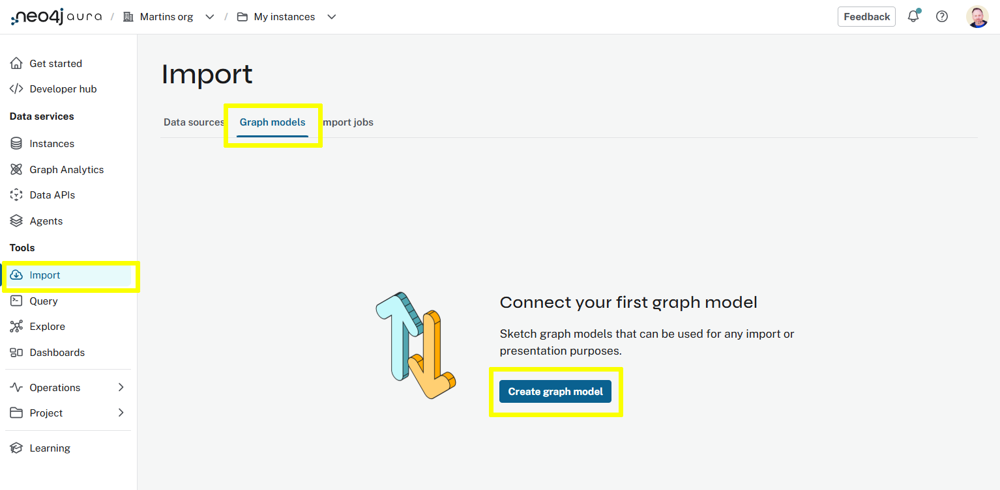
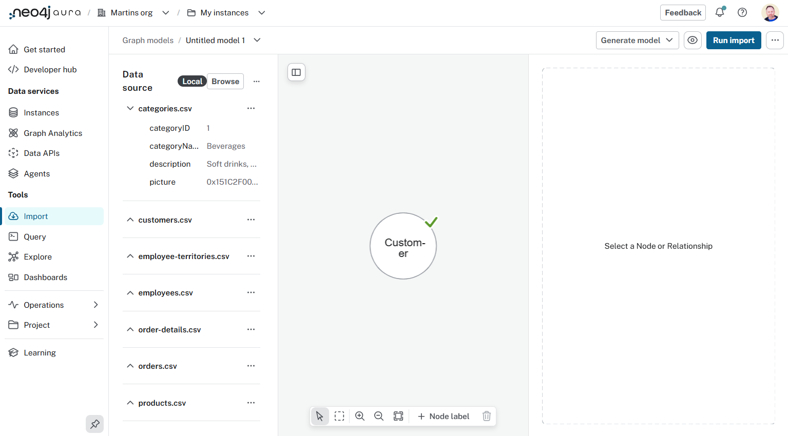
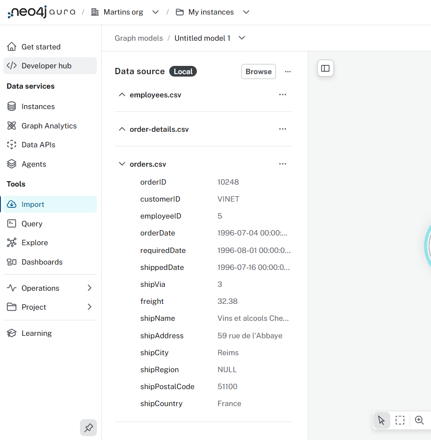
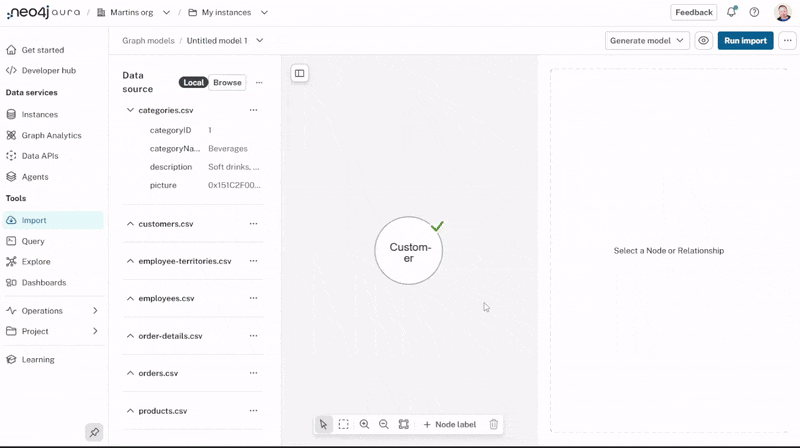
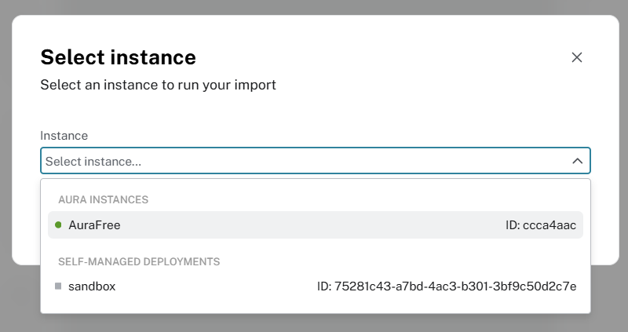
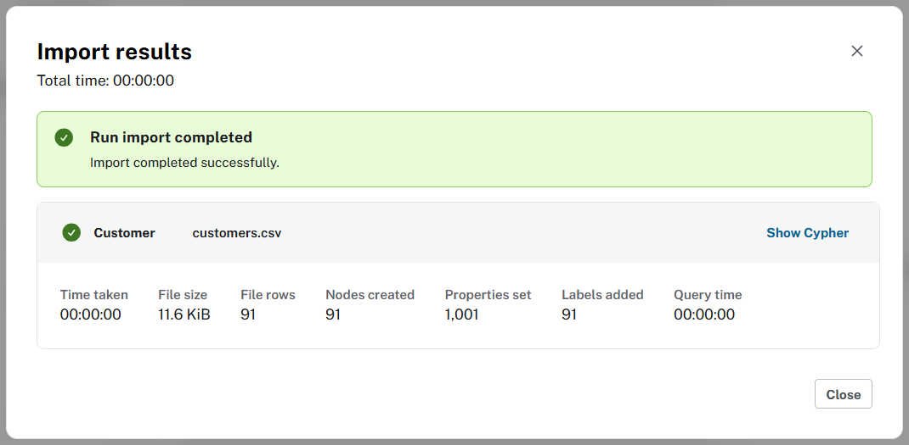

= Import
:type: lesson
:order: 2

You are going to import a relational dataset into your Neo4j Aura instance using the Import tool.

You will need to:

. Download the Northwind dataset
. Create a new graph data model
. Open the Northwind dataset in the Import tool
. Map the tables to the graph data model
. Run the import

== Northwind Dataset

The Northwind dataset contains data about a fictional company called Northwind Traders, which imports and exports specialty foods from around the world.

[source, mermaid]
.Northwind Relational Database Schema
----
include::diagrams/northwind.mermaid[]
----

== Create a graph data model

You need to link:data/northwind-customer.zip[download the Northwind dataset^] and create a new blank graph data model:

. link:data/northwind-customer.zip[Download the Northwind dataset^]
. Open the *Import* tool in Aura and select *Graph Models*. 
+

. Create a new graph data model.
. Use the `...` menu to `Open model (with data)` and select the `northwind-customer.zip` file you downloaded.
+
image::images/open-model-with-data-annotated.png["... menu - Open model with data"]

You will see the tables (csv files) from the Northwind dataset in the left-hand panel, and a single Customer node in the graph data model.

== Review the Data Source

Review the data source tables and try to identify:

- What tables will become Node labels
- The associated relationships between tables through their primary/foreign keys
- What fields will become properties on nodes and relationships

== Customer node

The `Customer` node has already been created for you. 

Select the node in the graph data model and review the data model in the right hand panel.

You should be able to identify the following:

* The node label - `Customer`.
* The source table - `customers.csv`.
* The node properties - the `name`, what data `type` is used, and what `column` from the source table is used for each property.
* What property is used as the unique ID for the node label - `customerId`.

== Run the import

Run the import to create the `Customer` nodes:

. Click *Run Import*
. Select your instance
+

. Enter your instance credentials
. A summary of the import will be displayed
+ 

You can view the Customers in the graph using the Query tool:

[source, cypher, role=noplay]
.Customer nodes
----
MATCH (c:Customer)
RETURN c
----

image::images/query-customer-nodes.png["Result of the query showing the Customer nodes"]

== Next

read::Continue[]

[.summary]
== Lesson Summary

In this lesson, you imported customer data from the Northwind dataset and started to build a graph data model.

In the next lesson, you will continue to build the graph data model by adding `Order` nodes and `PURCHASED` relationships between customers and orders.