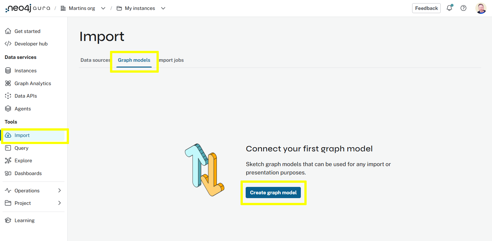
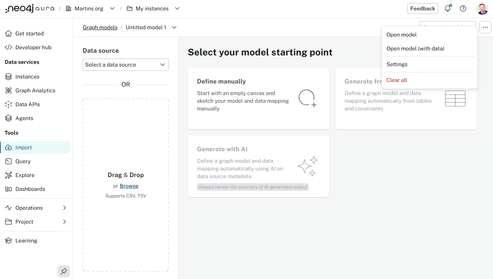
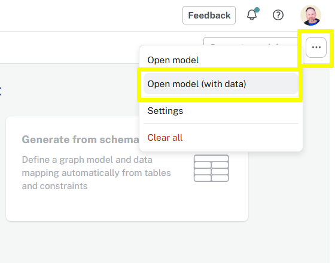
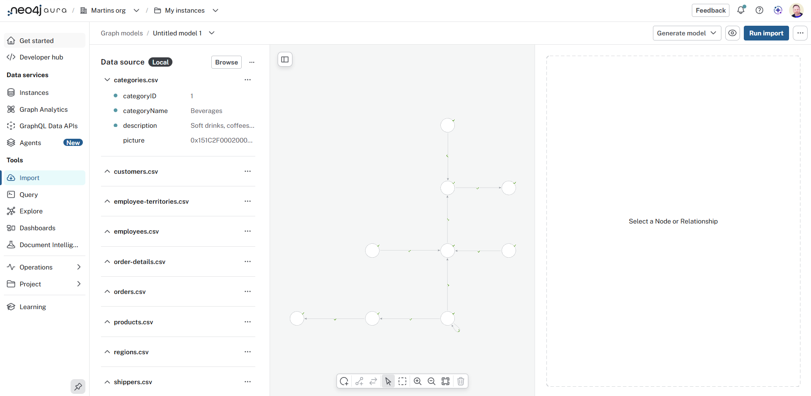
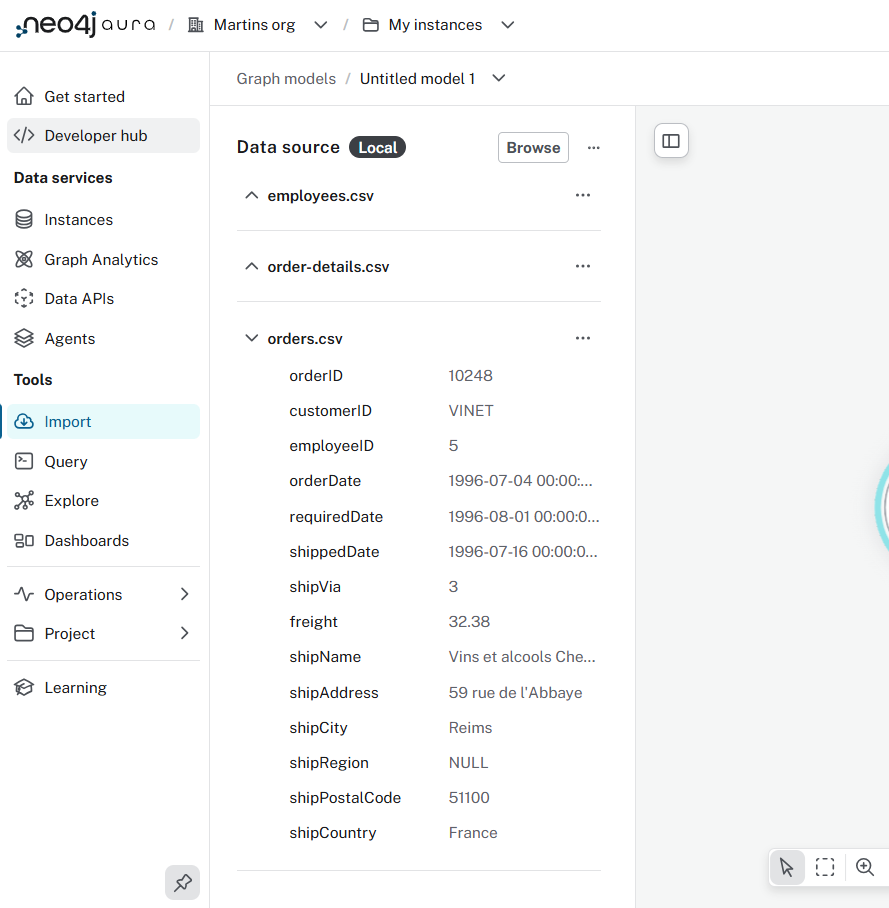
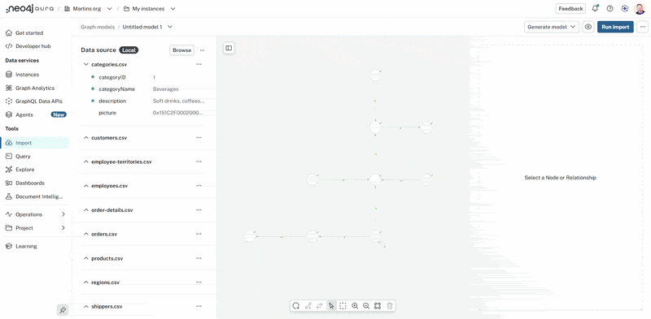
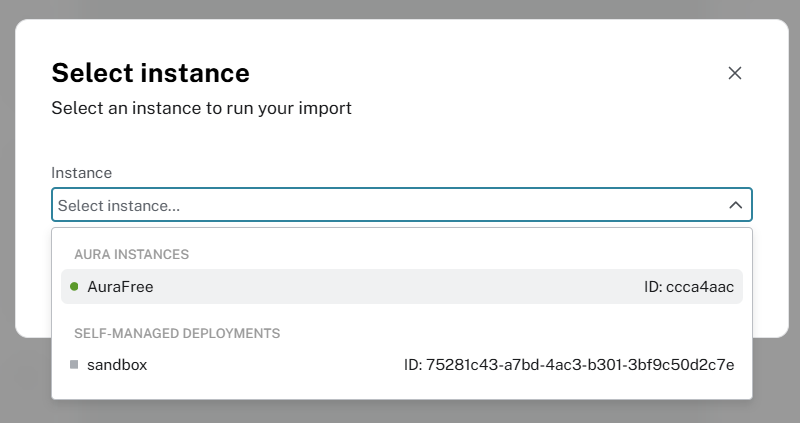
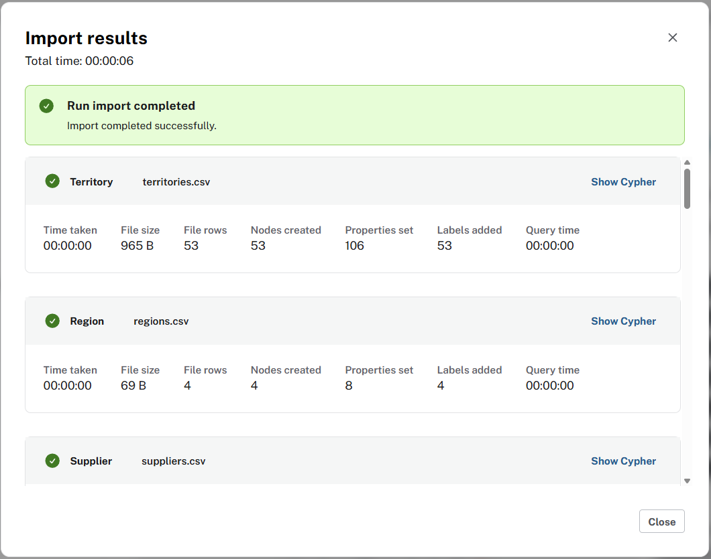
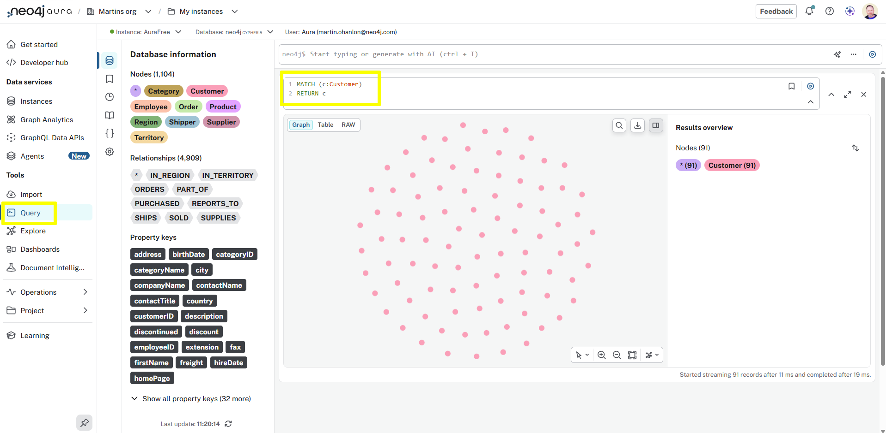

= Import
:type: lesson
:order: 2

[.slide.discrete]
== Introduction

You are going to import a relational dataset into your Neo4j Aura instance using the *Import* tool.

You will:

. Create a new graph data model from the Northwind dataset
. Explore and import a pre-built Northwind graph data model
. Learn how to build a graph data model in stages by mapping tables to nodes and relationships

[.slide.col-40-60]
== Northwind Dataset

[.col]
====
The Northwind dataset contains data about a fictional company called Northwind Traders, which imports and exports specialty foods from around the world.

The dataset contains tables for Customers, Orders, Products, Categories, and Employees.
====

[.col]
====
=====
[source, mermaid]
.Northwind Relational Database Schema
----
include::diagrams/northwind-simplified.mermaid[]
----
=====
====

// todo - awaiting website fix
// [.col]
// ====
// [.slide-only]
// =====
// [source, mermaid, role="slide-only"]
// .Northwind Relational Database Schema
// ----
// include::diagrams/northwind-simplified.mermaid[]
// ----
// =====

// [.transcript-only]
// =====
// [source, mermaid]
// .Northwind Relational Database Schema
// ----
// include::diagrams/northwind.mermaid[]
// ----
// =====
// ====

[.slide]
== Create a graph data model

[.slide-only]
====

Your task is to:

. Download the Northwind dataset
. Create a new graph data model in the *Import* tool
. Open the Northwind dataset
. Review the source data and graph data model

**Continue with the lesson to create the graph data model**
====

[.transcript-only]
=== Import the Northwind dataset

You need to link:https://raw.githubusercontent.com/neo4j-graph-examples/northwind/refs/heads/main/import/northwind-complete.zip[download the Northwind dataset^] and create a new blank graph data model:

. link:https://raw.githubusercontent.com/neo4j-graph-examples/northwind/refs/heads/main/import/northwind-complete.zip[Download the Northwind dataset^]
. Open the *Import* tool in Aura and select *Graph Models*. 
+
console::Open Import Tool[tool=import]
+

. Create a new graph data model.
+

. Use the `...` menu to `Open model (with data)` and select the `northwind-complete.zip` file you downloaded.
+

. You will see the tables (csv files) in the left-hand panel, and a graph data model of the Northwind dataset.
+

[.slide.col-60-40]
== Review the Data Model

[.col]
====
Review the data source tables and try to identify:

- What tables will become Node labels
- The associated relationships between tables through their primary/foreign keys
- What fields will become properties on nodes and relationships
====

[.col]

[.slide.col-60-40]
== Northwind Graph Data Model

[.col]
====
Here is the complete graph data model for the Northwind dataset.

How does it compare to your thoughts after reviewing the source data?
====

[.col]
====
[source, mermaid]
.Northwind Graph Model
----
include::diagrams/northwind-graph-model.mermaid[]
----
====

[.slide]
== Load the data

[.slide-only]
====
You task is to: 

. Explore the graph data model to understand how the source data maps to the graph
. Run the import to create data model
. Query the graph to see the imported data

**Continue with the lesson to create the graph data model**
====

[.transcript-only]
=== Customer node

Find the `Customer` node in the graph data model.

Select the `Customer` node in the graph data model and review the data model in the right hand panel.

[TIP]
.Zoom in
====
You will have to zoom in on the graph data model to see the node labels and relationship types.
====

You should be able to identify the following:

* The node label - `Customer`.
* The source table - `customers.csv`.
* The node properties - the `name`, what data `type` is used, and what `column` from the source table is used for each property.
* What property is used as the unique ID for the node label - `customerId`.

This mapping is how the import tool creates the graph data model from the source data.

[.transcript-only]
=== Nodes and relationships

Review the other nodes and relationships in the graph data model and identify how the source data maps to the graph.

Try to identify:

* What tables become node labels
* What tables become relationships
* What fields become properties on nodes and relationships

[.transcript-only]
=== Run the import

Run the import to create the graph data model:

. Click *Run Import*
. Select your instance
+

. Enter your instance credentials (if required)
. A summary of the import will be displayed
+ 

[.slide.col-2]
== Query the graph

[.col]
====
You can view the data in the graph using the *Query* tool.

[.transcript-only]
=====
console::Open Query Tool[tool=query]
=====

Run the following query to return the `Customer` nodes:

[source, cypher, role=noplay]
.Customer nodes
----
MATCH (c:Customer)
RETURN c
----
====

[.col]

[.transcript-only]
=== Experiment with the data

Try running some queries to explore the data. For example:

[source, cypher, role=noplay]
.Customer orders
----
MATCH (c:Customer)-[p:PURCHASED]->(o:Order)
RETURN c.companyName, o.orderID, o.orderDate
----

[source, cypher, role=noplay]
.Graph of products order by a customer
----
MATCH (c:Customer)-[p:PURCHASED]->(o:Order)-[orders:ORDERS]->(product:Product)
WHERE c.customerID = "ERNSH"
RETURN c, p, o, orders, product
----

[source, cypher, role=noplay]
.Employees, territories and regions
----
MATCH (e:Employee)-[it:IN_TERRITORY]->(t:Territory)-[ir:IN_REGION]->(r:Region)
RETURN e, it, t, ir, r
----

read::Continue[]

[.summary]
== Lesson Summary

In this lesson, you imported customer data from the Northwind dataset and started to build a graph data model.

In the next lesson, you will continue to build the graph data model by adding `Order` nodes and `PURCHASED` relationships between customers and orders.
