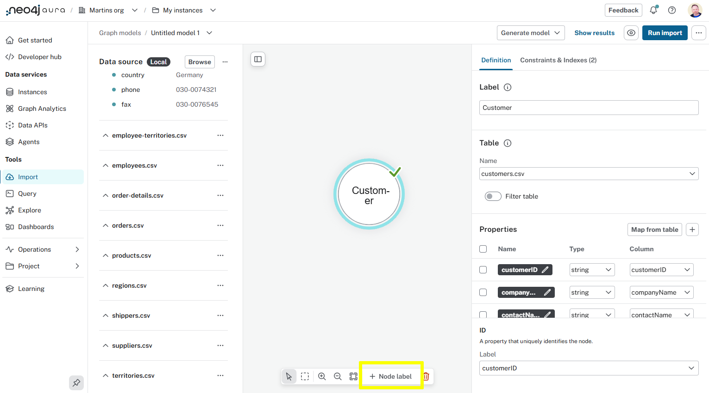
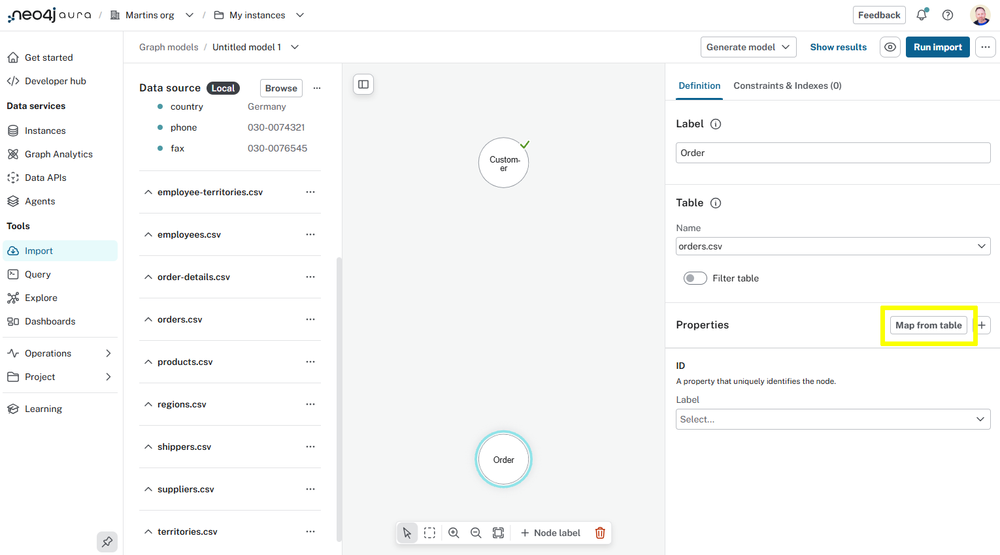
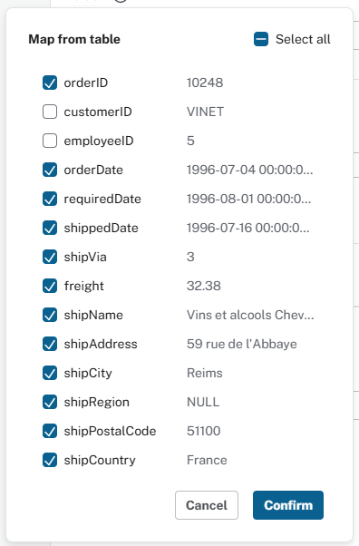
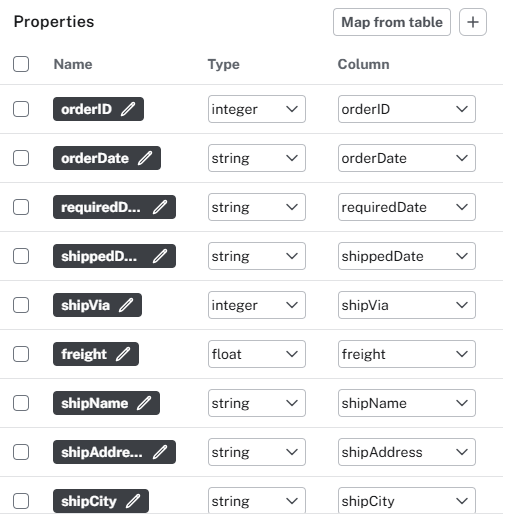
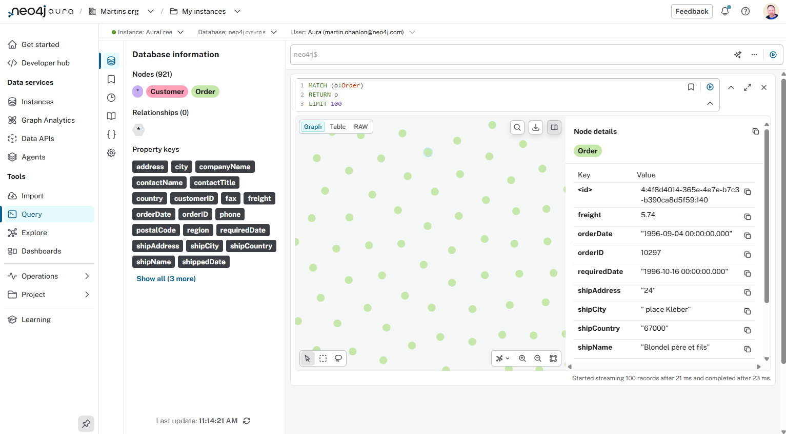
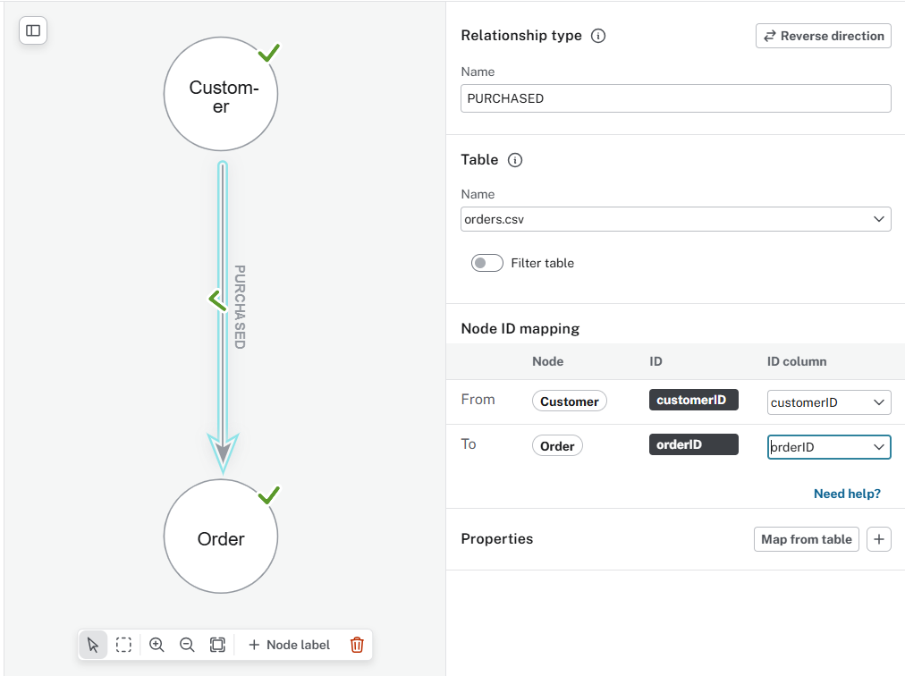
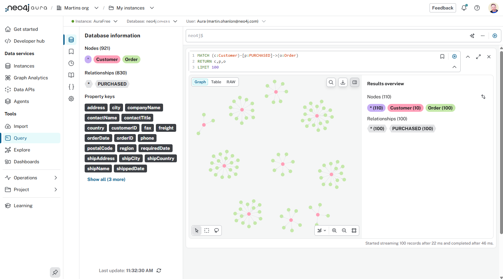

= Nodes and Relationships
:type: lesson
:order: 3

[.slide.discrete]
== Introduction

To extend your graph data model to including customers order you will: 

. Create `Order` nodes. 
. Connect `Customer` nodes to `Order` nodes with a `PURCHASED` relationship.
. Run the import and view the results.

[source, mermaid]
----
include::diagrams/customer-purchased-order.mermaid[]
----

todo - Continue with the workshop

== Order nodes

Create the `Order` nodes:

. Create a new *Node label* - `Order`
+

. Add the `Order` as the *Label*
. Select `orders.csv` as the *Table*
. Use the *Map from table* function to create the properties:
+

. Select all the columns, except the `customerId` and `employeeId`.
+

+
When you confirm the mapping, the properties, their data types, and column will be automatically mapped. 
+

* The `orderId` property should be selected as the unique ID.

You can *run the import* to create the `Order` nodes.

[NOTE]
.Reconnect and authenticate
====
If you're using a free Aura instance you will need to reconnect and enter your credentials before each run.
====

View the orders in the graph:

[source, cypher, role=noplay]
.Order nodes
----
MATCH (o:Order)
RETURN o
LIMIT 100
----

== PURCHASED

You can now create the `(Customer)-[:PURCHASED]->(Order)` relationship.

. Drag a relationship from the `Customer` node to the `Order` node.
+
image::images/create-relationship.gif["Creating a relationship by dragging an arrow from the source node to the target node"]
. Set the *Relationship Type* to `PURCHASED`
. Select `orders.csv` as the *Table*
. The Node ID mapping tells Import how to connect the nodes.
** Select `customerID` from the the `Customer` node
** Select `orderID` from the `Order` node
+

. Run the import

[%collapsible]
.Need a working solution?
====
:model-filename: northwind-customer-order.zip
:model-name: Customer-PURCHASED-Order data model

include::../../shared/download-model.adoc[]
====

[.slide.discrete]
== View customers and their orders

View the customer's purchased orders:

[source, cypher, role=noplay]
.Customer orders
----
MATCH (c:Customer)-[p:PURCHASED]->(o:Order)
RETURN c,p,o
LIMIT 100
----

== Products

Repeat the same process to add `Product` nodes and `ORDERS` relationship to `Order` nodes.

[source, mermaid]
----
include::diagrams/order-orders-product.mermaid[]
----

To include the product nodes you will need to:

. Add a new `Product` node label importing from `products.csv`
. Map the properties from the table
. Set the `productId` as the unique ID.

To create the relationship from `Order` to `Product`:

. Drag a new relationship from `Order` to `Product` with type `ORDERS`
. Use `order-details.csv` as the source table.
. Use the `customerID` and productID` for the node ID mapping.
. Map the `unitPrice`, `quantity` and `discount` as relationship properties.

[%collapsible]
.Need a working solution?
====
:model-filename: northwind-customer-order-product.zip
:model-name: Customer-Order-Product data model

include::../../shared/download-model.adoc[]
====

== Next

read::Continue[]

[.summary]
== Lesson Summary

In this lesson, you learned extend your graph data model by adding new nodes and relationships

In the next challenge, you will review the data set, identify new nodes and relationships and add them to the graph.
