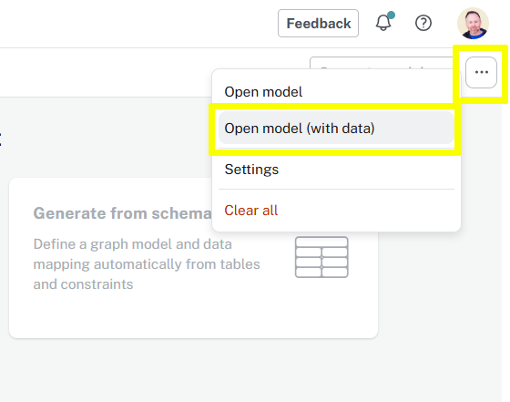

= The Complete Graph
:type: lesson
:order: 5

Here is an example complete graph data model for the Northwind dataset.

[source, mermaid]
.Northwind Graph Model
----
include::diagrams/northwind-graph-model.mermaid[]
----

How does it compare to the graph data model you created in the previous lesson?

[NOTE]
.It depends!
====
There is no right or wrong answer to this challenge.

The model you created is just as valid. A model is partially driver by the questions you want to ask of the data and the insights you want to gain. Your experience is different to others and your model may be different. 

Graph data models in Neo4j can be easily evolve as your use case changes.
====

== Download and import the model

If you want to... 

You can download the complete graph data model, and import it into your instance:

. Delete all the data from your instance:
+
[source, cypher, role=noplay]
----
MATCH (n) DETACH DELETE n
----
. link::data/northwind-complete.zip[Download the Northwind Complete data model^]
. Use the `...` menu and select the *Open Model (with data)*
+

. Run the import.

== Next

read::Continue[]

[.summary]
== Lesson Summary

In this lesson, you learned about ..

In the next lesson, you will learn about ..