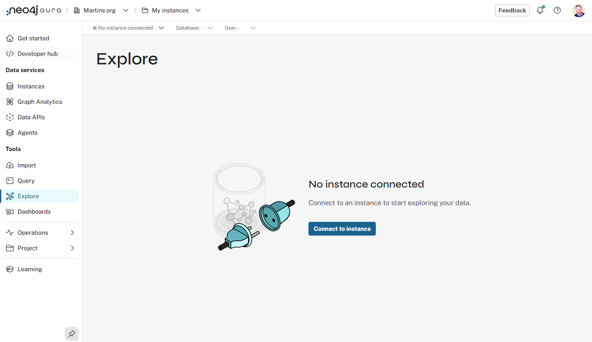
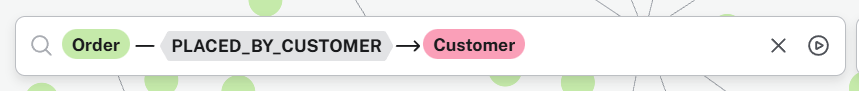

= Explore
:type: lesson
:order: 1
:image-path: {cdn-url}/aura-fundamentals/modules/3-services-tools/lessons/3-explore/images

[.slide.discrete]
== Introduction

You will learn how to:

* Connect to your Aura instance using the explore tool
* Explore and visualize your data
* Understand the differences between the **Query Tool** and the **Explore Tool**

[.slide.discrete.col-2]
== Explore Tool

[.col]
====
The **Explore** tool allows you to:

. Visualize and explore your graph data. 
. Interact with your data
. Search for nodes and relationships, visualize them, and edit the graph directly.
====

[.col]
image::{image-path}/03_explore_tool_start.jpg["Explore tool"]

[.slide.col-2]
== Connect

[.col]
====
Open the **Explore** tool and connect to your Aura instance.
====

[.col]

[.slide.col-2]
== Search

[.col]
====
Use the search bar to find Orders and their related Customers.

. <click> in the searchbar
. <select> `Customer`
. <select> `PURCHASED`
. <select> `Order`

Explore the results.
====

[.col]

[.slide]
== Features of the Explore tool

* **No Cypher knowledge required**: You can explore your data without needing to write Cypher queries.

* **Visual exploration**: You can interact with your data visually, making it easier to understand relationships and patterns.

* **Editing capabilities**: You can edit nodes and relationships directly in the graph view, without needing to write Cypher commands.

* **Perspectives**: You can create and share Perspectives, which are predefined views of your data that can include specific search phrases and styling options.

[.slide]
== Considerations

1. The model has to be understood. You can explore the data knowing what the database holds and how it is organized.

2. Security does apply. If the user's role does not allow editing the database this step will not work. The user will be informed about that.

3. Defining these queries (also known as **search phrases**) does require knowledge of Cypher syntax. As the Perspectives can be shared, not everybody needs to have that knowledge.

[.next]
== Next

read::Continue[]

[.summary]
== Lesson Summary

In this lesson, you about the explore tool, how to connect to your Aura instance, and how to visualize and interact with your graph data.

In the next lesson, you will create a dashboard to visualize key metrics from your graph data.
