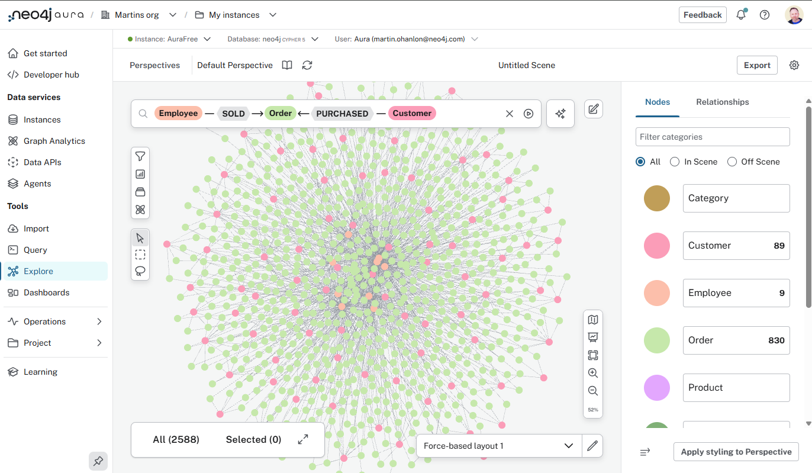
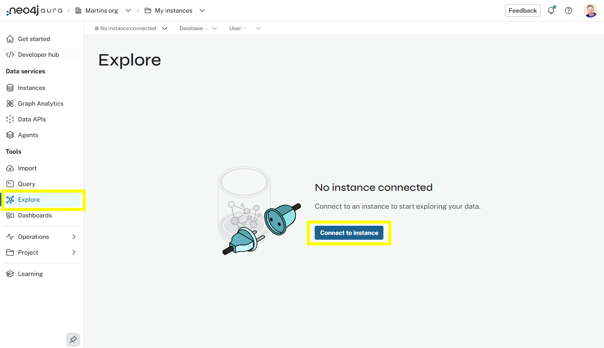
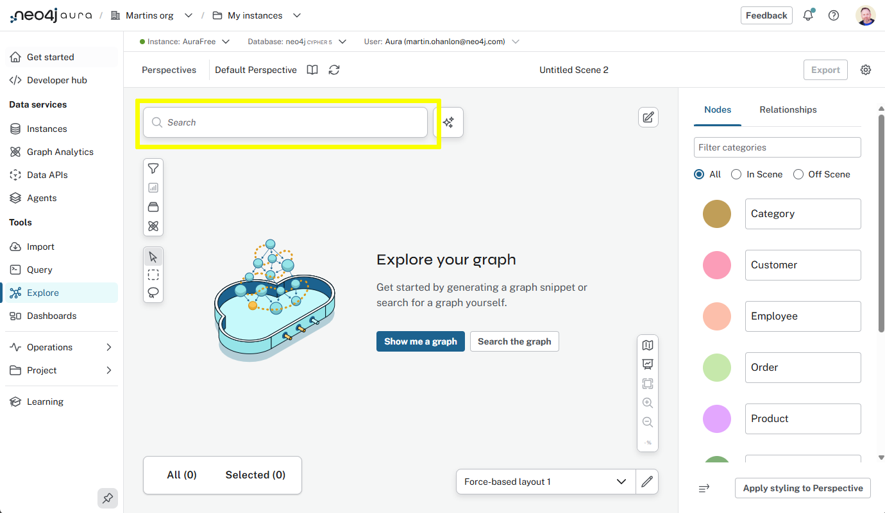
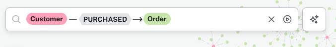

= Explore
:type: lesson
:optional: true
:order: 1

[.slide.discrete]
== Introduction

You will learn how to:

* Connect to your Aura instance using the *Explore* tool
* Use search to find nodes and relationships
* Explore and visualize your data

[.slide.discrete.col-2]
== Explore Tool

[.col]
====
The **Explore** tool allows you to:

. Visualize and explore your graph data. 
. Interact with your data
. Search for nodes and relationships, visualize them, and edit the graph directly.
====

[.col]

[.slide]
== Search

Your task is to use the *search* to find customers and their orders:

. Connect to your Aura instance.
. Use search to create a scene of customers and order
. Explore the results.

[.slide-only]
====
**Continue with the lesson to explore your graph **
====

[.transcript-only]
=== Connect

Open the **Explore** tool and connect to your Aura instance:

console::Open Explore[tool=explore]

[.transcript-only]
=== Customers and Orders

You can use the search bar to create a _scene:_

To find Orders and their related Customers:

. <click> in the searchbar
. <select> `Customer`
. <select> `PURCHASED`
. <select> `Order`

Explore the results. Click on nodes and relationships to view their properties. Use the toolbar to change the layout, colors, and other visualization options.

[.transcript-only]
=== Experiment

Experiment with the search to find different parts of the graph, for example:

. Specific customers, such as [copy]#Alfreds Futterkiste#.
. Adding `Product` to the search to find out what products customers are purchasing.
. Finding which employee `SOLD` the orders to customers.

[.next]
== Next

read::Continue[]

[.summary]
== Lesson Summary

In this lesson, you about the explore tool, how to connect to your Aura instance, and how to visualize and interact with your graph data.

In the next lesson, you will create a dashboard to visualize key metrics from your graph data.
