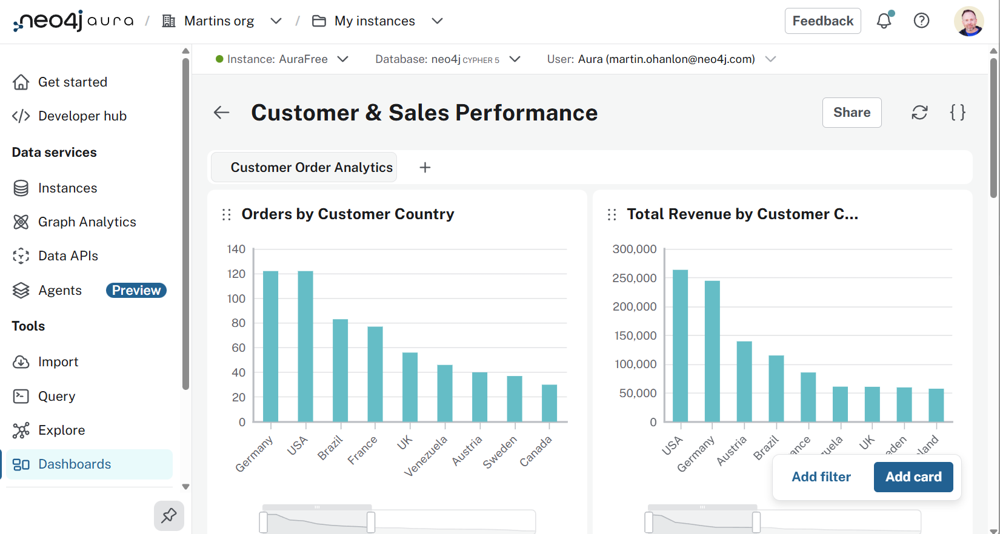
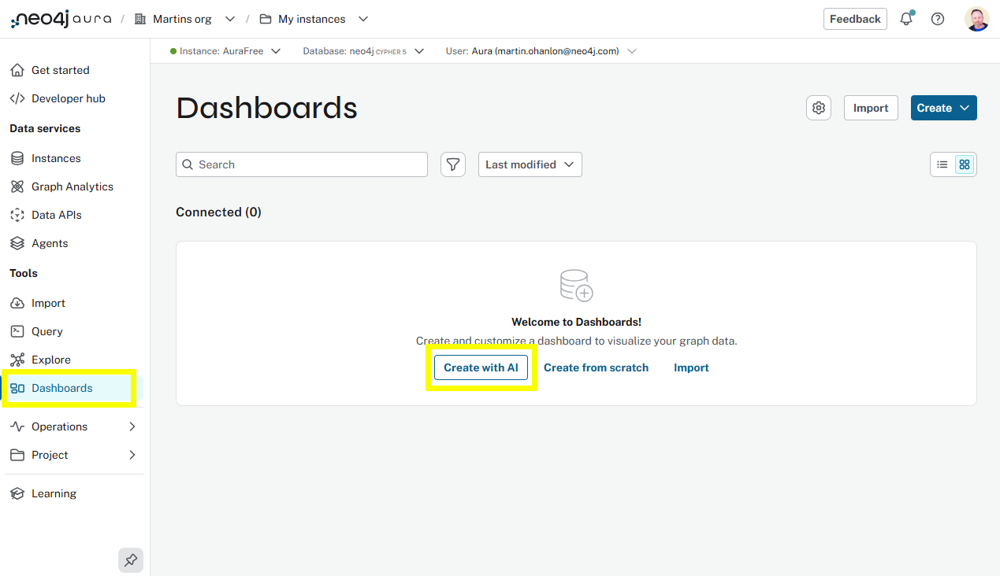
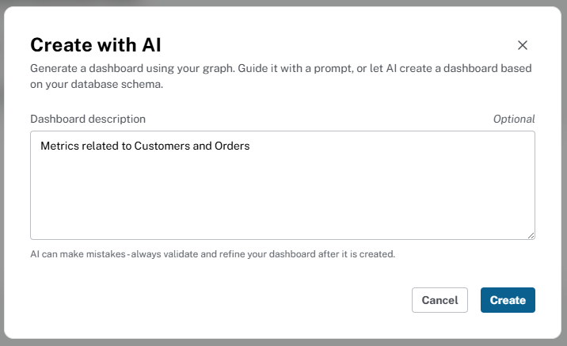
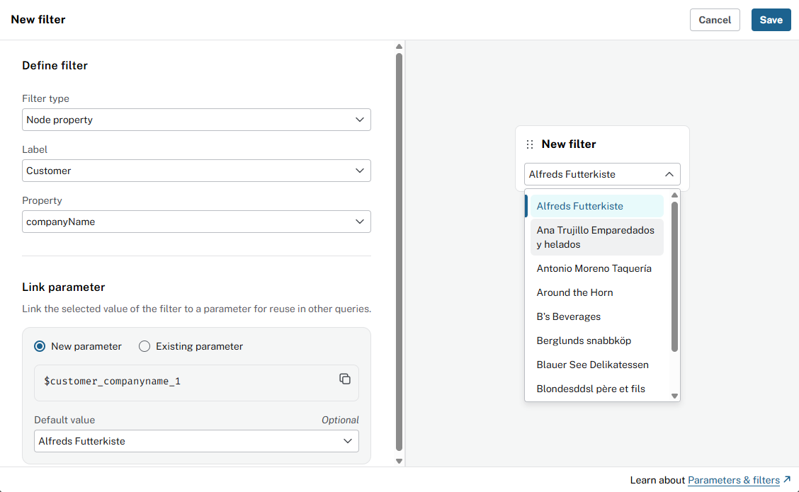
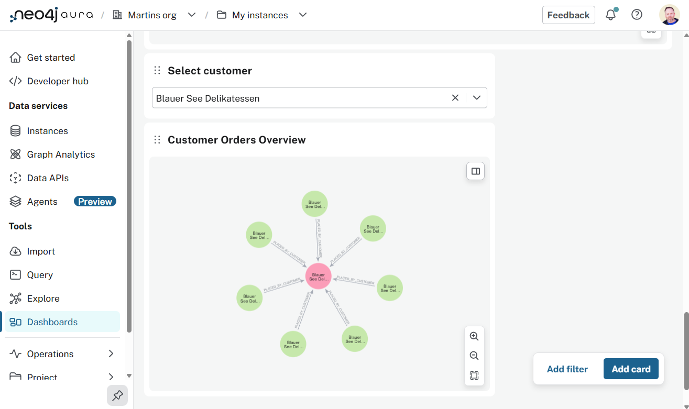

= Dashboards
:type: lesson
:order: 2
:image-path: {cdn-url}/aura-fundamentals/modules/3-services-tools/lessons/4-dashboard/images

[.slide.discrete.col-2]
== Creating dashboards in Aura

[.col]
====
You will learn how to:

* Create interactive dashboards in Aura
* Build dashboard cards with Cypher queries
* Add filters to make dashboards dynamic
====

[.col]

[.slide]
== Building dashboards with AI assistance

You can create a new AI generated dashboard 

. Select "Create with AI".
+
[.transcript-only]
====

====
. Enter the prompt - [copy]#Metrics related to Customers and Orders#.
+
[.transcript-only]
====

====
. The dashboard will be generated based on your prompt.

[.slide]
== Create a dashboard card

You can modify the dashboard by adding new cards:

. Click **Add a card** to create a new visualization.
+
Dashboard cards are individual components that display specific data visualizations.
. Change the card title from "New card" to "Customer Orders Overview"
. Select **Graph** from the visualization type dropdown
. Use the following Cypher query in the Query field:

[source,cypher,role=noplay]
----
MATCH (c:Customer)<-[r:PURCHASED]->(o:Order)
WHERE c.companyName = 'Eastern Connection'
RETURN c,r,o
----

[.slide.col-2]
== Making dashboards interactive with filters

[.col]
====
Filters allow users to dynamically change what data is displayed without modifying queries.

You will create a filter that lets users select a specific customer to view their orders.

On the dashboard select **Add filter**.

Create a filter with the following settings:

* Filter type: **Node property**
* Node label: `Customer`
* Property key: `companyName`
====

[.col]

[.slide.col-2]
== Linking filters to dashboard cards

[.col]
====
Update the Customer Orders Overview card query to use the filter parameter.

[source,cypher,role=noplay]
----
MATCH (c:Customer)<-[r:PURCHASED]->(o:Order)
WHERE c.companyName = $customer_companyname
RETURN c,r,o
----
====

[.col]

[.slide]

== Where dashboards fit in your workflow

Dashboards enable rapid prototyping of data visualizations and serve as the bridge between your graph database and stakeholders.

The dashboards tool is useful for:

* Quick data exploration and validation
* Creating stakeholder presentations
* Building operational monitoring dashboards
* Prototyping before investing in custom applications

[.next]
== Next

read::Continue[]

[.summary]
== Lesson Summary

In this lesson, you created a dashboard in Aura using the AI assistant, and modified it by adding cards and filters.

In the next lesson, you will create an agent to interact with your graph data using natural language.
