= Dashboards
:type: lesson
:optional: true
:order: 2
:image-path: {cdn-url}/aura-fundamentals/modules/3-services-tools/lessons/4-dashboard/images

[.slide.discrete.col-2]
== Introduction

[.col]
====
Aura Dashboards allow you to:

* Create interactive dashboards using your graph data.
* Display metrics and insights with customizable cards.
* Use filters to make dashboards dynamic and interactive.
* Display data in various formats, including tables, charts, and maps.
====

[.col]
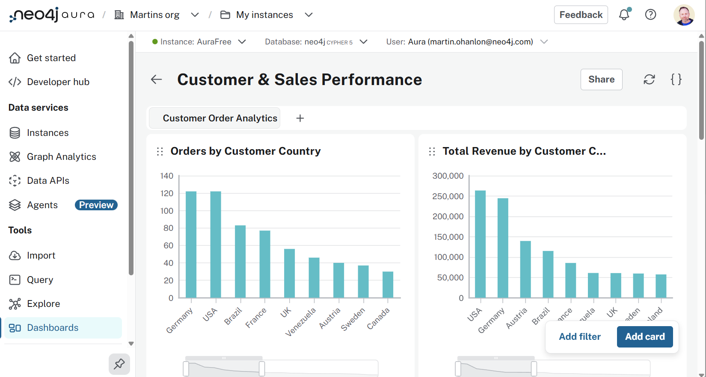

[.slide]
== Building dashboards

You task is to :

* Create a dashboards using the AI assistant
* Add a new dashboard card with a custom Cypher query
* Add filters and parameters to make the card dynamic

[.slide-only]
====
**Continue with the lesson to build your a dashboard**
====

[.transcript-only]
== AI generated dashboard

You can create a new dashboard using the *Create with AI* feature:

. Open the *Dashboards* tool
+
console::Open Dashboards[tool=dashboards]

. Select *Create with AI*.
+
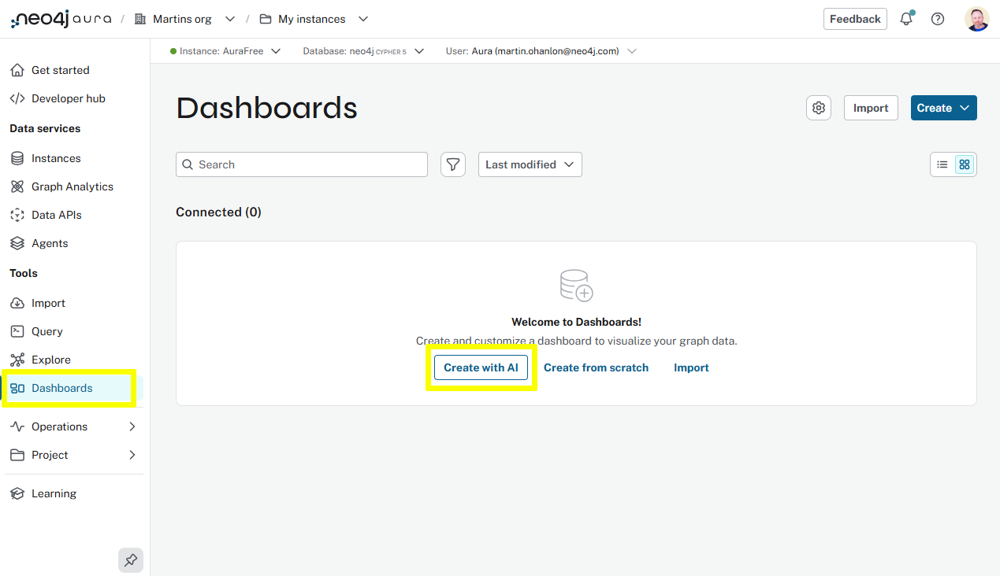

. Enter a description of the dashboard you want to create, such as [copy]#Metrics related to Customers and Orders#.
+
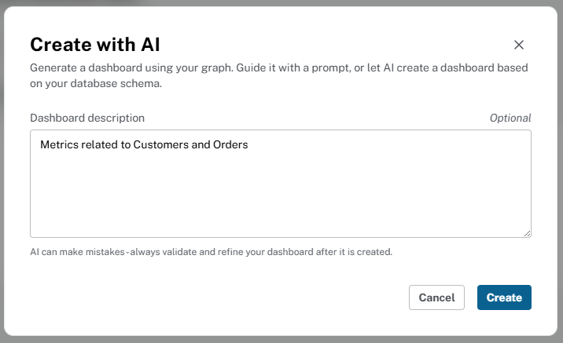

. The dashboard will be generated based on your description.
+
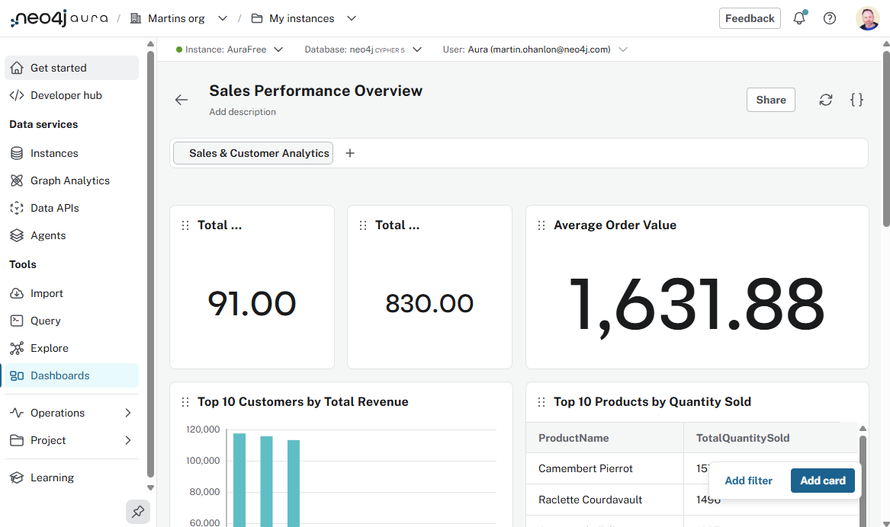

Explore the dashboard and the information it contains.

=== Create a dashboard card

You can add additional information to your dashboard by adding new *cards*.

[NOTE]
.Cards
====
Dashboard cards are individual components that display specific data visualizations.
====

You are going to add a card that shows the graph of a specific customer's orders:

. Click **Add a card** to create a new visualization.
+
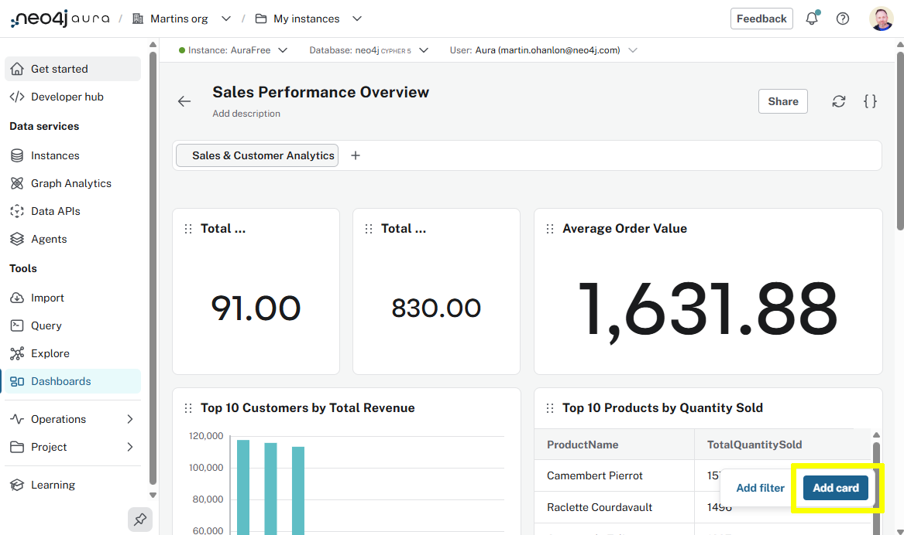

. Change the card title from "New card" to [copy]#Customer Orders Overview#.

. Select **Graph** from the visualization type dropdown
+
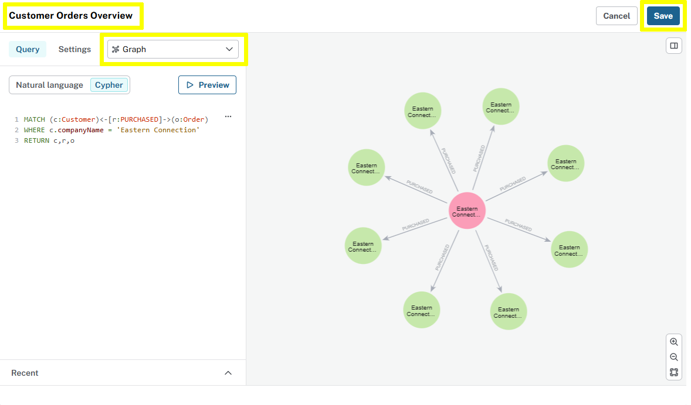

. Use the following Cypher query in the Query field:
+
[source,cypher,role=noplay]
----
MATCH (c:Customer)<-[r:PURCHASED]->(o:Order)
WHERE c.companyName = 'Eastern Connection'
RETURN c,r,o
----
+
[TIP]
.Previewing the card results
====
You can preview the results of the card query before saving it by clicking the *Preview* button.
====

. *Save* the card.

Your new card will be added to the bottom of dashboard, showing the orders for the customer "Eastern Connection".

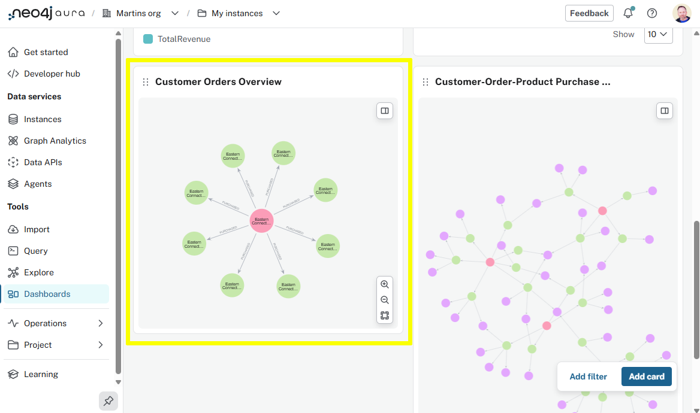

=== Making cards interactive with filters

Filters allow you to dynamically change what data is displayed without modifying the cards.

You can create a filter that lets users select what customer they want to view the orders for:

. Select **Add filter**.
+
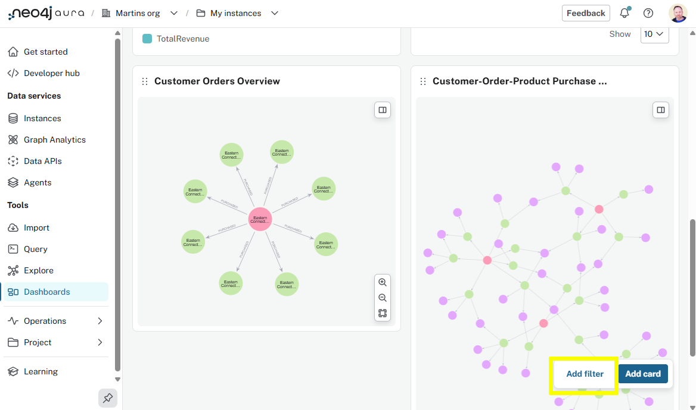

. Edit the filter name from "New filter" to [copy]#Customer Filter#.

. Create a filter with the following settings:

* Filter type: `Node property`
* Node label: `Customer`
* Property key: `companyName`

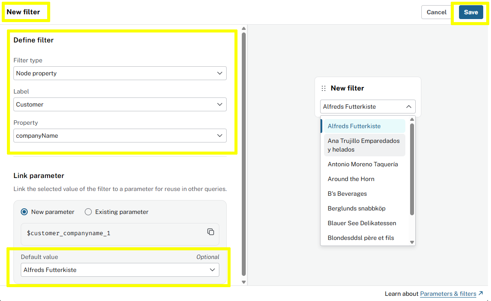

. Add a default value for the filter, such as `Alfreds Futterkiste`.

. *Save* the filter.

The filter will be added to the dashboard, allowing you to select different customers from the dropdown.

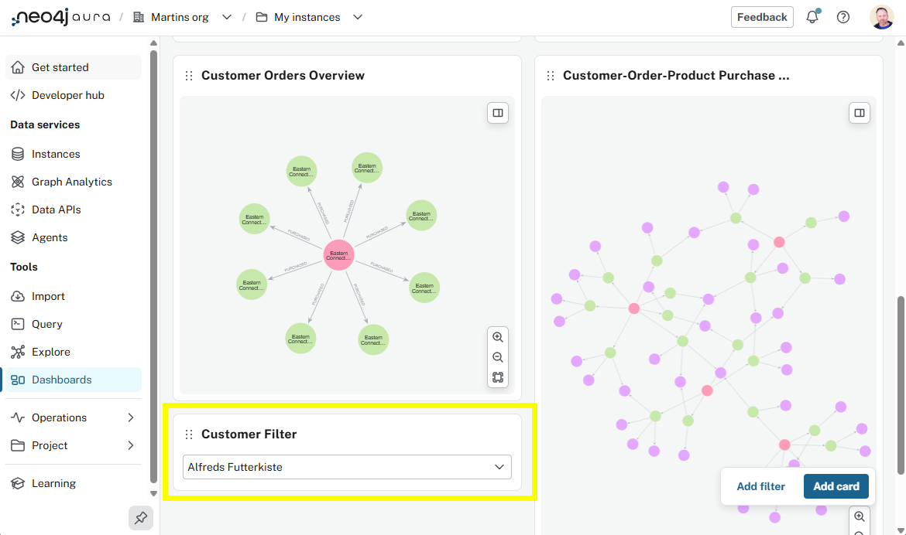

=== Link the filter to the card

You need to update the card query to use the filter parameter:

. Edit the *Customer Orders Overview* card.
+
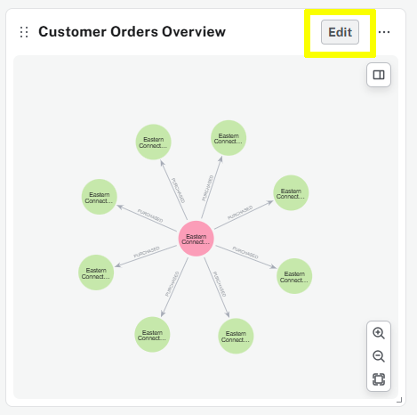

. Update the query to use the new filter parameter.
+
[source,cypher,role=noplay]
----
MATCH (c:Customer)<-[r:PURCHASED]->(o:Order)
WHERE c.companyName = $customer_companyname
RETURN c,r,o
----

. Save the card.

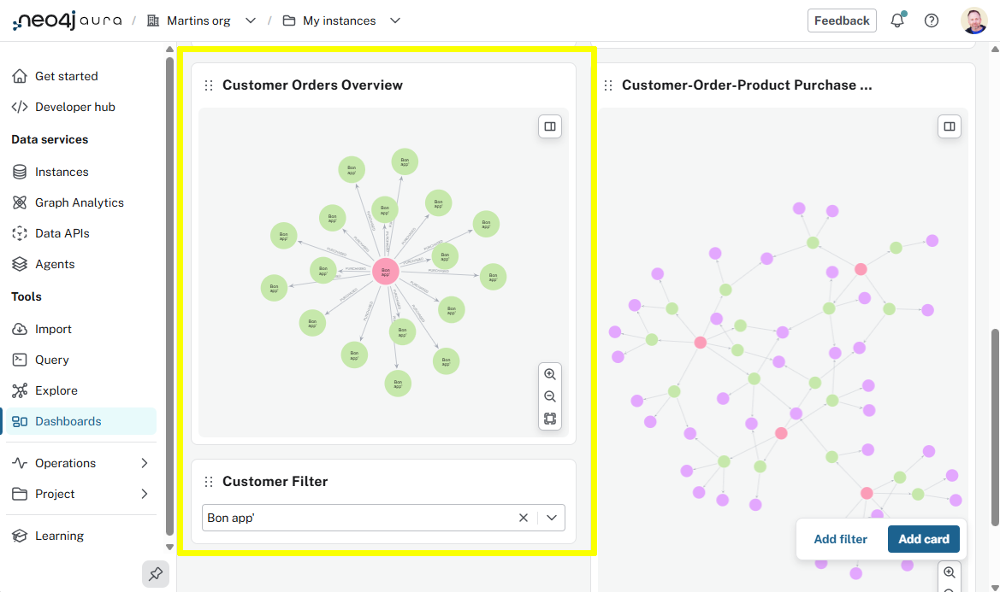

Updating the filter selection will now update the card results, allowing you to explore different customers and their orders.

Experiment by modifying other cards on the dashboard to use the filter.

read::Continue[]

[.summary]
== Lesson Summary

In this lesson, you created a dashboard in Aura using the AI assistant, and modified it by adding cards and filters.

In the next lesson, you will create an agent to interact with your graph data using natural language.
