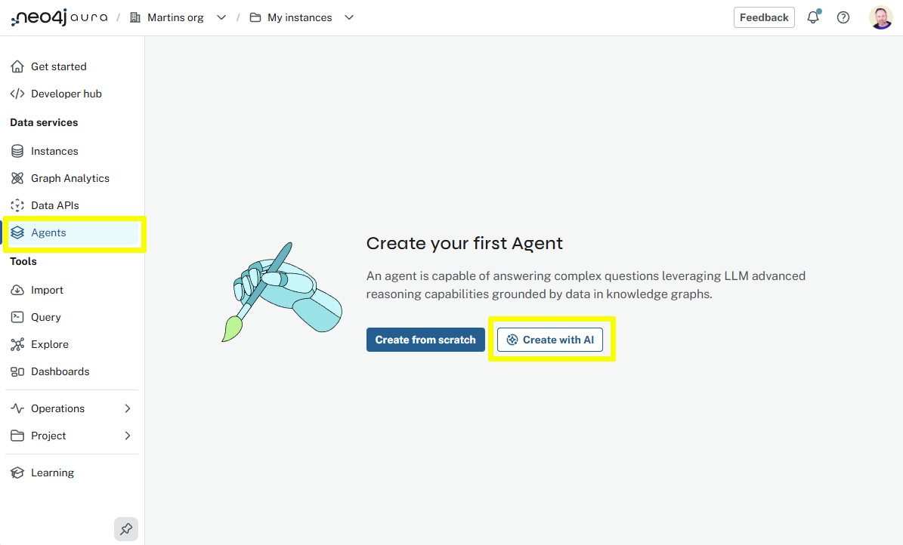
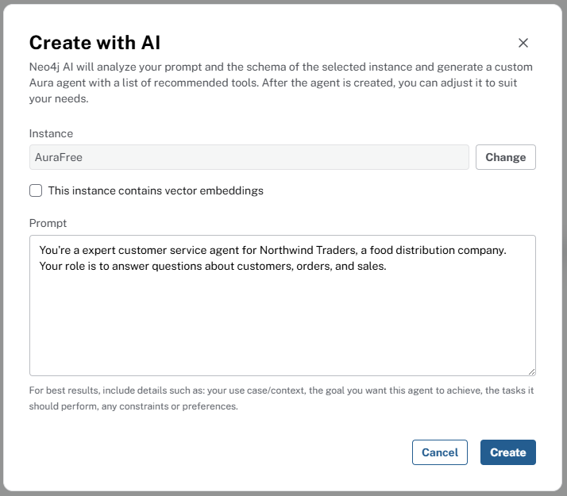
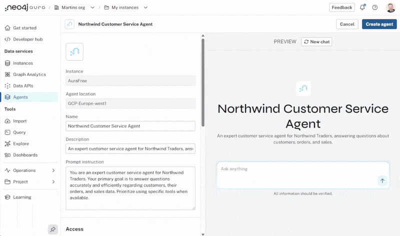
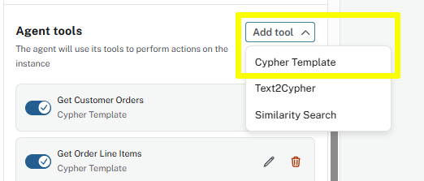
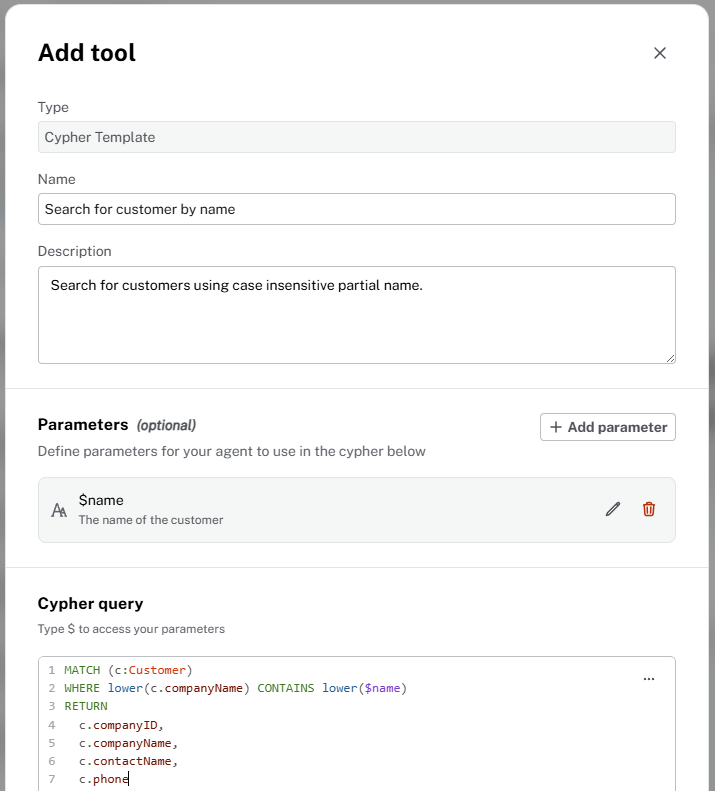
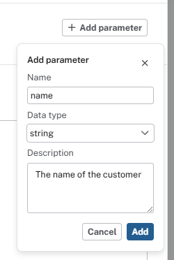

= Agents
:type: lesson
:order: 3
:image-path: {cdn-url}/workshop-genai/modules/4-agents/lessons/1-what-is-an-agent/images

[.slide.discrete]
== Definition

You are going to learn how to create an Aura AI agent that can interact with your Neo4j database and external tools.

An **AI agent** is a system that combines a Large Language Model (LLM) with the ability to take actions in the real world.

An agent can interact with external systems, retrieve information, and execute tasks autonomously.

[.slide]
== Key Components of an Agent

**LLM**: The agent uses an LLM for reasoning, planning, and decision-making.

**Tools**: Agents have access to a set of _tools_ that extend their capabilities beyond text generation. Tools are typically retrievers that can:

* Access databases
* Make API calls to external services
* Undertake File system operations
* Search the web
* Execute code

**Decision Making**: The agent uses the LLM to analyze tasks, determine which tools are needed, and coordinate their use to achieve goals.

[.slide.col-2]
== How Agents Work

[.col]
====
1. **Receive a task** or query from a user
2. **Plan and reason** using the LLM to break down complex tasks
3. **Select and execute tools** based on what's needed
4. **Observe and process results** and determine next steps
5. **Iterate** until the task is complete or provide a final response

This autonomous capability makes agents particularly powerful for complex, multi-step tasks that require both reasoning and real-world interaction.
====

[.col]
image::{image-path}/agent-process.svg["A flowchart showing the agent process from user input to LLM reasoning, tool selection, tool execution, and final output.", width=90%]

// todo - continue with the lesson

[.slide]
== Creating an Aura Agent

You are going to use the Aura Agents *Create with AI* feature to access your Neo4j database.

[.slide-only]
====
**Continue with the lesson to add Order nodes and PURCHASED relationships **
====

[.transcript-only]
=== Create an agent with AI

. Open the *Aura Agents* Data Service
. Create a new agent with AI
+

. Enter the prompt to create the - [copy]#You're an expert customer service agent for Northwind Traders, a food distribution company. Your role is to answer questions about customers, orders, and sales.#
+ 

. Aura will create an agent based on the prompt and the graph data model.

[.transcript-only]
=== Explore the Agent

Explore the agent' configuration and tools.

The tools are used by the agent to gather information and perform actions.

You can ask the agent questions about the data.

Try the following questions:

. [copy]#Who is our best customer?#
. [copy]#What do they buy?#
. [copy]#Which sales representative do they work with?#

You can see the agent's reasoning and tool use by expanding the *Thought* section in the agent's response:

image::images/agent-reasoning.png["Agent response showing the thought process and tool use"]

[.transcript-only]
=== Add a tool

You can add tools to the agent to extend its capabilities.

The agent has no way of searching customers by name, you will add a tool to allow it to do that:

. Click *Add Tool* in the agent configuration
. Select the *Cypher Template* tool
+

. Add the following configuration to the tool:
+

** Name: `Search for customer by name`
** Description: `Search for customers using case insensitive partial name.`
** Add a Parameter called `$name`, type `string`, and description `The name of the customer`
+

** Cypher Query:
+
[source, cypher, role=noplay]
----
MATCH (c:Customer)
WHERE lower(c.companyName) CONTAINS lower($name)
RETURN 
  c.companyID,
  c.companyName, 
  c.contactName,
  c.phone
----
** Save the changes to the tool
. Ask the agent to find a customer by name - [copy]#Find the customer with the name holdings#

Review the agent's reasoning and the tool's results, it should have used the new tool to find the customer.

[.transcript-only]
=== Tool Types

The agent has access to the following tool types:

* *Cypher Template* - Execute a Cypher query against the Neo4j database with parameters.
* *Text2Cypher* - Generate and execute Cypher queries based on a natural language description of the data needed.
* *Semantic Search* - Use embeddings and vector search to find relevant nodes based on a natural language query.

You can learn more about Text2Cypher and Semantic Search in the link:https://graphacademy.neo4j.com/courses/genai-fundamentals[Neo4j & Generative AI Fundamentals course^].

[.transcript-only]
=== Experiment with the agent

Take some time to experiment with the agent, ask it questions about the data, and review its reasoning and tool use.

You may find that the agent needs additional tools to answer certain questions.

[.next]
== Next

read::Continue[]

[.summary]
== Lesson Summary

In this lesson, you learned about ..

In the next lesson, you will learn about ..
